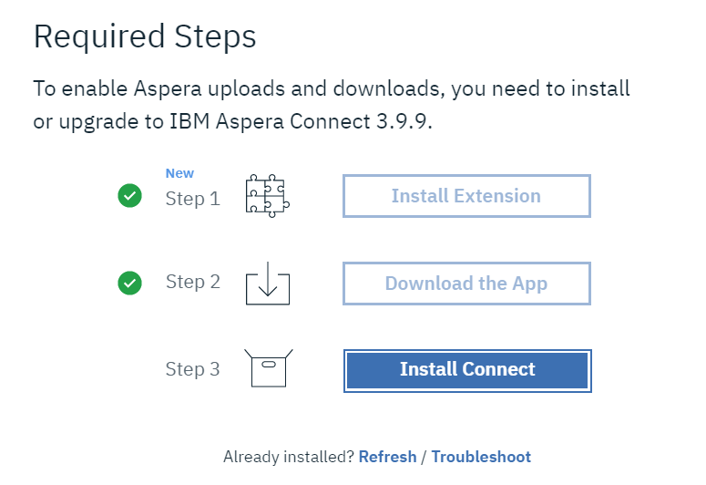
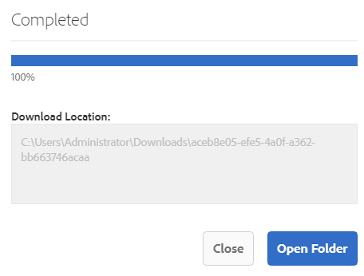

# Accelera i download di Brand Portal {#guide-to-accelerate-downloads-from-brand-portal}

Adobe Experience Manager Assets Brand Portal consente di migliorare le prestazioni di download dei file di risorse di grandi dimensioni tramite l’integrazione con IBM Aspera Connect, un’applicazione che viene installata su richiesta. L&#39;applicazione utilizza una tecnologia proprietaria per rimuovere i costi generali TCP e consente di migliorare la velocità di trasferimento dei file di risorse. Questa integrazione garantisce un’esperienza di download migliorata.

>[!NOTE]
>
>La velocità di download varia per gli utenti in quanto dipende da fattori quali la larghezza di banda della rete, la latenza del server e la posizione geografica dei client.

Il **[!UICONTROL Download rapido]** La configurazione di è attivata per impostazione predefinita, il che riduce in modo significativo il tempo necessario per scaricare i file delle risorse desiderati da Brand Portal.

## Prerequisiti per accelerare il download dei file {#prerequisites-to-accelerate-file-download}

Per scaricare i file più rapidamente, verificare quanto segue:

* Accedi a **[!UICONTROL Strumenti]** > **[!UICONTROL Scarica]** e verifica che **[!UICONTROL Download rapido]** la configurazione è abilitata in **[!UICONTROL Impostazioni di download]**.
* Verificare che la porta 33001 (TCP e UDP) sia aperta sul firewall. Per ulteriori informazioni sui prerequisiti, consulta [Documentazione del client IBM Aspera Connect](https://downloads.asperasoft.com/en/documentation/8).
* **Installare IBM Aspera Connect 3.9.9** nell’estensione del browser utilizzando i privilegi di amministratore (`https://www.ibm.com/docs/en/aspera-connect/3.9.9`).
* Per il supporto della piattaforma del client di trasferimento Aspera, consulta [Matrice di supporto per la piattaforma IBM Aspera Connect](https://www.asperasoft.com/company/support/transfer-clients/).

>[!NOTE]
>
>Esiste un problema noto con IBM Aspera Connect. Il download rapido non funziona con IBM Aspera Connect versione 3.10 e successive.

## Scaricare i domini {#download-domains}

Di seguito sono riportati i domini di download per diverse aree geografiche:

| Codice di regione | Dominio |
|---|---|
| NA O1 | downloads-na1.brand-portal.adobe.com |
| NA VA5 | downloads-na2.brand-portal.adobe.com |
| LON5 EMEA | downloads-emea1.brand-portal.adobe.com |
| APAC SIN2 | downloads-apac1.brand-portal.adobe.com |

## Esempio di prestazioni di download con acceleratore file {#expected-download-performance-using-file-accelerator}

La tabella seguente mostra le prestazioni di download per un file da 2 GB utilizzando Aspera Connect file download accelerator:

*I risultati osservati variano a causa di fattori quali la larghezza di banda della rete, la latenza del server e la posizione del client, considerando che il server Brand Portal si trova in Oregon (Stati Uniti).*

| Posizione client | Latenza tra client e server (millisecondi) | Velocità con Aspera Connect File Transfer Accelerator (MBps) | Tempo impiegato per scaricare un file da 2 GB con Aspera File Transfer Accelerator (secondi) |
|---------------------------|-----------------------------------|---------------------------------------------|-------------------------------------------------------------------------|
| Stati Uniti occidentali (N. California) | 18 | 36 | 57 |
| Stati Uniti occidentali (Oregon) | 42 | 36 | 57 |
| Stati Uniti orientali (N. Virginia) | 85 | 35 | 58 |
| APAC (Tokyo) | 124 | 36 | 57 |
| Noida (India) | 275 | 13.36 | 153 |
| Sydney | 175 | 29 | 70 |
| Londra | 179 | 35 | 58 |
| Singapore | 196 | 34 | 60 |

## Scaricare le risorse {#download-assets}

Per scaricare più rapidamente le risorse da Brand Portal:

1. Accedi al tuo tenant Brand Portal. Per impostazione predefinita, il **[!UICONTROL File]** viene visualizzata una vista che contiene tutte le risorse e le cartelle pubblicate.

   Effettua una delle operazioni seguenti:

   * Seleziona le risorse o le cartelle da scaricare. Dalla barra degli strumenti nella parte superiore, fai clic su **[!UICONTROL Scarica]** icona.

      

   * Per scaricare rappresentazioni specifiche di una risorsa, passa il puntatore del mouse sulla risorsa e fai clic su **[!UICONTROL Scarica]** disponibile nelle miniature di azione rapida.

      

1. Il **[!UICONTROL Scarica]** viene visualizzata una finestra di dialogo in cui sono elencate tutte le risorse selezionate.

   Per mantenere la gerarchia delle cartelle di Brand Portal durante il download delle risorse, seleziona la **[!UICONTROL Crea una cartella separata per ogni risorsa]** casella di controllo.

   Il pulsante di download riflette il conteggio degli elementi selezionati. Dopo aver applicato le regole, fai clic su **[!UICONTROL Scarica elementi]**. Per ulteriori informazioni su come applicare le regole, consulta [scaricare le risorse](../using/brand-portal-download-assets.md#download-assets).

   

1. Per impostazione predefinita, il **[!UICONTROL Download rapido]** è abilitato in **[!UICONTROL Impostazioni di download]**. Pertanto, viene visualizzata una casella di conferma per scaricare le risorse utilizzando IBM Aspera Connect.

   Se scarichi le risorse per la prima volta e IBM Aspera Connect non è installato nel browser o la versione esistente non è aggiornata, verrà richiesto di installare Aspera download accelerator (`https://www.ibm.com/docs/en/aspera-connect/3.9.9`).

   

1. **Installare il client Aspera Connect**

   Per installare l&#39;installazione del client IBM Aspera Connect, eseguire l&#39;installazione dal file con estensione msi dell&#39;applicazione client IBM Aspera Connect e seguire la procedura guidata di installazione.

   

1. Una volta installato correttamente il client, aggiorna la pagina del browser e avvia di nuovo i passaggi di download.

1. Per continuare a utilizzare **[!UICONTROL Download rapido]**, fai clic su **[!UICONTROL Consenti]**. Tutte le rappresentazioni selezionate vengono scaricate in una cartella zip utilizzando IBM Aspera Connect.

   Una volta completato correttamente il download, una finestra di dialogo mostra il percorso in cui le risorse vengono scaricate sul sistema dell’utente.

   

   Se non desideri utilizzare IBM Aspera Connect, fai clic su **[!UICONTROL Rifiuta]**. Se **[!UICONTROL Download rapido]** è negato o non riesce, il sistema compila un messaggio di errore. Fai clic su **[!UICONTROL Download normale]** per continuare a scaricare le risorse.

>[!NOTE]
>
>Se il **[!UICONTROL Download rapido]** l’impostazione viene disattivata dall’amministratore, le rappresentazioni selezionate vengono scaricate direttamente in una cartella zip senza utilizzare IBM Aspera Connect.

<!-- 
On successful completion of the download, a dialog box shows the location where assets are downloaded onto the user's system. If there is a failure, it shows error.

   >[!NOTE]
   >
   >There is a known limitation in Aspera Connect client application that no prompt to select download location appears if **[!UICONTROL Always ask me where to save downloaded files]** is enabled under the tab **[!UICONTROL Transfers]** within **[!UICONTROL Preferences]**. Before any download begins, provide the location in the text box **[!UICONTROL Save downloaded files to]**.

1. Log in to Brand Portal using a supported browser.
1. Browse and select the folders or assets you want to download. From the toolbar at the top, click the **[!UICONTROL Download]** icon. the **[!UICONTROL Download]** dialog appears with the **[!UICONTROL Asset(s)]** and **[!UICONTROL Enable download acceleration]** check boxes selected by default. 

   

   >[!NOTE]
   >
   >The functionality to send email notification with the link to download assets is presently not supported while faster downloads are enabled.

   

1. Click **[!UICONTROL Download]**.

   To speed up the download experience on your Brand Portal tenant account, you need to have Aspera Connect client application installed in your browser's extension.

1. **Download Aspera Connect Client**

   If Aspera Connect client is not installed on your system or the existing Aspera Connect client is out of date, a prompt is displayed on the browser page from where you can download the system-specific Aspera Connect client by selecting **[!UICONTROL Download Latest Version]**.

   

   To download the latest version of Aspera Connect from [https://downloads.asperasoft.com/connect2/](https://downloads.asperasoft.com/connect2/), select **[!UICONTROL Download Now]** and follow the instructions.

1. **Install Aspera Connect Client**

   To install IBM Aspera Connect client setup, run the setup from  .msi  file of IBM Aspera Connect client application and follow the installation wizard.

1. Once the client is successfully installed, refresh the browser page and initiate the download steps again.

   When using Aspera Connect for the first time, the browser prompts to open the link using **[!UICONTROL IBM Aspera Connect]**. To skip this dialog in future, enable **[!UICONTROL Remember my choice for FASP links]**.

   >[!NOTE]
   >
   >This message is different on the different browsers.

1. A dialog box confirms whether to proceed the transfer or not. Select **[!UICONTROL Allow]** to begin.
To skip this dialog in future, enable **[!UICONTROL Use my choice for all connections with this host]**.
Download begins. A dialog box shows the progress of the download. Use the dialog box to **[!UICONTROL pause]**, **[!UICONTROL resume]**, or **[!UICONTROL cancel]** the download.
Aspera Connect application provides an Activity Window on the system where user can view and manage all transfer sessions. For more information, refer [Aspera Connect Client documentation](https://downloads.asperasoft.com/en/documentation/8).

On successful completion of the download, a dialog box shows the location where assets are downloaded onto the user's system. If there is a failure, it shows error.

   >[!NOTE]
   >
   >There is a known limitation in Aspera Connect client application that no prompt to select download location appears if **[!UICONTROL Always ask me where to save downloaded files]** is enabled under the tab **[!UICONTROL Transfers]** within **[!UICONTROL Preferences]**. Before any download begins, provide the location in the text box **[!UICONTROL Save downloaded files to]**.
-->

## Utilizzo dell’acceleratore file nel browser Microsoft Edge {#using-file-accelerator-on-microsoft-edge-browser}

Microsoft Edge viene eseguito in modalità protetta avanzata (EPM) impedendo la comunicazione con il server Aspera Connect, mentre si trova sulla stessa rete privata o con un sito attendibile. Di conseguenza, viene visualizzato un pop-up ogni volta che viene stabilita una connessione con il server.

Per utilizzare la funzionalità di download accelerato su Microsoft Edge, rimuovi il sito Brand Portal dall’elenco dei siti attendibili.

1. Apri il Pannello di controllo Campaign (**[!UICONTROL Tasto finestra + X]**, quindi seleziona **[!UICONTROL Pannello di controllo Campaign]**).
1. Vai a **[!UICONTROL Rete e Internet]** > **[!UICONTROL Opzioni Internet]**. Fai clic su **[!UICONTROL Sicurezza]** scheda.
1. Fai clic su **[!UICONTROL Area siti attendibili]**, quindi fai clic su **[!UICONTROL Sites]**.
1. Rimuovi il sito Brand Portal dall&#39;elenco.

## Preferenze client Aspera Connect {#aspera-connect-client-preferences}

Esistono alcune preferenze utili che possono essere impostate nella preferenza Client di IBM Aspera Connect facendo clic con il pulsante destro del mouse sull’icona e selezionando **[!UICONTROL Preferenze]**.

È possibile impostare il percorso di download predefinito.

Inoltre, il client Aspera Connect può essere contrassegnato per l&#39;avvio automatico all&#39;avvio del sistema in modo che il client di connessione sia in esecuzione e disponibile per il download per iniziare più rapidamente.

## Risoluzione dei problemi relativi all’accelerazione del download {#troubleshoot-issues-with-download-acceleration}

Se l&#39;accelerazione del download non funziona, eseguire la procedura seguente per risolvere i problemi:

1. Per verificare che le porte non siano bloccate, visita [https://test-connect.asperasoft.com](https://test-connect.asperasoft.com/) dalla tua macchina.

   Se le porte non sono corrette, contattare il team di rete e verificare che le porte 33001 (TCP e UDP) non siano bloccate nel firewall.

1. Se le porte sono corrette, verificare se la rete non è lenta, misurando la larghezza di banda disponibile utilizzando [https://www.speedtest.net/](https://www.speedtest.net/).

   Se la larghezza di banda è di pochi (1-10 Mbps) o in Kbps, utilizza Preferenze Aspera e prova a limitare la larghezza di banda pari alla larghezza di banda disponibile.

   <!-- The URL in this step is giving a 404 error. 1. To confirm whether the downloads from Aspera demo server are working, use [https://demo.asperasoft.com/aspera/user](https://demo.asperasoft.com/aspera/user).  
   (login:  asperaweb , password:  demoaspera ) -->

1. Se nessuno dei passaggi precedenti funziona, deseleziona l’opzione Abilita accelerazione di download e utilizza il download normale.
