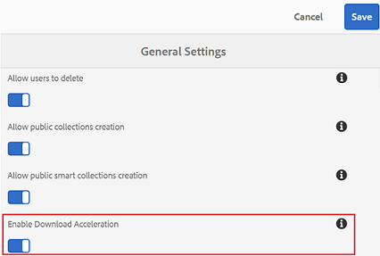
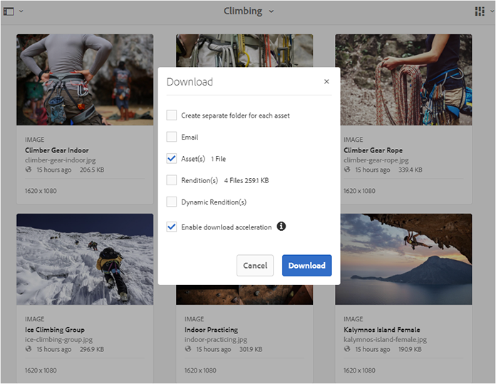
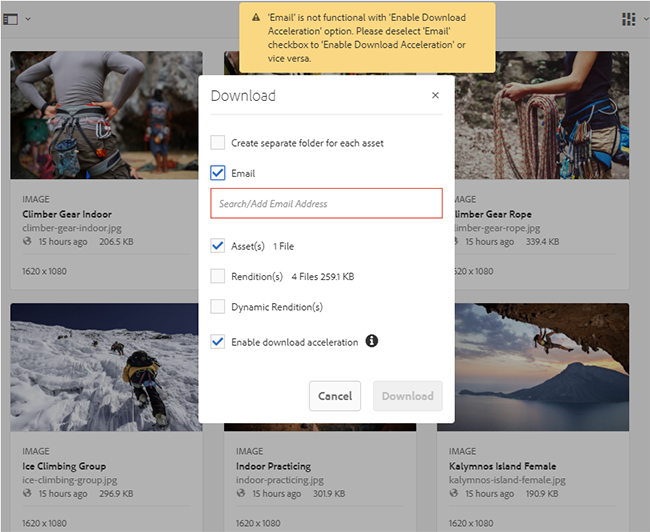
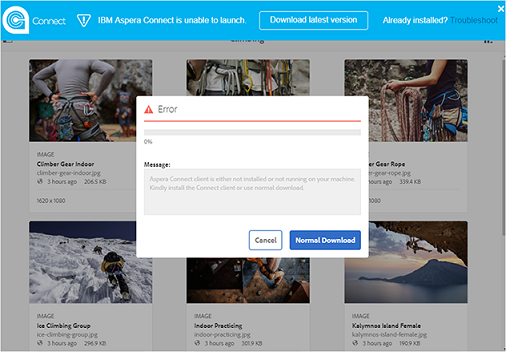
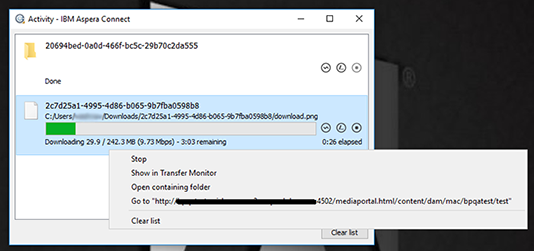
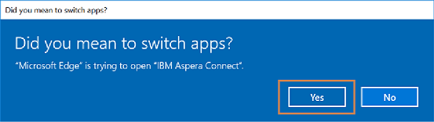
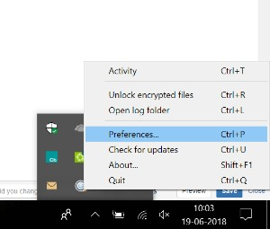
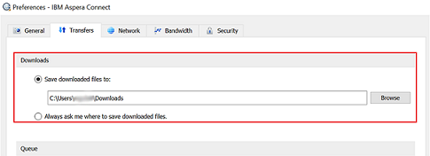
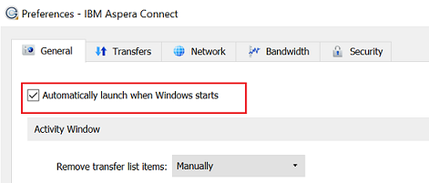

# Accelerare i download del Brand Portal {#guide-to-accelerate-downloads-from-brand-portal}

Brand Portal consente di migliorare le prestazioni di download di file di risorse di grandi dimensioni integrando con IBM Aspera Connect, un’applicazione install-on-demand. L'applicazione utilizza una tecnologia proprietaria per rimuovere le spese generali TCP e migliorare la velocità di trasferimento dei file di risorse. Questa integrazione offre un'esperienza di download più completa.

>[!NOTE]
>
>La velocità di download varia a seconda degli utenti, in quanto dipende da fattori quali larghezza di banda della rete, latenza del server e posizione geografica dei client.

Se attivato, gli utenti del Brand Portal possono ridurre notevolmente il tempo necessario per scaricare i file di risorse desiderati dal Brand Portal o tramite il collegamento condiviso installando il client Aspera Connect.

## Prerequisiti per accelerare il download dei file {#prerequisites-to-accelerate-file-download}

Per scaricare più rapidamente i file, accertatevi di quanto segue:

* **[!UICONTROL Attiva accelerazione]** download (disabilitata per impostazione predefinita) da Impostazioni  generali nel pannello degli strumenti di amministrazione.
* La porta 33001 (TCP e UDP) è aperta sul firewall. Per ulteriori informazioni sui prerequisiti, consultate la documentazione [del client](https://downloads.asperasoft.com/en/documentation/8)Aspera Connect.
* Installate Adobe Connect usando i privilegi di amministratore.
* Per il supporto della piattaforma per il client di trasferimento Aspera, vedi Matrice [di supporto della piattaforma](https://www.asperasoft.com/company/support/transfer-clients/)Aspera Connect.

## Download dei domini {#download-domains}

Di seguito sono elencati i domini di download per diverse aree geografiche:

| Codice regione | Dominio |
|---|---|
| NA OR1 | download-na1.brand-Portal.adobe.com |
| NA VA5 | download-na2.brand-Portal.adobe.com |
| EMEA LON5 | downloads-emea1.brand-portale.adobe.com |
| APAC SIN2 | downloads-apac1.brand-Portal.adobe.com |

## Esempio di prestazioni di download mediante l'acceleratore di file {#expected-download-performance-using-file-accelerator}

La tabella seguente mostra le prestazioni di download per i file da 2 GB che utilizzano l’acceleratore di download dei file Aspera Connect:

**I risultati osservati variano a causa di fattori come larghezza di banda di rete, latenza server e posizione client, considerando che il server Brand Portal si trova in Oregon (Stati Uniti).*

| Posizione client | Latenza tra client e server (millisecondi) | Velocità con Aspera Connect File Transfer Accelerator (MBps) | Tempo impiegato per scaricare il file da 2 GB con Aspera File Transfer Accelerator (secondi) |
|---------------------------|-----------------------------------|---------------------------------------------|-------------------------------------------------------------------------|
| U.S. West (N. California) | 18 | 36 | 57 |
| U.S. West (Oregon) | 42 | 36 | 57 |
| USA Est (N. Virginia | 85 | 35 | 58 |
| APAC (Tokyo) | 124 | 36 | 57 |
| Noida (India) | 275 | 13.36 | 153 |
| Sydney | 175 | 29 | 70 |
| Londra | 179 | 35 | 58 |
| Singapore | 196 | 34 | 60 |

## Download del flusso di lavoro tramite l'acceleratore di file {#download-workflow-using-file-accelerator}

Per scaricare più rapidamente le risorse da Brand Portal:

1. Effettuate l'accesso al Portale del marchio utilizzando un browser supportato.
1. Sfogliate e selezionate il file di risorse, la cartella o la raccolta da scaricare. Toccate o fate clic sull’opzione di download.
Viene visualizzata una finestra di dialogo con l'opzione [Abilita accelerazione] download selezionata.
   

   >[!NOTE]
   >
   >La funzionalità di invio di notifiche e-mail con il collegamento per scaricare le risorse non è attualmente supportata quando sono abilitati i download più veloci.

   

1. Toccate o fate clic sull’opzione **[!UICONTROL Scarica]** .
Per velocizzare l'esperienza di download nell'account tenant del Portale marchio, è necessario che nel sistema sia installata l'applicazione client Aspera Connect.

1. **Scaricate il client** Aspera Connect se il client Aspera Connect non è installato sul sistema o se il client Aspera Connect esistente è obsoleto, nella pagina del browser viene visualizzato un prompt dal quale potete scaricare il client Aspera Connect specifico del sistema selezionando **[!UICONTROL Scarica versione]** più recente.

   

   Per scaricare la versione più recente di Aspera Connect da [https://downloads.asperasoft.com/connect2/](https://downloads.asperasoft.com/connect2/), selezionate **[!UICONTROL Scarica ora]** e seguite le istruzioni.

1. **Installa il client** Aspera Connect Per installare l’installazione del client IBM Aspera Connect, esegui l’installazione dal file .msi dell’applicazione client IBM Aspera Connect e segui la procedura guidata di installazione.

1. Dopo aver installato correttamente il client, aggiornate la pagina del browser e riavviate i passaggi di download oppure selezionate **[!UICONTROL Riavvia]** nella finestra di dialogo **[!UICONTROL Download]** risorse (passaggio 2).
Quando utilizzate Aspera Connect per la prima volta, il browser richiede di aprire il collegamento utilizzando **[!UICONTROL IBM Aspera Connect]**. Per saltare questa finestra di dialogo in futuro, abilitare **[!UICONTROL Ricorda la scelta per i collegamenti]** FASP.

   >[!NOTE]
   >
   >Questo messaggio è diverso nei diversi browser.

1. Viene visualizzata una finestra di dialogo che conferma se procedere o meno al trasferimento. Selezionare **[!UICONTROL Consenti]** per iniziare.
Per saltare questa finestra di dialogo in futuro, abilita **[!UICONTROL Usa la mia scelta per tutte le connessioni con questo host]**.
Il download inizia. Viene visualizzata una finestra di dialogo con l’avanzamento del download. Utilizzare la finestra di dialogo per **[!UICONTROL mettere in pausa]**, **[!UICONTROL riprendere]** o **[!UICONTROL annullare]** il download.
L’applicazione Aspera Connect fornisce una finestra Attività sul sistema in cui l’utente può visualizzare e gestire tutte le sessioni di trasferimento. Per ulteriori informazioni, consultate la documentazione [del client](https://downloads.asperasoft.com/en/documentation/8)Aspera Connect.

Al completamento del download, viene visualizzata una finestra di dialogo in cui viene indicata la posizione in cui le risorse vengono scaricate nel sistema dell'utente. In caso di errore, viene visualizzato un errore.

>[!NOTE]
>
>Nell’applicazione client Aspera Connect esiste una limitazione nota per cui non viene visualizzato alcun prompt per selezionare il percorso di download se viene **[!UICONTROL sempre richiesto all’utente di specificare dove salvare i file]** scaricati è attivato nella scheda [!UICONTROL Trasferimenti] all’interno delle [!UICONTROL Preferenze]. Prima di iniziare il download, indicate il percorso nella casella di testo **[!UICONTROL Salva i file scaricati in]**.

## Utilizzo dell'acceleratore di file nel browser Microsoft Edge {#using-file-accelerator-on-microsoft-edge-browser}

Microsoft Edge viene eseguito in modalità protetta avanzata (EPM), impedendo la comunicazione con il server Aspera Connect, mentre si trova sulla stessa rete privata o con un sito trusted. Di conseguenza, viene visualizzata una finestra a comparsa ogni volta che viene stabilita una connessione con il server.

Per utilizzare la funzionalità di download accelerato in Microsoft Edge, rimuovete il sito Brand Portal dall'elenco dei siti attendibili.

1. Aprire il Pannello di controllo (premere il tasto **[!UICONTROL Finestra + X]**, quindi selezionare Pannello **[!UICONTROL di]** controllo).
1. Vai a **[!UICONTROL Rete e Internet &gt; Opzioni]** Internet. Fate clic sulla scheda **[!UICONTROL Protezione]** .
1. Fare clic sull'area **[!UICONTROL Siti]** attendibili, quindi fare clic su **[!UICONTROL Siti]**.
1. Rimuovere il sito Brand Portal dall'elenco.

## Preferenze del client Adobe Connect {#aspera-connect-client-preferences}

Alcune preferenze utili possono essere impostate nella preferenza del client IBM Aspera Connect facendo clic con il pulsante destro del mouse sull'icona e selezionando **[!UICONTROL Preferenze]**.

Potete impostare il percorso di download predefinito.

Inoltre, il client Aspera Connect può essere contrassegnato in modo che venga avviato automaticamente all’avvio del sistema, in modo che il client di connessione sia in esecuzione e sia disponibile affinché il download inizi più rapidamente.

## Risoluzione dei problemi relativi all'accelerazione del download {#troubleshoot-issues-with-download-acceleration}

Se l'accelerazione del download non funziona, attenetevi alla seguente procedura per risolvere i problemi:

1. Verificare che le porte non siano bloccate, visitando [https://test-connect.asperasoft.com](https://test-connect.asperasoft.com/) dal computer.

   Se le porte non sono OK, contattate il team di rete e assicuratevi che le porte 33001 (sia TCP che UDP) non siano bloccate nel firewall.

1. Se le porte sono a posto, controllate che la rete non sia lenta misurando la larghezza di banda disponibile tramite [https://www.speedtest.net/](https://www.speedtest.net/).

   Se la larghezza di banda è di pochi (1-10 Mbps) o in Kbps, utilizzate le preferenze di Aspera e cercate di limitare la larghezza di banda pari alla larghezza di banda disponibile.

1. Per confermare se i download dal server demo di Aspera funzionano, utilizzate [https://demo.asperasoft.com/aspera/user](https://demo.asperasoft.com/aspera/user).\
   (login:  asperaweb , password:  demoaspera )

1. Se nessuno dei passaggi di risoluzione dei problemi indicati sopra funziona, deselezionate l'opzione Abilita accelerazione download e utilizzate il download normale.
