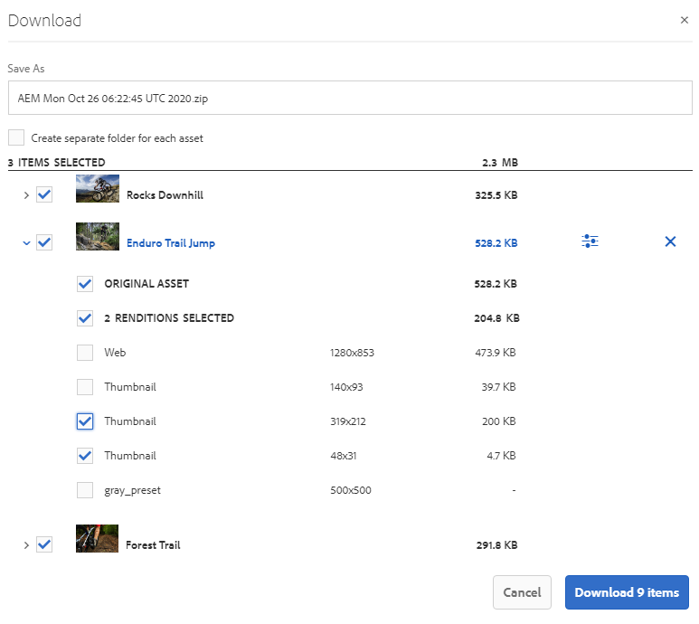

# Accelerare i download di Brand Portal {#guide-to-accelerate-downloads-from-brand-portal}

Adobe Experience Manager Assets Brand Portal consente di migliorare le prestazioni di download di file di risorse di grandi dimensioni mediante l’integrazione con IBM Aspera Connect, un’applicazione di installazione on-demand. L&#39;applicazione utilizza una tecnologia proprietaria per rimuovere le spese generali TCP e consente di migliorare la velocità di trasferimento dei file di risorse. Questa integrazione garantisce un&#39;esperienza di download migliorata.

>[!NOTE]
>
>La velocità di download varia a seconda degli utenti, in quanto dipende da fattori quali la larghezza di banda della rete, la latenza del server e la posizione geografica dei client.

Per impostazione predefinita, la configurazione **[!UICONTROL Download rapido]** è abilitata, il che riduce notevolmente il tempo necessario per scaricare i file di risorse desiderati da Brand Portal.

## Prerequisiti per accelerare il download dei file {#prerequisites-to-accelerate-file-download}

Per scaricare i file più velocemente, assicurati quanto segue:

* Passa a **[!UICONTROL Strumenti]** > **[!UICONTROL Scarica]** e verifica che la configurazione **[!UICONTROL Download rapido]** sia abilitata in **[!UICONTROL Impostazioni di download]**.
* Assicurarsi che la porta 33001 (sia TCP che UDP) sia aperta sul firewall. Per ulteriori informazioni sui prerequisiti, consulta la [documentazione del client IBM Aspera Connect](https://downloads.asperasoft.com/en/documentation/8).
* [Installa IBM Aspera Connect 3.9.9](https://www.ibm.com/support/knowledgecenter/SSXMX3_3.9.9/kc/connect_welcome.html) nell&#39;estensione del browser utilizzando i privilegi di amministratore.
* Per il supporto della piattaforma del client di trasferimento Aspera, vedi [Matrice di supporto della piattaforma IBM Aspera Connect](https://www.asperasoft.com/company/support/transfer-clients/).

## Download dei domini {#download-domains}

Di seguito sono riportati i domini di download per diverse aree geografiche:

| Codice area geografica | Dominio |
|---|---|
| NA O1 | downloads-na1.brand-portal.adobe.com |
| NA VA5 | downloads-na2.brand-portal.adobe.com |
| EMEA LON5 | downloads-emea1.brand-portal.adobe.com |
| APAC SIN2 | downloads-apac1.brand-portal.adobe.com |

## Prestazioni di download di esempio utilizzando l&#39;acceleratore di file {#expected-download-performance-using-file-accelerator}

La tabella seguente mostra le prestazioni di download per i file da 2 GB che utilizzano l&#39;acceleratore di download dei file Aspera Connect:

*I risultati osservati variano a causa di fattori come la larghezza di banda della rete, la latenza del server e la posizione del client, considerando che il server Brand Portal si trova in Oregon (Stati Uniti).*

| Posizione client | Latenza tra client e server (millisecondi) | Velocità con Aspera Connect File Transfer Accelerator (MBps) | Tempo impiegato per scaricare un file da 2 GB con Aspera File Transfer Accelerator (secondi) |
|---------------------------|-----------------------------------|---------------------------------------------|-------------------------------------------------------------------------|
| U.S. West (California) | 18 | 36 | 57 |
| U.S. West (Oregon) | 42 | 36 | 57 |
| Stati Uniti d&#39;America (Virginia) | 85 | 35 | 58 |
| APAC (Tokyo) | 124 | 36 | 57 |
| Noida (India) | 275 | 13,36 | 153 |
| Sydney | 175 | 29 | 70 |
| Londra | 179 | 35 | 58 |
| Singapore | 196 | 34 | 60 |

## Scarica il flusso di lavoro utilizzando l&#39;acceleratore di file {#download-workflow-using-file-accelerator}

Per scaricare più rapidamente le risorse da Brand Portal:

1. Accedi al tuo tenant Brand Portal. Per impostazione predefinita, viene visualizzata la vista **[!UICONTROL File]** contenente tutte le risorse e le cartelle pubblicate.

   Effettua una delle operazioni seguenti:

   * Seleziona le risorse o le cartelle da scaricare. Dalla barra degli strumenti nella parte superiore, fai clic sull&#39;icona **[!UICONTROL Scarica]** .

      

   * Per scaricare rappresentazioni specifiche di una risorsa, posiziona il puntatore del mouse sulla risorsa e fai clic sull’icona **[!UICONTROL Scarica]** disponibile nelle miniature delle azioni rapide.

      

1. Viene visualizzata la finestra di dialogo **[!UICONTROL Scarica]** in cui sono elencate tutte le risorse selezionate.

   Per mantenere la gerarchia delle cartelle di Brand Portal durante il download delle risorse, seleziona la casella di controllo **[!UICONTROL Crea cartella separata per ogni risorsa]**.

   Il pulsante di download riflette il conteggio degli elementi selezionati. Dopo aver applicato le regole, fai clic su **[!UICONTROL Scarica elementi]**. Per ulteriori informazioni su come applicare le regole, consulta [scaricare risorse](../using/brand-portal-download-assets.md#download-assets).

   

1. Per impostazione predefinita, l&#39;impostazione **[!UICONTROL Download rapido]** è abilitata in **[!UICONTROL Impostazioni di download]**. Pertanto, appare una casella di conferma per scaricare risorse utilizzando IBM Aspera Connect.

   Se stai scaricando le risorse per la prima volta e non hai installato IBM Aspera Connect nel tuo browser o la versione esistente è obsoleta, ti verrà richiesto di [installare l&#39;acceleratore di download Aspera](https://www.ibm.com/support/knowledgecenter/SSXMX3_3.9.9/kc/connect_welcome.html).

   

1. **Installa il client Aspera Connect**

   Per installare l&#39;installazione del client IBM Aspera Connect, esegui l&#39;installazione dal file .msi dell&#39;applicazione client IBM Aspera Connect e segui l&#39;installazione guidata.

   

1. Una volta installato correttamente il client, aggiorna la pagina del browser e avvia di nuovo i passaggi di download.

1. Per continuare a utilizzare **[!UICONTROL Download rapido]**, fai clic su **[!UICONTROL Consenti]**. Tutte le rappresentazioni selezionate vengono scaricate in una cartella zip utilizzando IBM Aspera Connect.

   Al completamento del download, una finestra di dialogo mostra il percorso in cui le risorse vengono scaricate nel sistema dell’utente.

   

   Se non desideri utilizzare IBM Aspera Connect, fai clic su **[!UICONTROL Rifiuta]**. Se **[!UICONTROL Download rapido]** viene negato o non riesce, il sistema compila un messaggio di errore. Fai clic sul pulsante **[!UICONTROL Download normale]** per continuare a scaricare le risorse.

>[!NOTE]
>
>Se l&#39;impostazione **[!UICONTROL Download rapido]** è disattivata dall&#39;amministratore, le rappresentazioni selezionate vengono scaricate direttamente in una cartella zip senza utilizzare IBM Aspera Connect.

<!-- 
On successful completion of the download, a dialog box shows the location where assets are downloaded onto the user's system. If there is a failure, it shows error.

   >[!NOTE]
   >
   >There is a known limitation in Aspera Connect client application that no prompt to select download location appears if **[!UICONTROL Always ask me where to save downloaded files]** is enabled under the tab **[!UICONTROL Transfers]** within **[!UICONTROL Preferences]**. Before any download begins, provide the location in the text box **[!UICONTROL Save downloaded files to]**.

1. Log in to Brand Portal using a supported browser.
1. Browse and select the folders or assets you want to download. From the toolbar at the top, click the **[!UICONTROL Download]** icon. the **[!UICONTROL Download]** dialog appears with the **[!UICONTROL Asset(s)]** and **[!UICONTROL Enable download acceleration]** check boxes selected by default. 

   

   >[!NOTE]
   >
   >The functionality to send email notification with the link to download assets is presently not supported while faster downloads are enabled.

   

1. Click **[!UICONTROL Download]**.

   To speed up the download experience on your Brand Portal tenant account, you need to have Aspera Connect client application installed in your browser's extension.

1. **Download Aspera Connect Client**

   If Aspera Connect client is not installed on your system or the existing Aspera Connect client is out of date, a prompt is displayed on the browser page from where you can download the system-specific Aspera Connect client by selecting **[!UICONTROL Download Latest Version]**.

   

   To download the latest version of Aspera Connect from [https://downloads.asperasoft.com/connect2/](https://downloads.asperasoft.com/connect2/), select **[!UICONTROL Download Now]** and follow the instructions.

1. **Install Aspera Connect Client**

   To install IBM Aspera Connect client setup, run the setup from  .msi  file of IBM Aspera Connect client application and follow the installation wizard.

1. Once the client is successfully installed, refresh the browser page and initiate the download steps again.

   When using Aspera Connect for the first time, the browser prompts to open the link using **[!UICONTROL IBM Aspera Connect]**. To skip this dialog in future, enable **[!UICONTROL Remember my choice for FASP links]**.

   >[!NOTE]
   >
   >This message is different on the different browsers.

1. A dialog box confirms whether to proceed the transfer or not. Select **[!UICONTROL Allow]** to begin.
To skip this dialog in future, enable **[!UICONTROL Use my choice for all connections with this host]**.
Download begins. A dialog box shows the progress of the download. Use the dialog box to **[!UICONTROL pause]**, **[!UICONTROL resume]**, or **[!UICONTROL cancel]** the download.
Aspera Connect application provides an Activity Window on the system where user can view and manage all transfer sessions. For more information, refer [Aspera Connect Client documentation](https://downloads.asperasoft.com/en/documentation/8).

On successful completion of the download, a dialog box shows the location where assets are downloaded onto the user's system. If there is a failure, it shows error.

   >[!NOTE]
   >
   >There is a known limitation in Aspera Connect client application that no prompt to select download location appears if **[!UICONTROL Always ask me where to save downloaded files]** is enabled under the tab **[!UICONTROL Transfers]** within **[!UICONTROL Preferences]**. Before any download begins, provide the location in the text box **[!UICONTROL Save downloaded files to]**.
-->

## Utilizzo dell&#39;acceleratore di file nel browser Microsoft Edge {#using-file-accelerator-on-microsoft-edge-browser}

Microsoft Edge viene eseguito in modalità protetta avanzata (EPM) per impedire la comunicazione con il server Aspera Connect, mentre si trova nella stessa rete privata o con un sito attendibile. Pertanto, viene visualizzato un pop-up ogni volta che viene stabilita una connessione con il server.

Per utilizzare la funzionalità di download accelerato su Microsoft Edge, rimuovere il sito Brand Portal dall&#39;elenco dei siti attendibili.

1. Apri il Pannello di controllo Campaign (**[!UICONTROL Tasto finestra + X]**, quindi seleziona **[!UICONTROL Pannello di controllo Campaign]**).
1. Vai a **[!UICONTROL Rete e Internet]** > **[!UICONTROL Opzioni Internet]**. Fare clic sulla scheda **[!UICONTROL Sicurezza]**.
1. Fare clic sulla **[!UICONTROL zona siti attendibili]**, quindi fare clic su **[!UICONTROL Sites]**.
1. Rimuovere il sito Brand Portal dall&#39;elenco.

## Preferenze del client Aspera Connect {#aspera-connect-client-preferences}

Ci sono alcune preferenze utili che possono essere impostate nella preferenza del client IBM Aspera Connect facendo clic con il pulsante destro del mouse sull&#39;icona e selezionando **[!UICONTROL Preferenze]**.

Puoi impostare il percorso di download predefinito.

Inoltre, il client Aspera Connect può essere contrassegnato per l&#39;avvio automatico all&#39;avvio del sistema in modo che il client di connessione sia in esecuzione e disponibile per il download per iniziare più velocemente.

## Risolvere i problemi relativi all&#39;accelerazione del download {#troubleshoot-issues-with-download-acceleration}

Se l&#39;accelerazione del download non funziona, segui questi passaggi per risolvere i problemi:

1. Controlla che le porte non siano bloccate, visitando [https://test-connect.asperasoft.com](https://test-connect.asperasoft.com/) dal computer.

   Se le porte non sono OK, contattare il team di rete e assicurarsi che le porte 33001 (sia TCP che UDP) non siano bloccate nel firewall.

1. Se le porte sono OK, controlla se la rete non è lenta, misurando la larghezza di banda disponibile utilizzando [https://www.speedtest.net/](https://www.speedtest.net/).

   Se la larghezza di banda è di pochi (1-10 Mbps) o in Kbps, utilizza le preferenze di Aspera e cerca di limitare la larghezza di banda uguale alla larghezza di banda disponibile.

1. Per confermare il funzionamento dei download dal server demo Aspera, utilizza [https://demo.asperasoft.com/aspera/user](https://demo.asperasoft.com/aspera/user).\
   (accesso:  asperaweb , password:  demoaspera )

1. Se nessuno dei passaggi precedenti funziona, deseleziona l’opzione Abilita accelerazione download e utilizza il normale download.
