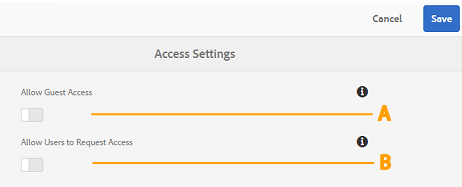
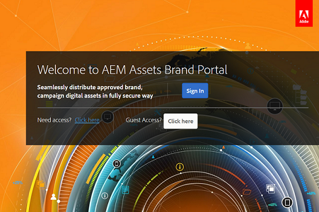

# Amministrare l'accesso utente su Brand Portal {#administer-user-access-on-brand-portal}

[!DNL AEM Assets Brand Portal 6.4.2] onwards consente agli amministratori di configurare l'accesso degli ospiti e di consentire agli utenti di richiedere l'accesso all [!DNL Brand Portal] 'organizzazione. Queste configurazioni sono state fornite come **configurazioni Impostazioni** di accesso nel pannello amministrativo. Entrambe le impostazioni sono disattivate per impostazione predefinita.

**** Una configurazione per consentire agli ospiti l'accesso [!DNL Brand Portal] all'accesso **ospite?** nella schermata [!DNL Brand Portal] di benvenuto. (Il valore predefinito è disattivato)

**Configurazione B** per consentire agli utenti di richiedere l'accesso [!DNL Brand Portal] a utilizzare **l'accesso?** nella schermata [!DNL Brand Portal] di benvenuto. (Il valore predefinito è disattivato)

## Consenti accesso come ospite {#allow-guest-access}

Per consentire agli utenti l'accesso agli ospiti [!DNL Brand Portal], in modo che gli utenti non debbano accedere alle risorse pubbliche, gli amministratori devono:

1. Selezionate il [!DNL AEM] logo per accedere agli strumenti di amministrazione, dalla barra degli strumenti in alto.
2. Dal pannello Strumenti di amministrazione, selezionate **Accesso** per aprire **la pagina Impostazioni** di accesso.
3. Abilitare la **configurazione Consenti accesso** ospiti.
4. **Salvate le modifiche.**
5. Disconnessione per rendere effettive le modifiche.

## Consenti agli utenti di richiedere l'accesso {#allow-users-to-request-access}

Gli amministratori possono consentire agli utenti dell'organizzazione di richiedere l'accesso [!DNL Brand Portal] dalla schermata di benvenuto. Tuttavia, gli amministratori devono abilitare la configurazione **Consenti agli utenti la** configurazione di accesso, in modo che nella schermata di benvenuto venga visualizzato il collegamento di accesso alla richiesta.

Per consentire agli utenti dell'organizzazione di richiedere l'accesso, [!DNL Brand Portal]gli amministratori devono:

1. Selezionate il [!DNL AEM] logo per accedere agli strumenti di amministrazione, dalla barra degli strumenti in alto.
2. Dal pannello Strumenti di amministrazione, selezionate **Accesso** per aprire **la pagina Impostazioni** di accesso.
3. Abilitare la **configurazione Consenti agli utenti la** configurazione di accesso.
4. **Salvate le modifiche.**
5. Disconnessione per rendere effettive le modifiche.
