# Manage Users, Groups, and User Roles {#manage-users-groups-and-user-roles}

Gli amministratori possono utilizzare Adobe  Admin Console per creare utenti e profili di prodotti del portale AEM Assets e gestire i loro ruoli utilizzando l&#39;interfaccia utente di Brand Portal. Questo privilegio non è disponibile per visualizzatori ed editor.

In [[!UICONTROL Admin Console]](http://adminconsole.adobe.com/enterprise/overview), potete visualizzare tutti i prodotti associati alla vostra organizzazione. Un prodotto può essere una qualsiasi  soluzione Experience Cloud, ad esempio Adobe  Analytics,  Adobe Target o AEM Brand Portal. È necessario scegliere il prodotto AEM Brand Portal e creare profili di prodotto.

<!--
Comment Type: draft

<note type="note">

Product Profiles (formerly known as product configurations*). 

* The nomenclature has changed from product configurations to product profiles in the new Adobe Admin Console.

</note>
-->

Questi profili di prodotto vengono sincronizzati con l’interfaccia utente del Brand Portal ogni 8 ore e sono visibili come gruppi in Brand Portal. Dopo aver aggiunto utenti e creato profili di prodotto e aggiunto utenti a tali profili di prodotto, puoi assegnare ruoli a utenti e gruppi in Brand Portal.

>[!NOTE]
>
>Per creare gruppi in Brand Portal, da Adobe [!UICONTROL Admin Console], utilizzate **[!UICONTROL Prodotti > Profili]** di prodotto, invece di **[!UICONTROL Pagina utente > Gruppi]** di utenti. I profili di prodotto in Adobe [!UICONTROL Admin Console] vengono utilizzati per creare gruppi in Brand Portal.

## Aggiunta di un utente {#add-a-user}

Se siete amministratori di prodotto, utilizzate Adobe [[!UICONTROL Admin Console]](http://adminconsole.adobe.com/enterprise/overview) per creare utenti e assegnarli ai profili di prodotto (*precedentemente noti come configurazioni* di prodotto), che vengono visualizzati come gruppi in Brand Portal. Potete utilizzare i gruppi per eseguire operazioni in blocco, come la gestione dei ruoli e la condivisione delle risorse.

>[!NOTE]
>
>I nuovi utenti che non hanno accesso a Brand Portal possono richiedere l’accesso dalla schermata di accesso di Brand Portal. Per ulteriori informazioni, consulta [Richiesta di accesso al Portale](../using/brand-portal.md#request-access-to-brand-portal)marchio. Dopo aver ricevuto le notifiche di richiesta di accesso nell&#39;area di notifica, fate clic sulla notifica desiderata, quindi fate clic su **[!UICONTROL Concedi accesso]**. In alternativa, segui il collegamento presente nell’e-mail di richiesta di accesso ricevuta. Quindi, per aggiungere un utente tramite [Adobe [!UICONTROL Admin Console]](http://adminconsole.adobe.com/enterprise/overview), seguite i passaggi da 4 a 7 descritti di seguito.

>[!NOTE]
>
>Potete accedere ad [Adobe [!UICONTROL Admin Console]](http://adminconsole.adobe.com/enterprise/overview) direttamente o dal Brand Portal. Se accedete direttamente, seguite i Passaggi da 4 a 7 descritti di seguito per aggiungere un utente.

1. Dalla barra degli strumenti di AEM nella parte superiore, fate clic sul logo Adobe per accedere agli strumenti amministrativi.

   

1. Dal pannello degli strumenti di amministrazione, fate clic su **[!UICONTROL Utenti]**.

   

1. Nella pagina Ruoli  utente, fate clic sulla scheda **[!UICONTROL Gestione]** , quindi su **[!UICONTROL Avvia  Admin Console]**.

   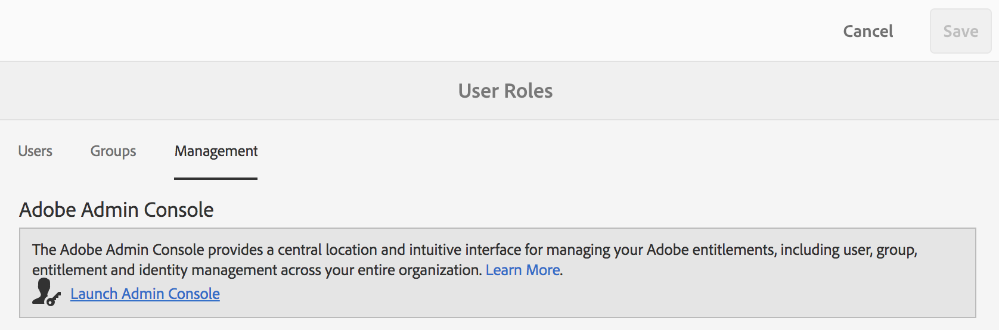

1. In  Admin Console, effettuate una delle seguenti operazioni per creare un nuovo utente:

   * Dalla barra degli strumenti nella parte superiore, fate clic su **[!UICONTROL Panoramica]**. Nella pagina [!UICONTROL Panoramica] , fate clic su **[!UICONTROL Assegna utenti]** dalla scheda prodotto Brand Portal.

   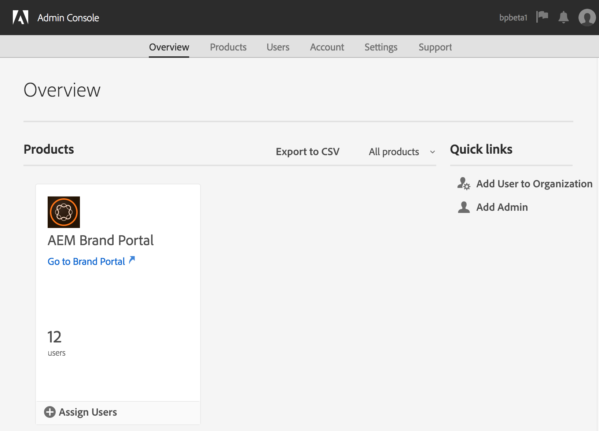

   * Dalla barra degli strumenti nella parte superiore, fate clic su **[!UICONTROL Utenti]**. Nella pagina [!UICONTROL Utenti] , [!UICONTROL Utenti] nella barra a sinistra è selezionata per impostazione predefinita. Fate clic su **[!UICONTROL Aggiungi utente]**.

   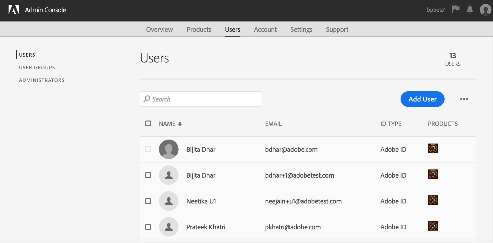

1. Nella finestra di dialogo Aggiungi utente, digitate l&#39;ID e-mail dell&#39;utente che desiderate aggiungere o selezionate l&#39;utente dall&#39;elenco dei suggerimenti che vengono visualizzati durante la digitazione.

   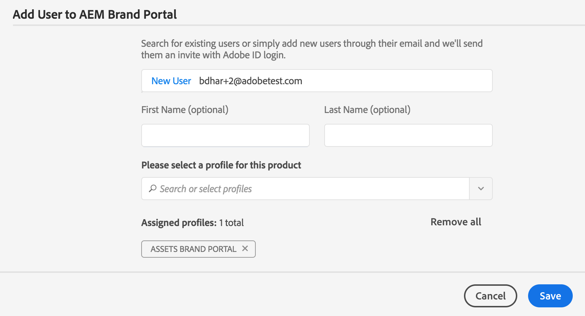

1. Assegnate l&#39;utente ad almeno un profilo di prodotto (precedentemente noto come configurazioni di prodotto) in modo che possa accedere al Portale marchio. Seleziona il profilo di prodotto appropriato dal campo **[!UICONTROL Selezionare un profilo per il prodotto]** .
1. Fai clic su **[!UICONTROL Salva]**. All’utente aggiunto viene inviato un messaggio e-mail di benvenuto. L’utente invitato può accedere al Portale marchio facendo clic sul collegamento nell’e-mail di benvenuto e accedendo tramite un [!UICONTROL Adobe ID]. Per ulteriori informazioni, consultate [Prima esecuzione](../using/brand-portal-onboarding.md)dell&#39;accesso.

   >[!NOTE]
   >
   >Se un utente non è in grado di accedere al Portale marchio, l&#39;amministratore dell&#39;organizzazione deve visitare Adobe [!UICONTROL Admin Console] e verificare se l&#39;utente è presente e se è stato aggiunto ad almeno un profilo di prodotto.

   Per informazioni sulla concessione di privilegi amministrativi all&#39;utente, consultate [Fornire privilegi di amministratore agli utenti](../using/brand-portal-adding-users.md#provideadministratorprivilegestousers).

## Aggiungere un profilo di prodotto {#add-a-product-profile}

I profili di prodotto (precedentemente noti come configurazioni di prodotto) in [!UICONTROL Admin Console] vengono utilizzati per creare gruppi in Brand Portal in modo da poter eseguire operazioni in massa come la gestione di ruoli e la condivisione di risorse in Brand Portal. **Brand Portal** è il profilo di prodotto predefinito disponibile; puoi creare più profili di prodotto e aggiungere utenti ai nuovi profili di prodotto.

>[!NOTE]
>
>Potete accedere a [[!UICONTROL Admin Console]](http://adminconsole.adobe.com/enterprise/overview) direttamente o dal Portale marchio. Se accedete direttamente a [!UICONTROL Admin Console] , seguite i passaggi da 4 a 7 descritti di seguito per aggiungere un profilo di prodotto.

1. Dalla barra degli strumenti di AEM nella parte superiore, fate clic sul logo Adobe per accedere agli strumenti amministrativi.

   

1. Dal pannello degli strumenti di amministrazione, fate clic su **[!UICONTROL Utenti]**.

   

1. Nella pagina Ruoli  utente, fate clic sulla scheda **[!UICONTROL Gestione]** , quindi su **[!UICONTROL Avvia  Admin Console]**.

   

1. Dalla barra degli strumenti nella parte superiore, fare clic su **[!UICONTROL Prodotti]**.
1. Nella pagina [!UICONTROL Prodotti] , Profili  prodotto è selezionato per impostazione predefinita. Fate clic su **[!UICONTROL Nuovo profilo]**.

   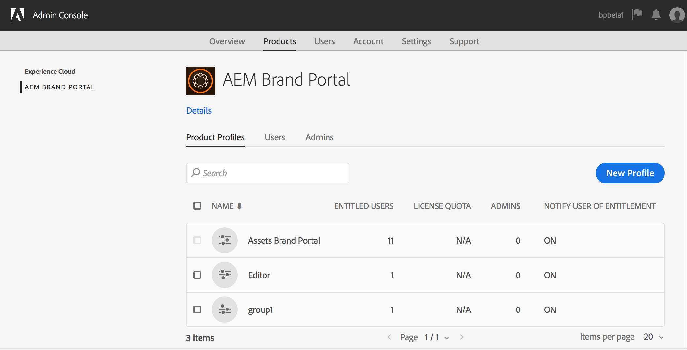

1. Nella pagina [!UICONTROL Crea un nuovo profilo] , immetti il nome del profilo, il nome visualizzato, la descrizione del profilo e scegli se desideri inviare una notifica via e-mail agli utenti quando vengono aggiunti o rimossi dal profilo.

   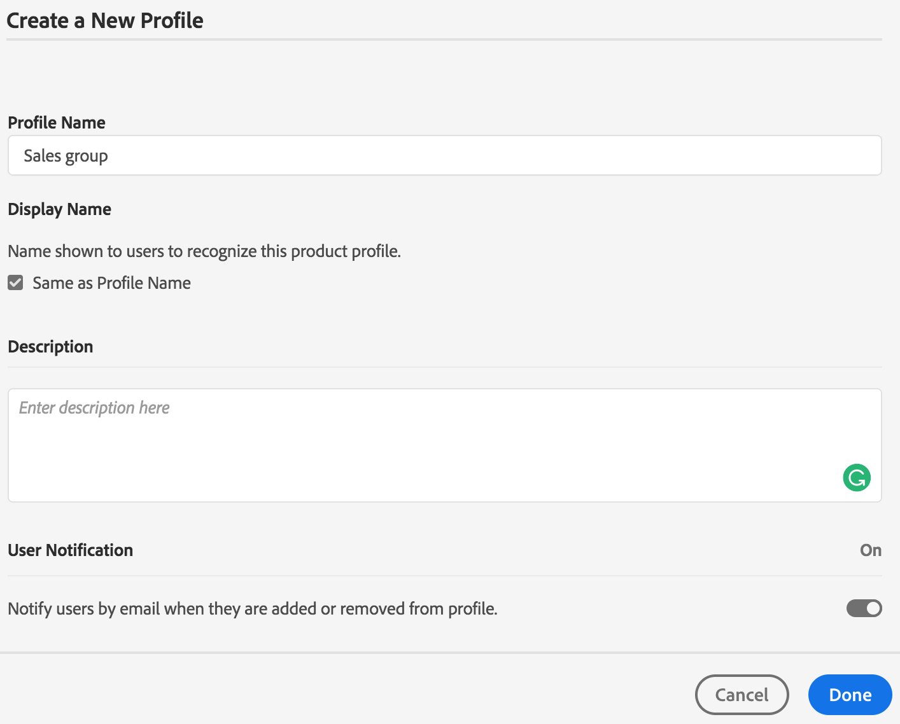

1. Fate clic su **[!UICONTROL Fine]**. Il gruppo di configurazione del prodotto, ad esempio il gruppo **** Vendite, viene aggiunto a Brand Portal.

   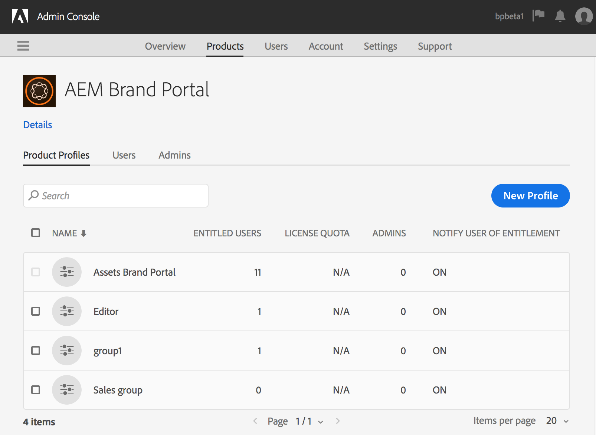

## Aggiunta di utenti a un profilo di prodotto {#add-users-to-a-product-profile}

Per aggiungere utenti a un gruppo Brand Portal, aggiungeteli al profilo di prodotto corrispondente (precedentemente noto come configurazioni di prodotto) in [!UICONTROL Admin Console]. Potete aggiungere utenti singolarmente o in gruppo.

>[!NOTE]
>
>Potete accedere a [[!UICONTROL Admin Console]](http://adminconsole.adobe.com/enterprise/overview) direttamente o dal Portale marchio. Se accedete direttamente a  Admin Console, seguite i passaggi da 4 a 7 della procedura seguente per aggiungere utenti a un profilo di prodotto.

1. Dalla barra degli strumenti di AEM nella parte superiore, fate clic sul logo Adobe per accedere agli strumenti amministrativi.

   

1. Dal pannello degli strumenti di amministrazione, fate clic su **[!UICONTROL Utenti]**.

   

1. Nella pagina Ruoli  utente, fate clic sulla scheda **[!UICONTROL Gestione]** , quindi su **[!UICONTROL Avvia  Admin Console]**.

   ![Lancio [!DNL Admin Console]](assets/launch_admin_console.png)

1. Dalla barra degli strumenti nella parte superiore, fare clic su **[!UICONTROL Prodotti]**.
1. Nella pagina [!UICONTROL Prodotti] , Profili  prodotto è selezionato per impostazione predefinita. Aprite il profilo di prodotto al quale desiderate aggiungere un utente, ad esempio un gruppo Vendite.

   

1. Per aggiungere singoli utenti al profilo di prodotto, effettuate le seguenti operazioni:

   * Fate clic su **[!UICONTROL Aggiungi utente]**.

   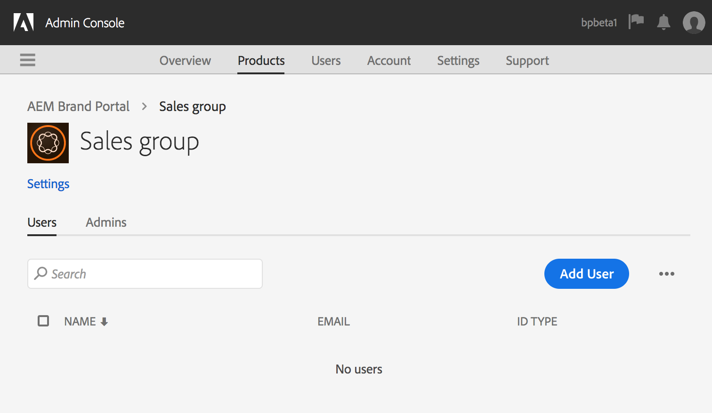

   * Nella pagina [!UICONTROL Aggiungi utente al gruppo] Vendite, digitate l&#39;ID e-mail dell&#39;utente che desiderate aggiungere o selezionate l&#39;utente dall&#39;elenco dei suggerimenti che vengono visualizzati durante la digitazione.

   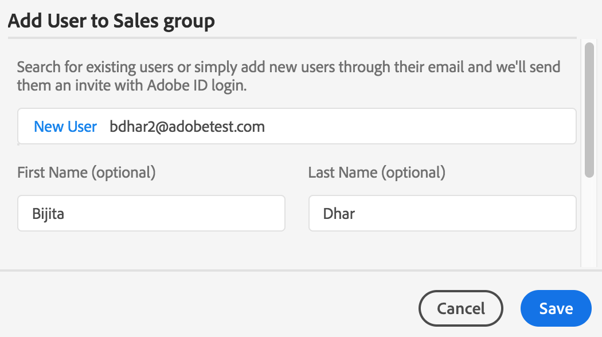

   * Fai clic su **[!UICONTROL Salva]**.

1. Per aggiungere utenti in massa al profilo di prodotto, effettuate le seguenti operazioni:

   * Scegliete **[!UICONTROL puntini di sospensione (...) > Aggiungi utenti in base a CSV]**.

   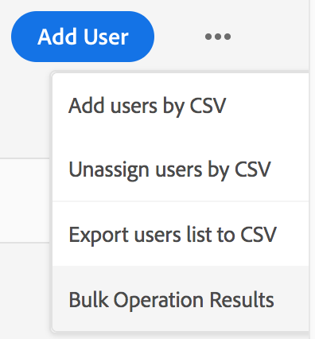

   * Nella pagina **[!UICONTROL Aggiungi utenti con CSV]** , scaricate un modello CSV o trascinate un file CSV.

   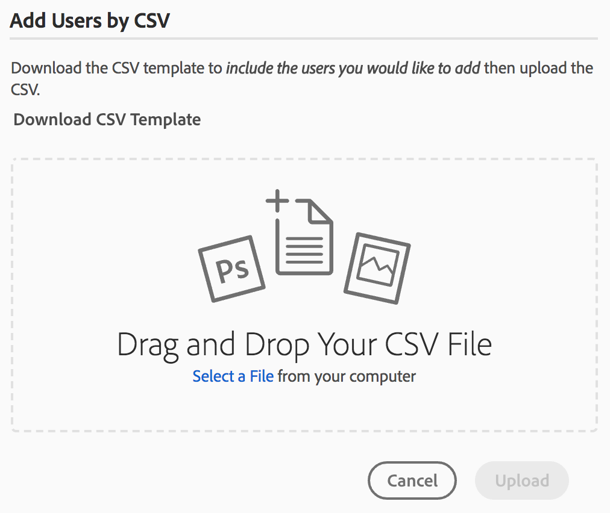

   * Click **[!UICONTROL Upload]**.
   Se hai aggiunto utenti al profilo di prodotto predefinito, ovvero Portale marchio, all’ID e-mail degli utenti aggiunti viene inviato un messaggio e-mail di benvenuto. Gli utenti invitati possono accedere al Portale marchio facendo clic sul collegamento nell’e-mail di benvenuto e accedendo tramite un [!UICONTROL Adobe ID]. Per ulteriori informazioni, consultate [Prima esecuzione](../using/brand-portal-onboarding.md)dell&#39;accesso.

   Gli utenti aggiunti a un profilo di prodotto personalizzato o nuovo non ricevono notifiche e-mail.

## Privilegi di amministratore per gli utenti {#provide-administrator-privileges-to-users}

Potete concedere all’amministratore di sistema o all’amministratore di prodotto i privilegi di amministratore a un utente di Brand Portal. Non fornire altri diritti amministrativi disponibili in [!UICONTROL Admin Console], ad esempio amministratore di profilo di prodotto, amministratore di gruppo di utenti e amministratore del supporto. Per ulteriori informazioni su questi ruoli, vedere Ruoli amministrativi.

>[!NOTE]
>
>Potete accedere a [[!UICONTROL Admin Console]](https://adminconsole.adobe.com/enterprise/overview) direttamente o dal Portale marchio. Se accedete direttamente a [!UICONTROL Admin Console] , seguite i passaggi da 4 a 8 descritti nella procedura seguente per aggiungere un utente a un profilo di prodotto.

1. Dalla barra degli strumenti di AEM nella parte superiore, fate clic sul logo Adobe per accedere agli strumenti amministrativi.

   

1. Dal pannello degli strumenti di amministrazione, fate clic su **[!UICONTROL Utenti]**.

   

1. Nella pagina Ruoli  utente, fate clic sulla scheda **[!UICONTROL Gestione]** , quindi su **[!UICONTROL Avvia  Admin Console]**.

   

1. Dalla barra degli strumenti nella parte superiore, fate clic su **[!UICONTROL Utenti]**.
1. Nella pagina [!UICONTROL Utenti] , [!UICONTROL Utenti] nella barra a sinistra è selezionata per impostazione predefinita. Fate clic sul nome utente dell’utente a cui desiderate assegnare i privilegi di amministratore.

   

1. Nella pagina del profilo utente, individuate la sezione Diritti **[!UICONTROL di]** amministrazione in basso e scegliete **[!UICONTROL puntini di sospensione (...) > Modifica diritti]**di amministrazione.
   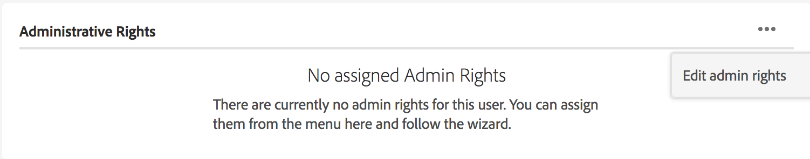

1. Nella pagina [!UICONTROL Modifica amministratore] , selezionate Amministratore di sistema o Amministratore prodotto.

   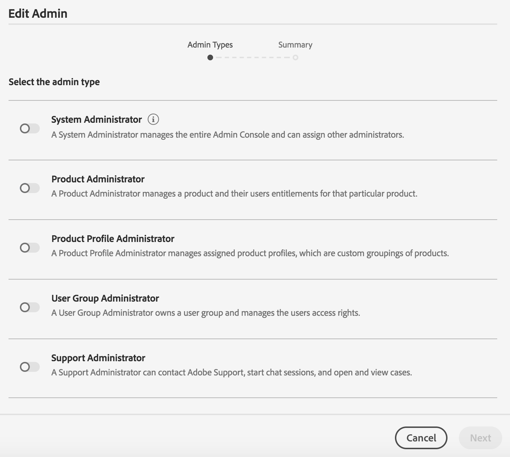

   >[!NOTE]
   >
   >Brand Portal supporta solo i ruoli Amministratore di sistema e Amministratore prodotto.
   >
   >
   >Adobe consiglia di evitare di utilizzare il ruolo di amministratore di sistema perché concede privilegi di amministratore a livello di organizzazione per tutti i prodotti di un&#39;organizzazione. Ad esempio, un amministratore di sistema di un&#39;organizzazione che include tre prodotti Marketing Cloud dispone dell&#39;intero set di privilegi per tutti e tre i prodotti. Solo un amministratore di sistema può configurare i AEM Assets in modo che le risorse possano essere pubblicate dai AEM Assets al Portale marchio. For more information, see [Configure AEM Assets with Brand Portal](../using/configure-aem-assets-with-brand-portal.md).
   >
   >Al contrario, il ruolo Amministratore prodotto concede privilegi di amministratore solo per un prodotto specifico. Se desiderate applicare un controllo di accesso più dettagliato in Brand Portal, utilizzate il ruolo Amministratore prodotto e selezionate il prodotto come Brand Portal.

   >[!NOTE]
   >
   >Brand Portal non supporta i privilegi di amministratore del profilo di prodotto (precedentemente denominato amministratore di configurazione). Evitate di assegnare diritti di amministratore del profilo di prodotto a un utente.

1. Esaminate la selezione del tipo di amministratore e fate clic su **[!UICONTROL Salva]**.

   >[!NOTE]
   >
   >Per revocare i privilegi di amministratore per un utente, apportate le modifiche appropriate nella pagina **[!UICONTROL Modifica amministratore]** , quindi fate clic su **[!UICONTROL Salva]**.

## Gestione dei ruoli utente {#manage-user-roles}

Un amministratore può modificare i ruoli per gli utenti in Brand Portal.

Oltre al ruolo Amministratore, Brand Portal supporta i seguenti ruoli:

* [!UICONTROL Visualizzatore]: Gli utenti con questo ruolo possono visualizzare i file e le cartelle condivisi da un amministratore. I visualizzatori possono anche cercare e scaricare le risorse. Tuttavia, i visualizzatori non possono condividere il contenuto (file, cartelle, [!UICONTROL raccolte]) con altri utenti.
* [!UICONTROL Editor]: Gli utenti con questo ruolo dispongono di tutti i privilegi di un visualizzatore. Inoltre, gli editor possono condividere il contenuto (cartelle, [!UICONTROL raccolte], collegamenti) con altri utenti.

1. Dalla barra degli strumenti di AEM nella parte superiore, fate clic sul logo Adobe per accedere agli strumenti amministrativi.

   

1. Dal pannello degli strumenti di amministrazione, fate clic su **[!UICONTROL Utenti]**.

   

1. Nella pagina Ruoli  utente, la scheda [!UICONTROL Utenti] è selezionata per impostazione predefinita. Per l’utente di cui desiderate modificare il ruolo, selezionate **[!UICONTROL Editor]** o **[!UICONTROL Visualizzatore]** dall’elenco a discesa **[!UICONTROL Ruolo]** .

   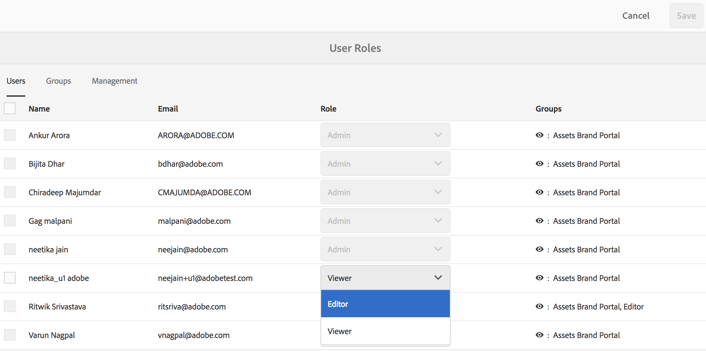

   Per modificare il ruolo di più utenti contemporaneamente, selezionate gli utenti e scegliete il ruolo appropriato dal menu a discesa **[!UICONTROL Ruolo]** .

   >[!NOTE]
   >
   >L&#39;elenco [!UICONTROL Ruolo] per gli utenti Amministratore è disattivato. Non potete selezionare questi utenti per modificarne i ruoli.

   >[!NOTE]
   >
   >Il ruolo utente è disabilitato anche se l’utente è membro del gruppo Editor. Per revocare i privilegi di modifica all’utente, rimuovete l’utente dal gruppo Editor oppure modificate il ruolo dell’intero gruppo nel visualizzatore.

1. Fai clic su **[!UICONTROL Salva]**. Il ruolo viene modificato per l&#39;utente corrispondente. Se avete selezionato più utenti, i ruoli per tutti gli utenti vengono modificati contemporaneamente.

   >[!NOTE]
   >
   >Le modifiche nelle autorizzazioni dell’utente si riflettono nella pagina Ruoli **** utente solo dopo che gli utenti hanno nuovamente effettuato l’accesso al Portale marchio.

## Gestione di ruoli e privilegi di gruppo {#manage-group-roles-and-privileges}

Un amministratore può associare privilegi specifici a un [gruppo](../using/brand-portal-adding-users.md#main-pars-title-278567577) di utenti in Brand Portal. La scheda **[!UICONTROL Gruppi]** nella pagina Ruoli **** utente consente agli amministratori di:

* Assegnazione di ruoli ai gruppi di utenti
* Limita i gruppi di utenti a scaricare le rappresentazioni originali di file di immagini (.jpeg, .tiff, .png, .bmp, .gif, .pjpeg, x-portabile-anymap, x-portatile-bitmap, x-portabile-grigio, x-portabile-pixel-map, x-xbitmap, x-xmap, x-icon, image/photoshop, image/x-photoshop, .psd, image/vnd.adobe.photoshop) dal Brand Portal.

>[!NOTE]
>
>Per le risorse condivise come collegamento, verrà applicata l’autorizzazione per accedere alle rappresentazioni originali dei file immagine in base alle autorizzazioni dell’utente che sta condividendo le risorse.

Per modificare il ruolo e il diritto di accesso alle rappresentazioni originali per membri specifici del gruppo, effettuate le seguenti operazioni:

1. Nella pagina Ruoli **** utente, andate alla scheda **[!UICONTROL Gruppi]** .
1. Selezionate i gruppi per i quali desiderate modificare i ruoli.
1. Selezionate il ruolo appropriato dall’elenco a discesa **[!UICONTROL Ruolo]** .

   Per consentire ai membri di un gruppo di avere accesso alle rappresentazioni originali di file di immagine (.jpeg, .tiff, .png, .bmp, .gif, .pjpeg, x-portabile-anymap, x-portatile-bitmap, x-portabile-grigio, x-portabile-pixmap, x-rgb, x-xbitmap, x-xpixmap, x-icon, image/photoshop, image x-photoshop, .psd, image/vnd.adobe.photoshop) che scaricano dal portale o dal collegamento condiviso, mantenete l&#39;opzione **[!UICONTROL Accesso all&#39;originale]** selezionata per quel gruppo. Per impostazione predefinita, l’opzione **[!UICONTROL Accesso all’originale]** è selezionata per tutti gli utenti. Per impedire a un gruppo di utenti di accedere alle rappresentazioni originali, deselezionate l’opzione corrispondente a tale gruppo.

   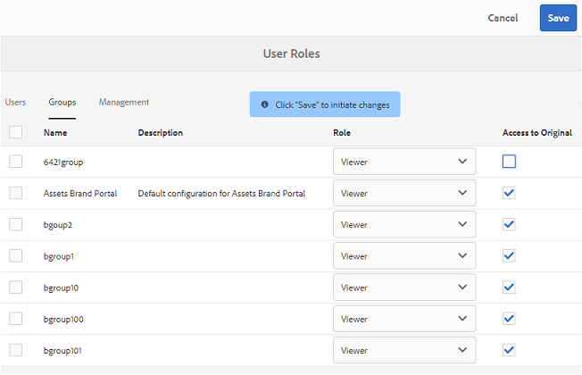

   >[!NOTE]
   >
   >Se un utente viene aggiunto a più gruppi e se uno di questi dispone di restrizioni, tali restrizioni verranno applicate a tale utente.
   >
   >
   >Inoltre, le restrizioni per l’accesso alle rappresentazioni originali dei file immagine non si applicano agli amministratori anche se sono membri di gruppi limitati.

1. Fai clic su **[!UICONTROL Salva]**. Il ruolo viene modificato per i gruppi corrispondenti.

   >[!NOTE]
   >
   >L’associazione utente-gruppo, o l’appartenenza al gruppo di un utente, viene sincronizzata nel Portale marchio ogni 8 ore. Le modifiche ai ruoli utente o gruppo diventano effettive dopo l’esecuzione del processo di sincronizzazione successivo.

