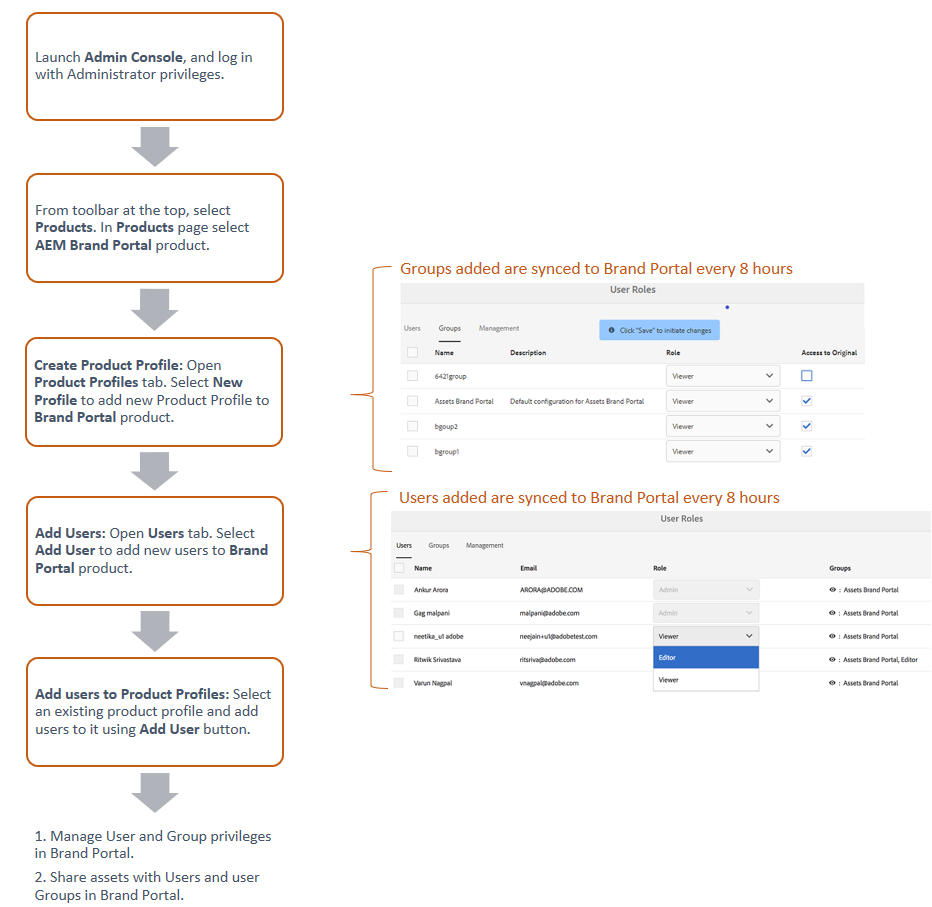

# Gestire utenti, gruppi e ruoli utente {#manage-users-groups-and-user-roles}

Gli amministratori possono utilizzare Adobe Admin Console per creare utenti e profili di prodotto AEM Assets Brand Portal e gestire i loro ruoli utilizzando l’interfaccia utente di Brand Portal. Questo privilegio non è disponibile per visualizzatori ed editor.

In [[!UICONTROL Admin Console]](http://adminconsole.adobe.com/enterprise/overview) puoi visualizzare tutti i prodotti associati alla tua organizzazione. Un prodotto potrebbe essere una qualsiasi soluzione di Experience Cloud, ad esempio Adobe Analytics, Adobe Target o AEM Brand Portal. Devi scegliere il prodotto AEM Brand Portal e creare profili di prodotto.

<!--
Comment Type: draft

<note type="note">

Product Profiles (formerly known as product configurations*). 

* The nomenclature has changed from product configurations to product profiles in the new Adobe Admin Console.

</note>
-->

Questi profili di prodotto vengono sincronizzati con l’interfaccia utente di Brand Portal ogni 8 ore e sono visibili come gruppi in Brand Portal. Dopo aver aggiunto gli utenti e creato i profili di prodotto e aggiunto gli utenti a tali profili di prodotto, puoi assegnare i ruoli a utenti e gruppi in Brand Portal.

>[!NOTE]
>
>Per creare gruppi in Brand Portal, a partire da [!UICONTROL Admin Console], utilizza **[!UICONTROL Prodotti > Profili di prodotto]**, ad Adobe, anziché **[!UICONTROL Pagina utente > Gruppi utente]**. I profili di prodotto nell&#39;Adobe [!UICONTROL Admin Console] vengono utilizzati per creare gruppi in Brand Portal.

## Aggiungi un utente {#add-a-user}

Se sei un amministratore di prodotto, utilizza l’Adobe [[!UICONTROL Admin Console]](http://adminconsole.adobe.com/enterprise/overview) per creare utenti e assegnarli ai profili di prodotto (*precedentemente noti come configurazioni di prodotto*), che vengono visualizzati come gruppi in Brand Portal. Puoi utilizzare i gruppi per eseguire operazioni in blocco, ad esempio la gestione dei ruoli e la condivisione delle risorse.

>[!NOTE]
>
>I nuovi utenti che non hanno accesso a Brand Portal possono richiedere l’accesso dalla schermata di accesso di Brand Portal. Per ulteriori informazioni, consulta [Richiedere l’accesso a Brand Portal](../using/brand-portal.md#request-access-to-brand-portal). Dopo aver ricevuto le notifiche di richiesta di accesso nell&#39;area di notifica, fai clic sulla notifica pertinente e quindi su **[!UICONTROL Concedi accesso]**. In alternativa, segui il collegamento nell’e-mail di richiesta di accesso ricevuta. Quindi, per aggiungere un utente tramite [Adobe [!UICONTROL Admin Console]](http://adminconsole.adobe.com/enterprise/overview), segui i passaggi 4-7 della procedura seguente.

>[!NOTE]
>
>Puoi accedere a [Adobe [!UICONTROL Admin Console]](http://adminconsole.adobe.com/enterprise/overview) direttamente o da Brand Portal. Se accedi direttamente, segui i passaggi 4-7 della procedura seguente per aggiungere un utente.

1. Dalla barra degli strumenti AEM in alto, fai clic sul logo Adobe per accedere agli strumenti amministrativi.

   

1. Dal pannello degli strumenti amministrativi, fai clic su **[!UICONTROL Utenti]**.

   

1. Nella pagina [!UICONTROL Ruoli utente], fai clic sulla scheda **[!UICONTROL Gestione]** , quindi fai clic su **[!UICONTROL Avvia Admin Console]**.

   

1. Ad Admin Console, per creare un nuovo utente, effettua una delle seguenti operazioni:

   * Dalla barra degli strumenti nella parte superiore, fai clic su **[!UICONTROL Panoramica]**. Nella pagina [!UICONTROL Panoramica], fai clic su **[!UICONTROL Assegna utenti]** dalla scheda prodotto Brand Portal.

   

   * Dalla barra degli strumenti nella parte superiore, fai clic su **[!UICONTROL Utenti]**. Nella pagina [!UICONTROL Utenti] , l’opzione [!UICONTROL Utenti] nella barra a sinistra è selezionata per impostazione predefinita. Fare clic su **[!UICONTROL Aggiungi utente]**.

   

1. Nella finestra di dialogo aggiungi utente, digita l’ID e-mail dell’utente che desideri aggiungere o seleziona l’utente dall’elenco dei suggerimenti visualizzati durante la digitazione.

   

1. Assegna l’utente ad almeno un profilo di prodotto (precedentemente noto come configurazioni di prodotto) in modo che l’utente possa accedere a Brand Portal. Seleziona il profilo di prodotto appropriato dal campo **[!UICONTROL Seleziona un profilo per questo prodotto]** .
1. Fai clic su **[!UICONTROL Salva]**. Viene inviata un’e-mail di benvenuto all’utente aggiunto. L&#39;utente invitato può accedere a Brand Portal facendo clic sul collegamento nell&#39;e-mail di benvenuto e accedendo utilizzando un [!UICONTROL Adobe ID]. Per ulteriori informazioni, consulta [Esperienza del primo accesso](../using/brand-portal-onboarding.md).

   >[!NOTE]
   >
   >Se un utente non è in grado di accedere a Brand Portal, l&#39;amministratore dell&#39;organizzazione deve visitare l&#39;Adobe [!UICONTROL Admin Console] e verificare se l&#39;utente è presente ed è stato aggiunto ad almeno un profilo di prodotto.

   Per informazioni sulla concessione di privilegi amministrativi all&#39;utente, vedere [Fornire privilegi di amministratore agli utenti](../using/brand-portal-adding-users.md#provideadministratorprivilegestousers).

## Aggiungere un profilo di prodotto {#add-a-product-profile}

I profili di prodotto (precedentemente noti come configurazioni di prodotto) in [!UICONTROL Admin Console] vengono utilizzati per creare gruppi in Brand Portal in modo da poter eseguire operazioni in blocco, come la gestione dei ruoli e la condivisione delle risorse in Brand Portal. **Brand** Portal è il profilo di prodotto predefinito disponibile; puoi creare più profili di prodotto e aggiungere utenti ai nuovi profili di prodotto.

>[!NOTE]
>
>Puoi accedere a [[!UICONTROL Admin Console]](http://adminconsole.adobe.com/enterprise/overview) direttamente o da Brand Portal. Se accedi direttamente a [!UICONTROL Admin Console], segui i passaggi 4-7 della procedura seguente per aggiungere un profilo di prodotto.

1. Dalla barra degli strumenti AEM in alto, fai clic sul logo Adobe per accedere agli strumenti amministrativi.

   

1. Dal pannello degli strumenti amministrativi, fai clic su **[!UICONTROL Utenti]**.

   

1. Nella pagina [!UICONTROL Ruoli utente], fai clic sulla scheda **[!UICONTROL Gestione]** , quindi fai clic su **[!UICONTROL Avvia Admin Console]**.

   

1. Dalla barra degli strumenti nella parte superiore, fai clic su **[!UICONTROL Prodotti]**.
1. Nella pagina [!UICONTROL Prodotti], [!UICONTROL Profili di prodotto] è selezionato per impostazione predefinita. Fai clic su **[!UICONTROL Nuovo profilo]**.

   

1. Nella pagina [!UICONTROL Crea un nuovo profilo] , inserisci il nome del profilo, il nome visualizzato, la descrizione del profilo e scegli se desideri avvisare gli utenti via e-mail quando vengono aggiunti o rimossi dal profilo.

   

1. Fare clic su **[!UICONTROL Fine]**. Il gruppo di configurazione del prodotto, ad esempio **[!UICONTROL Gruppo vendite]**, viene aggiunto a Brand Portal.

   

## Aggiungere utenti a un profilo di prodotto {#add-users-to-a-product-profile}

Per aggiungere utenti a un gruppo Brand Portal, aggiungili al profilo di prodotto corrispondente (precedentemente noto come configurazioni di prodotto) in [!UICONTROL Admin Console]. Puoi aggiungere gli utenti singolarmente o in blocco.

>[!NOTE]
>
>Puoi accedere a [[!UICONTROL Admin Console]](http://adminconsole.adobe.com/enterprise/overview) direttamente o da Brand Portal. Se accedi direttamente ad Admin Console, segui i passaggi 4-7 della procedura seguente per aggiungere utenti a un profilo di prodotto.

1. Dalla barra degli strumenti AEM in alto, fai clic sul logo Adobe per accedere agli strumenti amministrativi.

   

1. Dal pannello degli strumenti amministrativi, fai clic su **[!UICONTROL Utenti]**.

   

1. Nella pagina [!UICONTROL Ruoli utente], fai clic sulla scheda **[!UICONTROL Gestione]** , quindi fai clic su **[!UICONTROL Avvia Admin Console]**.

   ![Lancio [!DNL Admin Console]](assets/launch_admin_console.png)

1. Dalla barra degli strumenti nella parte superiore, fai clic su **[!UICONTROL Prodotti]**.
1. Nella pagina [!UICONTROL Prodotti], [!UICONTROL Profili di prodotto] è selezionato per impostazione predefinita. Apri il profilo di prodotto a cui desideri aggiungere un utente, ad esempio [!UICONTROL Gruppo vendite].

   

1. Per aggiungere singoli utenti al profilo di prodotto, procedi come segue:

   * Fare clic su **[!UICONTROL Aggiungi utente]**.

   

   * Nella pagina [!UICONTROL Aggiungi utente al gruppo vendite], digita l&#39;ID e-mail dell&#39;utente che desideri aggiungere o selezionare l&#39;utente dall&#39;elenco dei suggerimenti visualizzati durante la digitazione.

   

   * Fai clic su **[!UICONTROL Salva]**.

1. Per aggiungere utenti in blocco al profilo di prodotto, procedi come segue:

   * Scegli **[!UICONTROL puntini di sospensione (..) > Aggiungi gli utenti tramite CSV]**.

   

   * Nella pagina **[!UICONTROL Aggiungi utenti da CSV]** , scarica un modello CSV o trascina un file CSV.

   

   * Fai clic su **[!UICONTROL Carica]**.
   Se hai aggiunto gli utenti al profilo di prodotto predefinito, ovvero Brand Portal, viene inviata un’e-mail di benvenuto all’ID e-mail degli utenti aggiunti. Gli utenti invitati possono accedere a Brand Portal facendo clic sul collegamento presente nell&#39;e-mail di benvenuto e accedendo utilizzando un [!UICONTROL Adobe ID]. Per ulteriori informazioni, consulta [Esperienza del primo accesso](../using/brand-portal-onboarding.md).

   Gli utenti aggiunti a un profilo di prodotto personalizzato o nuovo non ricevono notifiche e-mail.

## Fornire privilegi di amministratore agli utenti {#provide-administrator-privileges-to-users}

È possibile concedere all’amministratore di sistema o all’amministratore di prodotto il privilegio di amministratore di prodotto a un utente Brand Portal. Non fornire altri diritti amministrativi disponibili in [!UICONTROL Admin Console], ad esempio amministratore del profilo di prodotto, amministratore del gruppo di utenti e amministratore del supporto. Per ulteriori informazioni su questi ruoli, consulta [Ruoli amministrativi](https://helpx.adobe.com/enterprise/using/admin-roles.html).

>[!NOTE]
>
>Puoi accedere a [[!UICONTROL Admin Console]](https://adminconsole.adobe.com/enterprise/overview) direttamente o da Brand Portal. Se accedi direttamente a [!UICONTROL Admin Console], segui i passaggi 4-8 della procedura seguente per aggiungere un utente a un profilo di prodotto.

1. Dalla barra degli strumenti AEM in alto, fai clic sul logo Adobe per accedere agli strumenti amministrativi.

   

1. Dal pannello degli strumenti amministrativi, fai clic su **[!UICONTROL Utenti]**.

   

1. Nella pagina [!UICONTROL Ruoli utente], fai clic sulla scheda **[!UICONTROL Gestione]** , quindi fai clic su **[!UICONTROL Avvia Admin Console]**.

   

1. Dalla barra degli strumenti nella parte superiore, fai clic su **[!UICONTROL Utenti]**.
1. Nella pagina [!UICONTROL Utenti] , l’opzione [!UICONTROL Utenti] nella barra a sinistra è selezionata per impostazione predefinita. Fare clic sul nome utente dell&#39;utente a cui si desidera assegnare privilegi di amministratore.

   

1. Nella pagina del profilo utente, individua la sezione **[!UICONTROL Diritti amministrativi]** in basso e scegli **[!UICONTROL puntini di sospensione (...) > Modifica diritti di amministrazione]**.
   

1. Nella pagina [!UICONTROL Modifica amministratore], selezionare Amministratore di sistema o Amministratore di prodotto.

   

   >[!NOTE]
   >
   >Brand Portal supporta solo i ruoli Amministratore di sistema e Amministratore di prodotto.
   >
   >Adobe consiglia di evitare di utilizzare il ruolo Amministratore di sistema perché concede privilegi di amministratore a livello di organizzazione per tutti i prodotti di un&#39;organizzazione. Ad esempio, l’amministratore di sistema di un’organizzazione che include tre prodotti marketing cloud dispone dell’intero insieme di privilegi per tutti e tre i prodotti. Solo un amministratore di sistema può configurare AEM Assets in modo che le risorse possano essere pubblicate da AEM Assets a Brand Portal. Per ulteriori informazioni, consulta [Configurare AEM Assets con Brand Portal](../using/configure-aem-assets-with-brand-portal.md).
   >
   >Al contrario, il ruolo Amministratore prodotto concede privilegi di amministratore solo per un prodotto specifico. Se desideri applicare un controllo di accesso più granulare all’interno di Brand Portal, utilizza il ruolo Amministratore prodotto e seleziona il prodotto come Brand Portal.

   >[!NOTE]
   >
   >Brand Portal non supporta i privilegi di amministratore del profilo di prodotto (precedentemente noto come amministratore della configurazione). Evita di assegnare i diritti di amministratore del profilo di prodotto a un utente.

1. Esamina la selezione del tipo di amministratore e fai clic su **[!UICONTROL Salva]**.

   >[!NOTE]
   >
   >Per revocare i privilegi di amministratore per un utente, apporta le modifiche appropriate nella pagina **[!UICONTROL Modifica amministratore]**, quindi fai clic su **[!UICONTROL Salva]**.

## Gestire i ruoli utente {#manage-user-roles}

Un amministratore può modificare i ruoli per gli utenti in Brand Portal.

Oltre al ruolo Amministratore, Brand Portal supporta i seguenti ruoli:

* [!UICONTROL Visualizzatore]: Gli utenti con questo ruolo possono visualizzare i file e le cartelle condivisi da un amministratore. I visualizzatori possono anche cercare e scaricare le risorse. Tuttavia, i visualizzatori non possono condividere contenuti (file, cartelle, [!UICONTROL raccolte]) con altri utenti.
* [!UICONTROL Editor]: Gli utenti con questo ruolo hanno tutti i privilegi di un visualizzatore. Inoltre, gli editor possono condividere contenuti (cartelle, [!UICONTROL raccolte], collegamenti) con altri utenti.

1. Dalla barra degli strumenti AEM in alto, fai clic sul logo Adobe per accedere agli strumenti amministrativi.

   

1. Dal pannello degli strumenti amministrativi, fai clic su **[!UICONTROL Utenti]**.

   

1. Nella pagina [!UICONTROL Ruoli utente], la scheda [!UICONTROL Utenti] è selezionata per impostazione predefinita. Per l&#39;utente di cui si desidera modificare il ruolo, selezionare **[!UICONTROL Editor]** o **[!UICONTROL Visualizzatore]** dal menu a discesa **[!UICONTROL Ruolo]**.

   

   Per modificare il ruolo di più utenti contemporaneamente, seleziona gli utenti e scegli il ruolo appropriato dal menu a discesa **[!UICONTROL Role]** .

   >[!NOTE]
   >
   >L&#39;elenco [!UICONTROL Role] per gli utenti amministratori è disattivato. Non è possibile selezionare questi utenti per modificarne i ruoli.

   >[!NOTE]
   >
   >Il ruolo utente viene disabilitato anche se l&#39;utente è membro del gruppo Editor. Per revocare i privilegi di modifica all’utente, rimuovi l’utente dal gruppo Editor o cambia il ruolo dell’intero gruppo in Visualizzatore.

1. Fai clic su **[!UICONTROL Salva]**. Il ruolo viene modificato per l’utente corrispondente. Se hai selezionato più utenti, i ruoli per tutti gli utenti vengono modificati contemporaneamente.

   >[!NOTE]
   >
   >Le modifiche nelle autorizzazioni utente si riflettono nella pagina **[!UICONTROL Ruoli utente]** solo dopo il nuovo accesso degli utenti a Brand Portal.

## Gestire ruoli e privilegi del gruppo {#manage-group-roles-and-privileges}

Un amministratore può associare privilegi specifici a un [gruppo](../using/brand-portal-adding-users.md#main-pars-title-278567577) di utenti su Brand Portal. La scheda **[!UICONTROL Gruppi]** nella pagina **[!UICONTROL Ruoli utente]** consente agli amministratori di:

* Assegnare ruoli ai gruppi di utenti
* Limita i gruppi di utenti a scaricare rappresentazioni originali di file immagine (.jpeg, .tiff, .png, .bmp, .gif, .pjpeg, x-portatile-anymap, x-portatile-bitmap, x-portatile-graymap, x-portatile-pixmap, x-rgb, x-xbitmap, x-xmap, x-icon, image/photoshop, image/x-photoshop, .psd, image/vnd.adobe.photoshop) da Brand Portal.

>[!NOTE]
>
>Per le risorse condivise come collegamento, l’autorizzazione per accedere alle rappresentazioni originali dei file di immagine verrà applicata in base alle autorizzazioni dell’utente che condivide le risorse.

Per modificare il ruolo e il diritto di accedere alle rappresentazioni originali per specifici membri del gruppo, effettua le seguenti operazioni:

1. Nella pagina **[!UICONTROL Ruoli utente]** , passa alla scheda **[!UICONTROL Gruppi]** .
1. Selezionare i gruppi per i quali si desidera modificare i ruoli.
1. Seleziona il ruolo appropriato dall&#39;elenco a discesa **[!UICONTROL Ruolo]** .

   Per consentire ai membri di un gruppo di avere accesso alle rappresentazioni originali di file immagine (.jpeg, .tiff, .png, .bmp, .gif, .pjpeg, x-portatile-anymap, x-portatile-bitmap, x-portatile-griaymap, x-portatile-pixmap, x-rgb, x-xbitmap, x-xpixmap, x-icon, image/photoshop, image/image x-photoshop, .psd, image/vnd.adobe.photoshop) che scaricano dal portale o dal collegamento condiviso, mantieni selezionata l&#39;opzione **[!UICONTROL Accesso all&#39;originale]** per quel gruppo. Per impostazione predefinita, l&#39;opzione **[!UICONTROL Accesso all&#39;originale]** è selezionata per tutti gli utenti. Per impedire a un gruppo di utenti di accedere alle rappresentazioni originali, deseleziona l’opzione corrispondente a tale gruppo.

   

   >[!NOTE]
   >
   >Se un utente viene aggiunto a più gruppi e se uno di questi gruppi dispone di restrizioni, tali restrizioni verranno applicate a tale utente.
   >
   >Inoltre, le restrizioni per l&#39;accesso alle rappresentazioni originali dei file di immagine non si applicano agli amministratori anche se sono membri di gruppi ristretti.

1. Fai clic su **[!UICONTROL Salva]**. Il ruolo viene modificato per i gruppi corrispondenti.

   >[!NOTE]
   >
   >L’associazione utente-gruppo, o l’iscrizione al gruppo di un utente, viene sincronizzata in Brand Portal ogni 8 ore. Le modifiche ai ruoli utente o gruppo hanno effetto dopo l’esecuzione del processo di sincronizzazione successivo.
