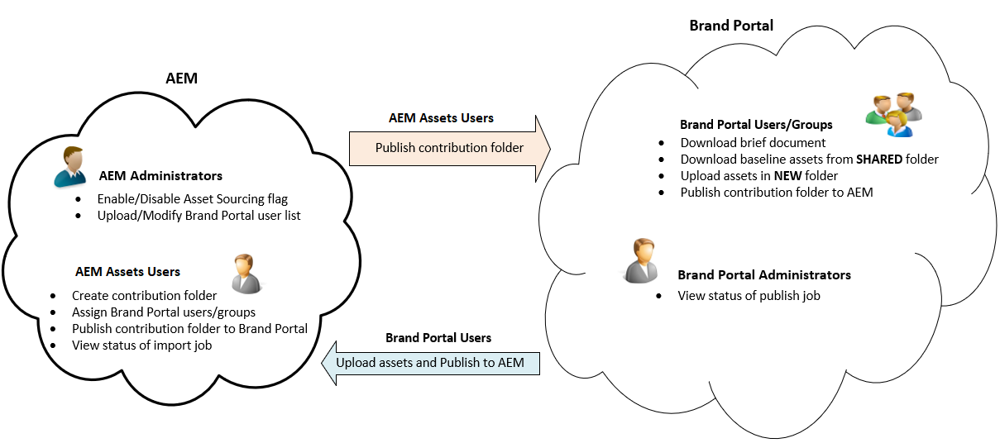

# Panoramica di Asset Sourcing {#overview-asset-sourcing-in-bp}

**Asset Sourcing** consente agli utenti di AEM (amministratori/utenti non amministratori) di creare nuove cartelle con un’ulteriore proprietà **Asset Contribution** , in modo che la nuova cartella creata possa essere aperta all’invio delle risorse da parte degli utenti del Brand Portal. Questo attiva automaticamente un flusso di lavoro che crea due sottocartelle aggiuntive, denominate **SHARED** e **NEW**, all’interno della cartella **Contribution** appena creata. L’amministratore AEM definisce quindi il requisito caricando una breve descrizione dei tipi di risorse da aggiungere alla cartella dei contributi, nonché una serie di risorse di base, nella cartella **SHARED** per garantire che gli utenti BP dispongano delle informazioni di riferimento necessarie. L’amministratore può quindi concedere agli utenti attivi di Brand Portal l’accesso alla cartella dei contributi prima di pubblicare la nuova cartella **Contribution** nel Brand Portal. Dopo aver aggiunto il contenuto nella cartella **NEW** , l’utente può pubblicare nuovamente la cartella dei contributi nell’ambiente di authoring di AEM. L’importazione potrebbe richiedere alcuni minuti e riflettere il contenuto appena pubblicato in AEM Assets.

Inoltre, tutte le funzionalità esistenti rimangono invariate. Gli utenti di Brand Portal possono visualizzare, cercare e scaricare risorse dalla cartella dei contributi e dalle altre cartelle consentite. Inoltre, gli amministratori possono condividere ulteriormente la cartella dei contributi, modificare le proprietà e aggiungere risorse alle raccolte.

>[!VIDEO](https://video.tv.adobe.com/v/29365/?quality=12)

>[!NOTE]
>
>La sorgente delle risorse in Brand Portal è supportata in AEM 6.5.2.0 e versioni successive.
>
>Questa funzione non è supportata nelle versioni precedenti - AEM 6.3 e AEM 6.4.
>
>Contatta il supporto Adobe per aggiornare l’istanza di AEM all’ultima versione supportata di AEM.

>[!NOTE]
>
>Se utilizzi AEM 6.5.4, la funzione di origine delle risorse continuerà a funzionare con l’integrazione OAuth legacy.
>
>Tuttavia, gli utenti di Brand Portal non sono in grado di pubblicare le risorse delle cartelle dei contributi in Risorse AEM al momento dell’aggiornamento ad Adobe I/O su AEM 6.5.4.
>
>Questo problema verrà risolto nel service pack successivo AEM 6.5.5.
>
>Per una correzione immediata su AEM 6.5.4, si consiglia di [scaricare l’hotfix](https://www.adobeaemcloud.com/content/marketplace/marketplaceProxy.html?packagePath=/content/companies/public/adobe/packages/cq650/hotfix/cq-6.5.0-hotfix-33041) e installarlo nell’istanza di creazione.

## Prerequisiti {#prerequisites}

* AEM 6.5.0.2 o versione successiva.
* Accertati che l’istanza di Risorse AEM sia configurata con il Brand Portal. Consultate [Configurare AEM Assets con Brand Portal](../using/configure-aem-assets-with-brand-portal.md).

## Consulta anche {#reference-articles}

**Per amministratori**

* [Configurare la sorgente delle risorse in AEM](brand-portal-configure-asset-sourcing.md)
* [Carica elenco utenti Brand Portal](brand-portal-configure-asset-sourcing.md)
* [Configurare la cartella dei contributi](brand-portal-contribution-folder.md)
* [Caricare le risorse della baseline nella cartella Contribution](brand-portal-upload-baseline-assets.md)
* [Pubblica cartella dei contributi in Brand Portal](brand-portal-publish-contribution-folder-to-brand-portal.md)

**Per utenti di Brand Portal**

* [Scaricare i requisiti delle risorse](brand-portal-download-asset-requirements.md)
* [Caricare nuove risorse nella cartella Contribution](brand-portal-upload-assets-to-contribution-folder.md)
* [Pubblica la cartella dei contributi in Risorse AEM](brand-portal-publish-contribution-folder-to-aem-assets.md)
