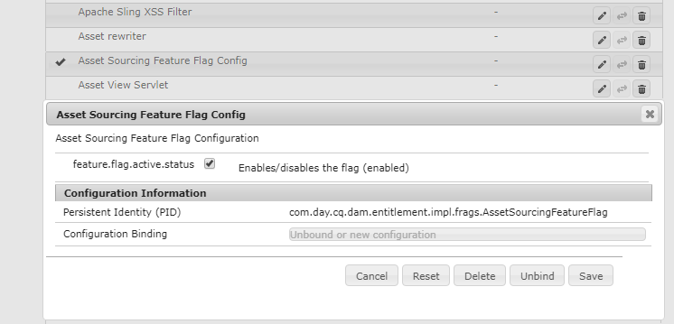
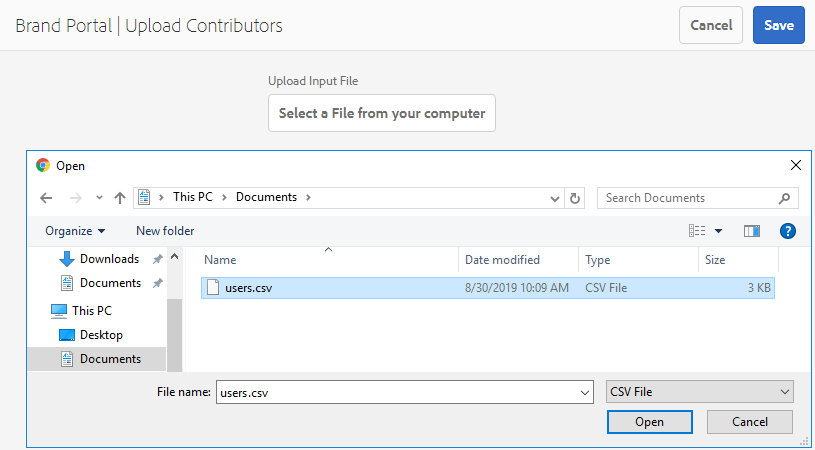

# Panoramica su Asset Sourcing {#overview-asset-sourcing-in-bp}

**Asset** Source consente agli utenti AEM (amministratori/utenti non amministratori) di creare nuove cartelle con un’ulteriore proprietà  **Asset** Contribution, in modo che la nuova cartella creata sia aperta all’invio delle risorse da parte degli utenti di Brand Portal. Questo attiva automaticamente un flusso di lavoro che crea due sottocartelle aggiuntive, denominate **SHARED** e **NEW**, all’interno della cartella **Contribution** appena creata. L’amministratore AEM definisce quindi il requisito caricando una breve descrizione dei tipi di risorse da aggiungere alla cartella dei contributi, nonché un set di risorse della linea di base, nella cartella **SHARED** per garantire che gli utenti BP dispongano delle informazioni di riferimento necessarie. L’amministratore può quindi concedere agli utenti attivi di Brand Portal l’accesso alla cartella dei contributi prima di pubblicare su Brand Portal la cartella **Contribution** appena creata. Dopo aver aggiunto il contenuto nella cartella **NEW** , l’utente può pubblicare nuovamente la cartella dei contributi nell’ambiente di authoring di AEM. Tieni presente che potrebbero essere necessari alcuni minuti per completare l’importazione e riflettere il contenuto appena pubblicato in AEM Assets.

Inoltre, tutte le funzionalità esistenti rimangono invariate. Gli utenti di Brand Portal possono visualizzare, cercare e scaricare risorse dalla cartella dei contributi e dalle altre cartelle consentite. Inoltre, gli amministratori possono condividere ulteriormente la cartella dei contributi, modificare le proprietà e aggiungere risorse alle raccolte.

## Prerequisiti {#prerequisites}

* Istanza di AEM Assets as a Cloud Service, AEM Assets 6.5.2 o versione successiva.
* Assicurati che l’istanza di AEM Assets sia configurata con Brand Portal. Consulta [Configurare AEM Assets con Brand Portal](../using/configure-aem-assets-with-brand-portal.md).
* Assicurati che il tenant di Brand Portal sia configurato con un’istanza di authoring di AEM Assets.

>[!VIDEO](https://video.tv.adobe.com/v/29365/?quality=12)

>[!NOTE]
>
>C’è un problema noto in AEM Assets 6.5.4. Gli utenti di Brand Portal non possono pubblicare le risorse della cartella dei contributi in AEM Assets durante l’aggiornamento ad Adobe Developer Console.
>
>Il problema è stato risolto in AEM 6.5.5. È possibile aggiornare l’istanza di AEM Assets all’ultimo service pack AEM 6.5.5 e [aggiornare le configurazioni](https://docs.adobe.com/content/help/en/experience-manager-65/assets/brandportal/configure-aem-assets-with-brand-portal.html#upgrade-integration-65) in Adobe Developer Console.
>
>Per la correzione immediata su AEM 6.5.4, si consiglia di [scaricare l&#39;hotfix](https://www.adobeaemcloud.com/content/marketplace/marketplaceProxy.html?packagePath=/content/companies/public/adobe/packages/cq650/hotfix/cq-6.5.0-hotfix-33041) e installarlo nell&#39;istanza di authoring.

## Configurare Asset Sourcing {#configure-asset-sourcing}

**Asset** Source è configurato dall’interno dell’istanza di authoring di AEM Assets. Gli amministratori possono abilitare la configurazione del flag di funzione Origine risorse dalla **Configurazione della console Web AEM** e caricare l’elenco degli utenti attivi di Brand Portal in **AEM Assets**.

>[!NOTE]
>
>Per impostazione predefinita, Asset Sourcing è abilitato su AEM Assets as a Cloud Service. L’amministratore AEM può caricare direttamente gli utenti attivi di Brand Portal per consentire loro di accedere alla funzione Asset Sourcing.

>[!NOTE]
>
>Prima di iniziare la configurazione, accertati che l’istanza di AEM Assets sia configurata con Brand Portal. Consulta [Configurare AEM Assets con Brand Portal](../using/configure-aem-assets-with-brand-portal.md).

Il video seguente illustra come configurare Asset Sourcing nell’istanza di authoring di AEM Assets:

>[!VIDEO](https://video.tv.adobe.com/v/29771)

### Abilita Asset Sourcing {#enable-asset-sourcing}

Gli amministratori AEM possono abilitare il flag della funzione Origine risorse dall’interno della configurazione della console Web di AEM (anche tramite Configuration Manager).

>[!NOTE]
>
>Questo passaggio non è applicabile ad AEM Assets as a Cloud Service.

**Per abilitare Asset Sourcing:**
1. Accedi all’istanza di authoring di AEM Assets e apri Configuration Manager.
URL predefinito: http:// localhost:4502/system/console/configMgr.
1. Cerca utilizzando la parola chiave **Origine risorse** per individuare **[!UICONTROL Configurazione flag caratteristica determinazione origine risorse]**.
1. Fai clic su **[!UICONTROL File di configurazione del flag di funzione di determinazione origine delle risorse]** per aprire la finestra di configurazione.
1. Selezionare la casella di controllo **[!UICONTROL feature.flag.active.status]**.
1. Fai clic su **[!UICONTROL Salva]**.

### Carica elenco utenti di Brand Portal {#upload-bp-user-list}

Gli amministratori AEM possono caricare il file di configurazione dell’utente di Brand Portal (.csv) contenente l’elenco di utenti attivi di Brand Portal in AEM Assets. Una cartella di contributi può essere condivisa solo con gli utenti attivi di Brand Portal definiti nell’elenco di utenti. L’amministratore può anche aggiungere nuovi utenti nel file di configurazione e caricare l’elenco utenti modificato.

>[!NOTE]
>
>Il formato del file CSV è lo stesso supportato in Admin Console per l’importazione in serie da parte degli utenti. E-mail, nome e cognome sono obbligatori.

Gli amministratori possono aggiungere nuovi utenti in AEM Admin Console. Per informazioni dettagliate, consulta [Gestione utenti](brand-portal-adding-users.md) . Dopo aver aggiunto gli utenti in Admin Console, questi possono essere aggiunti al file di configurazione utente di Brand Portal e quindi ottenere l’autorizzazione per accedere alla cartella dei contributi.

**Per caricare l’elenco degli utenti di Brand Portal:**
1. Accedi alla tua istanza di AEM Assets.
1. Dal pannello **Strumenti**, passa a **[!UICONTROL Risorse]** > **[!UICONTROL Utenti del Brand Portal]**.

1. Viene visualizzata la finestra dei collaboratori per il caricamento di Brand Portal.
Sfoglia dal computer locale e carica il file **di configurazione (.csv)** contenente l’elenco degli utenti di Brand Portal attivi.
1. Fai clic su **[!UICONTROL Salva]**.

   

Gli amministratori possono fornire l’accesso a utenti specifici da questo elenco di utenti durante la configurazione di una cartella di contributi. Solo gli utenti assegnati a una cartella di contributi avranno accesso alla cartella dei contributi e pubblicheranno le risorse da Brand Portal in AEM Assets.

## Consulta anche {#reference-articles}

* [Configurare e pubblicare la cartella dei contributi in Brand Portal](brand-portal-publish-contribution-folder-to-brand-portal.md)

* [Pubblicare la cartella dei contributi in AEM Assets](brand-portal-publish-contribution-folder-to-aem-assets.md)
