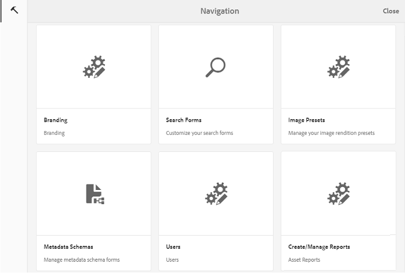
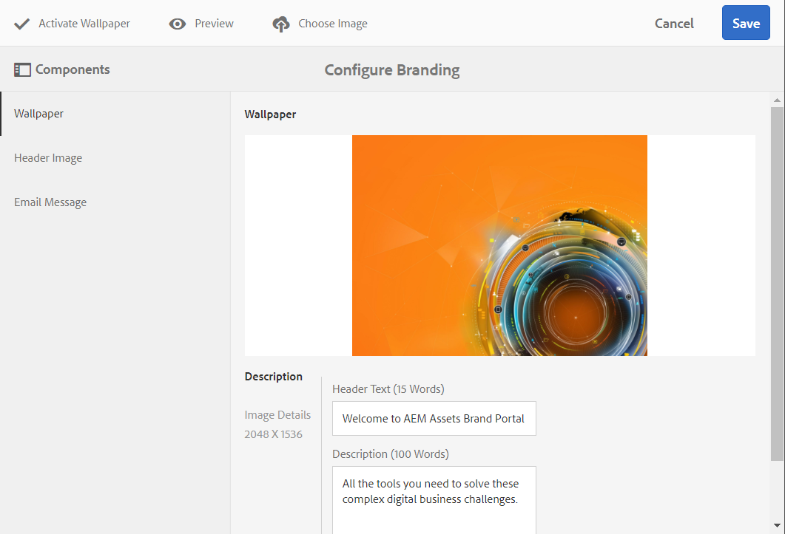
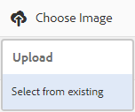
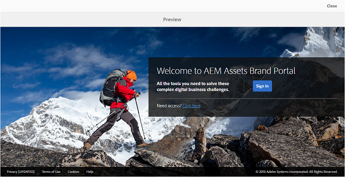
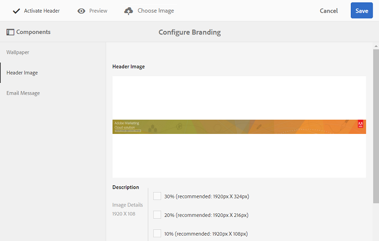
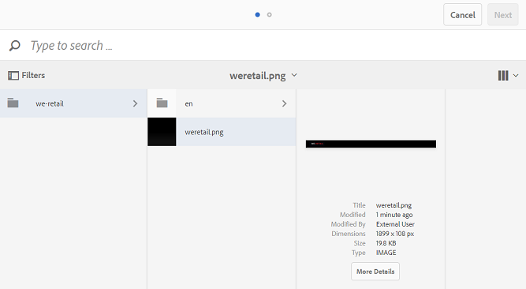
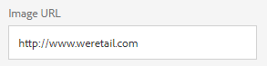
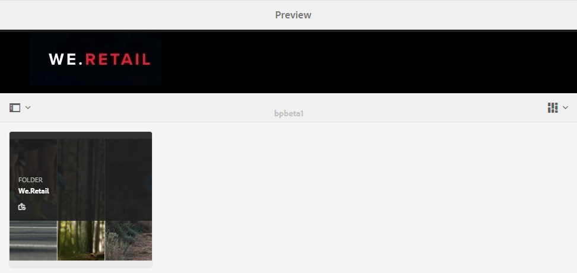
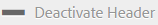
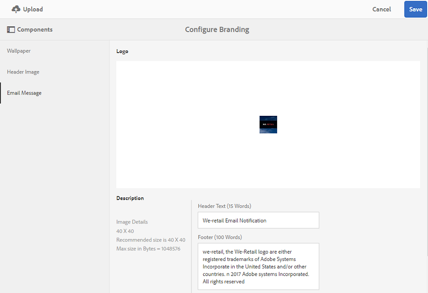

# Personalizzare sfondo, intestazione e messaggio e-mail {#customize-wallpaper-header-and-email-message}

Gli amministratori di Brand Portal possono personalizzare in modo limitato l’interfaccia visualizzata agli utenti. Potete scegliere un&#39;immagine di sfondo specifica (sfondo) per la pagina di accesso al Brand Portal. Potete inoltre aggiungere un’immagine di intestazione e personalizzare le e-mail di condivisione delle risorse in modo che corrispondano al marchio del cliente.

## Personalizzare lo sfondo della schermata di login {#customize-the-login-screen-wallpaper}

In assenza di un&#39;immagine dello sfondo personalizzata, nella pagina di login viene visualizzato uno sfondo predefinito.

1. Dalla barra degli strumenti di AEM nella parte superiore, fate clic sul logo Adobe per accedere agli strumenti amministrativi.

   

1. Dal pannello degli strumenti di amministrazione, fate clic su **[!UICONTROL Branding]**.

   

1. Per impostazione predefinita, nella barra a sinistra della pagina **[!UICONTROL Configura marchio]**,**[!UICONTROL &#x200B;è selezionata l’opzione Carta da parati]** . Viene visualizzata l’immagine di sfondo predefinita visualizzata nella pagina di login.

   

1. Per aggiungere una nuova immagine di sfondo, fate clic sull’icona **[!UICONTROL Scegli immagine]**nella barra degli strumenti nella parte superiore.

   

   Effettua una delle operazioni seguenti:

   * Per caricare un’immagine dal computer, fate clic su **[!UICONTROL Carica]**. Passate all’immagine desiderata e caricatela.
   * Per utilizzare un&#39;immagine esistente del Portale marchio, fate clic su **[!UICONTROL Seleziona da esistente]**. Scegliete un’immagine mediante il selettore delle risorse.
   

1. Specificate un testo di intestazione e una descrizione per l’immagine di sfondo. Per salvare le modifiche, fate clic su **[!UICONTROL Salva]**nella barra degli strumenti nella parte superiore.

1. Dalla barra degli strumenti nella parte superiore, fate clic sull’icona **[!UICONTROL Anteprima]**per generare un’anteprima dell’interfaccia Portale marchio con l’immagine.

   

   

1. Per attivare o disattivare lo sfondo predefinito, effettuate le seguenti operazioni nella pagina **[!UICONTROL Configura marchio > Sfondo]**:

   * Per visualizzare l&#39;immagine dello sfondo predefinito nella pagina di login del Portale marchio, fate clic su **[!UICONTROL Disattiva sfondo]**nella barra degli strumenti nella parte superiore. Un messaggio conferma che l&#39;immagine personalizzata è disattivata.
   

   * Per ripristinare l’immagine personalizzata nella pagina di accesso del Portale marchio, fate clic su **[!UICONTROL Attiva sfondo]**nella barra degli strumenti. Viene visualizzato un messaggio di conferma del ripristino dell’immagine.
   

   * Click **[!UICONTROL Save]**to save the changes.

## Personalizzare l’intestazione {#customize-the-header}

L’intestazione viene visualizzata su diverse pagine del Portale marchio dopo l’accesso al Portale marchio.

1. Dalla barra degli strumenti di AEM nella parte superiore, fate clic sul logo Adobe per accedere agli strumenti amministrativi.

   

1. Dal pannello degli strumenti di amministrazione, fate clic su **[!UICONTROL Branding]**.

   

1. Per personalizzare l’intestazione della pagina per l’interfaccia Portale marchio, nella pagina **[!UICONTROL Configura marchio]**selezionate Immagine**** intestazione dalla barra a sinistra. Viene visualizzata l’immagine di intestazione predefinita.

   

1. Per caricare un’immagine di intestazione, fate clic sull’icona **[!UICONTROL Scegli immagine]**e scegliete**[!UICONTROL  Carica]**.

   Per usare un’immagine esistente del Portale marchio, scegliete **[!UICONTROL Seleziona da esistente]**.

   

   Scegliete un’immagine mediante il selettore delle risorse.

   

1. Per includere un URL nell’immagine di intestazione, specificatelo nella casella URL ****immagine. Potete specificare URL esterni o interni. I collegamenti interni possono anche essere collegamenti relativi, ad esempio   [!UICONTROL `/mediaportal.html/content/dam/mac/tenant_id/tags`].
Questo collegamento indirizza gli utenti alla cartella dei tag.
Per salvare le modifiche, fate clic su **[!UICONTROL Salva]**nella barra degli strumenti nella parte superiore.

   

1. Dalla barra degli strumenti nella parte superiore, fate clic sull’icona **[!UICONTROL Anteprima]**per generare un’anteprima dell’interfaccia Portale marchio con l’immagine dell’intestazione.

   
   

1. Per attivare o disattivare l’immagine dell’intestazione, effettuate le seguenti operazioni nella pagina **[!UICONTROL Configura marchio > Immagine]**intestazione:

   * Per evitare che un’immagine di intestazione venga visualizzata sulle pagine del Portale marchio, fate clic su **[!UICONTROL Disattiva intestazione]**nella barra degli strumenti nella parte superiore. Viene visualizzato un messaggio di conferma della disattivazione dell’immagine.
   

   * Per visualizzare nuovamente l’immagine dell’intestazione sulle pagine del Portale marchio, fate clic su **[!UICONTROL Attiva intestazione]**nella barra degli strumenti nella parte superiore. Viene visualizzato un messaggio di conferma dell’attivazione dell’immagine.
   

   * Click **[!UICONTROL Save]**to save the changes.

## Personalizzare i messaggi e-mail {#customize-the-email-messaging}

Quando le risorse vengono condivise come collegamento, gli utenti ricevono un messaggio e-mail contenente il collegamento. Gli amministratori possono personalizzare i messaggi, vale a dire logo, descrizione e piè di pagina, di queste e-mail.

1. Dalla barra degli strumenti di AEM nella parte superiore, fate clic sul logo Adobe per accedere agli strumenti amministrativi.

   

1. Dal pannello degli strumenti di amministrazione, fate clic su **[!UICONTROL Branding]**.

   

1. Quando le risorse vengono condivise come collegamenti o scaricate tramite e-mail e quando **[!UICONTROL le raccolte]**vengono condivise, agli utenti vengono inviate delle notifiche e-mail. Per personalizzare il messaggio e-mail, nella pagina**[!UICONTROL  Configura marchio]** selezionate Messaggio **[!UICONTROL e-]**mail dalla barra a sinistra.

   

1. Per aggiungere un logo alle e-mail in uscita, fate clic su **[!UICONTROL Carica]**nella barra degli strumenti nella parte superiore.

1. Nella sezione **[!UICONTROL Descrizione]**, specificate il testo dell’intestazione e del piè di pagina del messaggio e-mail. Per salvare le modifiche, fate clic su**[!UICONTROL  Salva]** nella barra degli strumenti nella parte superiore.

   >[!NOTE]
   >
   >Se non utilizzate la dimensione consigliata per il logo, o se il testo dell’intestazione e del piè di pagina supera il numero di parole consigliato, il contenuto del messaggio e-mail potrebbe apparire illeggibile.
