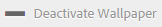

# Personalizzare lo sfondo, l'intestazione e il messaggio e-mail {#customize-wallpaper-header-and-email-message}

[!DNL Brand Portal] gli amministratori possono effettuare personalizzazioni limitate all'interfaccia visualizzata agli utenti. Potete scegliere un'immagine di sfondo specifica per la pagina [!DNL Brand Portal] di accesso. Puoi anche aggiungere un'immagine intestazione e personalizzare le e-mail di condivisione delle risorse in modo che corrispondano al marchio del cliente.

## Personalizzare lo sfondo dello schermo di accesso {#customize-the-login-screen-wallpaper}

In assenza di un'immagine con wallpaper personalizzata, nella pagina di accesso viene visualizzato uno sfondo predefinito.

1. Nella [!DNL AEM] barra degli strumenti in alto, fate clic sul logo Adobe per accedere agli strumenti di amministrazione.

   

2. Dal pannello Strumenti di amministrazione, fate clic **su Branding**.

   

3. Nella parte sinistra della pagina **Configura Branding** , **lo sfondo** è selezionato per impostazione predefinita. Viene visualizzata l'immagine di sfondo predefinita visualizzata nella pagina di accesso.

   

4. Per aggiungere una nuova immagine di sfondo, fate clic sull'icona **Scegli immagine** nella barra degli strumenti in alto.

   

   Effettua una delle operazioni seguenti:

   * Per caricare un'immagine dal computer, fate clic **su Carica**. Individuate l'immagine desiderata e caricatela.
   * Per utilizzare un'immagine Brand Portal esistente, fate clic **su Seleziona da esistente**. Scegliete un'immagine utilizzando il selettore risorse.
   

5. Specificate un testo e una descrizione dell'intestazione per l'immagine di sfondo. Per salvare le modifiche, fate clic **su Salva** nella barra degli strumenti in alto.

6. Dalla barra degli strumenti in alto, fate clic sull'icona **Anteprima** per generare un'anteprima dell'interfaccia Brand Portal con l'immagine.

   

   

7. Per attivare o disattivare lo sfondo predefinito, effettuate le seguenti operazioni nella pagina **Configura Branding** &gt; **Wallpaper** :

   * Per visualizzare l'immagine wallpaper predefinita nella pagina di login di Brand Portal, fate clic su **Disattiva Wallpaper** dalla barra degli strumenti nella parte superiore. Un messaggio conferma che l'immagine personalizzata è disattivata.
   

   * Per ripristinare l'immagine personalizzata nella pagina di login di Brand Portal, fate clic su **Attiva wallpaper** dalla barra degli strumenti. Un messaggio conferma che l'immagine è stata ripristinata.
   

   * Click **Save** to save the changes.

## Personalizzare l'intestazione {#customize-the-header}

L'intestazione viene visualizzata su diverse pagine Brand Portal dopo l'accesso al portale marchio.

1. Dalla barra degli strumenti AEM nella parte superiore, fate clic sul logo Adobe per accedere agli strumenti di amministrazione.

   

2. Dal pannello Strumenti di amministrazione, fate clic **su Branding**.

   

3. Per personalizzare l'intestazione della pagina per l'interfaccia Brand Portal, nella pagina **Configura marchio** , selezionate **Immagine intestazione** dalla barra a sinistra. Viene visualizzata l'immagine di intestazione predefinita.

   

4. Per caricare un'immagine intestazione, fate clic sull'icona **Scegli immagine** e scegliete **Carica**.

   Per usare un'immagine esistente [!DNL Brand Portal] , scegliete **Seleziona dall'esistente**.

   

   Scegliete un'immagine utilizzando il selettore risorse.

   

5. Per includere un URL nell'immagine dell'intestazione, specificatelo nella **casella URL** immagine. Potete specificare URL esterni o interni. I collegamenti interni possono anche essere collegamenti relativi, ad esempio
   `/mediaportal.html/content/dam/mac/tenant_id/tags`.
Questo collegamento indirizza gli utenti alla cartella dei tag.
Per salvare le modifiche, fate clic **su Salva** nella barra degli strumenti in alto.

   

6. Nella barra degli strumenti in alto, fate clic sull'icona **Anteprima** per generare un'anteprima [!DNL Brand Portal] dell'interfaccia con l'immagine intestazione.

   
   

7. Per attivare o disattivare l'immagine dell'intestazione, effettuate le seguenti operazioni nella pagina **Configura marchio** &gt; **Immagine** intestazione:

   * Per evitare che un'immagine intestazione venga visualizzata sulle [!DNL Brand Portal] pagine, fate clic su **Disattiva intestazione** dalla barra degli strumenti nella parte superiore. Un messaggio conferma che l'immagine è disattivata.
   

   * Per far apparire l'immagine dell'intestazione su [!DNL Brand Portal] pagine, fate clic **su Attiva intestazione** dalla barra degli strumenti nella parte superiore. Un messaggio conferma che l'immagine è stata attivata.
   

   * Click **Save** to save the changes.

## Personalizzazione dei messaggi e-mail {#customize-the-email-messaging}

Quando le risorse vengono condivise come collegamento, gli utenti ricevono un messaggio e-mail contenente il collegamento. Gli amministratori possono personalizzare i messaggi, ossia logo, descrizione e piè di pagina, di tali e-mail.

1. Nella [!DNL AEM] barra degli strumenti in alto, fate clic sul logo Adobe per accedere agli strumenti di amministrazione.

   

2. Dal pannello Strumenti di amministrazione, fate clic **su Branding**.

   

3. Quando le risorse vengono condivise come collegamenti o scaricate attraverso e-mail e quando [!UICONTROL vengono] condivise, le notifiche e-mail vengono inviate agli utenti. Per personalizzare il messaggio e-mail, nella pagina **Configura Branding** , selezionate **Messaggio e-mail** dalla barra a sinistra.

   

4. Per aggiungere un logo alle e-mail in uscita, fate clic **su Carica** nella barra degli strumenti in alto.

5. Nella sezione **Descrizione** , specificare il testo dell'intestazione e del piè di pagina. Per salvare le modifiche, fate clic **su Salva** nella barra degli strumenti in alto.

   >[!NOTE]
   >
   >Se non si utilizzano le dimensioni consigliate per il logo o se il testo di intestazione e piè di pagina supera il numero di parole consigliato, il contenuto del messaggio e-mail potrebbe apparire illeggibile.
