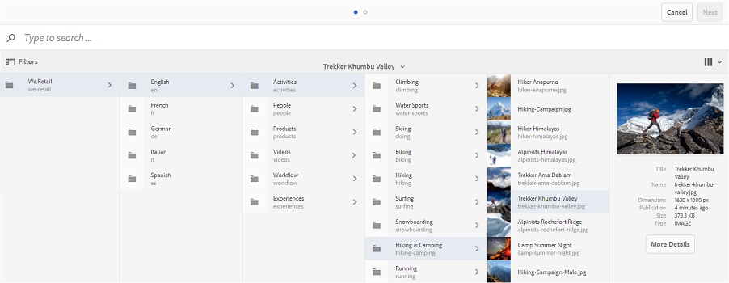

# Personalizzare sfondo, intestazione e messaggio e-mail {#customize-wallpaper-header-and-email-message}

Gli amministratori di Brand Portal possono apportare personalizzazioni limitate all’interfaccia visualizzata agli utenti. È possibile scegliere un&#39;immagine di sfondo specifica (sfondo) per la pagina di accesso di Brand Portal. Puoi anche aggiungere un’immagine di intestazione e personalizzare le e-mail di condivisione delle risorse in base al marchio del cliente.

## Personalizzare lo sfondo della schermata di accesso {#customize-the-login-screen-wallpaper}

In assenza di un&#39;immagine dello sfondo con marchio personalizzato, nella pagina di accesso viene visualizzato uno sfondo predefinito.

1. Dalla barra degli strumenti nella parte superiore, fai clic sul logo Experience Manager per accedere agli strumenti amministrativi.

   

1. Dal pannello strumenti amministrativi, fai clic su **[!UICONTROL Branding]**.

   

1. Per impostazione predefinita, nella barra a sinistra della pagina **[!UICONTROL Configura branding]** viene selezionato **[!UICONTROL Carta da parati]**. Viene visualizzata l’immagine di sfondo predefinita visualizzata nella pagina di accesso.

   

1. Per aggiungere una nuova immagine di sfondo, fai clic sull&#39;icona **[!UICONTROL Scegli immagine]** nella barra degli strumenti nella parte superiore.

   

   Effettua una delle operazioni seguenti:

   * Per caricare un&#39;immagine dal computer, fai clic su **[!UICONTROL Carica]**. Passa all’immagine desiderata e caricala.
   * Per utilizzare un&#39;immagine Brand Portal esistente, fai clic su **[!UICONTROL Seleziona da esistente]**. Scegli un’immagine utilizzando il selettore delle risorse.

   

1. Specifica un testo di intestazione e una descrizione per l’immagine di sfondo. Per salvare le modifiche, fai clic su **[!UICONTROL Salva]** nella barra degli strumenti nella parte superiore.

1. Dalla barra degli strumenti nella parte superiore, fai clic sull&#39;icona **[!UICONTROL Anteprima]** per generare un&#39;anteprima dell&#39;interfaccia Brand Portal con l&#39;immagine.

   

   

1. Per attivare o disattivare lo sfondo predefinito, procedi come segue nella pagina **[!UICONTROL Configura branding > Sfondo]** :

   * Per visualizzare l&#39;immagine dello sfondo predefinito nella pagina di accesso di Brand Portal, fare clic su **[!UICONTROL Disattiva sfondo]** nella barra degli strumenti nella parte superiore. Un messaggio conferma che l’immagine personalizzata è disattivata.

   

   * Per ripristinare l&#39;immagine personalizzata nella pagina di accesso di Brand Portal, fai clic su **[!UICONTROL Attiva sfondo]** nella barra degli strumenti. Un messaggio conferma il ripristino dell’immagine.

   

   * Fai clic su **[!UICONTROL Salva]** per salvare le modifiche.

## Personalizzare l’intestazione {#customize-the-header}

L’intestazione viene visualizzata su varie pagine Brand Portal dopo l’accesso a Brand Portal.

1. Dalla barra degli strumenti nella parte superiore, fai clic sul logo Experience Manager per accedere agli strumenti amministrativi.

   

1. Dal pannello strumenti amministrativi, fai clic su **[!UICONTROL Branding]**.

   

1. Per personalizzare l’intestazione della pagina per l’interfaccia Brand Portal, nella pagina **[!UICONTROL Configura branding]** , seleziona **[!UICONTROL Immagine intestazione]** dalla barra a sinistra. Viene visualizzata l’immagine di intestazione predefinita.

   

1. Per caricare un&#39;immagine di intestazione, fai clic sull&#39;icona **[!UICONTROL Scegli immagine]** e scegli **[!UICONTROL Carica]**.

   Per utilizzare un&#39;immagine Brand Portal esistente, scegli **[!UICONTROL Seleziona da esistente]**.

   

   Scegli un’immagine utilizzando il selettore delle risorse.

   

1. Per includere un URL nell&#39;immagine di intestazione, specificalo nella casella **[!UICONTROL URL immagine]**. Puoi specificare URL esterni o interni. I collegamenti interni possono anche essere collegamenti relativi, ad esempio
   [!UICONTROL `/mediaportal.html/content/dam/mac/tenant_id/tags`].
Questo collegamento indirizza gli utenti alla cartella dei tag.
Per salvare le modifiche, fai clic su **[!UICONTROL Salva]** nella barra degli strumenti nella parte superiore.

   

1. Dalla barra degli strumenti nella parte superiore, fai clic sull&#39;icona **[!UICONTROL Anteprima]** per generare un&#39;anteprima dell&#39;interfaccia Brand Portal con l&#39;immagine di intestazione.

   
   

1. Per attivare o disattivare l&#39;immagine di intestazione, procedi come segue nella pagina **[!UICONTROL Configura branding > Immagine intestazione]** :

   * Per evitare che un&#39;immagine di intestazione appaia sulle pagine Brand Portal, fai clic su **[!UICONTROL Disattiva intestazione]** nella barra degli strumenti nella parte superiore. Un messaggio conferma che l’immagine è disattivata.

   

   * Per far riapparire l&#39;immagine di intestazione sulle pagine Brand Portal, fai clic su **[!UICONTROL Attiva intestazione]** nella barra degli strumenti nella parte superiore. Un messaggio conferma che l’immagine è attivata.

   

   * Fai clic su **[!UICONTROL Salva]** per salvare le modifiche.

## Personalizzare i messaggi e-mail {#customize-the-email-messaging}

Quando le risorse vengono condivise come collegamento, gli utenti ricevono un’e-mail contenente il collegamento. Gli amministratori possono personalizzare la messaggistica, ovvero il logo, la descrizione e il piè di pagina, di queste e-mail.

1. Dalla barra degli strumenti nella parte superiore, fai clic sul logo Experience Manager per accedere agli strumenti amministrativi.

   

1. Dal pannello strumenti amministrativi, fai clic su **[!UICONTROL Branding]**.

   

1. Quando le risorse vengono condivise come collegamenti o scaricate tramite e-mail e quando **[!UICONTROL le raccolte]** sono condivise, gli utenti ricevono notifiche e-mail. Per personalizzare il messaggio e-mail, nella pagina **[!UICONTROL Configura branding]** , seleziona **[!UICONTROL Messaggio e-mail]** dalla barra a sinistra.

   

1. Per aggiungere un logo alle e-mail in uscita, fai clic su **[!UICONTROL Carica]** nella barra degli strumenti nella parte superiore.

1. Nella sezione **[!UICONTROL Descrizione]** , specifica il testo dell&#39;intestazione e del piè di pagina dell&#39;e-mail. Per salvare le modifiche, fai clic su **[!UICONTROL Salva]** nella barra degli strumenti nella parte superiore.

   >[!NOTE]
   >
   >Se non si utilizzano le dimensioni consigliate per il logo o se il testo dell’intestazione e del piè di pagina supera il numero di parole consigliato, il contenuto del messaggio e-mail potrebbe risultare illeggibile.
