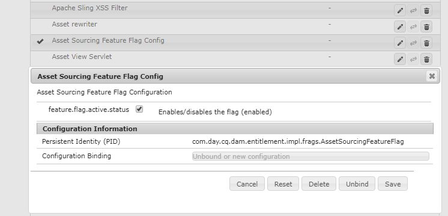

# Configurare l&#39;origine delle risorse {#configure-asset-sourcing}

AEM amministratori possono configurare l’origine delle **risorse** dall’istanza di creazione AEM. L’amministratore abilita la configurazione del flag della funzione Origine risorsa da **AEM Configurazione** console Web e carica l’elenco degli utenti attivi di Brand Portal in **AEM Assets**.

>[!NOTE]
>
>Prima di iniziare con la configurazione, accertatevi che l’istanza di AEM Assets  sia configurata con Brand Portal. See, [Configure AEM Assets with Brand Portal](../using/configure-aem-assets-with-brand-portal.md).

Il video seguente illustra come configurare l’origine delle risorse nell’istanza di creazione AEM:

>[!VIDEO](https://video.tv.adobe.com/v/29771)

## Abilita origine risorse {#enable-asset-sourcing}

AEM gli amministratori possono abilitare la gestione dell’origine delle risorse dalla configurazione della console AEM Web (ad esempio, una gestione della configurazione).

**Per abilitare l&#39;origine delle risorse:**
1. Accedete all’istanza di creazione AEM e aprite Configuration ManagerURL predefinito: http:// localhost:4502/system/console/configMgr
1. Effettuate una ricerca utilizzando la parola chiave **Origine** risorsa per individuare il file di configurazione del flag della funzione di origine delle **[!UICONTROL risorse]**
1. Fate clic su **[!UICONTROL Asset Sourcing Feature Flag Config]** per aprire la finestra di configurazione
1. Selezionate la casella di controllo **[!UICONTROL feature.flag.active.status]** .
1. Fai clic su **[!UICONTROL Salva]**.

## Carica elenco utenti Brand Portal {#upload-bp-user-list}

AEM amministratori possono caricare il file di configurazione utente (.csv) del Brand Portal contenente l’elenco di utenti attivo  Portale marchio in AEM Assets. Una cartella di contributi può essere condivisa solo con gli utenti attivi del Brand Portal definiti nell’elenco di utenti. L’amministratore può anche aggiungere nuovi utenti nel file di configurazione e caricare l’elenco di utenti modificato.

>[!NOTE]
>
>Il formato del file CSV è uguale a quello supportato dal Admin Console  per l’importazione in massa di utenti. E-mail, nome e cognome sono obbligatori.

L&#39;amministratore può aggiungere nuovi utenti AEM Admin Console . Per informazioni dettagliate, consultate [Gestione utenti](brand-portal-adding-users.md) . Dopo aver aggiunto gli utenti in  Admin Console, questi possono essere aggiunti al file di configurazione utente del Brand Portal e quindi ottenere l’autorizzazione per accedere alla cartella dei contributi.

**Per caricare l’elenco degli utenti di Brand Portal:**
1. Accedete all’istanza di AEM creazioneURL predefinito: http:// localhost:4502/aem/start.html
1. Dal pannello **Strumenti**  , passa a **[!UICONTROL Risorse > Utenti del Brand Portal]**
   
1. Si apre la finestra Collaboratori di caricamento del portale del marchio.
Sfogliate il computer locale e caricate il file **di** configurazione (.csv) contenente l’elenco degli utenti attivi di Brand Portal.
1. Fai clic su **[!UICONTROL Salva]**.
   

Gli amministratori possono fornire l’accesso a utenti/gruppi specifici da questo elenco di utenti durante la configurazione della cartella dei contributi.

Per ulteriori informazioni, consultate [Configurare la cartella](brand-portal-contribution-folder.md)dei contributi.
