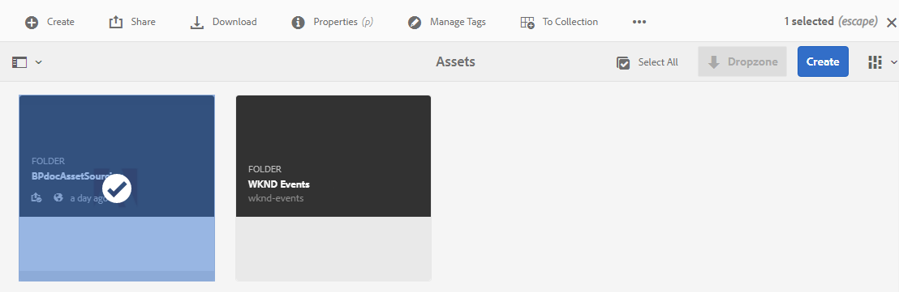
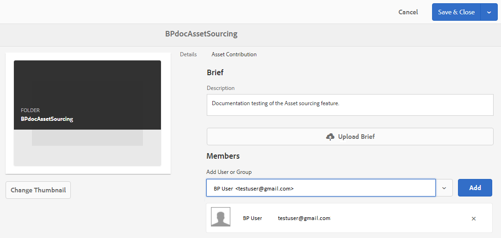

# Configurare le proprietà della cartella dei contributi {#configure-contribution-folder-properties}

AEM amministratore esegue le seguenti attività durante la configurazione delle proprietà di una cartella di contributi.

* **Aggiungi descrizione**: Fornite una descrizione di alto livello della cartella dei contributi.
* **Breve** caricamento:  Carica documento Requisito risorsa contenente informazioni relative alle risorse.
* **Aggiungi collaboratori**: Aggiungete utenti o gruppi del Brand Portal per consentire loro di accedere alla cartella dei contributi.

Il requisito risorsa si riferisce ai dettagli forniti dagli amministratori per aiutare i collaboratori (utenti del Brand Portal) a comprendere la necessità e i requisiti della cartella dei contributi. L’amministratore carica un documento sui requisiti delle risorse che contiene una breve descrizione del tipo di risorse da aggiungere alla cartella dei contributi e alle informazioni relative alle risorse, ad esempio lo scopo, il tipo di immagini, la dimensione massima, ecc.

L’amministratore può quindi concedere agli utenti/ai gruppi del Brand Portal l’accesso alla cartella Contribution prima di pubblicare la cartella Contribution appena creata nel Brand Portal.

**Per configurare le proprietà della cartella dei contributi:**

1. Accedete all’istanza di AEM creazioneURL predefinito: http:// localhost:4502/aem/start.html
1. Andate a **[!UICONTROL Risorse > File]** e individuate la cartella dei contributi.
1. Selezionate la cartella dei contributi e fate clic su **[!UICONTROL Proprietà]** . Si apre la finestra Proprietà cartella.
   
1. Passate alla scheda Contributo **** risorsa.
1. Immettete una **[!UICONTROL descrizione]** di alto livello della cartella dei contributi.
1. Fate clic su **[!UICONTROL Carica descrizione]**  per sfogliare il computer locale e caricare un documento **per il fabbisogno di** risorse.
1. Nel campo **[!UICONTROL Aggiungi utente o Gruppo]** , aggiungete utenti del Brand Portal con cui desiderate condividere la cartella dei contributi. Gli utenti aggiunti possono accedere e caricare il contenuto nella cartella dei contributi utilizzando l’interfaccia Brand Portal. Al momento non è possibile aggiungere gruppi a una cartella di contributi.
1. Fai clic su **[!UICONTROL Salva]**.

>[!NOTE]
>
>I risultati della ricerca si basano sull’elenco di utenti del Brand Portal configurato in  AEM Assets. Accertatevi di disporre dell’elenco di utenti aggiornato del Brand Portal. Consultate, [Carica elenco](brand-portal-configure-asset-sourcing.md)utenti Portale marchio.
