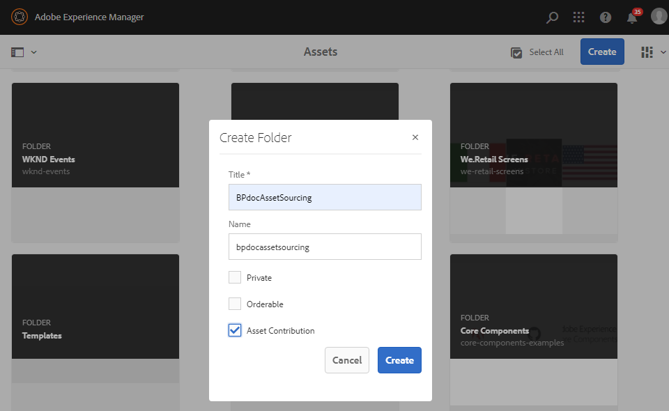
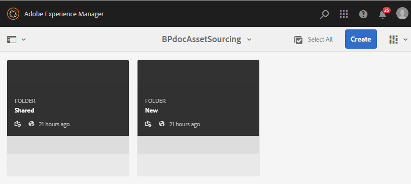

# Create contribution folder {#create-contribution-folder}

AEM amministratori e utenti non amministratori che dispongono dell’autorizzazione per creare una nuova cartella, possono creare una cartella di contributi in  AEM Assets.
Per creare una cartella di contributi, create una nuova cartella di tipo Contributo risorsa, in modo che la nuova cartella creata sia aperta all’invio delle risorse da parte degli utenti del Brand Portal.  Questo attiva automaticamente un flusso di lavoro che crea due sottocartelle aggiuntive, denominate SHARED e NEW, all’interno della cartella dei contributi.

>[!NOTE]
>
>Potete creare più cartelle di contributi all’interno di una cartella, ma non dovete creare una cartella di contributi all’interno di un’altra cartella di contributi.

Per creare una cartella di contributi:
1. Effettuate l’accesso all’istanza di creazione AEM.

   L’URL predefinito è http:// localhost:4502/aem/start.html.

1. Passa a **[!UICONTROL Risorse]** > **[!UICONTROL File]**. Elenca tutte le cartelle esistenti nell&#39;archivio di AEM Assets .

1. Click **[!UICONTROL Create]** to create a new folder. **[!UICONTROL Viene visualizzata la finestra di dialogo Crea cartella]** .

1. Immettete **[!UICONTROL Titolo]** e **[!UICONTROL Nome]** della cartella e abilitate la casella di controllo Contributo **** risorsa.
Si consiglia di utilizzare lettere minuscole senza spazio per denominare la cartella.

1. Fai clic su **[!UICONTROL Crea]**. Potete visualizzare la cartella dei contributi elencata nell’archivio di AEM Assets .

   >[!NOTE]
   >
   >Un utente non amministratore può creare e condividere una cartella di contributi di risorse ma non può modificarla o eliminarla.

   

1. Fate clic per aprire la cartella dei contributi. Potete vedere due sottocartelle:**[!UICONTROL SHARED]** e **[!UICONTROL NEW]** vengono create automaticamente nella cartella dei contributi.

   

Ora potete [configurare le proprietà](brand-portal-configure-contribution-folder-properties.md)della cartella dei contributi.

