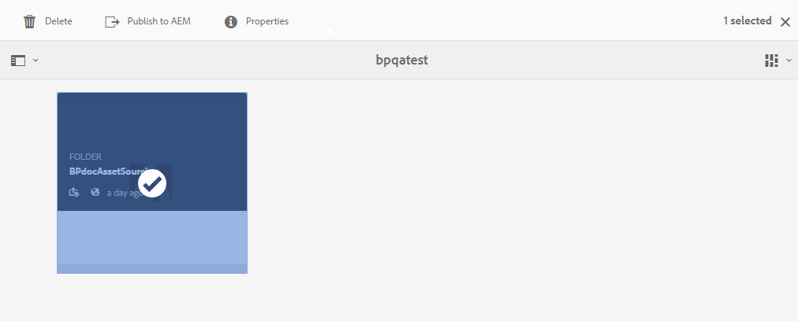
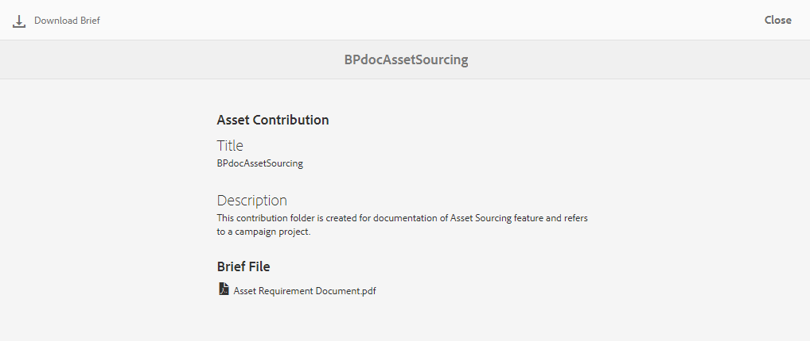
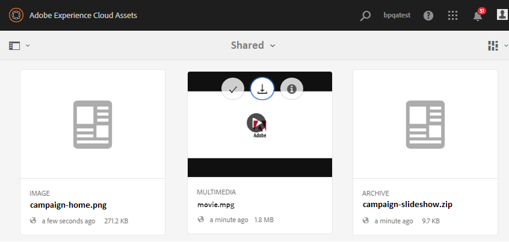

# Scaricare i requisiti delle risorse {#using-asset-souring-in-bp}

Gli utenti di Brand Portal ricevono automaticamente notifiche e-mail/impulsi ogni volta che una cartella di contributi viene condivisa dall’utente AEM, consentendo loro di scaricare il breve documento (requisito della risorsa), nonché di scaricare le risorse baseline (contenuto di riferimento), dalla cartella **SHARED** per verificare che siano in grado di soddisfare i requisiti delle risorse.

L’utente di Brand Portal esegue le seguenti attività per scaricare i requisiti delle risorse:

* **Scarica breve**: Scaricate il breve (documento sui requisiti delle risorse) allegato alla cartella dei contributi che contiene informazioni relative alle risorse come il tipo di risorse, lo scopo, i formati supportati, la dimensione massima delle risorse, ecc.
* **Scarica risorse** di base: Scaricate le risorse di base da usare per comprendere i tipi di risorse richiesti. Gli utenti di Brand Portal possono usare queste risorse come riferimento per creare nuove risorse da assegnare ai contributi.

La dashboard di Brand Portal riflette tutte le cartelle esistenti consentite all’utente di Brand Portal insieme alla nuova cartella di contributi condivisi. In questo esempio, l’utente di Brand Portal ha accesso solo alla cartella dei contributi appena creata, mentre nessun’altra cartella esistente viene condivisa con l’utente.

**Per scaricare i requisiti delle risorse:**

1. Effettuate l&#39;accesso all&#39;istanza Brand Portal.
1. Selezionate la cartella dei contributi dalla dashboard di Brand Portal.
1. Fate clic su **[!UICONTROL Proprietà]** . Viene visualizzata la finestra delle proprietà, con i dettagli della cartella Contributo risorsa.
   
1. Fate clic su **[!UICONTROL Scarica descrizione]**  per scaricare il documento dei requisiti delle risorse sul computer locale.
   
1. Tornate alla dashboard di Brand Portal.
1. Fate clic per aprire la cartella dei contributi. Nella cartella dei contributi sono visualizzate due sottocartelle **[!UICONTROL CONDIVISE]** e **[!UICONTROL NUOVO]** . La cartella SHARED contiene tutte le risorse di base (contenuto di riferimento) condivise dagli amministratori.
1. Potete scaricare la cartella **[!UICONTROL CONDIVISA]** contenente tutte le risorse della linea di base sul computer locale.
In alternativa, potete aprire la cartella **[!UICONTROL CONDIVISIONE]** e fare clic sull&#39;icona **Scarica**  per scaricare singoli file/cartelle.
   

Scorri il breve (documento sui requisiti delle risorse) e fai riferimento alle risorse di base per comprendere i requisiti delle risorse. Ora potete creare nuove risorse per il contributo e caricarle nella cartella dei contributi. Consultate [Caricare le risorse nella cartella](brand-portal-upload-assets-to-contribution-folder.md)Contributi.

