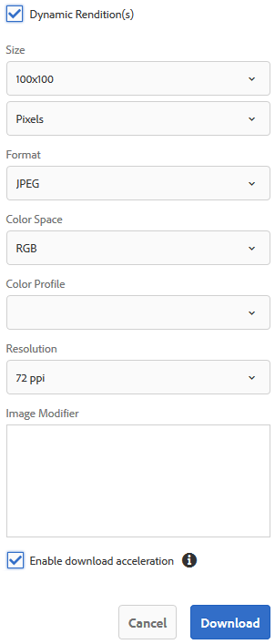

# Scaricare le risorse {#download-assets-from-bp}

Adobe Experience Manager Assets Brand Portal migliora l’esperienza di download consentendo agli utenti di scaricare simultaneamente da Brand Portal risorse e cartelle a loro accessibili. In questo modo, le risorse del brand approvate possono essere distribuite in modo sicuro per l’utilizzo offline. Continua a leggere per scoprire come scaricare le risorse (risorse approvate) da Brand Portal e cosa aspettarsi da [prestazioni di download](#expected-download-performance).

>[!NOTE]
>
>In Brand Portal 2020.10.0 (e versioni successive), la **[!UICONTROL Download rapido]** L’impostazione è abilitata per impostazione predefinita e utilizza IBM Aspera Connect per il download accelerato delle risorse. Installare IBM Aspera Connect 3.9.9 (`https://www.ibm.com/docs/en/aspera-connect/3.9.9`) nell’estensione del browser prima di scaricare le risorse da Brand Portal. Per ulteriori dettagli, consulta [guida per accelerare i download da Brand Portal](../using/accelerated-download.md).
>
>Se non desideri utilizzare IBM Aspera Connect e continuare con il normale processo di download, contatta l’amministratore Brand Portal per disattivare **[!UICONTROL Download rapido]** impostazione.

## Configurare il download delle risorse {#configure-download}

Gli amministratori di Brand Portal possono configurare le impostazioni per il download e il gruppo di utenti delle risorse per gli utenti di Brand Portal, consentendo loro di accedere e scaricare le rappresentazioni delle risorse dall’interfaccia di Brand Portal.

>[!NOTE]
>
>Le impostazioni di download applicate all’interfaccia utente facilitano agli utenti di Brand Portal un’esperienza autonoma di configurazione e download delle rappresentazioni delle risorse. Non limita il download delle risorse a livello di applicazione; ad esempio, gli utenti possono ancora accedere e scaricare le rappresentazioni delle risorse con il percorso URL completo.

L’accesso e il download delle rappresentazioni delle risorse dall’interfaccia di Brand Portal sono definiti dalle seguenti configurazioni:

* Abilita impostazioni di download
* Configurare le impostazioni del gruppo utenti

### Abilita impostazioni di download {#enable-download-settings}

Gli amministratori possono abilitare la risorsa **[!UICONTROL Impostazioni di download]** per definire il set di rappresentazioni accessibile agli utenti di Brand Portal per il download.

Le impostazioni disponibili sono:

* **[!UICONTROL Download veloce]**

   Consente di scaricare rapidamente le risorse tramite IBM Aspera Connect. Per impostazione predefinita, il **[!UICONTROL Download rapido]** è abilitato in **[!UICONTROL Impostazioni di download]**.

* **[!UICONTROL Rappresentazioni personalizzate]**

   Abilita il download di rappresentazioni personalizzate e/o dinamiche delle risorse.

   Tutte le rappresentazioni delle risorse diverse da quella originale e quelle generate dal sistema sono denominate rappresentazioni personalizzate. Include le rappresentazioni statiche e dinamiche disponibili per la risorsa. Qualsiasi utente può creare una rappresentazione statica personalizzata in Experience Manager Assets, mentre solo l’amministratore può creare una rappresentazione dinamica personalizzata. Per ulteriori informazioni, consulta [come applicare predefiniti immagine o rappresentazioni dinamiche](../using/brand-portal-image-presets.md).

* **[!UICONTROL Rappresentazioni di sistema]**

   Abilita il download delle rappresentazioni generate dal sistema delle risorse.

   Si tratta delle miniature generate automaticamente in Experience Manager Assets in base al flusso di lavoro &quot;Aggiorna risorsa DAM&quot;.

* **[!UICONTROL Download risorse]**

   Abilita il download delle rappresentazioni in una cartella separata per ciascuna risorsa. L’impostazione è applicabile a cartelle, raccolte e download in blocco di risorse (più di 20 risorse).

Accedi al tuo tenant Brand Portal come amministratore e passa a **[!UICONTROL Strumenti]** > **[!UICONTROL Scarica]**.

Gli amministratori possono abilitare qualsiasi combinazione di impostazioni per consentire agli utenti di Brand Portal di accedere e scaricare le rappresentazioni delle risorse.

>[!NOTE]
>
>Solo gli amministratori possono scaricare le risorse scadute. Per ulteriori informazioni sulle risorse scadute, consulta [gestire i diritti digitali delle risorse](../using/manage-digital-rights-of-assets.md).

### Configurare le impostazioni del gruppo utenti {#configure-user-group-settings}

Oltre al **[!UICONTROL Impostazioni di download]**, gli amministratori di Brand Portal possono configurare ulteriormente le impostazioni per diversi gruppi di utenti in modo da visualizzare e/o scaricare le risorse originali e le relative rappresentazioni.

Accedi al tuo tenant Brand Portal come amministratore e passa a **[!UICONTROL Strumenti]** > **[!UICONTROL Utenti]**. In **[!UICONTROL Ruoli utente]** , passare alla pagina **[!UICONTROL Gruppi]** per configurare le impostazioni di visualizzazione e/o download per i gruppi di utenti.

>[!NOTE]
>
>Se un utente viene aggiunto a più gruppi e uno di questi ha delle restrizioni, le restrizioni verranno applicate all’utente.

In base alla configurazione, il flusso di lavoro di download rimane costante per le risorse autonome, per più risorse, per le cartelle contenenti risorse, per le risorse concesse in licenza o non concesse in licenza e per il download delle risorse tramite il collegamento di condivisione.

La matrice seguente definisce se un utente può accedere alle rappresentazioni a seconda della [scarica configurazioni](#configure-download):

| **Impostazioni di download: rappresentazioni personalizzate** | **Impostazioni di download: rappresentazioni di sistema** | **Impostazioni gruppo utenti: Scarica originale** | **Impostazioni gruppo utenti: Scarica rappresentazioni** | **Risultato** |
|---|---|---|---|---|
| ATTIVATO | ATTIVATO | ATTIVATO | ATTIVATO | Visualizza e scarica tutte le rappresentazioni |
| ATTIVATO | ATTIVATO | DISATTIVATO | DISATTIVATO | Visualizza risorsa originale |
| DISATTIVATO | DISATTIVATO | ATTIVATO | ATTIVATO | Visualizzare e scaricare la risorsa originale |
| ATTIVATO | DISATTIVATO | ATTIVATO | ATTIVATO | Visualizzare e scaricare le rappresentazioni personalizzate e della risorsa originale |
| DISATTIVATO | ATTIVATO | ATTIVATO | ATTIVATO | Visualizzare e scaricare le rappresentazioni originali di risorse e sistemi |
| ATTIVATO | DISATTIVATO | DISATTIVATO | DISATTIVATO | Visualizza risorsa originale |
| DISATTIVATO | ATTIVATO | DISATTIVATO | DISATTIVATO | Visualizza risorsa originale |
| DISATTIVATO | DISATTIVATO | DISATTIVATO | ATTIVATO | Visualizza risorsa originale |
| DISATTIVATO | DISATTIVATO | ATTIVATO | DISATTIVATO | Visualizzare e scaricare la risorsa originale |
| DISATTIVATO | DISATTIVATO | DISATTIVATO | DISATTIVATO | Visualizza risorsa originale |

## Scaricare le risorse {#download-assets}

Gli utenti di Brand Portal possono scaricare più risorse, cartelle contenenti risorse e raccolte dall’interfaccia di Brand Portal.

>[!NOTE]
>
>Se non disponi delle autorizzazioni necessarie per accedere o scaricare le rappresentazioni delle risorse, contatta l’amministratore Brand Portal.

Se l’utente ha accesso alle rappresentazioni, gli verrà fornito il **[!UICONTROL Scarica]** finestra di dialogo con le seguenti funzionalità:

* Visualizza tutte le rappresentazioni disponibili di qualsiasi risorsa nell’elenco di download.
* Escludi le rappresentazioni delle risorse che non sono necessarie per il download.
* Applica lo stesso set di rappresentazioni a tutti i tipi di risorse simili con un solo clic.
* Applica un diverso set di rappresentazioni per diversi tipi di risorse.
* Crea una cartella separata per ogni risorsa.
* Scarica le risorse selezionate e le relative rappresentazioni.

>[!NOTE]
>
>Il **[!UICONTROL Scarica]** viene visualizzata solo se **[!UICONTROL Rappresentazioni personalizzate]** e (o) **[!UICONTROL Rappresentazioni di sistema]** è abilitato in **[!UICONTROL Impostazioni di download]**.

### Passaggi per scaricare le risorse {#bulk-download}

Di seguito è descritta la procedura per scaricare risorse o cartelle contenenti risorse dall’interfaccia di Brand Portal:

1. Accedi al tuo tenant Brand Portal. Per impostazione predefinita, il **[!UICONTROL File]** viene visualizzata una vista che contiene tutte le risorse e le cartelle pubblicate.

   Effettua una delle operazioni seguenti:

   * Seleziona le risorse o le cartelle da scaricare. Dalla barra degli strumenti nella parte superiore, fai clic su **[!UICONTROL Scarica]** icona.

      

   * Per scaricare rappresentazioni specifiche di una risorsa, passa il puntatore del mouse sulla risorsa e fai clic su **[!UICONTROL Scarica]** disponibile nelle miniature di azione rapida.

      

      >[!NOTE]
      >
      >Se scarichi le risorse per la prima volta e nel browser non è installato IBM Aspera Connect, ti verrà richiesto di installare l’acceleratore di download di Aspera (`https://www.ibm.com/docs/en/aspera-connect/3.9.9`).

      >[!NOTE]
      >
      >Se le risorse che stai scaricando includono anche risorse con licenza, vieni reindirizzato al **[!UICONTROL Gestione copyright]** pagina. In questa pagina, seleziona le risorse e fai clic su **[!UICONTROL Accetto]** e quindi fare clic su **[!UICONTROL Scarica]**. Se scegli di non essere d’accordo, le risorse concesse in licenza non vengono scaricate.
      > 
      >Le risorse protette da licenza hanno [contratto di licenza allegato](https://experienceleague.adobe.com/docs/experience-manager-65/assets/administer/drm.html) ad essi, impostando i [proprietà metadati](https://experienceleague.adobe.com/docs/experience-manager-65/assets/administer/drm.html) in Experience Manager Assets.

      

1. Il **[!UICONTROL Scarica]** viene visualizzata una finestra di dialogo in cui sono elencate tutte le risorse selezionate.

   Fai clic su una risorsa per visualizzare le rappresentazioni disponibili e seleziona le caselle di controllo corrispondenti alle rappresentazioni che desideri scaricare.

   Puoi selezionare o escludere manualmente le rappresentazioni di singole risorse, oppure fare clic sul pulsante **Applica** per selezionare lo stesso set di rappresentazioni da scaricare per tipi di risorse simili (tutti i file di immagine in questo esempio). In **[!UICONTROL Applica tutto]** , fai clic su **[!UICONTROL Fine]** per applicare la regola a tutte le risorse simili.

   

   Puoi anche rimuovere una risorsa dall’elenco di download (se necessario) facendo clic sul pulsante **Rimuovi** icona.

   

   Per mantenere la gerarchia delle cartelle di Brand Portal durante il download delle risorse, seleziona la **[!UICONTROL Crea una cartella separata per ogni risorsa]** casella di controllo.

   Il pulsante di download riflette il conteggio degli elementi selezionati. Dopo aver applicato le regole, fai clic su **[!UICONTROL Scarica elementi]**.

   

1. Per impostazione predefinita, il **[!UICONTROL Download rapido]** è abilitato in **[!UICONTROL Impostazioni di download]**. Pertanto, viene visualizzata una casella di conferma per consentire il download accelerato tramite IBM Aspera Connect.

   Per continuare a utilizzare **[!UICONTROL Download rapido]**, fai clic su **[!UICONTROL Consenti]**. Tutte le rappresentazioni selezionate vengono scaricate in una cartella zip utilizzando IBM Aspera Connect.

   Se non desideri utilizzare IBM Aspera Connect, fai clic su **[!UICONTROL Rifiuta]**. Se **[!UICONTROL Download rapido]** è negato o non riesce, il sistema compila un messaggio di errore. Fai clic su **[!UICONTROL Download normale]** per continuare a scaricare le risorse.

<!-- removed the known issue from step 2 as it is fixed in 2022.02.0 release.
   >[!CAUTION]
   >
   >(**Experience Manager Assets as a Cloud Service** only) The following known issue will be fixed in the upcoming release:
   >
   >The download dialog lists the smart crop renditions of the selected asset, however, the user cannot download the smart crop renditions.
-->

>[!NOTE]
>
>Se il **[!UICONTROL Download rapido]** l’impostazione viene disattivata dall’amministratore, le rappresentazioni selezionate vengono scaricate direttamente in una cartella zip senza utilizzare IBM Aspera Connect.

>[!NOTE]
>
>Se il **[!UICONTROL Download risorse]** è abilitato in **[!UICONTROL Impostazioni di download]**, i rendering delle risorse vengono scaricati in una cartella separata per ogni risorsa all’interno della cartella zip.
>  
>Se le risorse vengono scaricate da un collegamento condiviso, le rappresentazioni delle risorse vengono scaricate in una cartella separata per ogni risorsa all’interno della cartella zip.
>
>Se sono selezionate per il download una cartella, una raccolta o più di 20 risorse, il **[!UICONTROL Scarica]** La finestra di dialogo viene saltata e tutte le rappresentazioni delle risorse accessibili all’utente, escluse quelle dinamiche, vengono scaricate in una cartella zip.

>[!NOTE]
>
>Brand Portal supporta la configurazione di Dynamic Media in modalità ibrida e Scene7.
>
>(*Se l’istanza di authoring di Experience Manager Assets è in esecuzione su **Modalità Dynamic Media Hybrid***)
>
>Per visualizzare in anteprima o scaricare le rappresentazioni dinamiche di una risorsa, accertati che l’elemento multimediale dinamico sia attivato e che la rappresentazione TIFF piramidale della risorsa sia presente nell’istanza di authoring di Experience Manager Assets da cui sono state pubblicate le risorse. Quando una risorsa viene pubblicata da Experience Manager Assets a Brand Portal, viene pubblicata anche la relativa rappresentazione piramidale tiff.

Se non lo sei [autorizzato dall’amministratore ad accedere alle rappresentazioni originali](../using/brand-portal-adding-users.md#main-pars-procedure-202029708), le rappresentazioni originali delle risorse selezionate non vengono scaricate.

<!-- This issue has been resolved, check with engineering.
>[!NOTE]
>
>Once you have downloaded the asset renditions, the **[!UICONTROL Download]** button is disabled to avoid creating duplicate copies of the renditions. To download more (missing or another copy of renditions), refresh the browser to re-enable the download button.
-->

### Scaricare risorse dalla pagina dei dettagli delle risorse {#download-assets-from-asset-details-page}

Oltre al flusso di lavoro di download, esiste un altro metodo per scaricare le rappresentazioni di singole risorse direttamente dalla pagina dei dettagli delle risorse.

Gli utenti possono visualizzare in anteprima diverse rappresentazioni delle risorse, selezionare rappresentazioni specifiche e scaricare direttamente le rappresentazioni delle risorse da **[!UICONTROL Rappresentazioni]** nella pagina dei dettagli della risorsa senza dover aprire **[!UICONTROL Scarica]** .

Di seguito è descritta la procedura per scaricare le rappresentazioni delle risorse dalla pagina dei dettagli delle risorse:

1. Accedi al tuo tenant Brand Portal e fai clic sulla risorsa per aprire la pagina dei dettagli della risorsa.
1. Fai clic sull’icona della sovrapposizione a sinistra, quindi fai clic su **[!UICONTROL Rappresentazioni]**.

   

1. Il **[!UICONTROL Rappresentazioni]** nel pannello sono elencate tutte le rappresentazioni accessibili delle risorse in base alla risorsa [scarica configurazioni](#configure-download).

   Seleziona le rappresentazioni specifiche da scaricare e fai clic su **[!UICONTROL Scarica elementi]**.

   

1. Per impostazione predefinita, il **[!UICONTROL Download rapido]** è abilitato in **[!UICONTROL Impostazioni di download]**. Pertanto, viene visualizzata una casella di conferma per consentire il download accelerato tramite IBM Aspera Connect.

   Per continuare a utilizzare **[!UICONTROL Download rapido]**, fai clic su **[!UICONTROL Consenti]**. Tutte le rappresentazioni selezionate vengono scaricate in una cartella zip utilizzando IBM Aspera Connect.

   Se nega l’utilizzo di **[!UICONTROL Download rapido]**, il sistema compila un messaggio di errore. Fai clic su **[!UICONTROL Download normale]** per continuare a scaricare le risorse.

<!-- removed the known issue from step 3 as it is fixed in 2022.02.0 release.
   >[!CAUTION]
   >
   >(**Experience Manager Assets as a Cloud Service** only) The following known issues will be fixed in the upcoming release:
   >
   >The **[!UICONTROL Renditions]** panel does not list all the static renditions of the assets that are published to Brand Portal after December 16, 2021.
   >
   >The **[!UICONTROL Renditions]** panel lists the smart crop renditions of the asset, however, the user cannot preview or download the smart crop renditions.
-->

>[!NOTE]
>
>Se il **[!UICONTROL Download rapido]** l’impostazione viene disattivata dall’amministratore, le rappresentazioni selezionate vengono scaricate direttamente in una cartella zip senza utilizzare IBM Aspera Connect.

>[!NOTE]
>
>Le risorse scaricate singolarmente sono visibili nel rapporto di download delle risorse. Tuttavia, se viene scaricata una cartella contenente risorse, la cartella e le risorse non vengono visualizzate nel rapporto di download delle risorse.

<!--
>[!NOTE]
>
>Assets that are individually downloaded are visible in the assets download report. However, if a folder containing assets is downloaded, the folder and assets are not displayed in the assets download report.
-->

<!-- Backup of content before updating the new feature docs.
## Configure asset download {#configure-download}

The download configuration allows the Brand Portal administrators to define the set of renditions available to the Brand Portal users for downloading the assets. The administrator can configure the asset **[!UICONTROL Download]** settings from the Brand Portal interface. 

The available configurations are:

* **[!UICONTROL Fast Download]** 

  Enables high-speed download of the assets. To know more, see [guide to accelerate downloads from Brand Portal](../using/accelerated-download.md).

* **[!UICONTROL Custom Renditions]** 
  
  Download custom and (or) dynamic renditions of the assets. 
  All the asset renditions other than the original asset and system-generated renditions are called as custom renditions. It includes static as well as dynamic renditions available for the asset. Any user can create a custom static rendition in AEM Assets, whereas, only the AEM administrator can create custom dynamic renditions. To know more, see [how to apply image presets or dynamic renditions](../using/brand-portal-image-presets.md)

* **[!UICONTROL System Renditions]** 

  Download system-generated renditions of the assets. These are the thumbnails which are automatically generated in AEM Assets based on the "DAM update asset" workflow. 

Log in to your Brand Portal tenant as an administrator and navigate to **[!UICONTROL Tools]** > **[!UICONTROL Download]**. By default, the **[!UICONTROL Fast Download]** configuration is enabled in the **[!UICONTROL Download Settings]**. 

The administrators can enable any combination to configure the asset download process.

Based on the configuration, the download workflow remains constant for stand-alone assets, multiple assets, folders containing assets, licensed or unlicensed assets, and downloading assets using share link. 

* If both **[!UICONTROL Custom Renditions]** and **[!UICONTROL System Renditions]** configurations are turned-off, the original renditions of the assets are downloaded without any additional dialog being presented to the users.    

* If any of the **[!UICONTROL Custom Renditions]** or **[!UICONTROL System Renditions]** configuration is enabled, an additional **[!UICONTROL Download]** dialog box appears wherein you can choose whether to download the original asset along with its renditions, or download only specific renditions. 

>[!NOTE]
>
>Only the administrators can download the expired assets. For more information about expired assets, see [manage digital rights of assets](../using/manage-digital-rights-of-assets.md).

## Steps to download assets {#steps-to-download-assets}

Following are the steps to download assets or folders containing assets from Brand Portal:

1. From the Brand Portal interface, do one of the following:

   * Select the folders or assets you want to download. From the toolbar at the top, click the **[!UICONTROL Download]** icon.

     

   * To download a specific asset or folder, hover the pointer over the asset or folder and click the **[!UICONTROL Download]** icon available in the quick action thumbnails.

     

     >[!NOTE]
     >
     >If you are downloading the assets for the first time and do not have IBM Aspera Connect installed in your browser, it will prompt you to install the Aspera download accelerator. 

     >[!NOTE]
     >
     >If the assets you are downloading also include licensed assets, you are redirected to the **[!UICONTROL Copyright Management]** page. In this page, select the assets, click **[!UICONTROL Agree]**, and then click **[!UICONTROL Download]**. If you choose to disagree, licensed assets are not downloaded. 
     > 
     >License-protected assets have [license agreement attached]() to them, which is done by setting asset's [metadata property]() in Experience Manager Assets.

     

     
     >[!NOTE]
     >
     >Ensure to select all the required asset renditions while downloading them from the asset details page, and click **[!UICONTROL Download]**. The selected renditions are downloaded to your local machine.
     > 
     >Once you download, the **[!UICONTROL Download]** button is disabled to avoid creating duplicate copies of the downloaded renditions. To download more (missing or another copy of renditions), refresh the browser to re-enable the download button.

     If any of the **[!UICONTROL Custom Renditions]** or **[!UICONTROL System Renditions]** configuration is enabled in the **[!UICONTROL Download Settings]**, the **[!UICONTROL Download]** dialog appears with the **[!UICONTROL Asset(s)]** check box selected by default. If the **[!UICONTROL Fast Download]** configuration is enabled, the **[!UICONTROL Enable download acceleration]** check box is selected by default.

     

     >[!NOTE]
     >
     >If the downloading assets are image files, and you select only the **[!UICONTROL Asset(s)]** check box in the **[!UICONTROL Download]** dialog but are not [authorized by the administrator to have access to the original renditions of image files](../using/brand-portal-adding-users.md#main-pars-procedure-202029708) then no image files are downloaded and a notification appears, stating that you have been restricted by the administrator to access original renditions.

     

1. To download the renditions in addition to the original assets, select the **[!UICONTROL Rendition(s)]** check box. However, if you want to download the system-generated renditions along with the custom renditions, clear the **[!UICONTROL Exclude System Renditions]** check box.

   

   * To download only the renditions, clear the **[!UICONTROL Asset(s)]** check box.

     >[!NOTE]
     >
     >By default, only the assets are downloaded. However, original renditions of image files are not downloaded if you are not [authorized by the administrator to have access to the original renditions of image files](../using/brand-portal-adding-users.md#main-pars-procedure-202029708).

    * To share the selected assets with other users through a link, select the **[!UICONTROL Email]** check box. An email notification is sent to the users with the download link. To know how to download assets from shared links, see [downloading assets from shared links](../using/brand-portal-link-share.md#main-pars-header-1703469193).  

      

      >[!NOTE]
      >
      >The download link on email notification expires after 45 days.
      >
      >The administrators can customize email messages, that is, logo, description, and footer, using the [Branding](../using/brand-portal-branding.md) feature.

    * You can select a predefined image preset or create a custom dynamic rendition from the **[!UICONTROL Download]** dialog box. 

      To apply a [custom image preset to the asset and its renditions](../using/brand-portal-image-presets.md#applyimagepresetswhendownloadingimages), select the **[!UICONTROL Dynamic Rendition(s)]** check box. Specify the image preset properties (such as size, format, color space, resolution, and image modifier) to apply the custom image preset while downloading the asset and its renditions. To download only the dynamic renditions, clear the **[!UICONTROL Asset(s)]** check box.

      

      >[!NOTE]
      >
      >Brand Portal supports configuring Dynamic Media in both - Hybird and Scene 7 mode. 
      >
      >(*If AEM author instance is running on **Dynamic Media Hybrid mode***)
      >
      >To preview or download dynamic renditions of an asset, ensure that the dynamic media is enabled and the asset's Pyramid tiff rendition exists at the AEM Assets author instance from where the assets have been published. When an asset is published to Brand Portal, its Pyramid tiff rendition is also published.
      
  
    * To preserve the Brand Portal folder hierarchy while downloading assets, select the **[!UICONTROL Create separate folder for each asset]** check box. By default, the Brand Portal folder hierarchy is ignored and all the assets are downloaded in one folder in your local system.

1. Click **[!UICONTROL Download]**.

   The assets (and renditions if selected) are downloaded as a zip file to your local folder. However, no zip file is created if a single asset is downloaded without any of the renditions. 

   If you are not [authorized by the administrator to have access to the original renditions](../using/brand-portal-adding-users.md#main-pars-procedure-202029708), the original renditions of the selected assets are not downloaded. 

   >[!NOTE]
   >
   >Assets that are individually downloaded are visible in the assets download report. However, if a folder containing assets is downloaded, the folder and assets are not displayed in the assets download report.
-->

## Prestazioni di download previste {#expected-download-performance}

L’esperienza di download dei file può variare per gli utenti in posizioni client diverse, a seconda di fattori come la connettività Internet locale e la latenza del server. Le prestazioni di download previste per i file da 2 GB osservate in posizioni client diverse sono le seguenti, con il server Brand Portal in Oregon negli Stati Uniti:

| Posizione client | Latenza tra client e server | Velocità di download prevista | Tempo impiegato per scaricare un file da 2 GB |
|-------------------------|-----------------------------------|-------------------------|------------------------------------|
| USA occidentale (N. California) | 18 millisecondi | 7,68 MB/s | 4 minuti |
| USA occidentale (Oregon) | 42 millisecondi | 3,84 MB/s | 9 minuti |
| USA orientale (N. Virginia) | 85 millisecondi | 1,61 MB/s | 21 minuti |
| APAC (Tokyo) | 124 millisecondi | 1,13 MB/s | 30 minuti |
| Noida | 275 millisecondi | 0,5 MB/s | 68 minuti |
| Sydney | 175 millisecondi | 0,49 MB/s | 69 minuti |
| Londra | 179 millisecondi | 0,32 MB/s | 106 minuti |
| Singapore | 196 millisecondi | 0,5 MB/s | 68 minuti |

>[!NOTE]
>
>I dati citati sono stati osservati in condizioni di test che possono variare per gli utenti in posizioni diverse, con latenza e larghezza di banda variabili.
