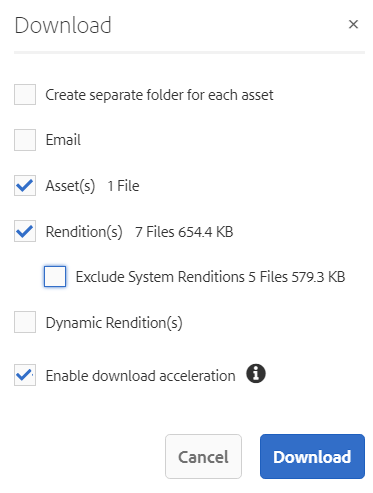

# Scaricare risorse da  Brand Portal {#download-assets-from-bp}

<!-- Before update in Download experience - 26th Aug 2020 comment by Vishabh.
 All users can simultaneously download multiple assets and folders accessible to them from Brand Portal. This way, approved brand assets can be securely distributed for offline use. Read on to know how to download approved assets from Brand Portal, and what to expect from the [download performance](../using/brand-portal-download-assets.md#main-pars-header).
-->

Adobe Experience Manager Assets Brand Portal migliora l’esperienza di download consentendo agli utenti di scaricare simultaneamente più risorse e cartelle accessibili da Brand Portal. In questo modo, le risorse del marchio approvate possono essere distribuite in modo sicuro e offline. Continua a leggere per scoprire come scaricare risorse approvate da Brand Portal e cosa aspettarsi dalle [prestazioni di download](../using/brand-portal-download-assets.md#expected-download-performance).

>[!NOTE]
>
>In Brand Portal 2020.10.0 (e versioni successive), l&#39;impostazione **[!UICONTROL Download rapido]** è abilitata per impostazione predefinita, che utilizza IBM Aspera Connect per il download accelerato delle risorse. Installa IBM Aspera Connect 3.9.9 (`https://www.ibm.com/docs/en/aspera-connect/3.9.9`) nell’estensione del browser prima di scaricare le risorse da Brand Portal. Per ulteriori dettagli, consulta la [guida per accelerare i download da Brand Portal](../using/accelerated-download.md).
>
>Se non desideri utilizzare IBM Aspera Connect e continuare con il normale processo di download, contatta l&#39;amministratore Brand Portal per disattivare l&#39;impostazione **[!UICONTROL Download rapido]**.

## Configurare il download delle risorse {#configure-download}

Gli amministratori di Brand Portal possono configurare le impostazioni di download delle risorse e dei gruppi di utenti per gli utenti di Brand Portal, consentendo loro di accedere e scaricare i rendering delle risorse dall’interfaccia di Brand Portal.

>[!NOTE]
>
>Le impostazioni di download applicate all’interfaccia utente di facilitano l’utilizzo self-service degli utenti di Brand Portal per configurare e scaricare facilmente i rendering delle risorse. Non limita il download delle risorse a livello di applicazione, ad esempio, gli utenti possono comunque accedere e scaricare i rendering delle risorse con il percorso URL completo.

L’accesso e il download delle rappresentazioni delle risorse dall’interfaccia di Brand Portal è definito dalle seguenti configurazioni:

* Abilita le impostazioni di download
* Configurare le impostazioni dei gruppi di utenti

### Abilita le impostazioni di download {#enable-download-settings}

Gli amministratori possono abilitare la risorsa **[!UICONTROL Scarica impostazioni]** per definire il set di rappresentazioni accessibili agli utenti Brand Portal per il download.

Le impostazioni disponibili sono:

* **[!UICONTROL Download veloce]**

   Fornisce il download accelerato delle risorse utilizzando IBM Aspera Connect. Per impostazione predefinita, l&#39;impostazione **[!UICONTROL Download rapido]** è abilitata in **[!UICONTROL Impostazioni di download]**.

* **[!UICONTROL Rappresentazioni personalizzate]**

   Abilita il download di rappresentazioni personalizzate e (o) dinamiche delle risorse.

   Tutte le rappresentazioni delle risorse diverse dalla risorsa originale e dalle rappresentazioni generate dal sistema sono denominate rappresentazioni personalizzate. Include rappresentazioni statiche e dinamiche disponibili per la risorsa. Qualsiasi utente può creare un rendering statico personalizzato in Experience Manager Assets, mentre solo l’amministratore può creare rappresentazioni dinamiche personalizzate. Per informazioni dettagliate, consulta [come applicare predefiniti immagine o rappresentazioni dinamiche](../using/brand-portal-image-presets.md).

* **[!UICONTROL Rappresentazioni di sistema]**

   Abilita il download di rappresentazioni generate dal sistema delle risorse.

   Queste sono le miniature generate automaticamente in Experience Manager Assets in base al flusso di lavoro &quot;Risorsa di aggiornamento DAM&quot;.

* **[!UICONTROL Download risorse]**

   Abilita il download dei rendering in una cartella separata per ogni risorsa. L’impostazione è applicabile alle cartelle, alle raccolte e al download in blocco di risorse (più di 20 risorse).

Accedi al tenant Brand Portal come amministratore e passa a **[!UICONTROL Strumenti]** > **[!UICONTROL Scarica]**.

Gli amministratori possono abilitare qualsiasi combinazione di impostazioni per consentire agli utenti di Brand Portal di accedere e scaricare le rappresentazioni.

>[!NOTE]
>
>Solo gli amministratori possono scaricare le risorse scadute. Per ulteriori informazioni sulle risorse scadute, consulta [gestire i diritti digitali delle risorse](../using/manage-digital-rights-of-assets.md).

### Configurare le impostazioni dei gruppi di utenti {#configure-user-group-settings}

Oltre alle **[!UICONTROL Impostazioni di download]**, gli amministratori di Brand Portal possono configurare ulteriormente le impostazioni per diversi gruppi di utenti per visualizzare e (o) scaricare le risorse originali e le relative rappresentazioni.

Accedi al tenant Brand Portal come amministratore e passa a **[!UICONTROL Strumenti]** > **[!UICONTROL Utenti]**. Nella pagina **[!UICONTROL Ruoli utente]** , passa alla scheda **[!UICONTROL Gruppi]** per configurare le impostazioni di visualizzazione e/o di download per i gruppi di utenti.

>[!NOTE]
>
>Se un utente viene aggiunto a più gruppi e se uno di questi gruppi presenta restrizioni, queste verranno applicate all&#39;utente.

In base alla configurazione, il flusso di lavoro di download rimane costante per le risorse autonome, per più risorse, per le cartelle contenenti risorse, risorse con licenza o senza licenza e per il download delle risorse tramite il collegamento di condivisione.

La seguente matrice definisce se un utente avrebbe accesso alle rappresentazioni a seconda delle [configurazioni di download](#configure-download):

| **Impostazioni di download: Rendering personalizzati** | **Impostazioni di download: Rendering di sistema** | **Impostazioni gruppo di utenti: Scarica originale** | **Impostazioni gruppo di utenti: Download delle rappresentazioni** | **Risultato** |
|---|---|---|---|---|
| ATTIVATO | ATTIVATO | ATTIVATO | ATTIVATO | Visualizza e scarica tutte le rappresentazioni |
| ATTIVATO | ATTIVATO | DISATTIVATO | DISATTIVATO | Visualizza risorsa originale |
| DISATTIVATO | DISATTIVATO | ATTIVATO | ATTIVATO | Visualizzare e scaricare la risorsa originale |
| ATTIVATO | DISATTIVATO | ATTIVATO | ATTIVATO | Visualizzare e scaricare le rappresentazioni originali e personalizzate |
| DISATTIVATO | ATTIVATO | ATTIVATO | ATTIVATO | Visualizzare e scaricare le rappresentazioni originali delle risorse e del sistema |
| ATTIVATO | DISATTIVATO | DISATTIVATO | DISATTIVATO | Visualizza risorsa originale |
| DISATTIVATO | ATTIVATO | DISATTIVATO | DISATTIVATO | Visualizza risorsa originale |
| DISATTIVATO | DISATTIVATO | DISATTIVATO | ATTIVATO | Visualizza risorsa originale |
| DISATTIVATO | DISATTIVATO | ATTIVATO | DISATTIVATO | Visualizzare e scaricare la risorsa originale |
| DISATTIVATO | DISATTIVATO | DISATTIVATO | DISATTIVATO | Visualizza risorsa originale |

## Scaricare le risorse {#download-assets}

Gli utenti di Brand Portal possono scaricare dall’interfaccia di Brand Portal più risorse, cartelle contenenti risorse e raccolte.

>[!NOTE]
>
>Contatta l’amministratore di Brand Portal se non disponi dell’autorizzazione per accedere o scaricare i rendering delle risorse.

Se l’utente ha accesso alle rappresentazioni, viene fornita all’utente la finestra di dialogo **[!UICONTROL Download]** migliorata con le seguenti funzionalità:
* Visualizza tutti i rendering disponibili di qualsiasi risorsa nell’elenco dei download.
* Escludi le rappresentazioni delle risorse non necessarie per il download.
* Applica con un solo clic lo stesso set di rappresentazioni a tutti i tipi di risorse simili.
* Applica un diverso set di rappresentazioni per diversi tipi di risorse.
* Crea una cartella separata per ogni risorsa.
* Scarica le risorse selezionate e le relative rappresentazioni.

>[!NOTE]
>
>La finestra di dialogo **[!UICONTROL Scarica]** viene visualizzata solo se **[!UICONTROL Rendering personalizzati]** e (o) **[!UICONTROL Rendering di sistema]** è abilitata in **[!UICONTROL Impostazioni di download]**.

### Passaggi per scaricare le risorse {#bulk-download}

Di seguito sono riportati i passaggi per scaricare risorse o cartelle contenenti risorse dall’interfaccia di Brand Portal:

1. Accedi al tuo tenant Brand Portal. Per impostazione predefinita, viene visualizzata la vista **[!UICONTROL File]** contenente tutte le risorse e le cartelle pubblicate.

   Effettua una delle operazioni seguenti:

   * Seleziona le risorse o le cartelle da scaricare. Dalla barra degli strumenti nella parte superiore, fai clic sull&#39;icona **[!UICONTROL Scarica]** .

      

   * Per scaricare rappresentazioni specifiche di una risorsa, posiziona il puntatore del mouse sulla risorsa e fai clic sull’icona **[!UICONTROL Scarica]** disponibile nelle miniature delle azioni rapide.

      

      >[!NOTE]
      >
      >Se scarichi le risorse per la prima volta e nel browser non è installato IBM Aspera Connect, ti verrà richiesto di installare l&#39;acceleratore di download Aspera (`https://www.ibm.com/docs/en/aspera-connect/3.9.9`).

      >[!NOTE]
      >
      >Se le risorse che stai scaricando includono anche risorse con licenza, sei reindirizzato alla pagina **[!UICONTROL Gestione copyright]** . In questa pagina, seleziona le risorse, fai clic su **[!UICONTROL Accetto]**, quindi fai clic su **[!UICONTROL Scarica]**. Se scegli di non essere d&#39;accordo, le risorse concesse in licenza non vengono scaricate.
      > 
      >Le risorse protette da licenza hanno [un contratto di licenza allegato](https://experienceleague.adobe.com/docs/experience-manager-65/assets/administer/drm.html), che viene fatto impostando la proprietà [metadati della risorsa](https://experienceleague.adobe.com/docs/experience-manager-65/assets/administer/drm.html) in Experience Manager Assets.

      

1. Viene visualizzata la finestra di dialogo **[!UICONTROL Scarica]** in cui sono elencate tutte le risorse selezionate.

   Fai clic su una risorsa per visualizzare i rendering disponibili e seleziona le caselle di controllo corrispondenti ai rendering da scaricare.

   Puoi selezionare o escludere manualmente i rendering per le singole risorse oppure fare clic sull&#39;icona **Applica** per selezionare lo stesso set di rendering da scaricare per tipi di risorse simili (tutti i file di immagine in questo esempio). Nella finestra di dialogo **[!UICONTROL Applica tutto]**, fai clic su **[!UICONTROL Fine]** per applicare la regola a tutte le risorse simili.

   

   Puoi anche rimuovere una risorsa dall’elenco dei download (se necessario) facendo clic sull’icona **Rimuovi** .

   

   Per mantenere la gerarchia delle cartelle di Brand Portal durante il download delle risorse, seleziona la casella di controllo **[!UICONTROL Crea cartella separata per ogni risorsa]**.

   Il pulsante di download riflette il conteggio degli elementi selezionati. Dopo aver applicato le regole, fai clic su **[!UICONTROL Scarica elementi]**.

   

1. Per impostazione predefinita, l&#39;impostazione **[!UICONTROL Download rapido]** è abilitata in **[!UICONTROL Impostazioni di download]**. Pertanto, viene visualizzata una casella di conferma per consentire il download accelerato utilizzando IBM Aspera Connect.

   Per continuare a utilizzare **[!UICONTROL Download rapido]**, fai clic su **[!UICONTROL Consenti]**. Tutte le rappresentazioni selezionate vengono scaricate in una cartella zip utilizzando IBM Aspera Connect.

   Se non desideri utilizzare IBM Aspera Connect, fai clic su **[!UICONTROL Rifiuta]**. Se **[!UICONTROL Download rapido]** viene negato o non riesce, il sistema compila un messaggio di errore. Fai clic sul pulsante **[!UICONTROL Download normale]** per continuare a scaricare le risorse.

>[!NOTE]
>
>Se l&#39;impostazione **[!UICONTROL Download rapido]** è disattivata dall&#39;amministratore, le rappresentazioni selezionate vengono scaricate direttamente in una cartella zip senza utilizzare IBM Aspera Connect.

>[!NOTE]
>
>Se l’impostazione **[!UICONTROL Download risorse]** è abilitata in **[!UICONTROL Impostazioni di download]**, i rendering delle risorse vengono scaricati in una cartella separata per ogni risorsa all’interno della cartella zip.
>  
>Se le risorse vengono scaricate da un collegamento condiviso, le rappresentazioni delle risorse vengono scaricate in una cartella separata per ciascuna risorsa all’interno della cartella zip.
>
>Se per il download è selezionata una cartella, una raccolta o più di 20 risorse, la finestra di dialogo **[!UICONTROL Scarica]** viene ignorata e tutti i rendering delle risorse accessibili all’utente, esclusi i rendering dinamici, vengono scaricati in una cartella zip.

>[!NOTE]
>
>Brand Portal supporta la configurazione di Dynamic Media in modalità ibrida e Scene 7.
>
>(*Se l&#39;istanza di authoring di Experience Manager Assets è in esecuzione su **Modalità ibrida di Dynamic Media***)
>
>Per visualizzare in anteprima o scaricare rappresentazioni dinamiche di una risorsa, accertati che l’elemento multimediale dinamico sia abilitato e che la rappresentazione a comparsa a piramide della risorsa esista nell’istanza di authoring di Experience Manager Assets da cui sono state pubblicate le risorse. Quando una risorsa viene pubblicata da Experience Manager Assets a Brand Portal, viene pubblicata anche la relativa rappresentazione a forma di file piramidale.

Se l&#39;amministratore non è [autorizzato ad accedere alle rappresentazioni originali](../using/brand-portal-adding-users.md#main-pars-procedure-202029708), le rappresentazioni originali delle risorse selezionate non vengono scaricate.

<!-- This issue has been resolved, check with engineering.
>[!NOTE]
>
>Once you have downloaded the asset renditions, the **[!UICONTROL Download]** button is disabled to avoid creating duplicate copies of the renditions. To download more (missing or another copy of renditions), refresh the browser to re-enable the download button.
-->

### Scarica le risorse dalla pagina dei dettagli delle risorse {#download-assets-from-asset-details-page}

Oltre al flusso di lavoro di download, esiste un altro metodo per scaricare i rendering per le singole risorse direttamente dalla pagina dei dettagli delle risorse.

Gli utenti possono visualizzare in anteprima diverse rappresentazioni, selezionare rappresentazioni specifiche e scaricarle direttamente dal pannello **[!UICONTROL Rappresentazioni]** nella pagina dei dettagli delle risorse senza dover aprire la finestra di dialogo **[!UICONTROL Scarica]** .

Di seguito sono riportati i passaggi per scaricare i rendering delle risorse dalla pagina dei dettagli delle risorse:

1. Accedi al tenant di Brand Portal e fai clic sulla risorsa per aprire la pagina dei dettagli della risorsa.
1. Fai clic sull&#39;icona di sovrapposizione a sinistra, quindi fai clic su **[!UICONTROL Rappresentazioni]**.

   

1. Il pannello **[!UICONTROL Rendering]** elenca tutte le rappresentazioni delle risorse accessibili in base alle [configurazioni di download](#configure-download) della risorsa.

   Seleziona le rappresentazioni specifiche da scaricare e fai clic su **[!UICONTROL Scarica elementi]**.

   

1. Per impostazione predefinita, l&#39;impostazione **[!UICONTROL Download rapido]** è abilitata in **[!UICONTROL Impostazioni di download]**. Pertanto, viene visualizzata una casella di conferma per consentire il download accelerato utilizzando IBM Aspera Connect.

   Per continuare a utilizzare **[!UICONTROL Download rapido]**, fai clic su **[!UICONTROL Consenti]**. Tutte le rappresentazioni selezionate vengono scaricate in una cartella zip utilizzando IBM Aspera Connect.

   Se si nega l&#39;utilizzo di **[!UICONTROL Download rapido]**, il sistema compila un messaggio di errore. Fai clic sul pulsante **[!UICONTROL Download normale]** per continuare a scaricare le risorse.

>[!NOTE]
>
>Se l&#39;impostazione **[!UICONTROL Download rapido]** è disattivata dall&#39;amministratore, le rappresentazioni selezionate vengono scaricate direttamente in una cartella zip senza utilizzare IBM Aspera Connect.

>[!NOTE]
>
>Le risorse scaricate singolarmente sono visibili nel rapporto di download delle risorse. Tuttavia, se viene scaricata una cartella contenente risorse, la cartella e le risorse non vengono visualizzate nel rapporto di download delle risorse.

<!--
>[!NOTE]
>
>Assets that are individually downloaded are visible in the assets download report. However, if a folder containing assets is downloaded, the folder and assets are not displayed in the assets download report.
-->

<!-- Backup of content before updating the new feature docs.
## Configure asset download {#configure-download}

The download configuration allows the Brand Portal administrators to define the set of renditions available to the Brand Portal users for downloading the assets. The administrator can configure the asset **[!UICONTROL Download]** settings from the Brand Portal interface. 

The available configurations are:

* **[!UICONTROL Fast Download]** 

  Enables high-speed download of the assets. To know more, see [guide to accelerate downloads from Brand Portal](../using/accelerated-download.md).

* **[!UICONTROL Custom Renditions]** 
  
  Download custom and (or) dynamic renditions of the assets. 
  All the asset renditions other than the original asset and system-generated renditions are called as custom renditions. It includes static as well as dynamic renditions available for the asset. Any user can create a custom static rendition in AEM Assets, whereas, only the AEM administrator can create custom dynamic renditions. To know more, see [how to apply image presets or dynamic renditions](../using/brand-portal-image-presets.md)

* **[!UICONTROL System Renditions]** 

  Download system-generated renditions of the assets. These are the thumbnails which are automatically generated in AEM Assets based on the "DAM update asset" workflow. 

Log in to your Brand Portal tenant as an administrator and navigate to **[!UICONTROL Tools]** > **[!UICONTROL Download]**. By default, the **[!UICONTROL Fast Download]** configuration is enabled in the **[!UICONTROL Download Settings]**. 

The administrators can enable any combination to configure the asset download process.

Based on the configuration, the download workflow remains constant for stand-alone assets, multiple assets, folders containing assets, licensed or unlicensed assets, and downloading assets using share link. 

* If both **[!UICONTROL Custom Renditions]** and **[!UICONTROL System Renditions]** configurations are turned-off, the original renditions of the assets are downloaded without any additional dialog being presented to the users.    

* If any of the **[!UICONTROL Custom Renditions]** or **[!UICONTROL System Renditions]** configuration is enabled, an additional **[!UICONTROL Download]** dialog box appears wherein you can choose whether to download the original asset along with its renditions, or download only specific renditions. 

>[!NOTE]
>
>Only the administrators can download the expired assets. For more information about expired assets, see [manage digital rights of assets](../using/manage-digital-rights-of-assets.md).

## Steps to download assets {#steps-to-download-assets}

Following are the steps to download assets or folders containing assets from Brand Portal:

1. From the Brand Portal interface, do one of the following:

   * Select the folders or assets you want to download. From the toolbar at the top, click the **[!UICONTROL Download]** icon.

     

   * To download a specific asset or folder, hover the pointer over the asset or folder and click the **[!UICONTROL Download]** icon available in the quick action thumbnails.

     

     >[!NOTE]
     >
     >If you are downloading the assets for the first time and do not have IBM Aspera Connect installed in your browser, it will prompt you to install the Aspera download accelerator. 

     >[!NOTE]
     >
     >If the assets you are downloading also include licensed assets, you are redirected to the **[!UICONTROL Copyright Management]** page. In this page, select the assets, click **[!UICONTROL Agree]**, and then click **[!UICONTROL Download]**. If you choose to disagree, licensed assets are not downloaded. 
     > 
     >License-protected assets have [license agreement attached]() to them, which is done by setting asset's [metadata property]() in Experience Manager Assets.

     

     
     >[!NOTE]
     >
     >Ensure to select all the required asset renditions while downloading them from the asset details page, and click **[!UICONTROL Download]**. The selected renditions are downloaded to your local machine.
     > 
     >Once you download, the **[!UICONTROL Download]** button is disabled to avoid creating duplicate copies of the downloaded renditions. To download more (missing or another copy of renditions), refresh the browser to re-enable the download button.

     If any of the **[!UICONTROL Custom Renditions]** or **[!UICONTROL System Renditions]** configuration is enabled in the **[!UICONTROL Download Settings]**, the **[!UICONTROL Download]** dialog appears with the **[!UICONTROL Asset(s)]** check box selected by default. If the **[!UICONTROL Fast Download]** configuration is enabled, the **[!UICONTROL Enable download acceleration]** check box is selected by default.

     

     >[!NOTE]
     >
     >If the downloading assets are image files, and you select only the **[!UICONTROL Asset(s)]** check box in the **[!UICONTROL Download]** dialog but are not [authorized by the administrator to have access to the original renditions of image files](../using/brand-portal-adding-users.md#main-pars-procedure-202029708) then no image files are downloaded and a notification appears, stating that you have been restricted by the administrator to access original renditions.

     

1. To download the renditions in addition to the original assets, select the **[!UICONTROL Rendition(s)]** check box. However, if you want to download the system-generated renditions along with the custom renditions, clear the **[!UICONTROL Exclude System Renditions]** check box.

   

   * To download only the renditions, clear the **[!UICONTROL Asset(s)]** check box.

     >[!NOTE]
     >
     >By default, only the assets are downloaded. However, original renditions of image files are not downloaded if you are not [authorized by the administrator to have access to the original renditions of image files](../using/brand-portal-adding-users.md#main-pars-procedure-202029708).

    * To share the selected assets with other users through a link, select the **[!UICONTROL Email]** check box. An email notification is sent to the users with the download link. To know how to download assets from shared links, see [downloading assets from shared links](../using/brand-portal-link-share.md#main-pars-header-1703469193).  

      

      >[!NOTE]
      >
      >The download link on email notification expires after 45 days.
      >
      >The administrators can customize email messages, that is, logo, description, and footer, using the [Branding](../using/brand-portal-branding.md) feature.

    * You can select a predefined image preset or create a custom dynamic rendition from the **[!UICONTROL Download]** dialog box. 

      To apply a [custom image preset to the asset and its renditions](../using/brand-portal-image-presets.md#applyimagepresetswhendownloadingimages), select the **[!UICONTROL Dynamic Rendition(s)]** check box. Specify the image preset properties (such as size, format, color space, resolution, and image modifier) to apply the custom image preset while downloading the asset and its renditions. To download only the dynamic renditions, clear the **[!UICONTROL Asset(s)]** check box.

      

      >[!NOTE]
      >
      >Brand Portal supports configuring Dynamic Media in both - Hybird and Scene 7 mode. 
      >
      >(*If AEM author instance is running on **Dynamic Media Hybrid mode***)
      >
      >To preview or download dynamic renditions of an asset, ensure that the dynamic media is enabled and the asset's Pyramid tiff rendition exists at the AEM Assets author instance from where the assets have been published. When an asset is published to Brand Portal, its Pyramid tiff rendition is also published.
      
  
    * To preserve the Brand Portal folder hierarchy while downloading assets, select the **[!UICONTROL Create separate folder for each asset]** check box. By default, the Brand Portal folder hierarchy is ignored and all the assets are downloaded in one folder in your local system.

1. Click **[!UICONTROL Download]**.

   The assets (and renditions if selected) are downloaded as a zip file to your local folder. However, no zip file is created if a single asset is downloaded without any of the renditions. 

   If you are not [authorized by the administrator to have access to the original renditions](../using/brand-portal-adding-users.md#main-pars-procedure-202029708), the original renditions of the selected assets are not downloaded. 

   >[!NOTE]
   >
   >Assets that are individually downloaded are visible in the assets download report. However, if a folder containing assets is downloaded, the folder and assets are not displayed in the assets download report.
-->

## Prestazioni di download previste {#expected-download-performance}

L’esperienza di download dei file può variare per gli utenti in posizioni client diverse, a seconda di fattori quali la connettività Internet locale e la latenza del server. Le prestazioni di download previste per i file da 2 GB osservati in posizioni client diverse sono le seguenti, con il server Brand Portal di Oregon negli Stati Uniti:

| Posizione client | Latenza tra client e server | Velocità di download prevista | Tempo impiegato per scaricare un file da 2 GB |
|-------------------------|-----------------------------------|-------------------------|------------------------------------|
| USA occidentale (N. California) | 18 millisecondi | 7,68 MB/s | 4 minuti |
| USA occidentale (Oregon) | 42 millisecondi | 3,84 MB/s | 9 minuti |
| USA orientale (N. Virginia) | 85 millisecondi | 1,61 MB/s | 21 minuti |
| APAC (Tokyo) | 124 millisecondi | 1,13 MB/s | 30 minuti |
| Noida | 275 millisecondi | 0,5 MB/s | 68 minuti |
| Sydney | 175 millisecondi | 0,49 MB/s | 69 minuti |
| Londra | 179 millisecondi | 0,32 MB/s | 106 minuti |
| Singapore | 196 millisecondi | 0,5 MB/s | 68 minuti |

>[!NOTE]
>
>I dati acquisiti vengono osservati in condizioni di test, che possono variare per gli utenti in luoghi diversi, a causa di latenza e larghezza di banda variabili.
