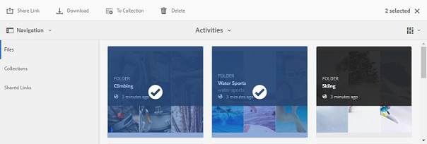

# Scaricare risorse da Brand Portal {#download-assets-from-bp}

<!-- Before update in Download experience - 26th Aug 2020 comment by Vishabh.
 All users can simultaneously download multiple assets and folders accessible to them from Brand Portal. This way, approved brand assets can be securely distributed for offline use. Read on to know how to download approved assets from Brand Portal, and what to expect from the [download performance](../using/brand-portal-download-assets.md#main-pars-header).
-->

Adobe Experience Manager Assets Brand Portal ottimizza l’esperienza di download consentendo agli utenti di scaricare simultaneamente più risorse e cartelle accessibili da Brand Portal. In questo modo, le risorse del marchio approvate possono essere distribuite in modo sicuro per l&#39;utilizzo offline. Continua a leggere per scoprire come scaricare le risorse approvate dal Brand Portal e cosa aspettarsi dalle prestazioni [di](../using/brand-portal-download-assets.md#expected-download-performance)download.

>[!NOTE]
>
>In Brand Portal 2020.10.0 (e versioni successive), l’impostazione Download **** rapido è abilitata per impostazione predefinita, che utilizza IBM Aspera Connect per il download accelerato delle risorse. [Installate IBM Aspera Connect 3.9.9](https://www.ibm.com/support/knowledgecenter/SSXMX3_3.9.9/kc/connect_welcome.html) nell’estensione del browser prima di scaricare le risorse dal Brand Portal. Per ulteriori dettagli, consultate la [guida per accelerare i download dal Brand Portal](../using/accelerated-download.md).
>
>Se non desiderate utilizzare IBM Aspera Connect e continuare con il normale processo di download, contattate l&#39;amministratore del Brand Portal per disattivare l&#39;impostazione Download **** rapido.

## Configurare il download delle risorse {#configure-download}

Gli amministratori di Brand Portal possono configurare le impostazioni e le autorizzazioni di download delle risorse per gli utenti di Brand Portal, consentendo loro di accedere e scaricare le rappresentazioni delle risorse dall’interfaccia di Brand Portal.

L’accesso e il download delle rappresentazioni da Brand Portal sono definiti dalle seguenti configurazioni:

* Abilita impostazioni di download
* Configurare le autorizzazioni di download

### Abilita impostazioni di download {#enable-download-settings}

Gli amministratori possono abilitare le impostazioni **[!UICONTROL di]** download della risorsa per definire il set di rappresentazioni accessibili agli utenti di Brand Portal per il download.

Le impostazioni disponibili sono:

* **[!UICONTROL Download veloce]**

   Fornisce il download accelerato delle risorse tramite IBM Aspera Connect. Per impostazione predefinita, l’impostazione Download **** rapido è abilitata nelle impostazioni **[!UICONTROL di]** download.

* **[!UICONTROL Rappresentazioni personalizzate]**

   Consente di scaricare rappresentazioni personalizzate e (o) dinamiche delle risorse.

   Tutte le rappresentazioni di risorse diverse dalla risorsa originale e dalle rappresentazioni generate dal sistema sono denominate rappresentazioni personalizzate. Include rappresentazioni statiche e dinamiche disponibili per la risorsa. Ogni utente può creare una rappresentazione statica personalizzata in  AEM Assets, mentre solo l&#39;amministratore AEM può creare rappresentazioni dinamiche personalizzate. Per informazioni dettagliate, consultate [come applicare predefiniti per immagini o rappresentazioni](../using/brand-portal-image-presets.md)dinamiche.

* **[!UICONTROL Rappresentazioni di sistema]**

   Consente di scaricare le rappresentazioni generate dal sistema delle risorse.

   Queste sono le miniature generate automaticamente in  AEM Assets in base al flusso di lavoro &quot;DAM update asset&quot; (Risorsa di aggiornamento DAM).

Accedi al tenant del Brand Portal come amministratore e passa a **[!UICONTROL Strumenti]** > **[!UICONTROL Scarica]**.

Gli amministratori possono abilitare qualsiasi combinazione di impostazioni per consentire agli utenti di Brand Portal di accedere e scaricare le rappresentazioni.

>[!NOTE]
>
>Solo gli amministratori possono scaricare le risorse scadute. Per ulteriori informazioni sulle risorse scadute, consultate [Gestione dei diritti digitali delle risorse](../using/manage-digital-rights-of-assets.md).

### Configurare le autorizzazioni di download {#configure-download-permissions}

Oltre alle impostazioni **[!UICONTROL di]** download, gli amministratori del Brand Portal possono configurare ulteriormente le autorizzazioni per diversi gruppi di utenti per visualizzare e (o) scaricare le risorse originali e le relative rappresentazioni.

Accedi al tenant del Brand Portal come amministratore e passa a **[!UICONTROL Strumenti]** > **[!UICONTROL Utenti]**. Nella pagina Ruoli **** utente, andate alla scheda **[!UICONTROL Gruppi]** per configurare le autorizzazioni di visualizzazione e (o) download per i gruppi di utenti.

>[!NOTE]
>
>Se un utente viene aggiunto a più gruppi e se uno di questi dispone di restrizioni, tali restrizioni verranno applicate all&#39;utente.

In base alla configurazione, il flusso di lavoro di download rimane costante per le risorse autonome, per più risorse, per le cartelle contenenti risorse, per le risorse con licenza o senza licenza e per il download delle risorse tramite il collegamento di condivisione.

La seguente matrice definisce se un utente avrebbe accesso alle rappresentazioni in base alle configurazioni [di](#configure-download)download:

| **Impostazioni di download: Rappresentazioni personalizzate** | **Impostazioni di download: Rappresentazioni del sistema** | **Autorizzazioni gruppo utenti: Scarica originale** | **Autorizzazioni gruppo utenti: Download delle rappresentazioni** | **Risultato** |
|---|---|---|---|---|
| ATTIVATO | ATTIVATO | ATTIVATO | ATTIVATO | Visualizzare e scaricare tutte le rappresentazioni |
| ATTIVATO | ATTIVATO | DISATTIVATO | DISATTIVATO | Visualizzare la risorsa originale |
| DISATTIVATO | DISATTIVATO | ATTIVATO | ATTIVATO | Visualizzare e scaricare la risorsa originale |
| ATTIVATO | DISATTIVATO | ATTIVATO | ATTIVATO | Visualizzare e scaricare la risorsa originale e le rappresentazioni personalizzate |
| DISATTIVATO | ATTIVATO | ATTIVATO | ATTIVATO | Visualizzare e scaricare le rappresentazioni originali delle risorse e del sistema |
| ATTIVATO | DISATTIVATO | DISATTIVATO | DISATTIVATO | Visualizzare la risorsa originale |
| DISATTIVATO | ATTIVATO | DISATTIVATO | DISATTIVATO | Visualizzare la risorsa originale |
| DISATTIVATO | DISATTIVATO | DISATTIVATO | ATTIVATO | Visualizzare la risorsa originale |
| DISATTIVATO | DISATTIVATO | ATTIVATO | DISATTIVATO | Visualizzare e scaricare la risorsa originale |
| DISATTIVATO | DISATTIVATO | DISATTIVATO | DISATTIVATO | Visualizzare la risorsa originale |

## Scaricare le risorse {#download-assets}

Gli utenti di Brand Portal possono scaricare dall’interfaccia Brand Portal più risorse, cartelle contenenti risorse e raccolte.

>[!NOTE]
>
>Se non disponete delle autorizzazioni per accedere o scaricare le rappresentazioni, contattate l’amministratore di Brand Portal.

Se l&#39;utente ha accesso alle rappresentazioni, l&#39;utente dispone della finestra di dialogo **[!UICONTROL Download]** avanzata con le seguenti funzionalità:
* Visualizza tutte le rappresentazioni disponibili di qualsiasi risorsa nell&#39;elenco dei download.
* Escludete le rappresentazioni delle risorse non necessarie per il download.
* Con un solo clic potete applicare lo stesso set di rappresentazioni a tutti i tipi di risorse simili.
* Applicate un set diverso di rappresentazioni per tipi di risorse diversi.
* Create una cartella separata per ogni rappresentazione di risorsa.
* Scaricate le risorse selezionate e le relative rappresentazioni.

>[!NOTE]
>
>La finestra di dialogo **[!UICONTROL Scarica]** viene visualizzata solo se le risorse sono selezionate per il download e le rappresentazioni **** personalizzate o **[!UICONTROL di sistema]** sono abilitate nelle impostazioni **[!UICONTROL di]** download.

### Passaggi per scaricare le risorse {#bulk-download}

Di seguito sono riportati i passaggi per scaricare risorse o cartelle contenenti risorse dall’interfaccia Brand Portal:

1. Accedete al tenant del Brand Portal. Per impostazione predefinita, viene aperta la visualizzazione **[!UICONTROL File]** che contiene tutte le risorse e le cartelle pubblicate.

   Effettua una delle operazioni seguenti:

   * Selezionate le risorse o le cartelle da scaricare. Dalla barra degli strumenti nella parte superiore, fate clic sull&#39;icona **[!UICONTROL Scarica]** .

      

   * Per scaricare rappresentazioni di risorse specifiche di una risorsa, passate il puntatore del mouse sulla risorsa e fate clic sull’icona **[!UICONTROL Scarica]** disponibile nelle miniature delle azioni rapide.

      

      >[!NOTE]
      >
      >Se state scaricando le risorse per la prima volta e non disponete di IBM Aspera Connect installato nel browser, vi verrà richiesto di installare l’acceleratore di download di Aspera.

      >[!NOTE]
      >
      >Se le risorse che state scaricando includono anche risorse con licenza, viene nuovamente visualizzata la pagina Gestione **** copyright. In questa pagina, selezionate le risorse, fate clic su **[!UICONTROL Accetto]** e quindi su **[!UICONTROL Scarica]**. Se scegliete di non essere d’accordo, le risorse con licenza non vengono scaricate.
      > 
      >Alle risorse protette da licenza è associato [un contratto di](https://helpx.adobe.com/experience-manager/6-5/assets/using/drm.html#DigitalRightsManagementinAssets) licenza, che viene fatto impostando la proprietà  metadati della risorsa in  risorse di Experience Manager.

      

1. Viene visualizzata la finestra di dialogo **[!UICONTROL Scarica]** in cui sono elencate tutte le risorse selezionate.

   Fate clic su una risorsa per visualizzare le rappresentazioni disponibili e selezionate le caselle di controllo corrispondenti alle rappresentazioni da scaricare.

   Potete selezionare o escludere manualmente i rendering per singole risorse oppure fare clic sull&#39;icona **Applica** per selezionare lo stesso set di rappresentazioni da scaricare per tipi di risorse simili (tutti i file immagine in questo esempio). Nella finestra di dialogo **[!UICONTROL Applica tutto]** , fate clic su **[!UICONTROL Fine]** per applicare la regola a tutte le risorse simili.

   

   Per rimuovere una risorsa dall’elenco di download (se necessario), fai clic sull’icona **Rimuovi** .

   

   Per mantenere la gerarchia delle cartelle del Portale marchio durante il download delle risorse, selezionate la casella di controllo **[!UICONTROL Crea cartella separata per ciascuna risorsa]** . Per impostazione predefinita, la gerarchia delle cartelle Brand Portal viene ignorata e tutte le risorse vengono scaricate in una cartella zip.

   Il pulsante di download riflette il numero di elementi selezionati. Dopo aver applicato le regole, fate clic su **[!UICONTROL Scarica elementi]**.

   

1. Per impostazione predefinita, l’impostazione Download **** rapido è abilitata nelle impostazioni **[!UICONTROL di]** download. Di conseguenza, viene visualizzata una finestra di conferma per consentire il download accelerato tramite IBM Aspera Connect.

   Per continuare a utilizzare **[!UICONTROL Download]** rapido, fate clic su **[!UICONTROL Consenti]**. Tutte le rappresentazioni selezionate vengono scaricate in una cartella zip utilizzando IBM Aspera Connect.

   Se non desiderate utilizzare IBM Aspera Connect, fate clic su **[!UICONTROL Rifiuta]**. Se il download **** rapido viene negato o ha esito negativo, il sistema compila un messaggio di errore. Per continuare a scaricare le risorse, fate clic sul pulsante Scarica **** normale. Le rappresentazioni selezionate vengono scaricate in una cartella zip senza utilizzare IBM Aspera Connect.

>[!NOTE]
>
>Se l’impostazione Download **** rapido è disattivata dall’amministratore, le rappresentazioni selezionate vengono scaricate direttamente in una cartella zip senza utilizzare IBM Aspera Connect.

>[!NOTE]
>
>Se per il download sono selezionate più di 20 risorse, la finestra di dialogo **[!UICONTROL Scarica]** viene ignorata e tutte le rappresentazioni accessibili all&#39;utente, escluse le rappresentazioni dinamiche, vengono scaricate direttamente in una cartella zip.
>
>Lo stesso comportamento viene seguito durante il download delle cartelle contenenti risorse e raccolte. Le rappresentazioni accessibili, escluse le rappresentazioni dinamiche, vengono scaricate direttamente in una cartella zip.

>[!NOTE]
>
>Brand Portal supporta la configurazione di contenuti multimediali dinamici sia in modalità ibrida che in modalità Scene7.
>
>(*se AEM’istanza di creazione è in esecuzione in modalità&#x200B;**ibrida***elemento multimediale dinamico)
>
>Per visualizzare in anteprima o scaricare le rappresentazioni dinamiche di una risorsa, accertatevi che l’elemento multimediale dinamico sia attivato e che la rappresentazione a comparsa piramidale della risorsa sia disponibile nell’istanza di creazione  AEM Assets da cui sono state pubblicate le risorse. Quando una risorsa viene pubblicata da AEM a Portale marchio, viene pubblicata anche la relativa rappresentazione a forma di poligono piramidale.

Se non siete [autorizzati dall’amministratore ad accedere alle rappresentazioni](../using/brand-portal-adding-users.md#main-pars-procedure-202029708)originali, le rappresentazioni originali delle risorse selezionate non vengono scaricate.

<!-- This issue has been resolved, check with engineering.
>[!NOTE]
>
>Once you have downloaded the asset renditions, the **[!UICONTROL Download]** button is disabled to avoid creating duplicate copies of the renditions. To download more (missing or another copy of renditions), refresh the browser to re-enable the download button.
-->

### Scaricare risorse dalla pagina dei dettagli della risorsa {#download-assets-from-asset-details-page}

Oltre al flusso di lavoro per il download, è disponibile un altro metodo per scaricare i rendering per singole risorse direttamente dalla pagina dei dettagli della risorsa.

Gli utenti possono visualizzare in anteprima diverse rappresentazioni, selezionare rappresentazioni specifiche e scaricarle direttamente dal pannello **[!UICONTROL Rappresentazioni]** nella pagina dei dettagli della risorsa senza dover aprire la finestra di dialogo **[!UICONTROL Scarica]** .

Seguono i passaggi per scaricare le rappresentazioni delle risorse dalla pagina dei dettagli delle risorse:

1. Accedete al tenant del Brand Portal e fate clic sulla risorsa per aprire la pagina dei dettagli della risorsa.
1. Fate clic sull&#39;icona della sovrapposizione a sinistra, quindi fate clic su **[!UICONTROL Rappresentazioni]**.

   

1. Il pannello **[!UICONTROL Rappresentazioni]** elenca tutte le rappresentazioni delle risorse accessibili in base alle configurazioni [di](#configure-download)download delle risorse.

   Selezionate le rappresentazioni specifiche da scaricare e fate clic su **[!UICONTROL Scarica elementi]**.

   

1. Per impostazione predefinita, l’impostazione Download **** rapido è abilitata nelle impostazioni **[!UICONTROL di]** download. Di conseguenza, viene visualizzata una finestra di conferma per consentire il download accelerato tramite IBM Aspera Connect.

   Per continuare a utilizzare **[!UICONTROL Download]** rapido, fate clic su **[!UICONTROL Consenti]**. Tutte le rappresentazioni selezionate vengono scaricate in una cartella zip utilizzando IBM Aspera Connect.

   Se si nega l&#39;utilizzo del download **** rapido, il sistema compila un messaggio di errore. Fate clic sul pulsante Download **** normale per continuare il download. Le rappresentazioni selezionate vengono scaricate in una cartella zip senza utilizzare IBM Aspera Connect.

>[!NOTE]
>
>Se l’impostazione Download **** rapido è disattivata dall’amministratore, le rappresentazioni selezionate vengono scaricate direttamente in una cartella zip senza utilizzare IBM Aspera Connect.

>[!NOTE]
>
>Le risorse che vengono scaricate singolarmente sono visibili nel rapporto di download delle risorse. Tuttavia, se viene scaricata una cartella contenente delle risorse, la cartella e le risorse non vengono visualizzate nel rapporto di download delle risorse.

<!--
>[!NOTE]
>
>Assets that are individually downloaded are visible in the assets download report. However, if a folder containing assets is downloaded, the folder and assets are not displayed in the assets download report.
-->

<!-- Backup of content before updating the new feature docs.
## Configure asset download {#configure-download}

The download configuration allows the Brand Portal administrators to define the set of renditions available to the Brand Portal users for downloading the assets. The administrator can configure the asset **[!UICONTROL Download]** settings from the Brand Portal interface. 

The available configurations are:

* **[!UICONTROL Fast Download]** 

  Enables high-speed download of the assets. To know more, see [guide to accelerate downloads from Brand Portal](../using/accelerated-download.md).

* **[!UICONTROL Custom Renditions]** 
  
  Download custom and (or) dynamic renditions of the assets. 
  All the asset renditions other than the original asset and system-generated renditions are called as custom renditions. It includes static as well as dynamic renditions available for the asset. Any user can create a custom static rendition in AEM Assets, whereas, only the AEM administrator can create custom dynamic renditions. To know more, see [how to apply image presets or dynamic renditions](../using/brand-portal-image-presets.md)

* **[!UICONTROL System Renditions]** 

  Download system-generated renditions of the assets. These are the thumbnails which are automatically generated in AEM Assets based on the "DAM update asset" workflow. 

Log in to your Brand Portal tenant as an administrator and navigate to **[!UICONTROL Tools]** > **[!UICONTROL Download]**. By default, the **[!UICONTROL Fast Download]** configuration is enabled in the **[!UICONTROL Download Settings]**. 

The administrators can enable any combination to configure the asset download process.

Based on the configuration, the download workflow remains constant for stand-alone assets, multiple assets, folders containing assets, licensed or unlicensed assets, and downloading assets using share link. 

* If both **[!UICONTROL Custom Renditions]** and **[!UICONTROL System Renditions]** configurations are turned-off, the original renditions of the assets are downloaded without any additional dialog being presented to the users.    

* If any of the **[!UICONTROL Custom Renditions]** or **[!UICONTROL System Renditions]** configuration is enabled, an additional **[!UICONTROL Download]** dialog box appears wherein you can choose whether to download the original asset along with its renditions, or download only specific renditions. 

>[!NOTE]
>
>Only the administrators can download the expired assets. For more information about expired assets, see [manage digital rights of assets](../using/manage-digital-rights-of-assets.md).

## Steps to download assets {#steps-to-download-assets}

Following are the steps to download assets or folders containing assets from Brand Portal:

1. From the Brand Portal interface, do one of the following:

   * Select the folders or assets you want to download. From the toolbar at the top, click the **[!UICONTROL Download]** icon.

     

   * To download a specific asset or folder, hover the pointer over the asset or folder and click the **[!UICONTROL Download]** icon available in the quick action thumbnails.

     

     >[!NOTE]
     >
     >If you are downloading the assets for the first time and do not have IBM Aspera Connect installed in your browser, it will prompt you to install the Aspera download accelerator. 

     >[!NOTE]
     >
     >If the assets you are downloading also include licensed assets, you are redirected to the **[!UICONTROL Copyright Management]** page. In this page, select the assets, click **[!UICONTROL Agree]**, and then click **[!UICONTROL Download]**. If you choose to disagree, licensed assets are not downloaded. 
     > 
     >License-protected assets have [license agreement attached](https://helpx.adobe.com/experience-manager/6-5/assets/using/drm.html#DigitalRightsManagementinAssets) to them, which is done by setting asset's [metadata property](https://helpx.adobe.com/experience-manager/6-5/assets/using/drm.html#DigitalRightsManagementinAssets) in Experience Manager Assets.

     

     
     >[!NOTE]
     >
     >Ensure to select all the required asset renditions while downloading them from the asset details page, and click **[!UICONTROL Download]**. The selected renditions are downloaded to your local machine.
     > 
     >Once you download, the **[!UICONTROL Download]** button is disabled to avoid creating duplicate copies of the downloaded renditions. To download more (missing or another copy of renditions), refresh the browser to re-enable the download button.

     If any of the **[!UICONTROL Custom Renditions]** or **[!UICONTROL System Renditions]** configuration is enabled in the **[!UICONTROL Download Settings]**, the **[!UICONTROL Download]** dialog appears with the **[!UICONTROL Asset(s)]** check box selected by default. If the **[!UICONTROL Fast Download]** configuration is enabled, the **[!UICONTROL Enable download acceleration]** check box is selected by default.

     

     >[!NOTE]
     >
     >If the downloading assets are image files, and you select only the **[!UICONTROL Asset(s)]** check box in the **[!UICONTROL Download]** dialog but are not [authorized by the administrator to have access to the original renditions of image files](../using/brand-portal-adding-users.md#main-pars-procedure-202029708) then no image files are downloaded and a notification appears, stating that you have been restricted by the administrator to access original renditions.

     

1. To download the renditions in addition to the original assets, select the **[!UICONTROL Rendition(s)]** check box. However, if you want to download the system-generated renditions along with the custom renditions, clear the **[!UICONTROL Exclude System Renditions]** check box.

   

   * To download only the renditions, clear the **[!UICONTROL Asset(s)]** check box.

     >[!NOTE]
     >
     >By default, only the assets are downloaded. However, original renditions of image files are not downloaded if you are not [authorized by the administrator to have access to the original renditions of image files](../using/brand-portal-adding-users.md#main-pars-procedure-202029708).

    * To share the selected assets with other users through a link, select the **[!UICONTROL Email]** check box. An email notification is sent to the users with the download link. To know how to download assets from shared links, see [downloading assets from shared links](../using/brand-portal-link-share.md#main-pars-header-1703469193).  

      

      >[!NOTE]
      >
      >The download link on email notification expires after 45 days.
      >
      >The administrators can customize email messages, that is, logo, description, and footer, using the [Branding](../using/brand-portal-branding.md) feature.

    * You can select a predefined image preset or create a custom dynamic rendition from the **[!UICONTROL Download]** dialog box. 

      To apply a [custom image preset to the asset and its renditions](../using/brand-portal-image-presets.md#applyimagepresetswhendownloadingimages), select the **[!UICONTROL Dynamic Rendition(s)]** check box. Specify the image preset properties (such as size, format, color space, resolution, and image modifier) to apply the custom image preset while downloading the asset and its renditions. To download only the dynamic renditions, clear the **[!UICONTROL Asset(s)]** check box.

      

      >[!NOTE]
      >
      >Brand Portal supports configuring Dynamic Media in both - Hybird and Scene 7 mode. 
      >
      >(*If AEM author instance is running on **Dynamic Media Hybrid mode***)
      >
      >To preview or download dynamic renditions of an asset, ensure that the dynamic media is enabled and the asset's Pyramid tiff rendition exists at the AEM Assets author instance from where the assets have been published. When an asset is published to Brand Portal, its Pyramid tiff rendition is also published.
      
  
    * To preserve the Brand Portal folder hierarchy while downloading assets, select the **[!UICONTROL Create separate folder for each asset]** check box. By default, the Brand Portal folder hierarchy is ignored and all the assets are downloaded in one folder in your local system.

1. Click **[!UICONTROL Download]**.

   The assets (and renditions if selected) are downloaded as a zip file to your local folder. However, no zip file is created if a single asset is downloaded without any of the renditions. 

   If you are not [authorized by the administrator to have access to the original renditions](../using/brand-portal-adding-users.md#main-pars-procedure-202029708), the original renditions of the selected assets are not downloaded. 

   >[!NOTE]
   >
   >Assets that are individually downloaded are visible in the assets download report. However, if a folder containing assets is downloaded, the folder and assets are not displayed in the assets download report.
-->

## Prevista prestazioni di download {#expected-download-performance}

L&#39;esperienza di download dei file può variare per gli utenti che si trovano in posizioni client diverse, a seconda di fattori quali la connettività Internet locale e la latenza del server. Le prestazioni di download previste per il file da 2 GB, osservate in diverse posizioni dei client, sono le seguenti:

| Posizione client | Latenza tra client e server | Velocità di download prevista | Tempo impiegato per scaricare un file da 2 GB |
|-------------------------|-----------------------------------|-------------------------|------------------------------------|
| USA occidentale (N. California) | 18 millisecondi | 7,68 MB/s | 4 minuti |
| USA occidentale (Oregon) | 42 millisecondi | 3,84 MB/s | 9 minuti |
| USA orientale (N. Virginia) | 85 millisecondi | 1,61 MB/s | 21 minuti |
| APAC (Tokyo) | 124 millisecondi | 1,13 MB/s | 30 minuti |
| Noida | 275 millisecondi | 0,5 MB/s | 68 minuti |
| Sydney | 175 millisecondi | 0,49 MB/s | 69 minuti |
| Londra | 179 millisecondi | 0,32 MB/s | 106 minuti |
| Singapore | 196 millisecondi | 0,5 MB/s | 68 minuti |

>[!NOTE]
>
>I dati citati sono osservati in condizioni di test, che possono variare per gli utenti in diverse aree, a causa di latenza e larghezza di banda variabili.

