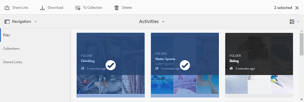
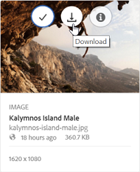
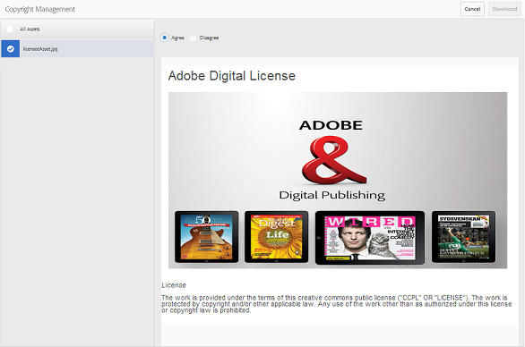
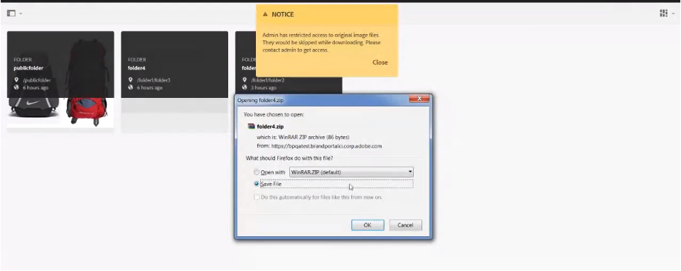
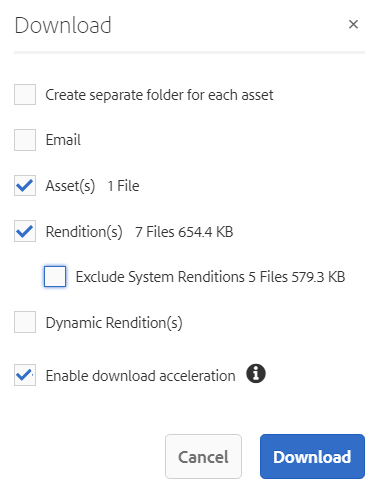
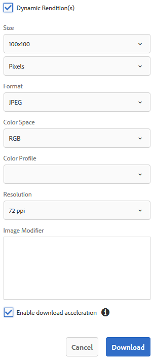

# Scaricare le risorse {#download-assets}

<!-- Before update in Download experience - 26th Aug 2020 by Vishabh.
 All users can simultaneously download multiple assets and folders accessible to them from Brand Portal. This way, approved brand assets can be securely distributed for offline use. Read on to know how to download approved assets from Brand Portal, and what to expect from the [download performance](../using/brand-portal-download-users.md#main-pars-header).
-->

Adobe Experience Manager Assets Brand Portal ottimizza l’esperienza di download consentendo agli utenti di scaricare simultaneamente più risorse e cartelle accessibili da Brand Portal. In questo modo, le risorse del marchio approvate possono essere distribuite in modo sicuro per l&#39;utilizzo offline. Continua a leggere per scoprire come scaricare le risorse approvate dal Brand Portal e cosa aspettarsi dalle prestazioni [di](../using/brand-portal-download-users.md#expected-download-performance)download.

>[!NOTE]
>
>Installate IBM Aspera Connect 3.9.9 nell’estensione del browser prima di scaricare le risorse dal Brand Portal.

<!--
**Types of renditions in Brand Portal:**

* Original asset rendition

  It is the original binary of the asset uploaded in AEM Assets. 
  
  
* System renditions

  These are the thumbnail renditions which are automatically generated in AEM Assets based on the "DAM update asset" workflow. 
  
* Custom renditions

  These are the additional renditions that an asset might have and its dynamic renditions. Any user can create additional custom renditions, whereas, only the AEM administrator can create dynamic renditions of an image in AEM Assets. To know more, see [how to apply image presets or dynamic renditions](../using/brand-portal-image-presets.md).     
-->

## Configurare il download delle risorse {#configure-download}

La configurazione di download consente agli amministratori di Brand Portal di definire il set di rappresentazioni disponibili per gli utenti di Brand Portal per il download delle risorse. L’amministratore può configurare le impostazioni di **[!UICONTROL download]** delle risorse dall’interfaccia Brand Portal.

Le configurazioni disponibili sono:

* **[!UICONTROL Download veloce]**

   Abilita il download ad alta velocità delle risorse. Per ulteriori informazioni, consulta [la guida per accelerare i download dal Brand Portal](../using/accelerated-download.md).

* **[!UICONTROL Rappresentazioni personalizzate]**

   Scaricate rappresentazioni personalizzate e (o) dinamiche delle risorse.
Tutte le rappresentazioni di risorse diverse dalla risorsa originale e dalle rappresentazioni generate dal sistema sono denominate come rappresentazioni personalizzate. Include rappresentazioni statiche e dinamiche disponibili per la risorsa. Ogni utente può creare una rappresentazione statica personalizzata in  AEM Assets, mentre solo l&#39;amministratore AEM può creare rappresentazioni dinamiche personalizzate. Per ulteriori informazioni, vedere [come applicare i predefiniti per immagini o le rappresentazioni dinamiche](../using/brand-portal-image-presets.md)

* **[!UICONTROL Rappresentazioni di sistema]**

   Scaricate le rappresentazioni delle risorse generate dal sistema. Queste sono le miniature generate automaticamente in  AEM Assets in base al flusso di lavoro &quot;DAM update asset&quot; (Risorsa di aggiornamento DAM).

Accedi al tenant del Brand Portal come amministratore e passa a **[!UICONTROL Strumenti]** > **[!UICONTROL Scarica]**. Per impostazione predefinita, la configurazione Download **** rapido è abilitata nelle impostazioni **[!UICONTROL di]** download.

Gli amministratori possono abilitare qualsiasi combinazione per configurare il processo di download delle risorse.

In base alla configurazione, il flusso di lavoro di download rimane costante per le risorse autonome, per più risorse, per le cartelle contenenti risorse, per le risorse con licenza o senza licenza e per il download delle risorse tramite il collegamento di condivisione.

* Se sono disattivate sia le rappresentazioni **[!UICONTROL personalizzate che le rappresentazioni]** di **** sistema, le rappresentazioni originali delle risorse vengono scaricate senza che agli utenti venga visualizzata alcuna finestra di dialogo aggiuntiva.

<!--
If all the three download configurations are turned-off, or only the **[!UICONTROL Fast Download]** configuration is enabled, the original assets are directly downloaded on your local system with no additional step required. 
-->

* Se è abilitata una qualsiasi configurazione di rappresentazioni **** personalizzate o rappresentazioni **[!UICONTROL di]** sistema, viene visualizzata un&#39;ulteriore finestra di dialogo **[!UICONTROL Download]** in cui potete scegliere se scaricare la risorsa originale insieme alle relative rappresentazioni oppure scaricare solo rappresentazioni specifiche.

>[!NOTE]
>
>Solo gli amministratori possono scaricare le risorse scadute. Per ulteriori informazioni sulle risorse scadute, consultate [Gestione dei diritti digitali delle risorse](../using/manage-digital-rights-of-assets.md).

## Passaggi per scaricare le risorse {#steps-to-download-assets}

Di seguito sono riportati i passaggi per scaricare risorse o cartelle contenenti risorse da Brand Portal:

1. Dall’interfaccia Brand Portal, effettuate una delle seguenti operazioni:

   * Selezionate le cartelle o le risorse da scaricare. Dalla barra degli strumenti nella parte superiore, fate clic sull&#39;icona **[!UICONTROL Scarica]** .

      

   * Per scaricare una risorsa o una cartella specifica, passate il puntatore del mouse sulla risorsa o sulla cartella e fate clic sull’icona **[!UICONTROL Scarica]** disponibile nelle miniature delle azioni rapide.

      

      >[!NOTE]
      >
      >Se state scaricando le risorse per la prima volta e non disponete di IBM Aspera Connect installato nel browser, vi verrà richiesto di installare l’acceleratore di download di Aspera.

      >[!NOTE]
      >
      >Se le risorse che state scaricando includono anche risorse con licenza, viene nuovamente visualizzata la pagina Gestione **** copyright. In questa pagina, selezionate le risorse, fate clic su **[!UICONTROL Accetto]** e quindi su **[!UICONTROL Scarica]**. Se scegliete di non essere d’accordo, le risorse con licenza non vengono scaricate.
      > 
      >Alle risorse protette da licenza è associato [un contratto di](https://helpx.adobe.com/experience-manager/6-5/assets/using/drm.html#DigitalRightsManagementinAssets) licenza, che viene fatto impostando la proprietà  metadati della risorsa in  risorse di Experience Manager.

      

      Se una qualsiasi delle rappresentazioni **** personalizzate o delle rappresentazioni **[!UICONTROL di]** sistema è abilitata nelle impostazioni **[!UICONTROL di]** download, viene visualizzata la finestra di dialogo **[!UICONTROL Scarica]** con la casella di controllo **[!UICONTROL Risorse]** selezionata per impostazione predefinita. Se è abilitata la configurazione di download **** rapido, per impostazione predefinita viene selezionata la casella di controllo **[!UICONTROL Abilita accelerazione]** download.

      

      >[!NOTE]
      >
      >Se le risorse scaricate sono file di immagine e selezionate solo la casella di controllo **[!UICONTROL Risorse]** nella finestra di dialogo **[!UICONTROL Scarica]** ma non [autorizzate dall’amministratore ad accedere alle rappresentazioni originali dei file](../using/brand-portal-adding-users.md#main-pars-procedure-202029708) immagine, non viene scaricato alcun file immagine e viene visualizzata una notifica in cui si informa che l’amministratore ha imposto delle restrizioni per accedere alle rappresentazioni originali.

      

1. Per scaricare le rappresentazioni oltre alle risorse originali, selezionate la casella di controllo **[!UICONTROL Rappresentazioni]** . Tuttavia, se desiderate scaricare le rappresentazioni generate dal sistema insieme alle rappresentazioni personalizzate, deselezionate la casella di controllo **[!UICONTROL Escludi rappresentazioni]** di sistema.

   

   * Per scaricare solo le rappresentazioni, deselezionate la casella di controllo **[!UICONTROL Risorse]** .

      >[!NOTE]
      >
      >Per impostazione predefinita, vengono scaricate solo le risorse. Tuttavia, le rappresentazioni originali dei file immagine non vengono scaricate se l’amministratore non [autorizza l’utente ad avere accesso alle rappresentazioni originali dei file](../using/brand-portal-adding-users.md#main-pars-procedure-202029708)immagine.

   * Per condividere le risorse selezionate con altri utenti tramite un collegamento, selezionate la casella di controllo **[!UICONTROL E-mail]** . Viene inviata agli utenti una notifica e-mail con il collegamento per il download. Per informazioni su come scaricare le risorse dai collegamenti condivisi, consultate [Download delle risorse dai collegamenti](../using/brand-portal-link-share.md#main-pars-header-1703469193)condivisi.

      

      >[!NOTE]
      >
      >Il collegamento di download nella notifica e-mail scade dopo 45 giorni.
      >
      >Gli amministratori possono personalizzare i messaggi e-mail, vale a dire logo, descrizione e piè di pagina, utilizzando la funzione [Branding](../using/brand-portal-branding.md) .

   * Potete selezionare un predefinito per immagini predefinito o creare una rappresentazione dinamica personalizzata dalla finestra di dialogo **[!UICONTROL Scarica]** .

      Per applicare un predefinito immagine [personalizzato alla risorsa e alle relative rappresentazioni](../using/brand-portal-image-presets.md#applyimagepresetswhendownloadingimages), selezionate la casella di controllo Rappresentazioni **[!UICONTROL dinamiche]** . Specificate le proprietà del predefinito per immagini (come dimensione, formato, spazio colore, risoluzione e modificatore di immagini) per applicare il predefinito per immagini personalizzato durante il download della risorsa e delle relative rappresentazioni. Per scaricare solo le rappresentazioni dinamiche, deselezionate la casella di controllo **[!UICONTROL Risorse]** .

      

      >[!NOTE]
      >
      >Brand Portal supporta la configurazione di Dynamic Media sia in modalità Hybird che Scene7.
      >
      >(*se l’istanza AEM (Autore) è in esecuzione in modalità&#x200B;**ibrida***elemento multimediale dinamico)      >Per visualizzare in anteprima o scaricare le rappresentazioni dinamiche di una risorsa, accertatevi che l’elemento multimediale dinamico sia attivato e che la rappresentazione a comparsa piramidale della risorsa sia disponibile nell’istanza di creazione  AEM Assets da cui sono state pubblicate le risorse. Quando una risorsa viene pubblicata nel Portale marchio, viene pubblicata anche la relativa rappresentazione a forma di poligono piramidale.

   * Per mantenere la gerarchia delle cartelle del Portale marchio durante il download delle risorse, selezionate la casella di controllo **[!UICONTROL Crea cartella separata per ciascuna risorsa]** . Per impostazione predefinita, la gerarchia delle cartelle di Brand Portal viene ignorata e tutte le risorse vengono scaricate in una cartella del sistema locale.

1. Fate clic su **[!UICONTROL Scarica]**.

   Le risorse (e le rappresentazioni, se selezionate) vengono scaricate come file ZIP nella cartella locale. Tuttavia, non viene creato alcun file ZIP se viene scaricata una singola risorsa senza alcuna rappresentazione.

   Se non siete [autorizzati dall’amministratore ad accedere alle rappresentazioni](../using/brand-portal-adding-users.md#main-pars-procedure-202029708)originali, le rappresentazioni originali delle risorse selezionate non vengono scaricate.

   >[!NOTE]
   >
   >Le risorse che vengono scaricate singolarmente sono visibili nel rapporto di download delle risorse. Tuttavia, se viene scaricata una cartella contenente delle risorse, la cartella e le risorse non vengono visualizzate nel rapporto di download delle risorse.

## Prevista prestazioni di download {#expected-download-performance}

L&#39;esperienza di download dei file può variare per gli utenti che si trovano in posizioni client diverse, a seconda di fattori quali la connettività Internet locale e la latenza del server. Le prestazioni di download previste per il file da 2 GB, osservate in diverse posizioni dei client, sono le seguenti:

| Posizione client | Latenza tra client e server | Velocità di download prevista | Tempo impiegato per scaricare un file da 2 GB |
|-------------------------|-----------------------------------|-------------------------|------------------------------------|
| USA occidentale (N. California) | 18 millisecondi | 7,68 MB/s | 4 minuti |
| USA occidentale (Oregon) | 42 millisecondi | 3,84 MB/s | 9 minuti |
| USA orientale (N. Virginia) | 85 millisecondi | 1,61 MB/s | 21 minuti |
| APAC (Tokyo) | 124 millisecondi | 1,13 MB/s | 30 minuti |
| Noida | 275 millisecondi | 0,5 MB/s | 68 minuti |
| Sydney | 175 millisecondi | 0,49 MB/s | 69 minuti |
| Londra | 179 millisecondi | 0,32 MB/s | 106 minuti |
| Singapore | 196 millisecondi | 0,5 MB/s | 68 minuti |

>[!NOTE]
>
>I dati citati sono osservati in condizioni di test, che possono variare per gli utenti in diverse aree, a causa di latenza e larghezza di banda variabili.

