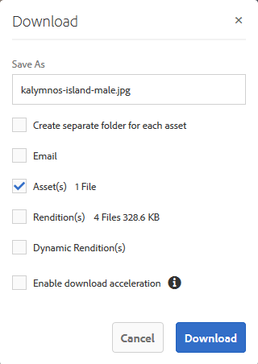
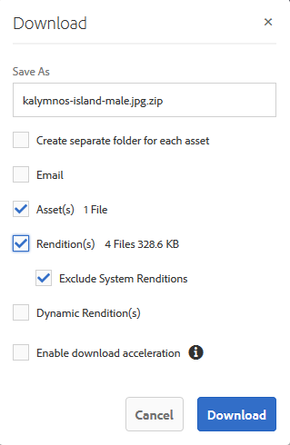

# Scaricare le risorse {#download-assets}

Tutti gli utenti possono scaricare simultaneamente più risorse e cartelle accessibili da Brand Portal. In questo modo, le risorse del marchio approvate possono essere distribuite in modo sicuro per l'utilizzo offline. Continua a leggere per scoprire come scaricare le risorse approvate dal Brand Portal e cosa aspettarsi dalle prestazioni [di](../using/brand-portal-download-users.md#main-pars-header)download.

>[!NOTE]
>
>Solo gli amministratori possono scaricare le risorse scadute. Per ulteriori informazioni sulle risorse scadute, consultate [Gestire i diritti digitali delle risorse](../using/manage-digital-rights-of-assets.md).

## Passaggi per scaricare le risorse {#steps-to-download-assets}

Per scaricare risorse o cartelle contenenti risorse per Brand Portal, effettuate le seguenti operazioni:

1. Dall’interfaccia Brand Portal, effettuate una delle seguenti operazioni:

   * Selezionate le cartelle o le risorse da scaricare. Dalla barra degli strumenti nella parte superiore, fate clic sull'icona **[!UICONTROL Scarica]** .
   

   * Per scaricare una singola cartella o risorsa, passate il puntatore del mouse sulla cartella o sulla risorsa. Dalle miniature delle azioni rapide disponibili, fai clic sull’icona **[!UICONTROL Scarica]** .
   

   >[!NOTE]
   >
   >Se le risorse che state scaricando includono anche risorse con licenza, viene nuovamente visualizzata la pagina Gestione **** copyright. In questa pagina, selezionate le risorse, fate clic su **[!UICONTROL Accetto]** e quindi su **[!UICONTROL Scarica]**. Se scegliete di non essere d’accordo, le risorse con licenza non vengono scaricate.\
   >Alle risorse protette da licenza è associato [un contratto di](https://helpx.adobe.com/experience-manager/6-5/assets/using/drm.html#DigitalRightsManagementinAssets) licenza, che viene fatto impostando la proprietà  metadati della risorsa in AEM Assets.

   

   Viene visualizzata la finestra di dialogo **[!UICONTROL Scarica]** con l’opzione **[!UICONTROL Risorse]** selezionata per impostazione predefinita.

   

   >[!NOTE]
   >
   >Se le risorse che state scaricando sono file di immagine e selezionate solo l’opzione **[!UICONTROL Risorse]** nella finestra di dialogo Download ma non sono [autorizzati dall’amministratore ad accedere alle rappresentazioni originali dei file](../using/brand-portal-adding-users.md#main-pars-procedure-202029708) immagine, non vengono scaricati file immagine e viene visualizzato un messaggio di avviso in cui si informa che l’amministratore ha imposto delle restrizioni per accedere alle rappresentazioni originali.

   

1. Per scaricare le rappresentazioni delle risorse oltre alle risorse, selezionate **[!UICONTROL Rappresentazioni]**. Tuttavia, per consentire il download delle rappresentazioni generate automaticamente insieme alle rappresentazioni personalizzate, deselezionate **[!UICONTROL Escludi rappresentazioni]** generate automaticamente, selezionata per impostazione predefinita.

   

   Per scaricare solo le rappresentazioni, deselezionate **[!UICONTROL Risorse]**.

   >[!NOTE]
   >
   >Per impostazione predefinita, vengono scaricate solo le risorse. Tuttavia, le rappresentazioni originali dei file immagine non vengono scaricate se l’amministratore non [autorizza l’utente ad accedere alle rappresentazioni originali dei file](../using/brand-portal-adding-users.md#main-pars-procedure-202029708)immagine.

   * Per accelerare il download dei file di risorse da Brand Portal, selezionate **[!UICONTROL Abilita accelerazione]** download e [seguite la procedura guidata](../using/accelerated-download.md#main-pars-header-405749062). Per ulteriori informazioni su come scaricare più rapidamente le risorse, consulta la [guida per accelerare i download dal Brand Portal](../using/accelerated-download.md).

   * Per applicare un predefinito immagine [personalizzato alla risorsa e alle relative rappresentazioni](../using/brand-portal-image-presets.md#applyimagepresetswhendownloadingimages), selezionate Rappresentazioni **[!UICONTROL dinamiche]**. Specificate le proprietà dei predefiniti per immagini (dimensioni, formato, spazio colore, risoluzione e modificatore di immagini) per applicare il predefinito per immagini personalizzato durante il download della risorsa e delle relative rappresentazioni. Per scaricare solo le rappresentazioni dinamiche, eliminate **[!UICONTROL le risorse]**.
   

   >[!NOTE]
   >
   >Per visualizzare in anteprima (o scaricare) le rappresentazioni dinamiche di qualsiasi risorsa, accertati che il supporto dinamico sia abilitato e che la rappresentazione a forma di poligono piramidale della risorsa esista nell’istanza di creazione di AEM, da cui sono state pubblicate le risorse. Quando una risorsa viene pubblicata nel Portale marchio, viene pubblicata anche la relativa rappresentazione a forma di poligono piramidale. Non è possibile generare la rappresentazione a forma di piramide da Brand Portal.

   * Per mantenere la gerarchia delle cartelle del Portale marchio durante il download delle risorse, selezionate **[!UICONTROL Crea cartella separata per ciascuna risorsa]**. Per impostazione predefinita, la gerarchia delle cartelle di Brand Portal viene ignorata e tutte le risorse vengono scaricate in una cartella del sistema locale.

   * Per inviare una notifica e-mail agli utenti con un collegamento per scaricare le risorse, selezionate **[!UICONTROL E-mail]**.
   

   >[!NOTE]
   >
   >Il collegamento per il download delle notifiche e-mail scade dopo 45 giorni.
   >
   >Gli amministratori possono personalizzare i messaggi e-mail, vale a dire il logo, la descrizione e il piè di pagina, utilizzando la funzione [Branding](../using/brand-portal-branding.md) .

1. Fate clic su **[!UICONTROL Scarica]**.

   Le risorse (e le rappresentazioni, se selezionate) vengono scaricate come file ZIP nella cartella locale. Tuttavia, non viene creato alcun file ZIP se viene scaricata una singola risorsa senza alcuna rappresentazione, garantendo così un download rapido.

   Le rappresentazioni originali delle risorse selezionate non vengono scaricate se l’amministratore non [consente di accedere alle rappresentazioni](../using/brand-portal-adding-users.md#main-pars-procedure-202029708)originali.

   >[!NOTE]
   >
   >Le risorse selezionate singolarmente e scaricate sono visibili nel rapporto sulle risorse scaricate. Tuttavia, se viene scaricata una cartella contenente delle risorse, nel rapporto delle risorse scaricate non vengono visualizzate né la cartella né le risorse.

   Per informazioni su come scaricare le risorse dai collegamenti condivisi, consultate [Download delle risorse dai collegamenti](../using/brand-portal-link-share.md#main-pars-header-1703469193)condivisi.

## Prevista prestazioni di download {#expected-download-performance}

L'esperienza di download dei file può variare per gli utenti che si trovano in posizioni client diverse, a seconda di fattori quali la connettività Internet locale e la latenza del server. Le prestazioni di download previste per il file da 2 GB, osservate in diverse posizioni dei client, sono le seguenti:

| Posizione client | Latenza tra client e server | Velocità di download prevista | Tempo impiegato per scaricare un file da 2 GB |
|-------------------------|-----------------------------------|-------------------------|------------------------------------|
| USA occidentale (N. California) | 18 millisecondi | 7,68 MB/s | 4 minuti |
| USA occidentale (Oregon) | 42 millisecondi | 3,84 MB/s | 9 minuti |
| USA orientale (N. Virginia) | 85 millisecondi | 1,61 MB/s | 21 minuti |
| APAC (Tokyo) | 124 millisecondi | 1,13 MB/s | 30 minuti |
| Noida | 275 millisecondi | 0,5 MB/s | 68 minuti |
| Sydney | 175 millisecondi | 0,49 MB/s | 69 minuti |
| Londra | 179 millisecondi | 0,32 MB/s | 106 minuti |
| Singapore | 196 millisecondi | 0,5 MB/s | 68 minuti |

**Nota**: I dati citati sono osservati in condizioni di test, che possono variare per gli utenti in diverse aree, a causa di latenza e larghezza di banda variabili.
