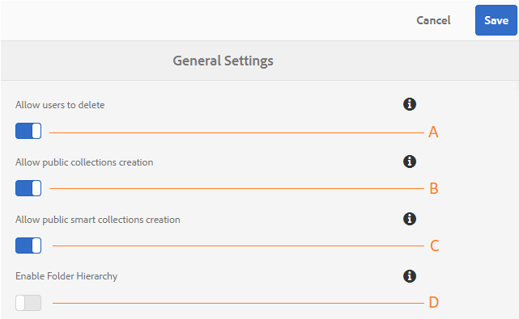

# Amministrare le configurazioni tenant generali {#administer-general-tenant-configurations}

 AEM Assets Brand Portal consente alle organizzazioni di configurare le seguenti funzionalità per tenant specifici:

* Eliminazione delle risorse da parte degli amministratori
* Creazione di raccolte pubbliche da parte di utenti non amministratori
* Creazione di raccolte smart pubbliche da parte di utenti non amministratori
* Gerarchia principale delle cartelle condivise visibile agli utenti non amministratori

Queste configurazioni sono state fornite come configurazioni **[!UICONTROL Impostazioni]** generali nel pannello degli strumenti amministrativi.

**Configurazione per** consentire agli amministratori di eliminare le risorse dal Brand Portal. (Il valore predefinito è attivato)

**B** Configurazione per consentire agli utenti non amministratori di creare raccolte pubbliche. (Il valore predefinito è attivato)

**C** Configurazione per consentire agli utenti non amministratori di creare raccolte smart pubbliche. (Il valore predefinito è attivato)

**D** Configurazione per visualizzare la gerarchia delle cartelle (dalla radice) delle cartelle condivise a utenti non amministratori (editor, visualizzatori, utenti ospiti). (Il valore predefinito è disabilitato)

## Attiva/Disattiva configurazioni generali {#enable-disable-general-configurations}

Per attivare/disattivare ciascuna delle seguenti configurazioni:

1. Effettuate l&#39;accesso con i privilegi di amministratore.
1. Selezionate il logo AEM per accedere agli strumenti amministrativi, dalla barra degli strumenti nella parte superiore.
1. Dal pannello degli strumenti di amministrazione, selezionate **[!UICONTROL Generale]** per aprire la pagina Impostazioni **** generali.
1. Utilizzate il rispettivo interruttore di attivazione/disattivazione per attivare o disattivare una qualsiasi delle configurazioni Generali.
1. **[!UICONTROL Salva le modifiche.]**
1. Disconnessione per rendere attive le modifiche.

## Consentire agli utenti amministratori di eliminare le risorse dal Brand Portal {#allow-admin-users-to-delete-assets-from-brand-portal}

**[!UICONTROL Consentire agli utenti di eliminare]** la configurazione consente alle organizzazioni di consentire (o limitare) agli utenti con privilegi di amministratore di eliminare risorse e cartelle dal Brand Portal.

## Consenti creazione raccolte pubbliche da parte di utenti non amministratori {#allow-public-collections-creation-by-non-admins}

[[!UICONTROL Consenti configurazione della creazione]](../using/brand-portal-share-collection.md#main-pars-text-1915052376) delle raccolte pubbliche controlla se i non amministratori possono creare raccolte pubbliche sul portale di marchio. La configurazione è abilitata per impostazione predefinita. Disattivando le organizzazioni di configurazione è possibile impedire l&#39;utilizzo di numerose raccolte pubbliche sul proprio portale, in modo da poter risparmiare spazio sul sistema.

## Consenti creazione di raccolte smart pubbliche da parte di utenti non amministratori {#allow-public-smart-collections-creation-by-non-admins}

[[!UICONTROL Consenti configurazione di creazione]](../using/brand-portal-searching.md#main-pars-header-500620467) raccolte intelligenti pubbliche controlla se gli utenti non amministratori possono salvare le ricerche come raccolte intelligenti e renderle pubbliche per quel tenant. La configurazione è abilitata per impostazione predefinita. Disattivando le organizzazioni di configurazione è possibile impedire che un numero enorme di raccolte pubbliche intelligenti create da utenti non amministratori nel Brand Portal dell&#39;organizzazione.

<!-- 
## Allow download acceleration {#allow-download-acceleration}

[[!UICONTROL Allow download acceleration]](../using/accelerated-download.md) configuration lets the organizations to allow accelerated downloads of assets from Brand Portal and shared links, by integrating with IBM Aspera Connect that is an install-on-demand application. The application uses proprietary technology to remove TCP overheads.
-->

## Abilita gerarchia cartelle {#enable-folder-hierarchy}

[[!UICONTROL Attiva configurazione gerarchia]](../using/brand-portal-sharing-folders.md#non-admin-user-access-to-shared-folders) cartelle consente agli amministratori di controllare in che modo gli utenti non amministratori (editor, visualizzatori e utenti ospiti) vedono le cartelle condivise dopo l’accesso.
