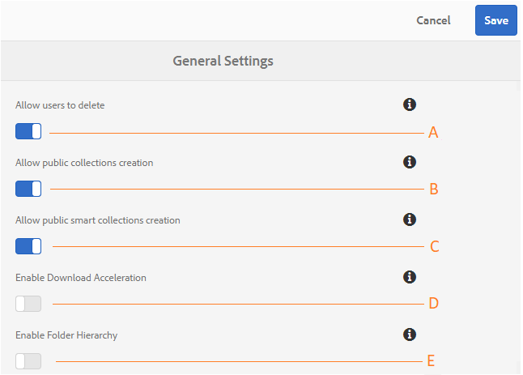

# Amministra configurazioni tenant generali {#administer-general-tenant-configurations}

[!DNL AEM] Risorse [!DNL Brand Portal] consente alle organizzazioni di configurare le seguenti funzionalità per tenant specifico:

* Eliminazione delle risorse per amministratori
* Creazione di [!UICONTROL raccolte] pubbliche da parte di utenti non amministratori
* Creazione di [!UICONTROL raccolte] smart pubblica da parte di utenti non amministratori
* Accelerazione download
* Gerarchia principale di cartelle condivise visibili agli utenti non amministratori

Queste configurazioni sono state fornite come **configurazioni Impostazioni** generali nel pannello Strumenti di amministrazione.

**** Configurazione per consentire agli amministratori di eliminare le risorse [!DNL Brand Portal]. (Il valore predefinito è abilitato)

**Configurazione B** per consentire agli utenti non amministratori di creare [!UICONTROL raccolte pubbliche]. (Il valore predefinito è abilitato)

**Configurazione C** per consentire agli utenti non amministratori di creare raccolte smart [!UICONTROL pubbliche]. (Il valore predefinito è abilitato)

**Configurazione D** per consentire l'accelerazione di download delle risorse scaricate dal portale e dai collegamenti condivisi. (Il valore predefinito è disattivato)

**Configurazione E** consente di visualizzare la gerarchia delle cartelle (dalla principale) di cartelle condivise agli utenti non amministratori (Editor, Visualizzatori, Utenti ospiti). (Il valore predefinito è disattivato)

## Attivare/Disattivare configurazioni Generali {#enable-disable-general-configurations}

Per attivare/disattivare ciascuna configurazione:

1. Accedete con i privilegi di amministratore.
2. Selezionate il [!DNL AEM] logo per accedere agli strumenti di amministrazione, dalla barra degli strumenti in alto.
3. Dal pannello Strumenti di amministrazione, selezionate **Generale** per aprire la **pagina Impostazioni** generali.
4. Usate il rispettivo interruttore di attivazione/disattivazione per attivare o disattivare una qualsiasi delle configurazioni Generali.
5. **Salvate le modifiche.**
6. Disconnessione per rendere effettive le modifiche.

## Consenti agli utenti amministratore di eliminare le risorse da [!DNL Brand Portal]{#allow-admin-users-to-delete-assets-from-brand-portal}

**Consenti agli utenti di eliminare** la configurazione consente alle organizzazioni di consentire l'eliminazione di risorse e cartelle da parte degli utenti con diritti di amministratore [!DNL Brand Portal].

## Consentire la creazione di raccolte pubbliche da parte di non amministratori {#allow-public-collections-creation-by-non-admins}

[Consenti creazione [!UICONTROL raccolte]pubblica] (../using/brand-portal-share-[!UICONTROL collection]. md # main-pars-text -1915052376) controlla se i non amministratori possono creare [!UICONTROL raccolte pubbliche]su [!DNL Brand Portal]. La configurazione è attivata per impostazione predefinita. Disabilitando le organizzazioni di configurazione, potete impedire che siano presenti numerose [!UICONTROL raccolte pubbliche]sul portale, in modo che lo spazio del sistema possa essere salvato.

## Consentire la creazione di raccolte smart pubbliche da parte di non amministratori {#allow-public-smart-collections-creation-by-non-admins}

[La configurazione di creazione](../using/brand-portal-searching.md#main-pars-header-500620467) di raccolte smart pubblica controlla se i non amministratori possono salvare le proprie ricerche come [!UICONTROL raccolte intelligenti] e renderle pubbliche per quel tenant. La configurazione è attivata per impostazione predefinita. Disabilitando le organizzazioni di configurazione, è possibile evitare di avere un numero elevato di raccolte smart [!UICONTROL pubbliche] create da utenti non amministratori nell'organizzazione [!DNL Brand Portal].

## Consenti accelerazione download {#allow-download-acceleration}

[Consenti configurazione accelerazione](../using/accelerated-download.md) download consente alle organizzazioni di consentire download accelerati di risorse e [!DNL Brand Portal] collegamenti condivisi, integrando con IBM Aspera Connect che è un'applicazione install-on-demand. L'applicazione utilizza la tecnologia proprietaria per rimuovere gli overhead TCP.

## Abilita gerarchia cartelle {#enable-folder-hierarchy}

[Abilita configurazione gerarchia](../using/brand-portal-sharing-folders.md#non-admin-user-access-to-shared-folders) cartelle consente agli amministratori di controllare il modo in cui gli utenti non amministratori (Editor, Visualizzatori e Utenti ospiti) vedono le cartelle condivise dopo l'accesso.
