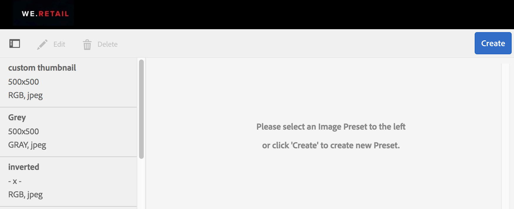
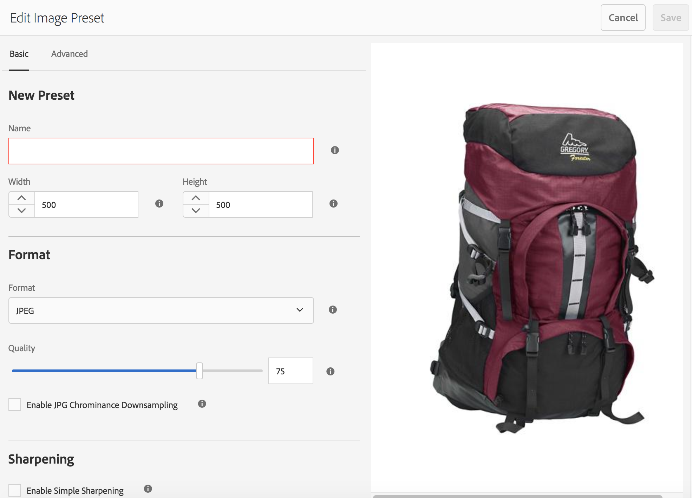
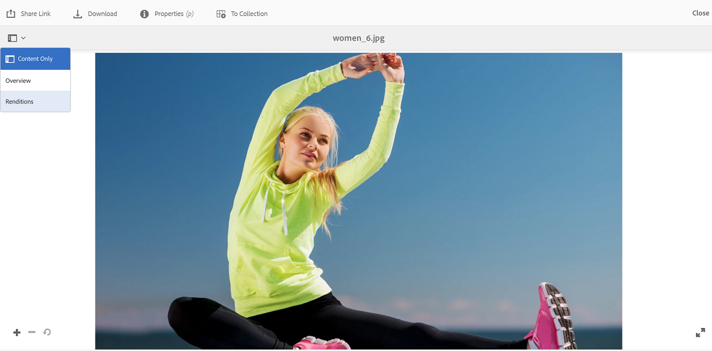
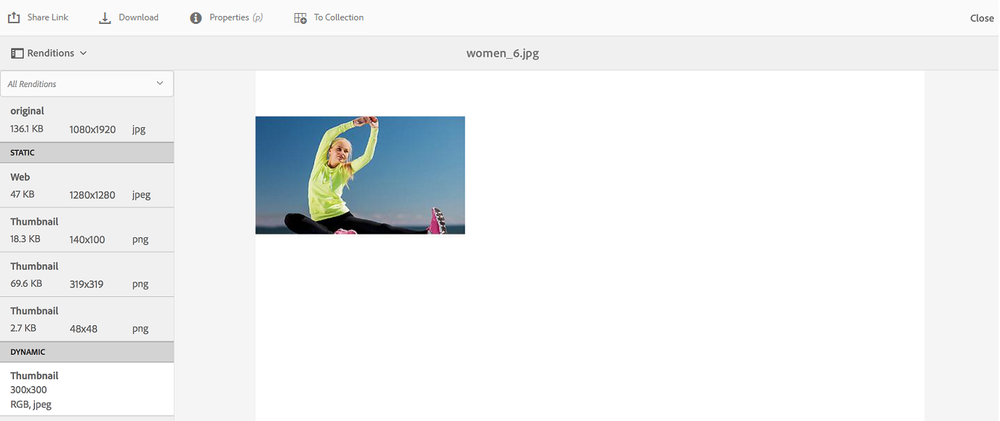
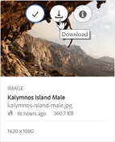
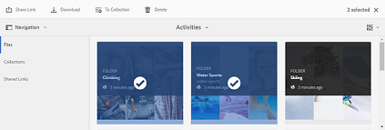

# Applicare predefiniti per immagini o rappresentazioni dinamiche {#apply-image-presets-or-dynamic-renditions}

Analogamente a una macro, un predefinito per immagini è una raccolta di comandi di ridimensionamento e formattazione predefiniti salvati con un nome. I predefiniti per immagini consentono a AEM Assets Brand Portal di distribuire in modo dinamico immagini di dimensioni, formati e proprietà diverse.

Un predefinito per immagini viene usato per generare rappresentazioni dinamiche di immagini che possono essere visualizzate in anteprima e scaricate. Quando visualizzate l'anteprima delle immagini e le relative rappresentazioni, potete scegliere un predefinito per riformattare le immagini in base alle specifiche impostate dall'amministratore.

Per visualizzare rappresentazioni dinamiche di una risorsa nel portale brand, accertatevi che la rappresentazione tiff piramidale esista nell'istanza di creazione AEM da dove effettuerete la pubblicazione sul portale marchio. Quando pubblicate la risorsa, la rappresentazione PTIFF viene pubblicata anche sul portale marchio. Non esiste modo di generare la rappresentazione PTIFF da Brand Portal.

>[!NOTE]
>
>Quando si scaricano le immagini e le relative rappresentazioni, non è possibile scegliere tra i predefiniti esistenti. Potete invece specificare le proprietà di un predefinito per immagini personalizzato. Per ulteriori informazioni, consultate [Applicare i predefiniti per immagini durante il download delle immagini](../using/brand-portal-image-presets.md#main-pars-text-1403412644).

Per ulteriori informazioni sui parametri richiesti durante la creazione dei predefiniti per immagini, consultate [Gestione dei predefiniti per immagini](https://docs.adobe.com/docs/en/AEM/6-0/administer/integration/dynamic-media/image-presets.html).

## Creare un predefinito per immagini {#create-an-image-preset}

Gli amministratori possono creare predefiniti per immagini che vengono visualizzati come rappresentazioni dinamiche nella pagina dei dettagli della risorsa. Potete creare un predefinito per immagini da zero o salvarne uno esistente con un nuovo nome. Quando create un predefinito per immagini, scegliete una dimensione per la distribuzione delle immagini e i comandi di formattazione. Quando un'immagine viene distribuita per la visualizzazione, l'aspetto viene ottimizzato in base ai comandi scelti.
Tenete presente che solo gli amministratori possono creare predefiniti per immagini in Brand Portal.

Tenete presente che solo gli amministratori possono creare predefiniti per immagini in Brand Portal.

>[!NOTE]
>
>Vengono create rappresentazioni dinamiche per le risorse per le quali è disponibile PTIFF. Pertanto, se una risorsa non dispone di rendering TIFF piramidale creata su AEM e pubblicata sul portale brand, è possibile esportare solo le rappresentazioni di sistema, ma le rappresentazioni dinamiche vengono presentate come un'opzione.
La modalità Ibrida Elemento multimediale dinamico deve essere attivata su AEM (Author) per creare tiff piramidale (ptiff) di una risorsa. Quando una risorsa viene pubblicata sul portale brand, i predefiniti per immagini vengono applicati e vengono visualizzate le rappresentazioni dinamiche.

1. Dalla barra degli strumenti AEM nella parte superiore, fate clic sul logo Adobe per accedere agli strumenti di amministrazione.

   

2. Dal pannello Strumenti di amministrazione, fate clic **[!UICONTROL su Predefiniti immagine]**.

   

3. Nella pagina Predefiniti immagine, fate clic su **[!UICONTROL Crea]**.

   

4. Nella pagina **[!UICONTROL Modifica predefinito]** immagine, inserite i valori nelle schede **[!UICONTROL Base]** e **[!UICONTROL Avanzate]** , compreso un nome. Le opzioni sono delineate nelle [opzioni dei predefiniti immagine](https://docs.adobe.com/docs/en/AEM/6-0/administer/integration/dynamic-media/image-presets.html#Image%20preset%20options). I predefiniti vengono visualizzati nel riquadro a sinistra e possono essere utilizzati al volo con altre risorse.

   

   >[!NOTE]
   >
   >Potete anche usare la pagina **[!UICONTROL Modifica predefinito]** immagine per modificare le proprietà di un predefinito esistente. Per modificare un predefinito per immagini, selezionatelo dalla pagina dei predefiniti immagine e fate clic **[!UICONTROL su Modifica]**.

5. Fai clic su **[!UICONTROL Salva]**. Il predefinito per immagini viene creato e visualizzato nella pagina dei predefiniti per immagini.
6. Per eliminare un predefinito per immagini, selezionatelo dalla pagina dei predefiniti immagine e fate clic **[!UICONTROL su Elimina]**. Nella pagina di conferma, fai clic **[!UICONTROL su Elimina]** per confermare l'eliminazione. Il predefinito per immagini viene rimosso dalla pagina dei predefiniti per immagini.

## Applicare predefiniti per immagini durante l'anteprima delle immagini {#apply-image-presets-when-previewing-images}

Quando visualizzate l'anteprima delle immagini e le relative rappresentazioni, scegliete tra i predefiniti esistenti per riformattare le immagini in base alle specifiche definite dall'amministratore.

1. Dall'interfaccia Brand Portal, fate clic su un'immagine per aprirla.
2. Fate clic sull'icona della sovrapposizione a sinistra, quindi scegliete **[!UICONTROL Rappresentazioni]**.

   

3. Nell'elenco **[!UICONTROL Rappresentazioni]** , selezionate la rappresentazione dinamica appropriata, ad esempio **[!UICONTROL Miniatura]**. Viene eseguito il rendering dell'immagine di anteprima in base alla vostra scelta.

   

## Applicare i predefiniti per immagini durante il download delle immagini {#apply-image-presets-when-downloading-images}

Quando scaricate immagini e le relative rappresentazioni da Brand Portal, non potete scegliere tra i predefiniti per immagini esistenti. Tuttavia, potete personalizzare le proprietà dei predefiniti immagine in base alle quali desiderate riformattare le immagini.

1. Dall'interfaccia Brand Portal, effettuate una delle seguenti operazioni:

   * Passate il puntatore sull'immagine da scaricare. Dalle miniature delle azioni rapide disponibili, fate clic sull'icona **[!UICONTROL Scarica]** .
   

   * Selezionate l'immagine da scaricare. Dalla barra degli strumenti in alto, fate clic sull'icona **[!UICONTROL Scarica]** .
   

2. Nella finestra **[!UICONTROL di]** dialogo Scarica, selezionate le opzioni richieste a seconda se desiderate scaricare la risorsa con o senza le relative rappresentazioni.

   

3. Per scaricare i rendering dinamici della risorsa, selezionate l' **** opzione Rappresentazioni dinamiche.
4. Potete personalizzare le proprietà dei predefiniti immagine in base alle quali desiderate riformattare l'immagine e le relative rappresentazioni in modo dinamico durante il download. Specificate le dimensioni, il formato, lo spazio colore, la risoluzione e il modificatore immagine.

   

5. Fate clic **[!UICONTROL su Scarica]**. Le rappresentazioni dinamiche personalizzate vengono scaricate in un file ZIP insieme all'immagine e alle rappresentazioni che hai scelto di scaricare. Tuttavia, non viene creato alcun file ZIP se viene scaricata una sola risorsa, per un download rapido.
