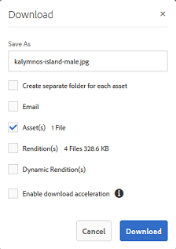
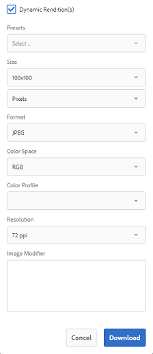

# Applicare predefiniti immagine o rappresentazioni dinamiche {#apply-image-presets-or-dynamic-renditions}

Come una macro, un predefinito immagine è una raccolta predefinita di comandi di ridimensionamento e formattazione salvati con un nome. I predefiniti per immagini consentono ad AEM Assets Brand Portal di distribuire dinamicamente immagini di dimensioni, formati e proprietà diversi.

Un predefinito per immagini consente di generare rappresentazioni dinamiche delle immagini che possono essere visualizzate in anteprima e scaricate. Quando visualizzi in anteprima le immagini e le relative rappresentazioni, puoi scegliere un predefinito per riformattare le immagini in base alle specifiche impostate dall’amministratore.

(*Se AEM’istanza di authoring è in esecuzione in **Modalità ibrida di Dynamic Media***) Per visualizzare le rappresentazioni dinamiche di una risorsa in Brand Portal, accertati che la relativa rappresentazione a forma di piramide esista nell’istanza di authoring AEM da dove pubblichi su Brand Portal. Quando pubblichi la risorsa, la relativa rappresentazione PTIFF viene pubblicata anche su Brand Portal.

>[!NOTE]
>
>Quando si scaricano le immagini e le relative rappresentazioni, non è possibile scegliere tra i predefiniti esistenti. È invece possibile specificare le proprietà di un predefinito immagine personalizzato. Per ulteriori informazioni, consulta [Applicare i predefiniti immagine durante il download di immagini](../using/brand-portal-image-presets.md#main-pars-text-1403412644).

Per ulteriori informazioni sui parametri richiesti durante la creazione dei predefiniti per immagini, consulta [Gestione dei predefiniti per immagini](https://docs.adobe.com/docs/en/AEM/6-0/administer/integration/dynamic-media/image-presets.html).

## Crea un predefinito immagine {#create-an-image-preset}

Gli amministratori AEM possono creare predefiniti per immagini da visualizzare come rappresentazioni dinamiche nella pagina dei dettagli della risorsa. Puoi creare un predefinito per immagini da zero o salvarne uno esistente con un nuovo nome. Quando crei un predefinito per immagini, scegli una dimensione per la distribuzione delle immagini e i comandi di formattazione. Quando un&#39;immagine viene distribuita per la visualizzazione, il suo aspetto viene ottimizzato in base ai comandi selezionati.

>[!NOTE]
>
>Le rappresentazioni dinamiche di un&#39;immagine vengono create utilizzando il relativo TIFF piramidale. Se il TIFF piramidale non è disponibile per alcuna risorsa, le rappresentazioni dinamiche per tale risorsa non possono essere recuperate in Brand Portal.
>
>Se AEM&#39;istanza di authoring è in esecuzione in modalità **Dynamic Media Hybrid**, le rappresentazioni TIFF piramidali delle risorse immagine vengono create e salvate nell&#39;archivio AEM.
>
>Se invece AEM&#39;istanza autore è in esecuzione in modalità **Dynamic Media Scene 7**, sul server Scene 7 esistono rappresentazioni TIFF piramidali delle risorse immagine.
>
>Quando tali risorse vengono pubblicate su Brand Portal, vengono applicati i predefiniti immagine e vengono visualizzate le rappresentazioni dinamiche.

1. Dalla barra degli strumenti AEM in alto, fai clic sul logo Adobe per accedere agli strumenti amministrativi.

1. Dal pannello degli strumenti amministrativi, fai clic su **[!UICONTROL Predefiniti immagini]**.

   

1. Nella pagina dei predefiniti immagine, fai clic su **[!UICONTROL Crea]**.

   

1. Nella pagina **[!UICONTROL Modifica predefinito immagine]**, immetti i valori desiderati nelle schede **[!UICONTROL Base]** e **[!UICONTROL Avanzate]**, compreso un nome. Le opzioni sono descritte in [Opzioni Preimpostazione immagine](https://docs.adobe.com/docs/en/AEM/6-0/administer/integration/dynamic-media/image-presets.html#Image%20preset%20options). I predefiniti vengono visualizzati nel riquadro a sinistra e possono essere usati all’istante con altre risorse.

   

   >[!NOTE]
   >
   >È inoltre possibile utilizzare la pagina **[!UICONTROL Modifica predefinito immagine]** per modificare le proprietà di un predefinito immagine esistente. Per modificare un predefinito immagine, selezionalo dalla pagina dei predefiniti immagine e fai clic su **[!UICONTROL Modifica]**.

1. Fai clic su **[!UICONTROL Salva]**. Il predefinito per immagini viene creato e visualizzato nella pagina dei predefiniti per immagini .
1. Per eliminare un predefinito immagine, selezionalo dalla pagina dei predefiniti immagine e fai clic su **[!UICONTROL Elimina]**. Nella pagina di conferma, fai clic su **[!UICONTROL Elimina]** per confermare l’eliminazione. Il predefinito per immagini viene rimosso dalla pagina dei predefiniti per immagini .

## Applica i predefiniti immagine durante l&#39;anteprima delle immagini {#apply-image-presets-when-previewing-images}

Quando visualizzi in anteprima le immagini e le relative rappresentazioni, scegli tra i predefiniti esistenti per riformattare le immagini in base alle specifiche impostate dall’amministratore.

1. Dall’interfaccia di Brand Portal, fai clic su un’immagine per aprirla.
1. Fai clic sull&#39;icona di sovrapposizione a sinistra e scegli **[!UICONTROL Rappresentazioni]**.

   

1. Dall’elenco **[!UICONTROL Rendering]**, seleziona il rendering dinamico appropriato, ad esempio **[!UICONTROL Miniatura]**. Il rendering dell’immagine di anteprima si basa sulla scelta del rendering.

   

## Applica i predefiniti immagine durante il download delle immagini {#apply-image-presets-when-downloading-images}

Quando si scaricano immagini e le relative rappresentazioni da Brand Portal, non è possibile scegliere tra i predefiniti per immagini esistenti. Tuttavia, è possibile personalizzare le proprietà dei predefiniti immagine in base alle quali si desidera riformattare le immagini.

1. Dall’interfaccia di Brand Portal, effettua una delle seguenti operazioni:

   * Passa il puntatore sull&#39;immagine da scaricare. Dalle miniature delle azioni rapide disponibili, fai clic sull&#39;icona **[!UICONTROL Scarica]** .

   

   * Seleziona l&#39;immagine da scaricare. Dalla barra degli strumenti nella parte superiore, fai clic sull&#39;icona **[!UICONTROL Scarica]** .

   

1. Dalla finestra di dialogo **[!UICONTROL Scarica]**, seleziona le opzioni richieste a seconda che desideri scaricare la risorsa con o senza le relative rappresentazioni.

   

1. Per scaricare le rappresentazioni dinamiche della risorsa, seleziona l’opzione **[!UICONTROL Rendering dinamico]** .
1. Personalizza le proprietà del predefinito immagine in base alle quali desideri riformattare dinamicamente l&#39;immagine e le relative rappresentazioni durante il download. Specifica le dimensioni, il formato, lo spazio colore, la risoluzione e il modificatore di immagine.

   

1. Fai clic su **[!UICONTROL Scarica]**. Le rappresentazioni dinamiche personalizzate vengono scaricate in un file ZIP insieme all&#39;immagine e alle rappresentazioni che hai scelto di scaricare. Tuttavia, se viene scaricata una singola risorsa non viene creato alcun file zip, il che assicura un download rapido.
