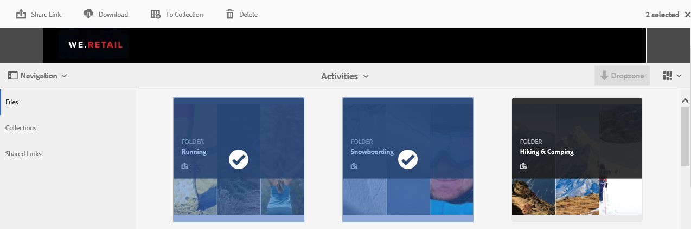
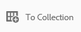
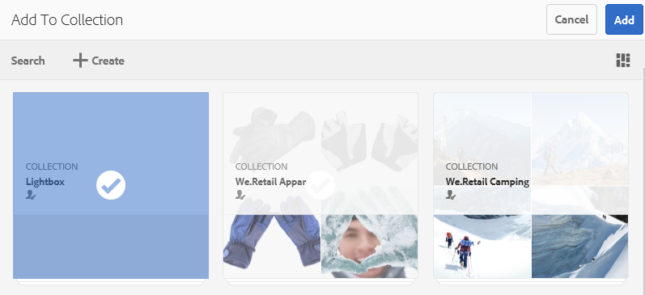
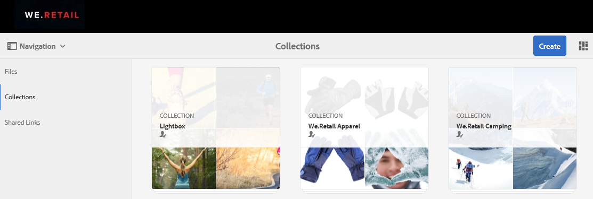
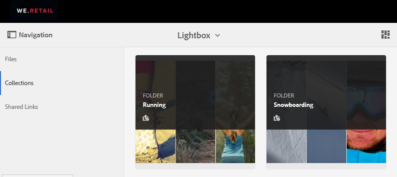
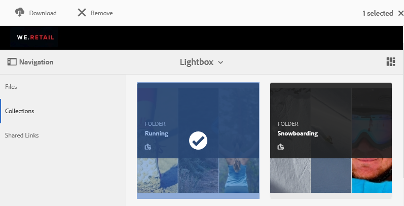

# Gestire la raccolta Lightbox {#manage-the-lightbox-collection}

**** Lightbox è un tipo speciale di raccolta che consente di accedere facilmente alle risorse. Ogni utente dispone di un **[!UICONTROL Lightbox]** esclusivo che viene creato automaticamente al primo accesso al Portale marchio. Impossibile eliminare la raccolta **[!UICONTROL Lightbox]**.

## Aggiungere risorse a lightbox {#add-assets-to-lightbox}

Per aggiungere risorse a **[!UICONTROL Lightbox]**, effettuate le seguenti operazioni:

1. Andate alla posizione delle risorse che desiderate aggiungere a **[!UICONTROL Lightbox]** e selezionate le risorse.

   

1. Dalla barra degli strumenti nella parte superiore, fate clic sull&#39;icona Aggiungi alla raccolta.

   

1. Nella pagina **[!UICONTROL Aggiungi alla raccolta]**, per impostazione predefinita viene selezionata la raccolta **[!UICONTROL Lightbox]**.

   Fate clic su **[!UICONTROL Aggiungi]**. Le risorse selezionate vengono aggiunte alla **[!UICONTROL Lightbox]**.

   

1. Per esaminare le risorse aggiunte a **[!UICONTROL Lightbox]**, fate clic su **[!UICONTROL Raccolte]** nella parte sinistra, quindi fate clic sulla raccolta **[!UICONTROL Lightbox]**.

   

   Le risorse aggiunte a **[!UICONTROL Lightbox]** vengono visualizzate nella pagina **[!UICONTROL Lightbox]**.

   

## Rimuovere risorse da lightbox {#remove-assets-from-lightbox}

1. Per esaminare le risorse in [!UICONTROL Lightbox], fare clic su **[!UICONTROL Raccolte]** nella barra a sinistra, quindi fare clic sulla raccolta [!UICONTROL Lightbox].

   

1. Selezionate la cartella che desiderate rimuovere dalla raccolta, quindi fate clic su **[!UICONTROL Remove]** nella barra degli strumenti nella parte superiore.

   

1. Nella finestra del messaggio di avviso, fare clic su **[!UICONTROL Rimuovi]** per confermare la rimozione.

La cartella viene eliminata dalla raccolta **[!UICONTROL Lightbox]**.
