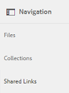
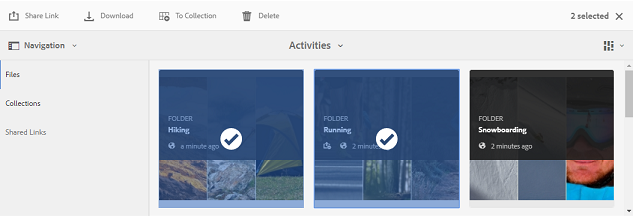
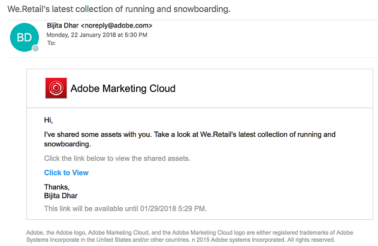
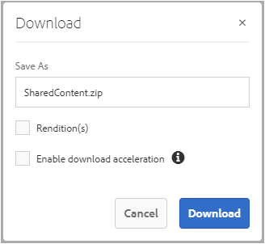
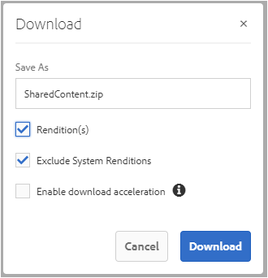

# Condivisione di risorse come collegamento {#share-assets-as-a-link}

Gli amministratori di AEM Assets Brand Portal possono condividere collegamenti di più risorse con utenti interni autorizzati ed entità esterne, inclusi partner e fornitori. Gli editor possono visualizzare e condividere solo le risorse condivise con loro.

La condivisione delle risorse tramite un collegamento è un modo pratico per renderle disponibili a soggetti esterni, in quanto i ricevitori non devono accedere al Portale marchio per accedere alle risorse.

L’accesso alla condivisione dei collegamenti è limitato a editor e amministratori. Per ulteriori informazioni, consultate [Gestione di utenti, gruppi e ruoli](../using/brand-portal-adding-users.md#manage-user-roles)utente.

>[!NOTE]
>
>È possibile scaricare fino a 5 GB di file ZIP utilizzando la funzionalità di condivisione dei collegamenti in Brand Portal.

Per condividere le risorse come collegamento, effettuate le seguenti operazioni:

1. Fate clic sull'icona della sovrapposizione a sinistra, quindi scegliete **[!UICONTROL Navigazione]**.

   

1. Nella parte laterale sinistra, fate clic su **[!UICONTROL File]** per condividere cartelle o immagini. Per condividere le raccolte, fate clic su **[!UICONTROL Raccolte]**.

   

1. Selezionate le cartelle o raccolte da condividere come collegamento.

   

1. Dalla barra degli strumenti nella parte superiore, fai clic sull’icona **[!UICONTROL Condividi collegamento]** .

   Viene visualizzata la finestra di dialogo Condivisione **** collegamento.

   

   >[!NOTE]
   >
   >Nel campo **[!UICONTROL Condividi collegamento]** viene visualizzato un collegamento per la risorsa creato automaticamente. Il tempo di scadenza predefinito per questo collegamento è 7 giorni. Potete copiare il collegamento e condividerlo separatamente con gli utenti oppure condividerlo dalla finestra di dialogo Condivisione **** collegamento.

1. Nella casella dell'indirizzo e-mail, digitate l'ID e-mail dell'utente con cui desiderate condividere il collegamento. Puoi condividere il collegamento con più utenti.

   Se l’utente è membro dell’organizzazione, selezionate il proprio ID e-mail dai suggerimenti visualizzati nell’elenco a discesa. Se l'utente è esterno, digitate l'ID e-mail completo e premete **[!UICONTROL Invio]**; l’ID e-mail viene aggiunto all’elenco degli utenti.

   

1. Nella casella **[!UICONTROL Oggetto]** , digitate l’oggetto della risorsa da condividere.
1. Nella casella **[!UICONTROL Messaggio]** , digitate un messaggio se necessario.
1. Nel campo **[!UICONTROL Scadenza]** , utilizza il selettore data per specificare una data e un'ora di scadenza per il collegamento. Per impostazione predefinita, la data di scadenza è impostata su 7 giorni dalla data in cui condividete il collegamento.

   Le risorse condivise tramite il collegamento scadono dopo aver attraversato la data e l’ora specificate nel campo **[!UICONTROL Scadenza]** . Per informazioni sul comportamento delle risorse scadute e sulle modifiche nelle attività consentite in base ai ruoli utente in Brand Portal, consultate [Gestione dei diritti digitali delle risorse](../using/manage-digital-rights-of-assets.md#asset-expiration).

1. Fate clic su **[!UICONTROL Condividi]**. Un messaggio conferma la condivisione del collegamento con gli utenti. Gli utenti ricevono un messaggio e-mail contenente il collegamento.

   

   >[!NOTE]
   >
   >Gli amministratori possono personalizzare i messaggi e-mail, che includono la personalizzazione di logo, descrizione e piè di pagina con la funzione [Branding](../using/brand-portal-branding.md) .

## Scaricare risorse dai collegamenti condivisi {#download-assets-from-shared-links}

Fate clic sul collegamento nel messaggio e-mail per visualizzare la risorsa condivisa. Viene visualizzata la pagina Condivisione collegamenti AEM.

Per scaricare le risorse condivise:

1. Fate clic sulle risorse, quindi fate clic sull’icona **[!UICONTROL Scarica]** dalla barra degli strumenti.

   

   >[!NOTE]
   >
   >Al momento, potete generare un’anteprima e una miniatura solo per determinate risorse, a seconda del formato del file. Per ulteriori informazioni sui formati di file supportati, consultate [Anteprima e supporto delle miniature per i formati](#preview-thumbnail-support)di risorse.

   >[!NOTE]
   >
   >Se le risorse che state scaricando includono anche risorse con licenza, viene nuovamente visualizzata la pagina Gestione **** copyright. In questa pagina, selezionate le risorse su licenza, fate clic su **[!UICONTROL Accetto]** e quindi su **[!UICONTROL Scarica]**. Se scegliete di non essere d’accordo, vengono scaricate solo le risorse senza licenza.\
   >Alle risorse protette da licenza è associato [un contratto di](https://helpx.adobe.com/experience-manager/6-5/assets/using/drm.html#DigitalRightsManagementinAssets) licenza, che viene eseguito impostando la proprietà  metadati della risorsa in [!DNL AEM Assets].

   

   Viene visualizzata la finestra di dialogo [!UICONTROL Download] . 
   

   * Per accelerare il download dei file di risorse condivisi come collegamento, seleziona **[!UICONTROL Abilita accelerazione]** download e [segui la procedura guidata](../using/accelerated-download.md#download-workflow-using-file-accelerator). Per ulteriori informazioni sul download rapido delle risorse sul Portale marchio, consulta la [Guida per accelerare i download dal Portale](../using/accelerated-download.md)marchio.
[!UICONTROL
1. Per scaricare le rappresentazioni delle risorse oltre alle risorse dal collegamento condiviso, selezionate l'opzione **[!UICONTROL Rappresentazioni (]** Rendition). In questo caso, per impostazione predefinita viene visualizzata l'opzione **Escludi rappresentazioni di sistema]** . Questo impedisce il download di rappresentazioni pronte all’uso insieme alle risorse approvate o alle relative rappresentazioni personalizzate.

   Tuttavia, per consentire il download delle rappresentazioni generate automaticamente insieme alle rappresentazioni personalizzate, deselezionate l'opzione **[!UICONTROL Escludi rappresentazioni]** di sistema.

   >[!NOTE]
   >
   >Le rappresentazioni originali non vengono scaricate utilizzando il collegamento condiviso se l'utente che ha condiviso le risorse come collegamento non è [autorizzato dall'amministratore ad avere accesso alle rappresentazioni](../using/brand-portal-adding-users.md#manage-group-roles-and-privileges)originali.

   

1. Toccate o fate clic su **[!UICONTROL Scarica]**. Le risorse (e le rappresentazioni, se selezionate) vengono scaricate come file ZIP nella cartella locale. Tuttavia, non viene creato alcun file ZIP se viene scaricata una singola risorsa senza alcuna rappresentazione, garantendo così un download rapido.

>[!NOTE]
>
>Brand Portal limita il download di risorse superiori a 5 GB per dimensione file.

## Anteprima e supporto delle miniature per i formati delle risorse {#preview-thumbnail-support}

Nella seguente matrice sono elencati i formati di risorse per i quali Brand Portal supporta la miniatura e l’anteprima:

| Formato risorsa | Supporto delle miniature | Supporto di anteprima |
|--------------|-------------------|-----------------|
| PNG | ✓ | ✓ |
| GIF | ✓ | ✓ |
| TIFF | ✓ | ✕ |
| JPEG | ✓ | ✓ |
| BMP | ✓ | ✕ |
| PNM* | NA | NA |
| PGM* | NA | NA |
| PBM* | NA | NA |
| PPM* | NA | NA |
| PSD | ✓ | ✕ |
| EPS | NA | ✕ |
| DNG | ✓ | ✕ |
| PICT | ✓ | ✕ |
| PSB* | ✓ | ✕ |
| JPG | ✓ | ✓ |
| AI | ✓ | ✕ |
| DOC | ✕ | ✕ |
| DOCX | ✕ | ✕ |
| ODT* | ✕ | ✕ |
| PDF | ✓ | ✕ |
| HTML | ✕ | ✕ |
| RTF | ✕ | ✕ |
| TXT | ✓ | ✕ |
| XLS | ✕ | ✕ |
| XLSX | ✕ | ✕ |
| ODS | ✕ | ✕ |
| PPT | ✓ | ✕ |
| PPTX | ✕ | ✕ |
| ODP | ✕ | ✕ |
| INDD | ✓ | ✕ |
| PS | ✕ | ✕ |
| QXP | ✕ | ✕ |
| EPUB | ✓ | ✕ |
| AAC | ✕ | ✕ |
| MIDI | ✕ | ✕ |
| 3GP | ✕ | ✕ |
| MP3 | ✕ | ✕ |
| MP4 | ✕ | ✕ |
| OGA | ✕ | ✕ |
| OGG | ✕ | ✕ |
| RA | ✕ | ✕ |
| WAV | ✕ | ✕ |
| WMA | ✕ | ✕ |
| DVI | ✕ | ✕ |
| FLV | ✕ | ✕ |
| M4V | ✕ | ✕ |
| MPG | ✕ | ✕ |
| OGV | ✕ | ✕ |
| MOV | ✕ | ✕ |
| WMV | ✕ | ✕ |
| SWF | ✕ | ✕ |
| TGZ | NA | ✕ |
| JAR | ✓ | ✕ |
| RAR | NA | ✕ |
| TAR | NA | ✕ |
| ZIP | ✓ | ✕ |

La legenda seguente spiega i simboli utilizzati nella matrice:

| Simbolo | Significato |
|---|---|
| ✓ | Questo formato di file supporta questa funzione |
| ✕ | Questo formato di file non supporta questa funzione |
| NA | Questa funzione non è applicabile a questo formato di file |
| * | Questa funzione richiede il supporto del componente aggiuntivo per questo formato di file nell’istanza di creazione di AEM ma non nel Portale marchio dopo la pubblicazione delle risorse nel Portale marchio |

## Annullamento della condivisione di risorse condivise come collegamento {#unshare-assets-shared-as-a-link}

Per annullare la condivisione di risorse precedentemente condivise come collegamento, effettuate le seguenti operazioni:

1. Per visualizzare le risorse condivise come collegamenti, fate clic sull’icona della sovrapposizione a sinistra, quindi scegliete **[!UICONTROL Navigazione]**.

   

1. Dal lato laterale, fate clic su Collegamenti **[!UICONTROL condivisi]**.

   

1. Controllare i collegamenti condivisi dall'elenco visualizzato.
1. Per annullare la condivisione di un collegamento dall’elenco, selezionatelo e fate clic sull’icona del raccoglitore accanto alla voce del collegamento oppure sull’icona **[!UICONTROL Annulla condivisione]** dalla barra degli strumenti nella parte superiore.

   

   >[!NOTE]
   >
   >La visualizzazione dei collegamenti condivisi è specifica dell'utente. Questa funzione non visualizza tutti i collegamenti condivisi da tutti gli utenti di un tenant.

1. Nella finestra del messaggio di avviso, fate clic su **[!UICONTROL Continua]** per confermare l'annullamento della condivisione. La voce relativa al collegamento viene rimossa dall'elenco dei collegamenti condivisi.
