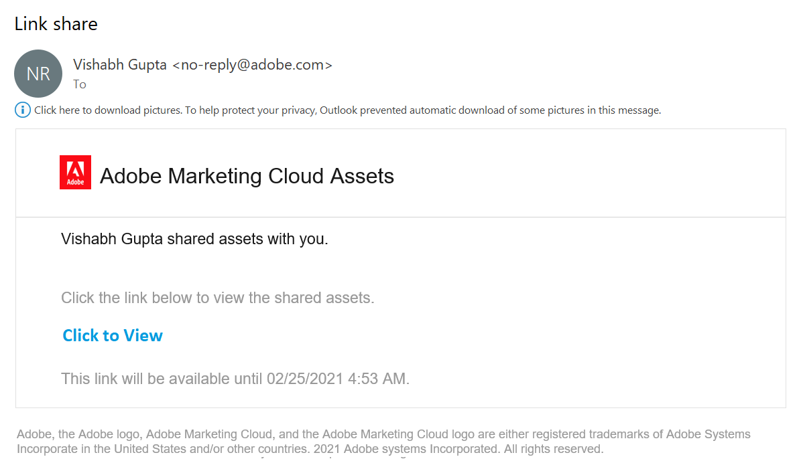
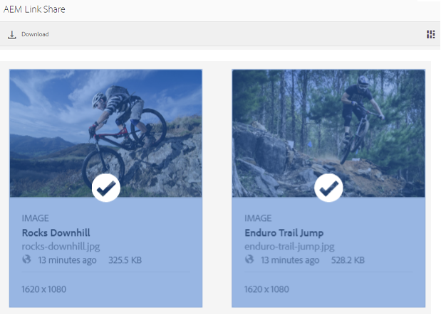
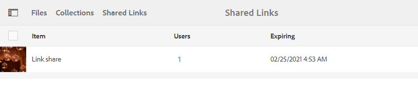
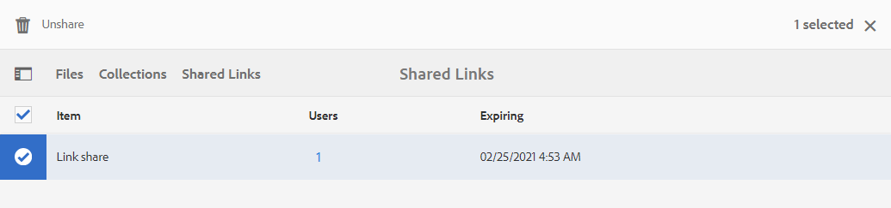

# Condividere le risorse come collegamento {#share-assets-as-a-link}

Gli amministratori di Adobe Experience Manager Assets Brand Portal possono condividere collegamenti di più risorse con utenti interni autorizzati ed entità esterne, inclusi partner e fornitori. Gli editor possono visualizzare e condividere solo le risorse condivise con loro.

La condivisione delle risorse tramite un collegamento è un modo pratico per renderle disponibili a soggetti esterni, in quanto i ricevitori non devono accedere al Portale marchio per accedere alle risorse.

<!-- Link sharing access is restricted to editors and administrators. 
-->

Per ulteriori informazioni, vedere [Gestione di utenti, gruppi e ruoli utente](../using/brand-portal-adding-users.md#manage-user-roles).

>[!NOTE]
>
>È possibile scaricare fino a 5 GB di file ZIP utilizzando la funzionalità di condivisione dei collegamenti in Brand Portal.

Seguono i passaggi per condividere le risorse come collegamento:

1. Accedete al tenant del Brand Portal. Per impostazione predefinita, viene aperta la visualizzazione **[!UICONTROL File]** che contiene tutte le risorse e le cartelle pubblicate.

1. Selezionate le risorse o le cartelle da condividere oppure passate alla vista **[!UICONTROL Raccolte]** per condividere le raccolte create.

   

1. Dalla barra degli strumenti nella parte superiore, fare clic sull&#39;icona **[!UICONTROL Condividi collegamento]**.

   Viene visualizzata la finestra di dialogo **[!UICONTROL Condivisione collegamento]**.

   

   * Nella casella dell&#39;indirizzo e-mail, digitate l&#39;ID e-mail dell&#39;utente con cui desiderate condividere il collegamento. Puoi condividere il collegamento con più utenti. Se l’utente è membro dell’organizzazione, selezionate il proprio ID e-mail dai suggerimenti visualizzati nell’elenco a discesa. Se l&#39;utente è esterno, digitare l&#39;ID e-mail completo e premere **[!UICONTROL Invio]**; l’ID e-mail viene aggiunto all’elenco degli utenti.

      

   * Nella casella **[!UICONTROL Oggetto]**, digitate l’oggetto della risorsa da condividere.
   * Nella casella **[!UICONTROL Messaggio]**, digitare un messaggio se necessario.
   * Nel campo **[!UICONTROL Scadenza]**, utilizza il selettore data per specificare una data e un&#39;ora di scadenza per il collegamento. Per impostazione predefinita, la data di scadenza è impostata su 7 giorni dalla data in cui condividete il collegamento.
   * Selezionare la casella di controllo **[!UICONTROL Consenti download del file originale]** per consentire ai destinatari di scaricare il rendering originale.

   Le risorse condivise tramite il collegamento scadono dopo aver attraversato la data e l&#39;ora specificate nel campo **[!UICONTROL Scadenza]**. Per informazioni sul comportamento delle risorse scadute e sulle modifiche nelle attività consentite in base ai ruoli utente in Brand Portal, consultate [Gestire i diritti digitali delle risorse](../using/manage-digital-rights-of-assets.md#asset-expiration).

   >[!NOTE]
   >
   >Il tempo di scadenza predefinito per il collegamento è 7 giorni. Il collegamento deve essere inviato via e-mail agli utenti tramite la finestra di dialogo **[!UICONTROL Condivisione collegamento]**, non copiare e condividere il collegamento separatamente.

1. Fate clic su **[!UICONTROL Condividi]**. Un messaggio conferma la condivisione del collegamento con gli utenti. Gli utenti ricevono un messaggio e-mail contenente il collegamento condiviso.

   

   >[!NOTE]
   >
   >Gli amministratori possono personalizzare i messaggi e-mail, che includono la personalizzazione di logo, descrizione e piè di pagina con la funzione [Branding](../using/brand-portal-branding.md).

## Scaricare risorse dai collegamenti condivisi {#download-assets-from-shared-links}

Fate clic sul collegamento nel messaggio e-mail per accedere alla risorsa condivisa. Viene visualizzata la pagina Condivisione collegamenti AEM.

Per scaricare le risorse condivise:

1. Fate clic sulle risorse o sulle cartelle, quindi fate clic sull&#39;icona **[!UICONTROL Scarica]** nella barra degli strumenti.

   

   >[!NOTE]
   >
   >Al momento, potete generare un’anteprima e una miniatura solo per determinate risorse, a seconda del formato del file. Per ulteriori informazioni sui formati di file supportati, consultate [Anteprima e supporto delle miniature per i formati di risorse](#preview-thumbnail-support).

1. Viene visualizzata la finestra di dialogo **[!UICONTROL Download]**.

   

1. Per impostazione predefinita, l&#39;impostazione **[!UICONTROL Download rapido]** è abilitata in **[!UICONTROL Impostazioni di download]**. Di conseguenza, appare una finestra di conferma per continuare a scaricare utilizzando IBM Aspera Connect.

   Per continuare a utilizzare **[!UICONTROL Download rapido]**, fare clic su **[!UICONTROL Consenti]**.

   Tutte le rappresentazioni selezionate vengono scaricate in una cartella zip contenente una cartella separata per ciascuna risorsa.

   >[!NOTE]
   >
   >Se per il download sono selezionate una cartella, una raccolta o più di 20 risorse, viene ignorata la finestra di dialogo **[!UICONTROL Scarica]** e tutte le rappresentazioni delle risorse accessibili all&#39;utente, escluse le rappresentazioni dinamiche, vengono scaricate in una cartella zip. All’interno della cartella zip viene creata una cartella separata.

   >[!NOTE]
   >
   >Le rappresentazioni originali non vengono scaricate utilizzando il collegamento condiviso se l&#39;utente che ha condiviso le risorse come collegamento non è [autorizzato dall&#39;amministratore ad avere accesso alle rappresentazioni originali](../using/brand-portal-adding-users.md#manage-group-roles-and-privileges).

>[!NOTE]
>
>Brand Portal limita il download di risorse superiori a 5 GB per dimensione file.

<!--
1. The **[!UICONTROL Download]** dialog box appears.

   

    * To speed up the download of asset files shared as the link, select **[!UICONTROL Enable download acceleration]** option and [follow the wizard](../using/accelerated-download.md#download-workflow-using-file-accelerator). To know more about the fast download of assets on Brand Portal refer [Guide to accelerate downloads from Brand Portal](../using/accelerated-download.md).
    
1. To download the renditions of assets in addition to the assets from the shared link, select **[!UICONTROL Rendition(s)]** option. When you do so, **[!UICONTROL Exclude System Renditions]** option appears that is selected by default. This prevents the download of out-of-the-box renditions along with approved assets or their custom renditions.

   However, to allow auto-generated renditions to download along with custom renditions, deselect the **[!UICONTROL Exclude System Renditions]** option.

   >[!NOTE]
   >
   >Original renditions are not downloaded using the shared link if the user who shared the assets as a link is not [authorized by the administrator to have access to the original renditions](../using/brand-portal-adding-users.md#manage-group-roles-and-privileges).

   

1. Click **[!UICONTROL Download]**. The assets (and renditions if selected) are downloaded as a ZIP file to your local folder. However, no zip file is created if a single asset is downloaded without any of the renditions, thereby ensuring speedy download.

>[!NOTE]
>
>Brand Portal restricts downloading assets larger than 5GB per file size.
-->

## Anteprima e supporto delle miniature per i formati delle risorse {#preview-thumbnail-support}

Nella seguente matrice sono elencati i formati di risorse per i quali Brand Portal supporta la miniatura e l’anteprima:

| Formato risorsa | Supporto delle miniature | Supporto per l&#39;anteprima |
|--------------|-------------------|-----------------|
| PNG | AND | AND |
| GIF | AND | AND |
| TIFF | AND | true |
| JPEG | AND | AND |
| BMP | AND | true |
| PNM* | NA | NA |
| PGM* | NA | NA |
| PBM* | NA | NA |
| PPM* | NA | NA |
| PSD | AND | true |
| EPS | NA | true |
| DNG | AND | true |
| PICT | AND | true |
| PSB* | AND | true |
| JPG | AND | AND |
| AI | AND | true |
| DOC | true | true |
| DOCX | true | true |
| ODT* | true | true |
| PDF | AND | true |
| HTML | true | true |
| RTF | true | true |
| TXT | AND | true |
| XLS | true | true |
| XLSX | true | true |
| ODS | true | true |
| PPT | AND | true |
| PPTX | true | true |
| ODP | true | true |
| INDD | AND | true |
| PS | true | true |
| QXP | true | true |
| EPUB | AND | true |
| AAC | true | true |
| MIDI | true | true |
| 3GP | true | true |
| MP3 | true | true |
| MP4 | true | true |
| OGA | true | true |
| OGG | true | true |
| RA | true | true |
| WAV | true | true |
| WMA | true | true |
| DVI | true | true |
| FLV | true | true |
| M4V | true | true |
| MPG | true | true |
| OGV | true | true |
| MOV | true | true |
| WMV | true | true |
| SWF | true | true |
| TGZ | NA | true |
| JAR | AND | true |
| RAR | NA | true |
| TAR | NA | true |
| ZIP | AND | true |

La legenda seguente spiega i simboli utilizzati nella matrice:

| Simbolo | Significato |
|---|---|
| AND | Questo formato di file supporta questa funzione |
| true | Questo formato di file non supporta questa funzione |
| NA | Questa funzione non è applicabile a questo formato di file |
| * | Questa funzione richiede il supporto del componente aggiuntivo per questo formato di file nell’istanza AEM’autore, ma non nel Portale marchio dopo la pubblicazione delle risorse nel Portale marchio |

## Annullare la condivisione di risorse condivise come collegamento {#unshare-assets-shared-as-a-link}

Per annullare la condivisione di risorse precedentemente condivise come collegamento, effettuate le seguenti operazioni:

1. Quando effettuate l&#39;accesso al Portale marchio, per impostazione predefinita si apre la vista **[!UICONTROL File]**. Per visualizzare le risorse condivise come collegamenti, andate alla vista **[!UICONTROL Collegamenti condivisi]**.

1. Controllare i collegamenti condivisi dall&#39;elenco visualizzato.

   

1. Per annullare la condivisione di un collegamento dall&#39;elenco, selezionatelo e fate clic sull&#39;icona **[!UICONTROL Annulla condivisione]** nella barra degli strumenti nella parte superiore.

   

   >[!NOTE]
   >
   >La visualizzazione dei collegamenti condivisi è specifica dell&#39;utente. Questa funzione non visualizza tutti i collegamenti condivisi da tutti gli utenti di un tenant.

1. Nella finestra del messaggio di avviso, fare clic su **[!UICONTROL Continua]** per confermare l&#39;annullamento della condivisione. La voce relativa al collegamento viene rimossa dall&#39;elenco dei collegamenti condivisi.
