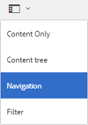
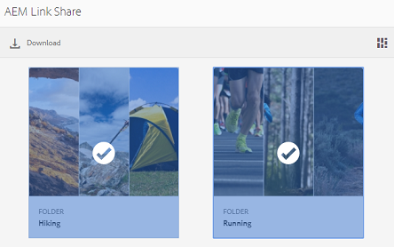

# Condividere le risorse come collegamento {#share-assets-as-a-link}

Gli amministratori di AEM Assets Brand Portal possono condividere collegamenti di più risorse con utenti interni autorizzati ed entità esterne, compresi partner e fornitori. Gli editor possono visualizzare e condividere solo le risorse condivise.

La condivisione di risorse tramite un collegamento è utile per renderle disponibili per i soggetti esterni, in quanto i destinatari non devono accedere al portale brand per accedere alle risorse.

L'accesso alla condivisione dei collegamenti è limitato a editor e amministratori. Per ulteriori informazioni, consultate [Gestione di utenti, gruppi e ruoli utente](../using/brand-portal-adding-users.md#manage-user-roles).

>[!NOTE]
>
>È consentito un massimo di 5 GB di download zip tramite la funzione di condivisione dei collegamenti sul portale brand.

Per condividere le risorse come collegamento, effettuate le seguenti operazioni:

1. Fate clic sull'icona della sovrapposizione a sinistra, quindi scegliete **[!UICONTROL Navigazione]**.

   

2. Da Siderail a sinistra, fate clic **[!UICONTROL su File]** per condividere cartelle o immagini. Per condividere le raccolte, fate clic su **[!UICONTROL Raccolte]**.

   

3. Selezionate le cartelle o raccolte che desiderate condividere come collegamento.

   

4. Dalla barra degli strumenti in alto, fate clic sull'icona **[!UICONTROL Condividi collegamento]** .

   Viene visualizzata **[!UICONTROL la finestra di]** dialogo Condivisione collegamenti.

   

   >[!NOTE]
   >
   >Nel campo **[!UICONTROL Condividi collegamento]** viene visualizzato un collegamento di risorsa creato automaticamente. Il tempo di scadenza predefinito per questo collegamento è di 7 giorni. Potete copiare il collegamento e condividerlo separatamente con gli utenti o condividerlo dalla finestra **[!UICONTROL di]** dialogo Condivisione collegamenti.

5. Nella casella dell'indirizzo e-mail, digitate l'ID e-mail dell'utente con il quale desiderate condividere il collegamento. Potete condividere il collegamento con più utenti.

   Se l'utente è un membro dell'organizzazione, selezionate il relativo ID e-mail dai suggerimenti visualizzati nell'elenco a discesa. Se l'utente è esterno, digitate l'ID e-mail completo e **[!UICONTROL premete Invio]**. l'ID e-mail viene aggiunto all'elenco degli utenti.

   

6. Nella casella **[!UICONTROL Oggetto]** , digitate un oggetto per la risorsa da condividere.
7. Nella casella **[!UICONTROL Messaggio]** , digitate un messaggio, se necessario.
8. Nel campo **[!UICONTROL Scadenza]** , utilizzate il selettore della data per specificare una data e un'ora di scadenza per il collegamento. Per impostazione predefinita, la data di scadenza è impostata su 7 giorni dalla data in cui condividete il collegamento.

   Le risorse condivise con il collegamento scadono dopo aver superato la data e l'ora specificate nel campo **[!UICONTROL Scadenza]** . Per informazioni sul comportamento di risorse scadute e modifiche nelle attività consentite basate sui ruoli utente in Brand Portal, consultate [Gestire i diritti digitali delle risorse](../using/manage-digital-rights-of-assets.md#asset-expiration).

9. Fate clic su **[!UICONTROL Condividi]**. Un messaggio conferma che il collegamento è condiviso con gli utenti. Gli utenti ricevono un messaggio e-mail contenente il collegamento.

   

   >[!NOTE]
   >
   >Gli amministratori possono personalizzare i messaggi e-mail, che includono la personalizzazione di logo, descrizione e piè di pagina con [la funzione Branding](../using/brand-portal-branding.md) .

## Download delle risorse dai collegamenti condivisi {#download-assets-from-shared-links}

Fate clic sul collegamento nell'e-mail per visualizzare la risorsa condivisa. Viene visualizzata la pagina Condivisione collegamento AEM.

Per scaricare le risorse condivise:

1. Fate clic sulle risorse, quindi fate clic **[!UICONTROL sull'icona Scarica]** dalla barra degli strumenti.

   

   >[!NOTE]
   >
   >Al momento, è possibile generare un'anteprima e una miniatura solo per determinate risorse, a seconda del formato di file. Per ulteriori informazioni sui formati di file supportati, consultate [Anteprima e supporto delle miniature per i formati delle risorse](#preview-thumbnail-support).

   >[!NOTE]
   >
   >Se le risorse che state scaricando includono anche risorse con licenza, verrete reindirizzati alla **[!UICONTROL pagina Gestione]** copyright. In questa pagina, selezionate le risorse con licenza, fate clic **[!UICONTROL su D'accordo]**, quindi su **[!UICONTROL Scarica]**. Se scegli di non d'accordo, vengono scaricate solo le risorse senza licenza.\
   >Alle risorse protette da licenza è [associato](https://helpx.adobe.com/experience-manager/6-5/assets/using/drm.html#DigitalRightsManagementinAssets) un contratto di licenza, che viene effettuato impostando la proprietà [metadata della risorsa](https://helpx.adobe.com/experience-manager/6-5/assets/using/drm.html#DigitalRightsManagementinAssets) in [!DNL AEM Assets].

   

   Viene visualizzata la finestra [!UICONTROL di] dialogo Scarica.
   

   * Per accelerare il download dei file di risorse condivisi come collegamento, selezionate **[!UICONTROL Abilita l'opzione di accelerazione]** download e [seguite la procedura guidata](../using/accelerated-download.md#download-workflow-using-file-accelerator). Per ulteriori informazioni sul download rapido delle risorse su Brand Portal, consultate [Guida per accelerare i download da Brand Portal](../using/accelerated-download.md).
[! UICONTROL
2. Per scaricare i rendering delle risorse in aggiunta alle risorse del collegamento condiviso, selezionate **[!UICONTROL Rappresentazioni]** . L'opzione **Escludi rendering di sistema viene** selezionata per impostazione predefinita. Questo impedisce il download di rappresentazioni predefinite insieme alle risorse approvate o alle relative rappresentazioni personalizzate.

   Tuttavia, per consentire il download di rappresentazioni generate automaticamente insieme a rappresentazioni personalizzate, deselezionare **[!UICONTROL l'opzione Escludi rendering]** di sistema.

   >[!NOTE]
   >
   >Le rappresentazioni originali non vengono scaricate utilizzando il collegamento condiviso se l'utente che ha condiviso le risorse come collegamento non [è autorizzato dall'amministratore ad avere accesso alle rappresentazioni originali](../using/brand-portal-adding-users.md#manage-group-roles-and-privileges).

   

3. Toccate o fate clic **[!UICONTROL su Scarica]**. Le risorse (e le rappresentazioni se selezionate) vengono scaricate come file ZIP nella cartella locale. Tuttavia, non viene creato alcun file ZIP se una singola risorsa viene scaricata senza rendering, garantendo così un download rapido.

>[!NOTE]
>
>Brand Portal limita il download di risorse di dimensioni superiori a 5 GB per file.

## Anteprima e supporto delle miniature per i formati delle risorse {#preview-thumbnail-support}

La seguente matrice elenca i formati di risorse per i quali Brand Portal supporta la miniatura e l'anteprima:

| Formato risorsa | Supporto delle miniature | Supporto per l'anteprima |
|--------------|-------------------|-----------------|
| PNG | ✓ | ✓ |
| GIF | ✓ | ✓ |
| TIFF | ✓ | ✕ |
| JPEG | ✓ | ✓ |
| BMP | ✓ | ✕ |
| PNM * | NA | NA |
| PGM * | NA | NA |
| PBM * | NA | NA |
| PPM * | NA | NA |
| PSD | ✓ | ✕ |
| EPS | NA | ✕ |
| DNG | ✓ | ✕ |
| PICT | ✓ | ✕ |
| PSB * | ✓ | ✕ |
| JPG | ✓ | ✓ |
| AI | ✓ | ✕ |
| DOC | ✕ | ✕ |
| DOCX | ✕ | ✕ |
| ODT * | ✕ | ✕ |
| PDF | ✓ | ✕ |
| HTML | ✕ | ✕ |
| RTF | ✕ | ✕ |
| TXT | ✓ | ✕ |
| XLS | ✕ | ✕ |
| XLSX | ✕ | ✕ |
| ODS | ✕ | ✕ |
| PPT | ✓ | ✕ |
| PPTX | ✕ | ✕ |
| ODP | ✕ | ✕ |
| INDD | ✓ | ✕ |
| PS | ✕ | ✕ |
| QXP | ✕ | ✕ |
| EPUB | ✓ | ✕ |
| AAC | ✕ | ✕ |
| MIDI | ✕ | ✕ |
| 3GP | ✕ | ✕ |
| MP3 | ✕ | ✕ |
| MP4 | ✕ | ✕ |
| OGA | ✕ | ✕ |
| OGG | ✕ | ✕ |
| RA | ✕ | ✕ |
| WAV | ✕ | ✕ |
| WMA | ✕ | ✕ |
| DVI | ✕ | ✕ |
| FLV | ✕ | ✕ |
| M4V | ✕ | ✕ |
| MPG | ✕ | ✕ |
| OGV | ✕ | ✕ |
| MOV | ✕ | ✕ |
| WMV | ✕ | ✕ |
| SWF | ✕ | ✕ |
| TGZ | NA | ✕ |
| JAR | ✓ | ✕ |
| RAR | NA | ✕ |
| TAR | NA | ✕ |
| ZIP | ✓ | ✕ |

La legenda seguente spiega i simboli utilizzati nella matrice:

| Simbolo | Significato |
|---|---|
| ✓ | Questo formato di file supporta questa funzionalità |
| ✕ | Questo formato di file non supporta questa funzionalità |
| NA | Questa funzione non è applicabile a questo formato di file |
| * | Questa funzione richiede il supporto del componente aggiuntivo per questo formato di file sull'istanza di creazione AEM, ma non su Brand Portal dopo che le risorse sono state pubblicate sul portale brand |

## Annullare la condivisione di risorse condivise come collegamento {#unshare-assets-shared-as-a-link}

Per annullare la condivisione di risorse condivise in precedenza come collegamento, effettuate le seguenti operazioni:

1. Per visualizzare le risorse condivise come collegamenti, fate clic sull'icona della sovrapposizione a sinistra e scegliete **[!UICONTROL Navigazione]**.

   

2. Da Siderail, fate clic su Collegamenti **[!UICONTROL condivisi]**.

   

3. Rivedete i collegamenti condivisi dall'elenco.
4. Per annullare la condivisione di un collegamento dall'elenco, selezionatelo e fate clic sull'icona del raccoglitore accanto alla voce di collegamento, oppure l'icona **[!UICONTROL Annulla condivisione]** dalla barra degli strumenti in alto.

   

   >[!NOTE]
   >
   >La visualizzazione dei collegamenti condivisi è specifica per l'utente. Questa funzione non visualizza tutti i collegamenti condivisi da tutti gli utenti di un tenant.

5. Nella finestra di messaggio di avviso, fate clic su **[!UICONTROL Continua]** per confermare la condivisione. La voce relativa al collegamento viene rimossa dall'elenco dei collegamenti condivisi.
