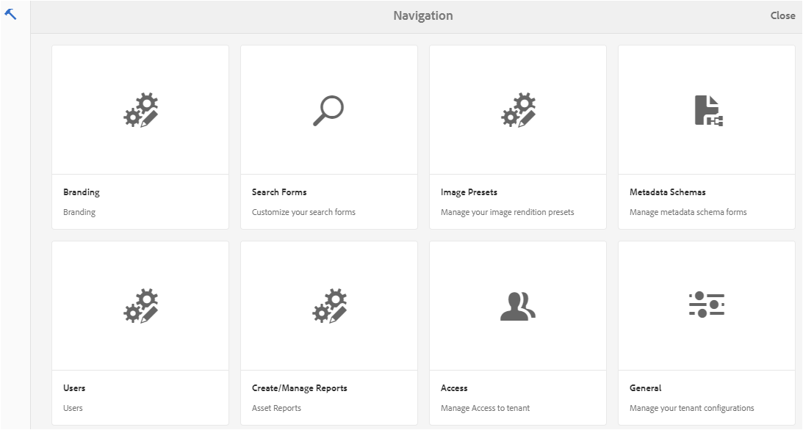
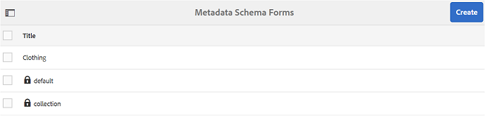
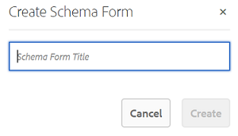
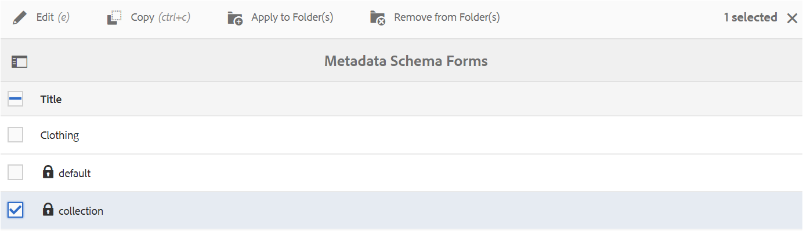
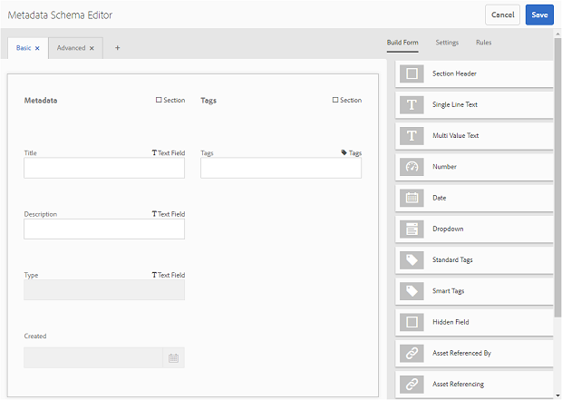
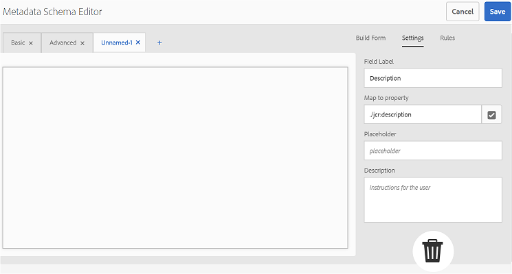
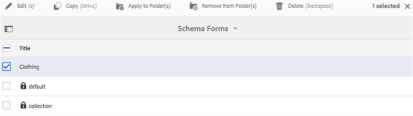
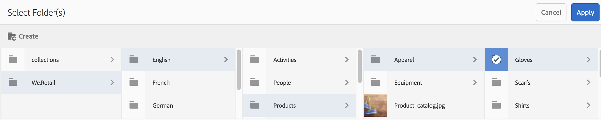

# Utilizzare il modulo schema metadati {#use-the-metadata-schema-form}

Uno schema di metadati descrive il layout della pagina Proprietà e le proprietà dei metadati visualizzate per le risorse che utilizzano lo schema specifico. Lo schema applicato a una risorsa determina i campi di metadati visualizzati nella pagina Proprietà.

La pagina **[!UICONTROL Proprietà]** di ciascuna risorsa include proprietà di metadati predefinite, a seconda del tipo MIME della risorsa. Gli amministratori possono usare l’Editor schema metadati per modificare gli schemi esistenti o aggiungere schemi di metadati personalizzati. Il portale dei marchi AEM Assets fornisce moduli predefiniti per le risorse di vari tipi MIME. Tuttavia, è anche possibile aggiungere moduli personalizzati per tali risorse.

## Aggiunta di uno schema di metadati {#add-a-metadata-schema-form}

Per creare un nuovo modulo schema di metadati, effettuate le seguenti operazioni:

1. Dalla barra degli strumenti di AEM nella parte superiore, fate clic sul logo Adobe per accedere agli strumenti amministrativi.

   

1. Dal pannello degli strumenti di amministrazione, fate clic su Schemi di **[!UICONTROL metadati]**.

   

1. Nella pagina Moduli **[!UICONTROL schema]** metadati, fare clic su **[!UICONTROL Crea]**.

   

1. Nella finestra di dialogo **[!UICONTROL Crea modulo]** schema, specificare il titolo del modulo schema, quindi fare clic su **[!UICONTROL Crea]** per completare il processo di creazione del modulo.

   

## Edit a metadata schema form {#edit-a-metadata-schema-form}

È possibile modificare un modulo di schema di metadati appena aggiunto o esistente. Il modulo schema metadati contiene il contenuto derivato dal relativo elemento padre, incluse schede ed elementi del modulo all&#39;interno di schede. È possibile mappare o configurare questi elementi del modulo su un campo all’interno di un nodo di metadati.

È possibile aggiungere nuove schede o elementi del modulo al modulo schema di metadati. Le schede derivate e gli elementi del modulo (dall&#39;elemento padre) sono nello stato bloccato. Non è possibile modificarle a livello di figlio.

Per modificare un modulo schema di metadati, effettuate le seguenti operazioni:

1. Dalla barra degli strumenti di AEM nella parte superiore, fate clic sul logo Adobe per accedere agli strumenti amministrativi.

   

1. Dal pannello degli strumenti di amministrazione, fate clic su Schemi di **[!UICONTROL metadati]**.
1. Dalla pagina Moduli **[!UICONTROL schema]** metadati, selezionare un modulo schema per modificarne le proprietà, ad esempio la **[!UICONTROL raccolta]**.

   

   >[!NOTE]
   >
   >I modelli non modificati presentano un simbolo di lucchetto. Se personalizzate uno dei modelli, il simbolo Blocca prima che il modello scompaia.

1. Dalla barra degli strumenti nella parte superiore, fate clic su **[!UICONTROL Modifica]**.

   Viene visualizzata la pagina Editor **[!UICONTROL schema]** metadati, con la scheda **[!UICONTROL Base]** aperta a sinistra e la scheda **[!UICONTROL Genera modulo]** aperta a destra.

1. In the **[!UICONTROL Metadata Schema Editor]** page, customize the **[!UICONTROL Properties]** page of the asset by dragging one or more components from a list of component types in the **[!UICONTROL Build Form]** tab to the **[!UICONTROL Basic]** tab.

   

1. Per configurare un componente, selezionatelo e modificatene le proprietà nella scheda **[!UICONTROL Impostazioni]** .

### Componenti nella scheda Genera modulo {#components-in-the-build-form-tab}

La scheda **[!UICONTROL Genera modulo]** elenca gli elementi che è possibile utilizzare nel modulo schema. La scheda **[!UICONTROL Impostazioni]** fornisce gli attributi di ogni elemento selezionato nella scheda **[!UICONTROL Modulo]** di creazione. Nella tabella seguente sono elencati gli elementi del modulo disponibili nella scheda **[!UICONTROL Genera modulo]** :

| Nome componente | Descrizione |
|---------------------|--------------------------------------------------------------------------------------------------------------------------------------------------------------------------------------------------------------------------------------------------------------------------------------------|
| **[!UICONTROL Intestazione sezione]** | Aggiungere un&#39;intestazione di sezione per un elenco di componenti comuni. |
| **[!UICONTROL Testo su riga singola]** | Aggiungere una proprietà di testo a riga singola. È memorizzato come stringa. |
| **[!UICONTROL Multi ValueText]** | Aggiungete una proprietà di testo con più valori. È memorizzato come array di stringhe. |
| **[!UICONTROL Numero]** | Aggiungere un componente numero. |
| **[!UICONTROL Data]** | Aggiungere un componente data. |
| **[!UICONTROL A discesa]** | Aggiungere un elenco a discesa. |
| **[!UICONTROL Tag standard]** | Aggiungi un tag. **Nota:** Gli amministratori potrebbero dover modificare il valore del percorso, ad esempio `/etc/tags/mac/<tenant_id>/<custom_tag_namespace>`, se pubblicano il modulo dello schema di metadati da AEM, dove il percorso non include informazioni sul tenant, ad esempio `/etc/tags/<custom_tag_namespace>`. |
| **[!UICONTROL Tag avanzati]** | Tag rilevati automaticamente se avete acquistato e configurato il componente aggiuntivo AEM per smart tag. |
| **[!UICONTROL Campo nascosto]** | Aggiungere un campo nascosto. Viene inviato come parametro POST al momento del salvataggio della risorsa. |
| **[!UICONTROL Risorsa con riferimento da]** | Aggiungete questo componente per visualizzare l’elenco delle risorse a cui fa riferimento la risorsa. |
| **[!UICONTROL Risorsa con riferimento a]** | Aggiungi per visualizzare un elenco delle risorse che fanno riferimento alla risorsa. |
| **[!UICONTROL Valutazione risorsa]** | Valutazione media di una risorsa aggiunta dai AEM Assets prima che venga pubblicata nel Brand Portal. |
| **[!UICONTROL Metadati contestuali]** | Potete aggiungere per controllare la visualizzazione di altre schede di metadati nella pagina Proprietà delle risorse. |

>[!NOTE]
>
>Non utilizzate i riferimenti **** prodotto, in quanto non funziona.

#### Modificare il componente metadati {#edit-the-metadata-component}

Per modificare le proprietà di un componente di metadati sul modulo, fate clic sul componente e modificatene le proprietà nella scheda **[!UICONTROL Impostazioni]** .

* **[!UICONTROL Etichetta]** campo: Nome della proprietà di metadati visualizzata nella pagina Proprietà della risorsa.

* **[!UICONTROL Mappa su proprietà]**: Il valore di questa proprietà fornisce il percorso/nome relativo al nodo della risorsa in cui viene salvata nell&#39;archivio CRX. Comincia con &quot;**./**&quot; perché indica che il percorso si trova sotto il nodo della risorsa.

Di seguito sono riportati i valori validi per questa proprietà:

-- `./jcr:content/metadata/dc:title`: memorizza il valore come proprietà nel nodo di metadati della risorsa [!UICONTROL `dc:title`].

-- `./jcr:created`: visualizza la proprietà jcr sul nodo della risorsa. Se configuri queste proprietà come View Properties (Visualizza proprietà), è consigliabile contrassegnarle con l’opzione Disattiva modifica, in quanto sono protette. In caso contrario, al momento di salvare le proprietà della risorsa si verifica l’errore “Impossibile modificare le risorse”.

* **[!UICONTROL Segnaposto]**: Utilizzate questa proprietà per fornire all&#39;utente tutte le informazioni pertinenti relative alla proprietà dei metadati.
* **[!UICONTROL Obbligatorio]**: Utilizzare questa proprietà per contrassegnare una proprietà di metadati come obbligatoria nella pagina Proprietà.
* **[!UICONTROL Disattiva modifica]**: Utilizzare questa proprietà per rendere non modificabile una proprietà di metadati nella pagina Proprietà.
* **[!UICONTROL Mostra campo vuoto in sola]** lettura: Contrassegnate questa proprietà per visualizzare una proprietà di metadati nella pagina Proprietà anche se non dispone di alcun valore. Per impostazione predefinita, quando una proprietà di metadati non ha alcun valore, non viene elencata nella pagina Proprietà.
* **[!UICONTROL Descrizione]**: Utilizzate questa proprietà per aggiungere una breve descrizione per il componente di metadati.
* **[!UICONTROL Icona]** Elimina: Fare clic su questa icona per eliminare un componente dal modulo schema.

>[!NOTE]
>
>Tutti i campi di metadati sono di sola lettura nell’editor di metadati di una risorsa. Poiché i metadati della risorsa devono essere modificati in AEM Assets prima che una risorsa venga pubblicata in Brand Portal.

#### Aggiunta o eliminazione di una scheda nel modulo schema {#add-or-delete-a-tab-in-the-schema-form}

Il modulo schema predefinito include le schede **[!UICONTROL Base]** e **[!UICONTROL Avanzate]** . L’editor dello schema consente di aggiungere o eliminare una scheda.

* Per aggiungere una nuova scheda a un modulo schema, fare clic su **[!UICONTROL +]**. Per impostazione predefinita, la nuova scheda ha il nome &quot;Senza nome-1&quot;. Potete modificare il nome dalla scheda **[!UICONTROL Impostazioni]** .

* Per eliminare una scheda, fare clic su **[!UICONTROL x]**. Click **[!UICONTROL Save]** to save the changes.

## Applicazione di uno schema di metadati a una cartella {#apply-a-metadata-schema-to-a-folder}

Brand Portal consente di personalizzare e controllare lo schema di metadati in modo che nella pagina **[!UICONTROL Proprietà]** di una risorsa siano visualizzate solo le informazioni specifiche che si sceglie di visualizzare. Per controllare i metadati visualizzati nella pagina **[!UICONTROL Proprietà]** , rimuovete i metadati richiesti dal modulo dello schema di metadati e applicatelo alla cartella specifica.

Per applicare uno schema di metadati a una cartella, effettuate le seguenti operazioni:

1. Dalla barra degli strumenti di AEM nella parte superiore, fate clic sul logo Adobe per accedere agli strumenti amministrativi.

   

1. Dal pannello degli strumenti di amministrazione, fate clic su Schemi di **[!UICONTROL metadati]**.

1. Dalla pagina Moduli **[!UICONTROL schema]** metadati, selezionate il modulo dello schema da applicare a una risorsa, ad esempio **[!UICONTROL abbigliamento]**.

   

1. Dalla barra degli strumenti nella parte superiore, fate clic su **[!UICONTROL Applica alle cartelle]**.

1. Dalla pagina **[!UICONTROL Seleziona cartelle]** , passate alla cartella alla quale desiderate applicare lo schema di metadati **[!UICONTROL abbigliamento]** , ad esempio **[!UICONTROL Guanti]**.

   

1. Fate clic su **[!UICONTROL Applica]** per applicare il modulo dello schema di metadati alla cartella.

   I metadati disponibili nel modulo schema di metadati **[!UICONTROL per l’abbigliamento]** vengono applicati alla cartella **[!UICONTROL Guanti]** e visualizzati nella pagina **[!UICONTROL Proprietà]** della cartella.

   

>[!NOTE]
>
>Se applicate uno schema che include schemi nidificati a una cartella contenente file video, il rendering delle proprietà dei metadati per i file video potrebbe non essere corretto. Per garantire il corretto rendering delle proprietà dei metadati, rimuovete gli schemi nidificati e applicate alla cartella solo lo schema principale.

## Delete a metadata schema form {#delete-a-metadata-schema-form}

Brand Portal consente di eliminare solo i moduli di schema personalizzati. Non consente di eliminare i moduli/modelli di schema predefiniti. Tuttavia, è possibile eliminare qualsiasi modifica personalizzata in questi moduli.

Per eliminare un modulo, selezionarlo e fare clic sull&#39;icona **[!UICONTROL Elimina]** .

>[!NOTE]
>
>Dopo aver eliminato le modifiche personalizzate apportate a un modulo predefinito, il simbolo **[!UICONTROL Blocca]** viene nuovamente visualizzato prima del nome del modulo nell’interfaccia Schema metadati per indicare che il modulo è stato ripristinato allo stato predefinito.

## Moduli schema per tipi MIME {#schema-forms-for-mime-types}

### Aggiunta di nuovi moduli per i tipi MIME {#adding-new-forms-for-mime-types}

Oltre ai moduli predefiniti, è possibile aggiungere moduli personalizzati per risorse di vari tipi MIME o creare un nuovo modulo con un tipo appropriato. Ad esempio, per aggiungere un nuovo modello per il sottotipo **[!UICONTROL image/png]**, crea il modulo sotto i moduli “image”. Il titolo del modulo schema è il nome del sottotipo. In questo caso, il titolo è &quot;png&quot;.

#### Utilizzo di un modello di schema esistente per vari tipi MIME {#using-an-existing-schema-template-for-various-mime-types}

È possibile utilizzare un modello esistente per un tipo MIME diverso. Ad esempio, usate il modulo **immagine/jpeg** per le risorse di tipo MIME **image/png**.

In questo caso, create un nuovo nodo [!UICONTROL `/etc/dam/metadataeditor/mimetypemappings`] nell&#39;archivio CRX. Specificare un nome per il nodo e definire le seguenti proprietà:

| **Nome** | **Tipo** | **Valore** |
|---|---|---|
| exposedmimetype | Stringa | image/jpeg |
| mimetypes | Stringa[] | image/png |

* **esposedmimetype**: Nome del modulo esistente da mappare
* **mimetismi**: Elenco di tipi MIME che utilizzano il modulo definito nell&#39;attributo **esposedmimetype**

Brand Portal mappa i seguenti tipi MIME e moduli di schema:

| **Modulo schema** | **Tipi MIME** |
|---|---|
| image/jpeg | image/pjpeg |
| image/tiff | image/x-tiff |
| application/pdf | application/postscript |
| application/x-ImageSet | Multipart/Related; type=application/x-ImageSet |
| application/x-SpinSet | Multipart/Related; type=application/x-SpinSet |
| application/x-MixedMediaSet | Multipart/Related; type=application/x-MixedMediaSet |
| video/quicktime | video/x-quicktime |
| video/mpeg4 | video/mp4 |
| video/avi | video/avi, video/msvideo, video/x-msvideo |
| video/wmv | video/x-ms-wmv |
| video/flv | video/x-flv |

Di seguito è riportato un elenco delle proprietà di metadati predefinite:

* jcr:content/metadata/cq:tags
* jcr:content/metadata/dc:format
* jcr:content/metadata/dam:status
* jcr:content/metadata/videoCodec
* jcr:content/metadata/audioCodec
* jcr:content/metadata/dc:title
* jcr:content/metadata/dc:description
* jcr:content/metadata/xmpMM:InstanceID
* jcr:content/metadata/xmpMM:DocumentID
* jcr:content/metadata/dam:sha1
* jcr:content/metadata/dam:solutionContext
* jcr:content/metadata/videoBitrate
* jcr:content/metadata/audioBitrate
* jcr:content/usages/usedBy
* jcr:content/jcr:lastModified
* jcr:content/metadata/prism:expirationDate
* jcr:content/onTime
* jcr:content/offTime
* jcr:content/metadata/dam:size
* jcr:content/metadata/tiff:ImageWidth
* jcr:content/metadata/tiff:ImageLength
