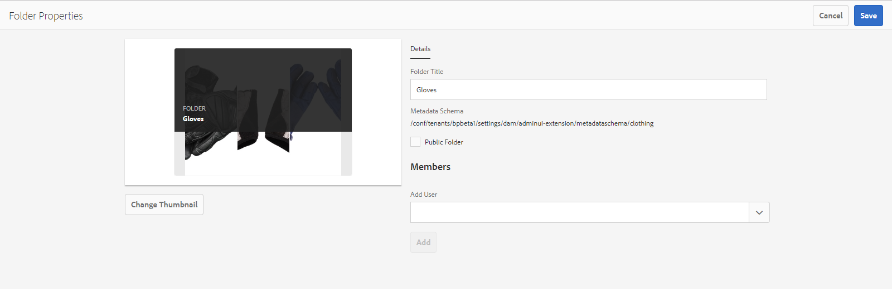

# Utilizzare il modulo schema metadati {#use-the-metadata-schema-form}

Uno schema di metadati descrive il layout della pagina Proprietà e le proprietà dei metadati visualizzate per le risorse che utilizzano lo schema specifico. Lo schema applicato a una risorsa determina i campi di metadati visualizzati nella relativa pagina Proprietà.

La pagina **[!UICONTROL Proprietà]** di ogni risorsa include proprietà di metadati predefinite a seconda del tipo MIME della risorsa. Gli amministratori possono utilizzare l’Editor schema metadati per modificare gli schemi esistenti o aggiungere schemi di metadati personalizzati. AEM Assets Brand Portal fornisce moduli predefiniti per risorse di vari tipi MIME. Tuttavia, è anche possibile aggiungere moduli personalizzati per tali risorse.

## Aggiungere un modulo schema metadati {#add-a-metadata-schema-form}

Per creare un nuovo modulo schema metadati, procedi come segue:

1. Dalla barra degli strumenti AEM in alto, fai clic sul logo Adobe per accedere agli strumenti amministrativi.

   

1. Dal pannello degli strumenti amministrativi, fai clic su **[!UICONTROL Schemi di metadati]**.

   

1. Nella pagina **[!UICONTROL Forms schema metadati]**, fai clic su **[!UICONTROL Crea]**.

   

1. Nella finestra di dialogo **[!UICONTROL Crea modulo schema]**, specifica il titolo del modulo schema, quindi fai clic su **[!UICONTROL Crea]** per completare il processo di creazione del modulo.

   

## Modificare un modulo schema metadati {#edit-a-metadata-schema-form}

È possibile modificare un modulo schema metadati appena aggiunto o esistente. Il modulo schema metadati contiene il contenuto derivato dal relativo elemento padre, incluse le schede e gli elementi del modulo all’interno delle schede. È possibile mappare o configurare questi elementi del modulo in un campo all’interno di un nodo di metadati.

È possibile aggiungere nuove schede o nuovi elementi modulo al modulo schema metadati. Le schede derivate e gli elementi del modulo (dall&#39;elemento padre) sono nello stato bloccato. Non è possibile modificarli a livello di bambino.

Per modificare un modulo schema metadati, procedi come segue:

1. Dalla barra degli strumenti AEM in alto, fai clic sul logo Adobe per accedere agli strumenti amministrativi.

   

1. Dal pannello degli strumenti amministrativi, fai clic su **[!UICONTROL Schemi di metadati]**.
1. Dalla pagina **[!UICONTROL Forms schema metadati]**, seleziona un modulo schema per modificarne le proprietà, ad esempio **[!UICONTROL collection]**.

   

   >[!NOTE]
   >
   >I modelli non modificati presentano un simbolo di blocco. Se si personalizza uno dei modelli, il simbolo Blocca prima che il modello scompaia.

1. Dalla barra degli strumenti nella parte superiore, fai clic su **[!UICONTROL Modifica]**.

   Viene visualizzata la pagina **[!UICONTROL Editor schema metadati]** con la scheda **[!UICONTROL Base]** aperta a sinistra e la scheda **[!UICONTROL Genera modulo]** aperta a destra.

1. Nella pagina **[!UICONTROL Editor schema metadati]** , personalizza la pagina **[!UICONTROL Proprietà]** della risorsa trascinando uno o più componenti da un elenco di tipi di componenti nella scheda **[!UICONTROL Genera modulo]** alla scheda **[!UICONTROL Base]** .

   

1. Per configurare un componente, selezionalo e modificane le proprietà nella scheda **[!UICONTROL Impostazioni]** .

### Componenti nella scheda Genera modulo {#components-in-the-build-form-tab}

La scheda **[!UICONTROL Genera modulo]** elenca gli elementi che è possibile utilizzare nel modulo schema. La scheda **[!UICONTROL Impostazioni]** fornisce gli attributi di ogni elemento selezionato nella scheda **[!UICONTROL Genera modulo]** . Nella tabella seguente sono elencati gli elementi del modulo disponibili nella scheda **[!UICONTROL Genera modulo]** :

| Nome componente | Descrizione |
|---------------------|--------------------------------------------------------------------------------------------------------------------------------------------------------------------------------------------------------------------------------------------------------------------------------------------|
| **[!UICONTROL Intestazione sezione]** | Aggiungi un’intestazione di sezione per un elenco di componenti comuni. |
| **[!UICONTROL Testo su riga singola]** | Aggiungi una proprietà di testo a riga singola. Viene memorizzato come stringa. |
| **[!UICONTROL TestoMultivalore]** | Aggiungi una proprietà di testo con più valori. Viene memorizzato come array di stringhe. |
| **[!UICONTROL Numero]** | Aggiungi un componente numerico. |
| **[!UICONTROL Data]** | Aggiungi un componente data . |
| **[!UICONTROL A discesa]** | Aggiungi un elenco a discesa. |
| **[!UICONTROL Tag standard]** | Aggiungi un tag. **Nota:** gli amministratori potrebbero dover modificare il valore del percorso, ad esempio  `/etc/tags/mac/<tenant_id>/<custom_tag_namespace>`, se pubblicano il modulo schema metadati da AEM, dove il percorso non include le informazioni sul tenant, ad esempio  `/etc/tags/<custom_tag_namespace>`. |
| **[!UICONTROL Tag avanzati]** | Sono stati rilevati automaticamente i tag se hai acquistato e configurato il componente aggiuntivo per tag avanzati AEM. |
| **[!UICONTROL Campo nascosto]** | Aggiungi un campo nascosto. Viene inviato come parametro POST al momento del salvataggio della risorsa. |
| **[!UICONTROL Risorsa con riferimento da]** | Aggiungi questo componente per visualizzare l’elenco delle risorse a cui fa riferimento la risorsa. |
| **[!UICONTROL Risorsa con riferimento a]** | Aggiungi per visualizzare un elenco di risorse che fanno riferimento alla risorsa. |
| **[!UICONTROL Valutazione risorsa]** | Valutazione media di una risorsa aggiunta da AEM Assets prima che venga pubblicata in Brand Portal. |
| **[!UICONTROL Metadati contestuali]** | Aggiungi per controllare la visualizzazione di altre schede di metadati nella pagina Proprietà delle risorse. |

>[!NOTE]
>
>Non utilizzare **[!UICONTROL Riferimenti prodotto]**, in quanto non funziona.

#### Modifica del componente metadati {#edit-the-metadata-component}

Per modificare le proprietà di un componente metadati sul modulo, fai clic sul componente e modificane le proprietà nella scheda **[!UICONTROL Impostazioni]** .

* **[!UICONTROL Etichetta]** campo: Nome della proprietà di metadati visualizzata nella pagina Proprietà della risorsa.

* **[!UICONTROL Mappa su proprietà]**: Il valore di questa proprietà fornisce il percorso/nome relativo al nodo della risorsa in cui viene salvata nell&#39;archivio CRX. Inizia con &quot;**./**&quot; perché indica che il percorso si trova sotto il nodo della risorsa.

Di seguito sono riportati i valori validi per questa proprietà:

-- `./jcr:content/metadata/dc:title`: memorizza il valore come proprietà nel nodo di metadati della risorsa [!UICONTROL `dc:title`].

-- `./jcr:created`: visualizza la proprietà jcr sul nodo della risorsa. Se configuri queste proprietà come View Properties (Visualizza proprietà), è consigliabile contrassegnarle con l’opzione Disattiva modifica, in quanto sono protette. In caso contrario, al momento di salvare le proprietà della risorsa si verifica l’errore “Impossibile modificare le risorse”.

* **[!UICONTROL Segnaposto]**: Utilizzare questa proprietà per fornire all&#39;utente tutte le informazioni pertinenti relative alla proprietà metadati.
* **[!UICONTROL Obbligatorio]**: Utilizzare questa proprietà per contrassegnare una proprietà metadati come obbligatoria nella pagina Proprietà.
* **[!UICONTROL Disattiva modifica]**: Utilizzare questa proprietà per rendere non modificabile una proprietà metadati nella pagina Proprietà.
* **[!UICONTROL Mostra Campo Vuoto In Sola]** Lettura: Contrassegna questa proprietà per visualizzare una proprietà di metadati nella pagina Proprietà anche se non ha alcun valore. Per impostazione predefinita, quando una proprietà di metadati non ha alcun valore, non viene elencata nella pagina Proprietà.
* **[!UICONTROL Descrizione]**: Utilizza questa proprietà per aggiungere una breve descrizione per il componente metadati.
* **[!UICONTROL Icona]** Elimina: Fai clic su questa icona per eliminare un componente dal modulo schema.

>[!NOTE]
>
>Tutti i campi di metadati sono di sola lettura nel modulo di editor di metadati di una risorsa. Poiché i metadati della risorsa devono essere modificati in AEM Assets prima che una risorsa venga pubblicata in Brand Portal.

#### Aggiunta o eliminazione di una scheda nel modulo schema {#add-or-delete-a-tab-in-the-schema-form}

Il modulo schema predefinito include le schede **[!UICONTROL Base]** e **[!UICONTROL Avanzate]**. L’editor dello schema consente di aggiungere o eliminare una scheda.

* Per aggiungere una nuova scheda a un modulo schema, fare clic su **[!UICONTROL +]**. Per impostazione predefinita, la nuova scheda ha il nome &quot;Senza nome-1&quot;. Puoi modificare il nome dalla scheda **[!UICONTROL Impostazioni]** .

* Per eliminare una scheda, fai clic su **[!UICONTROL x]**. Fai clic su **[!UICONTROL Salva]** per salvare le modifiche.

## Applicazione di uno schema di metadati a una cartella {#apply-a-metadata-schema-to-a-folder}

Brand Portal consente di personalizzare e controllare lo schema dei metadati in modo che la pagina **[!UICONTROL Proprietà]** di una risorsa visualizzi solo le informazioni specifiche che scegli di mostrare. Per controllare i metadati visualizzati nella pagina **[!UICONTROL Proprietà]**, rimuovi i metadati richiesti dal modulo schema metadati e applicali alla cartella specifica.

Per applicare un modulo schema metadati a una cartella, procedi come segue:

1. Dalla barra degli strumenti AEM in alto, fai clic sul logo Adobe per accedere agli strumenti amministrativi.

   

1. Dal pannello degli strumenti amministrativi, fai clic su **[!UICONTROL Schemi di metadati]**.

1. Dalla pagina **[!UICONTROL Forms schema metadati]** , seleziona il modulo schema da applicare a una risorsa, ad esempio **[!UICONTROL abbigliamento]**.

   

1. Dalla barra degli strumenti nella parte superiore, fai clic su **[!UICONTROL Applica a cartelle]**.

1. Dalla pagina **[!UICONTROL Seleziona cartelle]**, passa alla cartella in cui desideri applicare lo schema metadati **[!UICONTROL abbigliamento]**, ad esempio **[!UICONTROL Guanti]**.

   

1. Fai clic su **[!UICONTROL Applica]** per applicare il modulo schema metadati alla cartella.

   I metadati disponibili nel modulo di schema metadati **[!UICONTROL abbigliamento]** vengono applicati alla cartella **[!UICONTROL Guanti]** e sono visibili nella pagina **[!UICONTROL Proprietà]** della cartella.

   

>[!NOTE]
>
>Se applichi uno schema che include schemi nidificati a una cartella contenente file video, le proprietà dei metadati per i file video potrebbero non essere renderizzate correttamente. Per garantire il corretto rendering delle proprietà dei metadati, rimuovi gli schemi nidificati e applica solo lo schema padre alla cartella.

## Eliminare un modulo schema metadati {#delete-a-metadata-schema-form}

Brand Portal consente di eliminare solo i moduli schema personalizzati. Non consente di eliminare i moduli/modelli di schema predefiniti. Tuttavia, è possibile eliminare qualsiasi modifica personalizzata in questi moduli.

Per eliminare un modulo, selezionarlo e fare clic sull&#39;icona **[!UICONTROL Elimina]**.

>[!NOTE]
>
>Dopo aver eliminato le modifiche personalizzate apportate a un modulo predefinito, il simbolo **[!UICONTROL Lock]** viene visualizzato nuovamente prima del nome del modulo nell’interfaccia di Schema metadati per indicare che il modulo viene ripristinato allo stato predefinito.

## Moduli schema per TIPI MIME {#schema-forms-for-mime-types}

### Aggiunta di nuovi moduli per i tipi MIME {#adding-new-forms-for-mime-types}

Oltre ai moduli predefiniti, puoi aggiungere moduli personalizzati per risorse di vari tipi MIME o creare un nuovo modulo con un tipo appropriato. Ad esempio, per aggiungere un nuovo modello per il sottotipo **[!UICONTROL image/png]**, crea il modulo sotto i moduli “image”. Il titolo del modulo schema è il nome del sottotipo. In questo caso, il titolo è &quot;png&quot;.

#### Utilizzo di un modello di schema esistente per vari tipi MIME {#using-an-existing-schema-template-for-various-mime-types}

Puoi utilizzare un modello esistente per un tipo MIME diverso. Ad esempio, utilizza il modulo **image/jpeg** per le risorse di tipo MIME **image/png**.

In questo caso, crea un nuovo nodo in [!UICONTROL `/etc/dam/metadataeditor/mimetypemappings`] nell’archivio CRX. Specifica un nome per il nodo e definisci le seguenti proprietà:

| **Nome** | **Tipo** | **Valore** |
|---|---|---|
| exposedmimetype | Stringa | image/jpeg |
| mimetipi | Stringa[] | image/png |

* **exposedmimetype**: Nome del modulo esistente da mappare
* **mimetipi**: Elenco dei tipi MIME che utilizzano il modulo definito in  **** exposedmimetypeattribute

Brand Portal mappa i seguenti tipi MIME e moduli di schema:

| **Modulo schema** | **Tipi MIME** |
|---|---|
| image/jpeg | image/pjpeg |
| image/tiff | image/x-tiff |
| application/pdf | application/postscript |
| application/x-ImageSet | Multipart/Related; type=application/x-ImageSet |
| application/x-SpinSet | Multipart/Related; type=application/x-SpinSet |
| application/x-MixedMediaSet | Multipart/Related; type=application/x-MixedMediaSet |
| video/quicktime | video/x-quicktime |
| video/mpeg4 | video/mp4 |
| video/avi | video/avi, video/msvideo, video/x-msvideo |
| video/wmv | video/x-ms-wmv |
| video/flv | video/x-flv |

Di seguito è riportato un elenco delle proprietà di metadati predefinite:

* jcr:content/metadata/cq:tags
* jcr:content/metadata/dc:format
* jcr:content/metadata/dam:status
* jcr:content/metadata/videoCodec
* jcr:content/metadata/audioCodec
* jcr:content/metadata/dc:title
* jcr:content/metadata/dc:description
* jcr:content/metadata/xmpMM:InstanceID
* jcr:content/metadata/xmpMM:DocumentID
* jcr:content/metadata/dam:sha1
* jcr:content/metadata/dam:solutionContext
* jcr:content/metadata/videoBitrate
* jcr:content/metadata/audioBitrate
* jcr:content/usages/usedBy
* jcr:content/jcr:lastModified
* jcr:content/metadata/prism:expirationDate
* jcr:content/onTime
* jcr:content/offTime
* jcr:content/metadata/dam:size
* jcr:content/metadata/tiff:ImageWidth
* jcr:content/metadata/tiff:ImageLength
