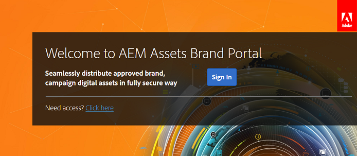

# Prima esperienza di accesso {#first-time-login-experience}

La prima volta che accedi è la stessa per tutti i nuovi utenti del Brand Portal di AEM Assets, inclusi gli amministratori. Dopo che un amministratore ti ha aggiunto all’account Brand Portal della tua organizzazione, non devi accettare gli inviti, ti verrà automaticamente aggiunto. Riceverete un messaggio e-mail di benvenuto contenente un collegamento all’account Brand Portal della vostra organizzazione.

Dopo che un amministratore aggiunge nuovi utenti, non deve accettare inviti per essere aggiunto all’account Brand Portal, vengono aggiunti automaticamente.

Per accedere al Portale marchio per la prima volta, effettuate le seguenti operazioni:

1. Aprite il messaggio e-mail di benvenuto e fate clic su **[!UICONTROL Inizia]**.

2. Nella pagina di registrazione, specificate i vostri dettagli (inclusi nome, cognome, password e paese/regione).
   >[!NOTE]
   >
   >Se siete già utenti Adobe Marketing Cloud, al posto della pagina di accesso viene visualizzata una pagina di accesso. Per accedere ad Adobe Marketing Cloud, immetti il tuo Adobe ID e la password.

   >[!NOTE]
   >
   >Se l’organizzazione utilizza gli Enterprise ID, invece di visualizzare questa pagina di registrazione, viene reindirizzata alla pagina di accesso dell’organizzazione. Per ulteriori informazioni, consultate [Enterprise ID, accesso e assistenza](https://helpx.adobe.com/in/enterprise/kb/enterprise-id-faq.html)sull'account.

3. Fate clic su **[!UICONTROL Continua]** per passare alla pagina Brand Portal della vostra organizzazione.
4. Dalla pagina di accesso al Brand Portal, fate clic su **[!UICONTROL Accesso]** per accedere al Brand Portal.

   

   >[!NOTE]
   >
   >Non potete accedere al Portale marchio se non siete associati ad alcun profilo di prodotto. Per poter accedere al Portale marchio, dovete essere associati ad almeno un profilo di prodotto AEM.
