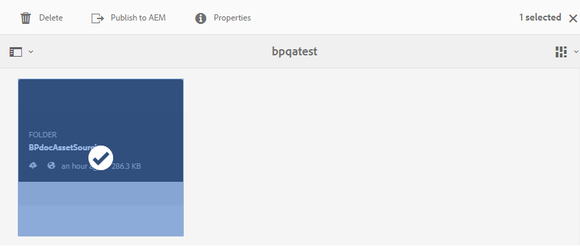

# Pubblica cartella dei contributi in AEM Assets {#publish-contribution-folder-to-aem}

Gli utenti di Brand Portal possono pubblicare la cartella dei contributi agli AEM Assets senza dover accedere all’istanza di creazione di AEM.

Accertatevi di aver soddisfatto i requisiti [delle](brand-portal-download-asset-requirements.md) risorse e di caricare le risorse appena create nella cartella **NEW** all’interno della cartella dei contributi. Consultate [Caricare le risorse nella cartella](brand-portal-upload-assets-to-contribution-folder.md)Contributi.

**Per pubblicare la cartella dei contributi:**

1. Effettuate l&#39;accesso all&#39;istanza Brand Portal.
1. Selezionate la cartella dei contributi dalla dashboard di Brand Portal.
1. Fate clic su **[!UICONTROL Pubblica in AEM]** .
   

Una notifica e-mail/impulso viene inviata agli utenti del Brand Portal e all’amministratore AEM nelle diverse fasi del flusso di lavoro di pubblicazione:
1. **In coda** - Una notifica viene inviata all’utente del Brand Portal quando viene attivato un flusso di lavoro di pubblicazione in Brand Portal.

1. **Completa** - Una notifica viene inviata all’utente del Brand Portal e all’amministratore AEM al termine del flusso di lavoro di pubblicazione, ossia al termine della pubblicazione della cartella dei contributi agli AEM Assets.

