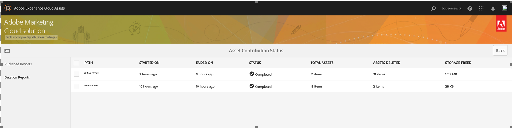

# Pubblicare la cartella dei contributi in Experience Manager Assets {#using-asset-souring-in-bp}

Gli utenti di Brand Portal con le autorizzazioni appropriate possono caricare più risorse, o cartelle contenenti più risorse, nella cartella Contributi. Tuttavia, gli utenti di Brand Portal possono caricare solo risorse in **NUOVO** cartella. Il **CONDIVISO** La cartella è destinata alla distribuzione delle risorse di base (contenuto di riferimento) che possono essere utilizzate dagli utenti di Brand Portal durante la creazione di nuove risorse da utilizzare come contributo.

L’utente di Brand Portal che dispone dell’autorizzazione per accedere alla cartella dei contributi può eseguire le seguenti attività:

* [Scaricare i requisiti delle risorse](#download-asset-requirements)
* [Carica nuove risorse nella cartella Contributi](#uplad-new-assets-to-contribution-folder)
* [Pubblicare la cartella dei contributi in Experience Manager Assets](#publish-contribution-folder-to-aem)

## Scaricare i requisiti delle risorse {#download-asset-requirements}

Gli utenti di Brand Portal ricevono automaticamente notifiche e-mail/impulsi ogni volta che l’utente di Experience Manager Assets condivide una cartella di contributi, consentendo loro di scaricare il documento breve (fabbisogno di risorse) e le risorse di base (contenuto di riferimento) da **CONDIVISO** per essere certi di comprendere i requisiti delle risorse.

L’utente di Brand Portal esegue le seguenti attività per scaricare i requisiti delle risorse:

* **Descrizione del download**: scarica la descrizione (documento sui requisiti delle risorse) allegata alla cartella dei contributi che contiene informazioni relative alle risorse come tipo di risorse, finalità, formati supportati, dimensioni massime delle risorse e così via.
* **Scaricare le risorse della linea di base**: scarica le risorse della linea di base che possono essere utilizzate per comprendere i tipi di risorse richiesti. Gli utenti di Brand Portal possono utilizzare queste risorse come riferimento per creare nuove risorse da aggiungere.

Il dashboard di Brand Portal include tutte le cartelle esistenti consentite all’utente di Brand Portal, insieme alla cartella dei contributi appena condivisa. In questo esempio, l’utente di Brand Portal ha accesso solo alla cartella dei contributi appena creata e non viene condivisa con l’utente alcuna altra cartella esistente.

**Per scaricare i requisiti delle risorse:**

1. Accedi all’istanza di Brand Portal.
1. Seleziona cartella contributi dal dashboard di Brand Portal.
1. Clic **[!UICONTROL Proprietà]**. Viene visualizzata la finestra Proprietà contenente i dettagli della cartella dei contributi.

   

   

1. Fai clic sul pulsante **[!UICONTROL Scarica resoconto]** per scaricare il documento sui requisiti delle risorse sul computer locale.

   

1. Torna alla dashboard di Brand Portal.
1. Fare clic per aprire la cartella Contributi, è possibile visualizzare due sottocartelle:**[!UICONTROL CONDIVISO]** e **[!UICONTROL NUOVO]** nella cartella dei contributi. La cartella SHARED contiene tutte le risorse di base (contenuto di riferimento) condivise dagli amministratori.
1. È possibile scaricare **[!UICONTROL CONDIVISO]** cartella contenente tutte le risorse della linea di base sul computer locale.
In alternativa, è possibile aprire **[!UICONTROL CONDIVISO]** e fai clic sul pulsante **Scarica** per scaricare singoli file/cartelle.

   

   

Consulta la descrizione (documento sui requisiti delle risorse) e fai riferimento alle risorse di base per comprenderne i requisiti. Ora puoi creare nuove risorse per il contributo e caricarle nella cartella Contributi.

## Carica risorse nella cartella dei contributi {#upload-new-assets-to-contribution-folder}

Dopo aver valutato i requisiti delle risorse, gli utenti di Brand Portal possono creare nuove risorse da assegnare ai contributi e caricarle nella cartella NEW all’interno della cartella Contributi. Un utente può caricare più risorse in una cartella di contributi risorse. Tuttavia, è possibile creare una sola cartella alla volta.

>[!NOTE]
>
>Gli utenti di Brand Portal possono caricare le risorse (massimo **2** GB per file) alla cartella NEW.
>
>Il limite massimo di caricamento per qualsiasi tenant Brand Portal è **10** GB applicato cumulativamente a tutte le cartelle dei contributi.
>
>Le risorse caricate in Brand Portal non vengono elaborate per le rappresentazioni e non contengono anteprime.

>[!NOTE]
>
>Si consiglia di rilasciare lo spazio di caricamento dopo la pubblicazione della cartella Contributi in Experience Manager Assets in modo che sia disponibile per il contributo degli altri utenti di Brand Portal.
>
>Se è necessario estendere il limite di caricamento del tenant Brand Portal oltre **10** GB, contattare l&#39;Assistenza clienti specificando il requisito.

**Per caricare nuove risorse:**

1. Accedi all’istanza di Brand Portal.
Il dashboard di Brand Portal include tutte le cartelle esistenti consentite all’utente di Brand Portal, insieme alla cartella dei contributi appena condivisa.

1. Selezionare la cartella dei contributi e fare clic per aprirla. La cartella Contributi contiene due sottocartelle: **[!UICONTROL CONDIVISO]** e **[!UICONTROL NUOVO]**.

1. Fai clic sul pulsante **[!UICONTROL NUOVO]** cartella.

   

1. Clic **[!UICONTROL Crea]** > **[!UICONTROL File]** per caricare singoli file o cartelle (.zip) contenenti più risorse.

   

1. Sfogliare e caricare le risorse (file o cartelle) in **[!UICONTROL NUOVO]** cartella.

   

Dopo aver caricato tutte le risorse o cartelle nella nuova cartella, pubblica la cartella dei contributi in Experience Manager Assets.

## Pubblicare la cartella dei contributi in Experience Manager Assets {#publish-contribution-folder-to-aem}

Gli utenti di Brand Portal possono pubblicare la cartella dei contributi in Experience Manager Assets senza dover accedere all’istanza di authoring di Experience Manager.

Verifica di aver soddisfatto i requisiti delle risorse e carica le risorse appena create in **NUOVO** nella cartella dei contributi.

**Per pubblicare la cartella dei contributi:**

1. Accedi all’istanza di Brand Portal.

1. Seleziona cartella contributi dal dashboard di Brand Portal.
1. Clic **[!UICONTROL Pubblica su AEM]**.

   

   

Una notifica e-mail/impulso viene inviata all’utente Brand Portal e agli amministratori in diverse fasi del flusso di lavoro di pubblicazione:

1. **In coda** - Viene inviata una notifica all’utente di Brand Portal e agli amministratori di Brand Portal quando viene attivato un flusso di lavoro di pubblicazione in Brand Portal.

1. **Completa** - Viene inviata una notifica all’utente di Brand Portal e agli amministratori di Brand Portal quando la cartella Contributi viene pubblicata correttamente in Experience Manager Assets.

Dopo aver pubblicato in Experience Manager Assets le nuove risorse create, gli utenti di Brand Portal possono eliminarle dalla cartella NEW. L’amministratore di Brand Portal può invece eliminare le risorse sia dalla cartella NUOVA che da QUELLA CONDIVISA.

Una volta raggiunto l’obiettivo di creare la cartella dei contributi, l’amministratore di Brand Portal può eliminarla per liberare lo spazio di caricamento per altri utenti.

## Stato processo di pubblicazione {#publishing-job-status}

Esistono due rapporti che gli amministratori possono utilizzare per visualizzare lo stato delle cartelle di contributo alle risorse pubblicate da Brand Portal a Experience Manager Assets.

* In Brand Portal, passa a **[!UICONTROL Strumenti]** > **[!UICONTROL Stato contributo risorsa]**. Questo rapporto riflette lo stato di tutti i processi di pubblicazione nelle diverse fasi del flusso di lavoro di pubblicazione.

   

* In Experience Manager Assets (on-premise o managed service), passa a **[!UICONTROL Risorse]** > **[!UICONTROL Processi]**. Questo rapporto riflette lo stato finale (Completato o Errore) di tutti i processi di pubblicazione.

   

* In Experience Manager Assets as a Cloud Service, passa a **[!UICONTROL Risorse]** > **[!UICONTROL Processi]**.

   In alternativa, puoi passare direttamente a **[!UICONTROL Processi]** dalla navigazione globale.

   Questo rapporto riflette lo stato finale (Completato o Errore) di tutti i processi di pubblicazione, inclusa l’importazione di risorse da Brand Portal a Experience Manager Assets as a Cloud Service.

   

<!--
>[!NOTE]
>
>Currently, no report is generated in AEM Assets as a Cloud Service for the Asset Sourcing workflow. 
-->

## Eliminazione automatica delle risorse pubblicate in Experience Manager Assets dalla cartella Contributi {#automatically-delete-published-assets-from-contribution-folder}

Brand Portal ora esegue processi automatici ogni dodici ore per analizzare tutte le cartelle Contributi ed eliminare tutte le risorse pubblicate nell’AEM. Di conseguenza, non è necessario eliminare manualmente le risorse nella cartella Contributi per mantenere la dimensione della cartella al di sotto del [limite di soglia](#upload-new-assets-to-contribution-folder). È inoltre possibile monitorare lo stato dei processi di eliminazione eseguiti automaticamente negli ultimi sette giorni. Il rapporto di un job fornisce i dettagli riportati di seguito.

* Ora di inizio processo
* Ora di fine processo
* Stato processo
* Totale risorse incluse in un processo
* Totale risorse eliminate correttamente in un processo
* Memoria totale resa disponibile in seguito all&#39;esecuzione del processo

   

Puoi anche eseguire un drill-down per visualizzare i dettagli di ciascuna risorsa inclusa in un processo di eliminazione. Dettagli quali titolo della risorsa, dimensione, autore, stato di eliminazione e ora di eliminazione sono inclusi nel rapporto.

>[!NOTE]
>
> * I clienti possono richiedere all’Assistenza clienti Adobe di disabilitare e riabilitare la funzionalità del processo di eliminazione automatico o di modificarne la frequenza di esecuzione.
> * Questa funzione è disponibile con Experience Manager 6.5.13.0 e versioni successive.

### Visualizzare e scaricare i rapporti di eliminazione {#view-delete-jobs}

Per visualizzare e scaricare i rapporti per un processo di eliminazione:

1. In Brand Portal, passa a **[!UICONTROL Strumenti]**>**[!UICONTROL Stato contributo risorsa]**>**[!UICONTROL Rapporti di eliminazione]** opzione.

1. Seleziona un processo e fai clic su **[!UICONTROL Visualizza]** per visualizzare il rapporto.

   Visualizzare i dettagli di ciascuna risorsa inclusa in un processo di eliminazione. Dettagli quali titolo della risorsa, dimensione, autore, stato di eliminazione e ora di eliminazione sono inclusi nel rapporto. Clic **[!UICONTROL Scarica]** per scaricare il rapporto per il processo in formato CSV.

   Lo stato di eliminazione di una risorsa nel rapporto può avere i seguenti valori possibili:

   * **Eliminato** - La risorsa è stata eliminata correttamente dalla cartella Contributi.

   * **Non trovato** - Brand Portal: impossibile trovare la risorsa nella cartella Contributi. La risorsa è già stata eliminata manualmente dalla cartella.

   * **Ignorato** - Brand Portal ha ignorato l’eliminazione della risorsa perché nella cartella Contributi è disponibile una nuova versione non ancora pubblicata come Experience Manager.

   * **Non riuscito** - Brand Portal: impossibile eliminare la risorsa. Esistono tre tentativi di eliminare una risorsa con un `Failed` elimina stato. Se la risorsa non riesce al terzo tentativo di eliminazione, devi eliminarla manualmente.

### Eliminare un rapporto

Brand Portal consente inoltre di selezionare uno o più rapporti ed eliminarli manualmente.

Per eliminare un rapporto:

1. Accedi a **[!UICONTROL Strumenti]**>**[!UICONTROL Stato contributo risorsa]**>**[!UICONTROL Rapporti di eliminazione]** opzione.

1. Seleziona uno o più rapporti e fai clic su **[!UICONTROL Elimina]**.

