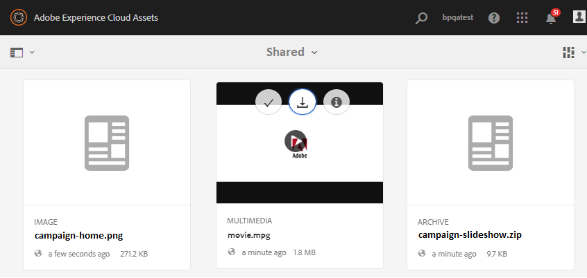
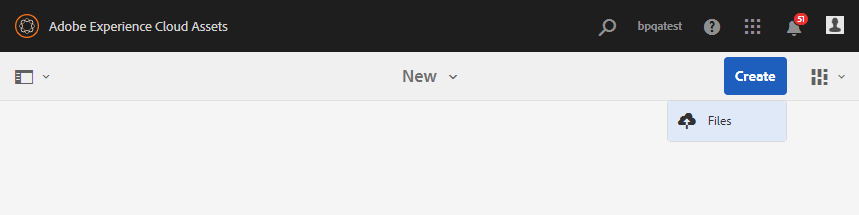

# Pubblicare la cartella dei contributi in AEM Assets {#using-asset-souring-in-bp}

Gli utenti di Brand Portal con le autorizzazioni appropriate possono caricare più risorse, o cartelle contenenti più risorse, nella cartella dei contributi. Tuttavia, gli utenti di Brand Portal possono caricare solo le risorse nella cartella **NEW** . La cartella **CONDIVISA** è destinata alla distribuzione delle risorse di base (contenuto di riferimento) che possono essere utilizzate dagli utenti di Brand Portal durante la creazione di nuove risorse da contribuire.

L’utente di Brand Portal che dispone dell’autorizzazione per accedere alla cartella dei contributi può eseguire le seguenti attività:

* [Scaricare i requisiti delle risorse](#download-asset-requirements)
* [Caricare nuove risorse nella cartella dei contributi](#uplad-new-assets-to-contribution-folder)
* [Pubblicare la cartella dei contributi in AEM Assets](#publish-contribution-folder-to-aem)

## Scaricare i requisiti delle risorse {#download-asset-requirements}

Gli utenti di Brand Portal ricevono automaticamente notifiche e-mail/impulso ogni volta che un utente di AEM condivide una cartella di contributi, consentendo loro di scaricare il breve documento (requisito della risorsa) e le risorse di base (contenuto di riferimento) dalla cartella **SHARED** per assicurarsi che comprendano i requisiti delle risorse.

L’utente di Brand Portal esegue le seguenti attività per scaricare i requisiti delle risorse:

* **Scarica breve**: Scarica il breve (documento dei requisiti delle risorse) allegato alla cartella dei contributi che contiene informazioni relative alle risorse come tipo di risorse, scopo, formati supportati, dimensione massima delle risorse, ecc.
* **Scaricare le risorse** della linea di base: Scarica le risorse di base che possono essere utilizzate per comprendere i tipi di risorse necessarie. Gli utenti di Brand Portal possono utilizzare queste risorse come riferimento per creare nuove risorse da contribuire.

Il dashboard di Brand Portal riflette tutte le cartelle esistenti consentite all’utente di Brand Portal insieme alla nuova cartella di contributi condivisi. In questo esempio, l’utente di Brand Portal ha accesso solo alla cartella dei contributi appena creata, mentre nessun’altra cartella esistente viene condivisa con l’utente.

**Per scaricare i requisiti delle risorse:**

1. Accedi all’istanza di Brand Portal.
1. Seleziona la cartella dei contributi dal dashboard di Brand Portal.
1. Fate clic su **[!UICONTROL Proprietà]** . Viene visualizzata la finestra della proprietà contenente i dettagli della cartella Contributo risorse .
   
1. Fai clic su **[!UICONTROL Scarica breve]**  per scaricare il documento sui requisiti delle risorse sul computer locale.
   
1. Torna alla dashboard di Brand Portal.
1. Fai clic per aprire la cartella dei contributi. Puoi visualizzare due sottocartelle:**[!UICONTROL SHARED]** e **[!UICONTROL NEW]** nella cartella dei contributi. La cartella SHARED contiene tutte le risorse della linea di base (contenuto di riferimento) condivise dagli amministratori.
1. È possibile scaricare la cartella **[!UICONTROL SHARED]** contenente tutte le risorse della linea di base sul computer locale.
In alternativa, è possibile aprire la cartella **[!UICONTROL CONDIVISA]** e fare clic sull&#39;icona **Scarica**  per scaricare singoli file/cartelle.
   

Per comprendere i requisiti relativi alle risorse, passa alla descrizione (documento sui requisiti delle risorse) e fai riferimento alle risorse della linea di base. Ora puoi creare nuove risorse per il contributo e caricarle nella cartella dei contributi.

## Caricare risorse nella cartella dei contributi {#uplad-new-assets-to-contribution-folder}

Dopo aver esaminato i requisiti delle risorse, gli utenti di Brand Portal possono creare nuove risorse da assegnare al contributo e caricarle nella cartella NEW all’interno della cartella Contribution.

>[!NOTE]
>
>Gli utenti di Brand Portal possono caricare le risorse solo nella cartella NEW .
>
>Il limite massimo di caricamento per qualsiasi tenant di Brand Portal è **10** GB, che viene applicato cumulativamente a tutte le cartelle dei contributi.

>[!NOTE]
>
>Si consiglia di rilasciare lo spazio di caricamento dopo la pubblicazione della cartella dei contributi in AEM Assets in modo che sia disponibile per i contributi agli altri utenti di Brand Portal.
>
>Se è necessario estendere il limite di caricamento del tenant di Brand Portal oltre **10** GB, contatta il supporto Adobe specificando il requisito.

**Per caricare nuove risorse:**

1. Accedi all’istanza di Brand Portal.
Il dashboard di Brand Portal riflette tutte le cartelle esistenti consentite all’utente di Brand Portal insieme alla nuova cartella di contributi condivisi.

1. Seleziona la cartella dei contributi e fai clic su per aprirla. La cartella Contributo contiene due sottocartelle: **[!UICONTROL SHARED]** e **[!UICONTROL NEW]**.

1. Fai clic sulla cartella **[!UICONTROL NEW]** .

   

1. Fai clic su **[!UICONTROL Crea]** > **[!UICONTROL File]** per caricare singoli file o cartelle (.zip) contenenti più risorse.

   

1. Sfoglia e carica le risorse (file o cartelle) nella cartella **[!UICONTROL NEW]** .

   

Dopo aver caricato tutte le risorse o le cartelle nella cartella NEW , pubblica la cartella Contribution in AEM Assets.

## Pubblicare la cartella dei contributi in AEM Assets {#publish-contribution-folder-to-aem}

Gli utenti di Brand Portal possono pubblicare la cartella dei contributi in AEM Assets senza dover accedere all’istanza di authoring di AEM.

Verifica di aver soddisfatto i requisiti delle risorse e carica le risorse appena create nella cartella **NEW** all’interno della cartella dei contributi.

**Per pubblicare la cartella dei contributi:**

1. Accedi all’istanza di Brand Portal.

1. Seleziona la cartella dei contributi dal dashboard di Brand Portal.
1. Fai clic su **[!UICONTROL Pubblica in AEM]**.

   

   

Una notifica e-mail/impulso viene inviata agli utenti e agli amministratori di Brand Portal in diverse fasi del flusso di lavoro di pubblicazione:
1. **In coda** : viene inviata una notifica agli utenti di Brand Portal e agli amministratori di Brand Portal quando viene attivato un flusso di lavoro di pubblicazione in Brand Portal.

1. **Completa** : una notifica viene inviata agli utenti di Brand Portal e agli amministratori di Brand Portal quando la cartella dei contributi viene pubblicata correttamente in AEM Assets.

Dopo aver pubblicato le risorse appena create in AEM Assets, gli utenti di Brand Portal possono eliminarle dalla NUOVA cartella. Al contrario, l’amministratore di Brand Portal può eliminare le risorse sia dalla cartella NEW che da quella SHARED.

Una volta raggiunto l’obiettivo di creare la cartella dei contributi, l’amministratore di Brand Portal può eliminare la cartella dei contributi per rilasciare lo spazio di caricamento per altri utenti.

**Stato del processo di pubblicazione**

Esistono due rapporti che gli amministratori possono utilizzare per visualizzare lo stato delle cartelle dei contributi delle risorse pubblicate da Brand Portal in AEM Assets.

* In Brand Portal, passa a **[!UICONTROL Strumenti]** > **[!UICONTROL Stato del contributo delle risorse]**. Questo rapporto riflette lo stato di tutti i processi di pubblicazione nelle diverse fasi del flusso di lavoro di pubblicazione.

   

* Nell’istanza di authoring di AEM Assets, passa a **[!UICONTROL Strumenti]** > **[!UICONTROL Processi]**. Questo rapporto riflette lo stato finale (Completato o Errore) di tutti i processi di pubblicazione.

   

>[!NOTE]
>
>L’interfaccia utente di AEM Assets as a Cloud Service può presentare una leggera differenza, ma il flusso di lavoro rimane invariato.

