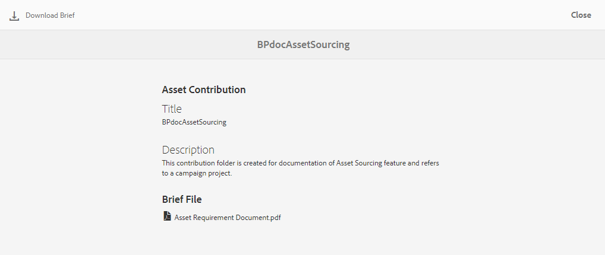
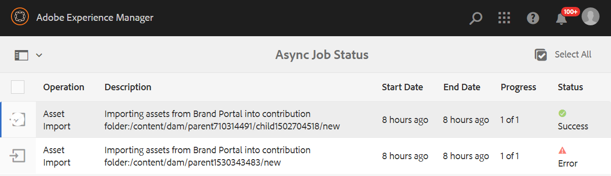

# Pubblicare la cartella dei contributi in Experience Manager Assets {#using-asset-souring-in-bp}

Gli utenti Brand Portal con le autorizzazioni appropriate possono caricare più risorse o cartelle contenenti più risorse nella cartella Contributo. Tuttavia, gli utenti Brand Portal possono caricare solo le risorse nel **NUOVO** cartella. La **CONDIVISO** Questa cartella è destinata alla distribuzione delle risorse della linea di base (contenuto di riferimento) che possono essere utilizzate dagli utenti di Brand Portal durante la creazione di nuove risorse da assegnare al contributo.

L’utente Brand Portal che dispone dell’autorizzazione per accedere alla cartella dei contributi può eseguire le seguenti attività:

* [Scaricare i requisiti delle risorse](#download-asset-requirements)
* [Caricare nuove risorse nella cartella dei contributi](#uplad-new-assets-to-contribution-folder)
* [Pubblicare la cartella dei contributi in Experience Manager Assets](#publish-contribution-folder-to-aem)

## Scaricare i requisiti delle risorse {#download-asset-requirements}

Gli utenti Brand Portal ricevono automaticamente notifiche e-mail/impulso ogni volta che una cartella di contributi viene condivisa dall’utente Experience Manager Assets, consentendo loro di scaricare il breve documento (requisito della risorsa) e le risorse di base (contenuto di riferimento) dal **CONDIVISO** per far sì che comprendano i requisiti delle risorse.

L’utente Brand Portal esegue le seguenti attività per scaricare i requisiti delle risorse:

* **Breve download**: Scarica il breve (documento dei requisiti delle risorse) allegato alla cartella dei contributi che contiene informazioni relative alle risorse come tipo di risorse, scopo, formati supportati, dimensione massima delle risorse, ecc.
* **Scaricare le risorse della linea di base**: Scarica le risorse di base che possono essere utilizzate per comprendere i tipi di risorse necessarie. Gli utenti di Brand Portal possono utilizzare queste risorse come riferimento per creare nuove risorse da assegnare ai contributi.

Il dashboard di Brand Portal riflette tutte le cartelle esistenti consentite all’utente di Brand Portal insieme alla cartella dei contributi appena condivisi. In questo esempio, l’utente Brand Portal ha accesso solo alla cartella dei contributi appena creata, mentre nessun’altra cartella esistente viene condivisa con l’utente.

**Per scaricare i requisiti delle risorse:**

1. Accedi alla tua istanza Brand Portal.
1. Seleziona la cartella Contributo dal dashboard di Brand Portal.
1. Fate clic su **[!UICONTROL Proprietà]**. Viene visualizzata la finestra Proprietà contenente i dettagli della cartella dei contributi.

   

   

1. Fai clic sul pulsante **[!UICONTROL Scarica breve]** per scaricare il documento dei requisiti delle risorse sul computer locale.

   

1. Torna al dashboard Brand Portal.
1. Fai clic per aprire la cartella dei contributi. Sono disponibili due sottocartelle:**[!UICONTROL CONDIVISO]** e **[!UICONTROL NUOVO]** nella cartella Contribution. La cartella SHARED contiene tutte le risorse della linea di base (contenuto di riferimento) condivise dagli amministratori.
1. È possibile scaricare **[!UICONTROL CONDIVISO]** cartella contenente tutte le risorse della linea di base nel computer locale.
Oppure, puoi aprire il **[!UICONTROL CONDIVISO]** e fai clic su **Scarica** per scaricare singoli file/cartelle.

   

   

Per comprendere i requisiti relativi alle risorse, passa alla descrizione (documento sui requisiti delle risorse) e fai riferimento alle risorse della linea di base. Ora puoi creare nuove risorse per il contributo e caricarle nella cartella dei contributi.

## Caricare risorse nella cartella Contribution {#uplad-new-assets-to-contribution-folder}

Dopo aver soddisfatto i requisiti delle risorse, gli utenti di Brand Portal possono creare nuove risorse per il contributo e caricarle nella cartella NEW all’interno della cartella Contribution. Un utente può caricare più risorse in una cartella contributo risorse. Tuttavia, è possibile creare una sola cartella alla volta.

>[!NOTE]
>
>Gli utenti Brand Portal possono caricare le risorse (massimo **2** GB per dimensione file) nella cartella NEW.
>
>Il limite massimo di caricamento per qualsiasi tenant Brand Portal è **10** GB applicato cumulativamente a tutte le cartelle dei contributi.
>
>Le risorse caricate in Brand Portal non vengono elaborate per le rappresentazioni e non contengono anteprime.

>[!NOTE]
>
>Si consiglia di rilasciare lo spazio di caricamento dopo la pubblicazione della cartella Contributo in Experience Manager Assets in modo che sia disponibile per gli altri utenti Brand Portal per il contributo.
>
>Se è necessario estendere il limite di caricamento del tenant Brand Portal oltre **10** GB, contatta l’Assistenza clienti specificando i requisiti.

**Per caricare nuove risorse:**

1. Accedi alla tua istanza Brand Portal.
Il dashboard di Brand Portal riflette tutte le cartelle esistenti consentite all’utente di Brand Portal insieme alla cartella dei contributi appena condivisi.

1. Seleziona la cartella dei contributi e fai clic su per aprirla. La cartella Contributo contiene due sottocartelle: **[!UICONTROL CONDIVISO]** e **[!UICONTROL NUOVO]**.

1. Fai clic sul pulsante **[!UICONTROL NUOVO]** cartella.

   

1. Fai clic su **[!UICONTROL Crea]** > **[!UICONTROL File]** per caricare singoli file o cartelle (.zip) contenenti più risorse.

   

1. Sfoglia e carica le risorse (file o cartelle) nel **[!UICONTROL NUOVO]** cartella.

   

Dopo aver caricato tutte le risorse o le cartelle nella cartella NEW , pubblica la cartella Contribution in Experience Manager Assets.

## Pubblicare la cartella dei contributi in Experience Manager Assets {#publish-contribution-folder-to-aem}

Gli utenti di Brand Portal possono pubblicare la cartella dei contributi in Experience Manager Assets senza dover accedere all’istanza di authoring di Experience Manager.

Assicurati di aver soddisfatto i requisiti delle risorse e di caricare le nuove risorse create in **NUOVO** all’interno della cartella Contribution.

**Per pubblicare la cartella dei contributi:**

1. Accedi alla tua istanza Brand Portal.

1. Seleziona la cartella Contributo dal dashboard di Brand Portal.
1. Fai clic su **[!UICONTROL Pubblica in AEM]**.

   

   

Una notifica e-mail/impulso viene inviata agli utenti e agli amministratori di Brand Portal in diverse fasi del flusso di lavoro di pubblicazione:

1. **In coda** - Viene inviata una notifica agli utenti Brand Portal e agli amministratori Brand Portal quando si attiva un flusso di lavoro di pubblicazione in Brand Portal.

1. **Completa** - Una notifica viene inviata agli utenti Brand Portal e agli amministratori Brand Portal quando la cartella dei contributi viene pubblicata correttamente in Experience Manager Assets.

Dopo aver pubblicato le risorse appena create in Experience Manager Assets, gli utenti Brand Portal possono eliminarle dalla cartella NEW. Al contrario, l’amministratore di Brand Portal può eliminare le risorse sia dalla cartella NEW che da quella SHARED.

Una volta raggiunto l’obiettivo di creare la cartella dei contributi, l’amministratore di Brand Portal può eliminare la cartella dei contributi per rilasciare lo spazio di caricamento per altri utenti.

## Stato del processo di pubblicazione {#publishing-job-status}

Esistono due rapporti che gli amministratori possono utilizzare per visualizzare lo stato delle cartelle dei contributi delle risorse pubblicate da Brand Portal a Experience Manager Assets.

* In Brand Portal, passa a **[!UICONTROL Strumenti]** > **[!UICONTROL Stato contributo risorsa]**. Questo rapporto riflette lo stato di tutti i processi di pubblicazione nelle diverse fasi del flusso di lavoro di pubblicazione.

   

* In Experience Manager Assets (on-premise o servizio gestito), passa a **[!UICONTROL Risorse]** > **[!UICONTROL Processi]**. Questo rapporto riflette lo stato finale (Completato o Errore) di tutti i processi di pubblicazione.

   

* In Experience Manager Assets as a Cloud Service, passa a **[!UICONTROL Risorse]** > **[!UICONTROL Processi]**.

   Oppure puoi passare direttamente a **[!UICONTROL Processi]** dalla navigazione globale.

   Questo rapporto riflette lo stato finale (Completato o Errore) di tutti i processi di pubblicazione, inclusa l’importazione di risorse da Brand Portal a Experience Manager Assets as a Cloud Service.

   

<!--
>[!NOTE]
>
>Currently, no report is generated in AEM Assets as a Cloud Service for the Asset Sourcing workflow. 
-->
