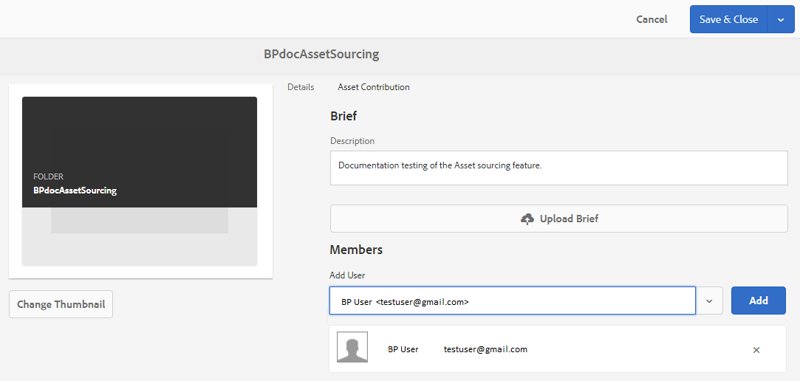

# Configurare la cartella dei contributi in Experience Manager Assets {#configure-contribution-folder}

Per l’origine collaborativa delle risorse, gli utenti di Experience Manager Assets (amministratori e utenti non amministratori autorizzati) possono creare nuove cartelle di tipo **Contributo risorse**, per garantire che la nuova cartella creata sia aperta all’invio di risorse da parte degli utenti di Brand Portal.  Questo attiva automaticamente un flusso di lavoro che crea due sottocartelle aggiuntive, denominate **CONDIVISO** e **NUOVO**, all&#39;interno del nuovo **Contributo** cartella.

L’utente di Experience Manager Assets definisce quindi i requisiti delle risorse caricando una breve descrizione dei tipi di risorse da aggiungere alla cartella dei contributi e un set di risorse previste nella **CONDIVISO** per garantire che gli utenti di Brand Portal dispongano delle informazioni necessarie. L’amministratore può quindi concedere agli utenti di Brand Portal attivi l’accesso alla cartella dei contributi prima di pubblicare in Brand Portal la cartella dei contributi appena creata.

Il video seguente illustra come configurare una cartella Contributi in Experience Manager Assets:

>[!VIDEO](https://video.tv.adobe.com/v/30547)

L’utente di Experience Manager Assets esegue le seguenti attività durante la configurazione di una cartella di contributi:

* [Crea cartella contributi](#create-contribution-folder)
* [Carica fabbisogni di risorse e assegna collaboratori](#configure-contribution-folder-properties)
* [Carica risorse di base](#uplad-new-assets-to-contribution-folder)
* [Pubblicare la cartella dei contributi da Experience Manager Assets a Brand Portal](#publish-contribution-folder-to-brand-portal)

## Crea cartella contributi {#create-contribution-folder}

Gli amministratori di Experience Manager Assets e gli utenti non amministratori autorizzati a creare una nuova cartella possono creare una cartella Contributi in Experience Manager Assets.
Per creare una cartella di contributi, crea una nuova cartella di tipo Contributo risorse, in modo che la nuova cartella creata sia aperta all’invio di risorse da parte degli utenti di Brand Portal.  Questo attiva automaticamente un flusso di lavoro che crea due sottocartelle aggiuntive, denominate CONDIVISO e NUOVO, all’interno della cartella dei contributi.

>[!NOTE]
>
>Gli amministratori possono creare più cartelle di contributi alle risorse all’interno di una cartella.
>
>Una cartella di contributi per le risorse contiene cartelle NUOVE e CONDIVISE per la distribuzione e il contributo delle risorse. Non creare una cartella di risorse, cartelle o contributi all&#39;interno di una cartella di contributi.

Puoi configurare le proprietà della cartella dei contributi separatamente e durante la creazione della cartella dei contributi. In questo esempio, stiamo configurando le proprietà separatamente.

**Per creare una cartella di contributi:**

1. Accedi all’istanza di Experience Manager Assets.

1. Accedi a **[!UICONTROL Risorse]** > **[!UICONTROL File]**. Elenca tutte le cartelle esistenti nell’archivio di Experience Manager Assets.

1. Clic **[!UICONTROL Crea]** per creare una nuova cartella. **[!UICONTROL Crea cartella]** viene visualizzata una finestra di dialogo.

1. Invio **[!UICONTROL Titolo]** e **[!UICONTROL Nome]** della cartella e seleziona la **[!UICONTROL Contributo risorse]** casella di controllo.
Si consiglia di utilizzare lettere minuscole senza spazio per denominare la cartella.

1. Fai clic su **[!UICONTROL Crea]**. Puoi visualizzare la cartella dei contributi elencata nell’archivio Experience Manager Assets.

   >[!NOTE]
   >
   >Un utente che non è amministratore può creare e condividere una cartella di contributi per le risorse, ma non può modificarla o eliminarla.

   

1. Fare clic per aprire la cartella Contributi, è possibile visualizzare due sottocartelle:**[!UICONTROL CONDIVISO]** e **[!UICONTROL NUOVO]** vengono create automaticamente nella cartella dei contributi.

   

## Configurare le proprietà della cartella contributi {#configure-contribution-folder-properties}

L’amministratore di Experience Manager Assets esegue le seguenti attività durante la configurazione delle proprietà di una cartella di contributi.

* **Aggiungi descrizione**: fornisci una descrizione di alto livello della cartella dei contributi.
* **Descrizione del caricamento**: carica il documento Fabbisogno risorse contenente le informazioni relative alle risorse.
* **Aggiungi collaboratori**: aggiungi gli utenti di Brand Portal per concedere loro l’accesso alla cartella dei contributi.

Il requisito risorsa si riferisce ai dettagli forniti dagli amministratori per aiutare i collaboratori (utenti Brand Portal) a comprendere le esigenze e i requisiti della cartella dei contributi. L’amministratore carica un documento sui requisiti delle risorse che contiene una descrizione del tipo di risorse da aggiungere alla cartella Contributi e informazioni relative alle risorse, ad esempio scopo, tipo di immagini, dimensione massima e così via.

**Per configurare le proprietà della cartella dei contributi:**

1. Accedi all’istanza di Experience Manager Assets.

1. Accedi a **[!UICONTROL Risorse > File]** e individuare la cartella dei contributi.
1. Seleziona la cartella dei contributi e fai clic su **[!UICONTROL Proprietà]** per aprire la finestra Proprietà cartella.

   

   

1. Accedi a **[!UICONTROL Contributo risorse]** scheda.
1. Inserisci il livello avanzato **[!UICONTROL Descrizione]** della cartella dei contributi.
1. Clic **[!UICONTROL Carica riepilogo]** per sfogliare dal computer locale e caricare un **Documento fabbisogno risorse**.

   

1. In **[!UICONTROL Aggiungi utente]** aggiungere utenti di Brand Portal con cui si desidera condividere la cartella dei contributi. Questi utenti possono accedere e caricare contenuti nella cartella dei contributi tramite l’interfaccia di Brand Portal.
1. Fai clic su **[!UICONTROL Salva]**.

   

>[!NOTE]
>
>I risultati della ricerca si basano sull’elenco di utenti di Brand Portal configurato in Experience Manager Assets. Verifica di disporre dell’elenco aggiornato degli utenti di Brand Portal.

Gli amministratori possono scaricare `user.csv` file da [!DNL Admin Console] e utilizzarlo come modello base per aggiungere utenti Brand Portal. Vai a [!UICONTROL Utenti] e fai clic sul pulsante [!UICONTROL Esporta elenco utenti in CSV] opzione per scaricare `users.csv` file. L’elenco di utenti di esempio seguente descrive gli attributi necessari per aggiungere gli utenti. L’unico attributo obbligatorio per una voce utente è `Email` e tutti gli altri attributi sono facoltativi.

[Ottieni file](assets/users.csv)

## Carica risorse nella cartella dei contributi {#uplad-new-assets-to-contribution-folder}

L’utente di Experience Manager Assets carica un set di risorse di base in **CONDIVISO** per garantire che gli utenti di Brand Portal dispongano delle informazioni necessarie.

**Per caricare le risorse previste:**

1. Accedi all’istanza di Experience Manager Assets.

1. Accedi a **[!UICONTROL Risorse > File]** e individuare la cartella dei contributi.

1. Selezionare la cartella dei contributi e fare clic per aprirla.

1. Fai clic sul pulsante **[!UICONTROL NUOVO]** cartella.

   

1. Clic **[!UICONTROL Crea]** > **[!UICONTROL File]** per caricare singoli file o cartelle (.zip) contenenti più risorse.

   

1. Sfogliare e caricare le risorse (file o cartelle) in **[!UICONTROL NUOVO]** cartella.

   

Dopo aver caricato tutte le risorse o cartelle nella nuova cartella, pubblica la cartella dei contributi in Experience Manager Assets.

## Pubblicare la cartella dei contributi in Brand Portal {#publish-contribution-folder-to-brand-portal}

Una volta configurata la cartella dei contributi, l’utente di Experience Manager Assets (amministratore/non amministratore) può pubblicarla da Experience Manager Assets a Brand Portal. Gli utenti di Brand Portal che dispongono dell’autorizzazione per accedere alla cartella dei contributi riceveranno una notifica e-mail/impulso al completamento dell’azione di pubblicazione.

**Per pubblicare la cartella dei contributi:**

1. Accedi all’istanza di Experience Manager Assets.

1. Accedi a **[!UICONTROL Risorse > File]** e individuare la cartella dei contributi in cui si desidera pubblicare in Brand Portal.
1. Seleziona la cartella dei contributi e fai clic su **[!UICONTROL Pubblicazione rapida]** > **[!UICONTROL Pubblica su Brand Portal]**.

   

   Riceverai un messaggio di successo dopo la pubblicazione della cartella dei contributi in Brand Portal.

Viene inviata una notifica e-mail/impulso agli utenti Brand Portal assegnati alla cartella Contributi. Gli utenti di Brand Portal possono accedere alla cartella dei contributi e iniziare a contribuire. Vedi, [Carica le risorse nella cartella Contributi e pubblicale in Experience Manager Assets](brand-portal-publish-contribution-folder-to-aem-assets.md).
