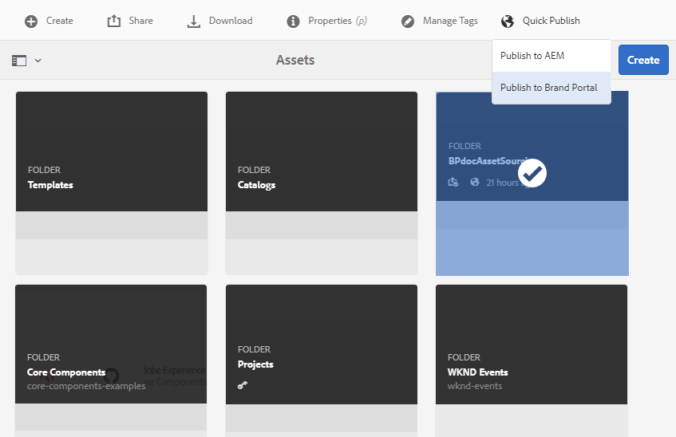

# Pubblica cartella dei contributi in Brand Portal {#publish-contribution-folder-to-brand-portal}

Una volta configurata [la cartella dei](brand-portal-configure-contribution-folder-properties.md)contributi, AEM utente (amministratore/non amministratore) può pubblicare la cartella dei contributi da  AEM Assets a Brand Portal. Gli utenti di Brand Portal che dispongono dell’autorizzazione per accedere alla cartella dei contributi riceveranno una notifica e-mail/impulso al completamento dell’azione di pubblicazione.

**Per pubblicare la cartella dei contributi:**

1. Effettuate l’accesso all’istanza AEM di creazione.
URL predefinito: http:// localhost:4502/aem/start.html
1. Andate a **[!UICONTROL Risorse > File]** e individuate la cartella dei contributi in cui desiderate pubblicare i contributi sul portale dei marchi.
1. Selezionate la cartella dei contributi e fate clic su **[!UICONTROL Pubblicazione rapida > Pubblica sul portale]** dei marchi.

   

   Dopo la pubblicazione della cartella dei contributi sul Brand Portal, riceverete un messaggio di riuscita.

Una notifica e-mail/impulso viene inviata agli utenti del Brand Portal assegnati alla cartella dei contributi. Gli utenti del Brand Portal possono accedere alla cartella dei contributi e iniziare a fornire contributi. Consultate [Caricare le risorse nella cartella](brand-portal-upload-assets-to-contribution-folder.md)Contribution.