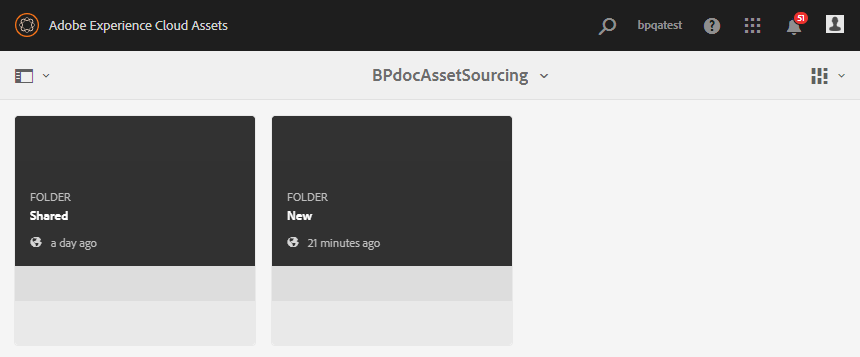

# Configurare la cartella dei contributi in Risorse AEM {#configure-contribution-folder}

Per l’origine collaborativa delle risorse, gli utenti AEM (amministratori e utenti non amministratori con autorizzazione) possono creare nuove cartelle di tipo **Contributo risorse**, garantendo che la nuova cartella creata sia aperta all’invio delle risorse da parte degli utenti di Brand Portal.  Questo attiva automaticamente un flusso di lavoro che crea due sottocartelle aggiuntive, denominate **SHARED** e **NEW**, all’interno della cartella **Contribution** appena creata.

L’utente AEM definisce quindi i requisiti delle risorse caricando una breve descrizione dei tipi di risorse da aggiungere alla cartella dei contributi, nonché un set di risorse della linea di base, nella cartella **CONDIVISA** per garantire che gli utenti di Brand Portal dispongano delle informazioni necessarie. L’amministratore può quindi concedere agli utenti attivi di Brand Portal l’accesso alla cartella dei contributi prima di pubblicare su Brand Portal la nuova cartella dei contributi.

Il video seguente illustra come configurare una cartella Contribution in AEM Assets:

>[!VIDEO](https://video.tv.adobe.com/v/30547)

L’utente AEM esegue le seguenti attività durante la configurazione di una cartella di contributi:

* [Crea cartella contributi](#create-contribution-folder)
* [Caricare i requisiti delle risorse e assegnare i collaboratori](#configure-contribution-folder-properties)
* [Caricare le risorse della linea di base](#uplad-new-assets-to-contribution-folder)
* [Pubblicare la cartella dei contributi da AEM Assets su Brand Portal](#publish-contribution-folder-to-brand-portal)

## Crea cartella contributi {#create-contribution-folder}

Gli amministratori AEM e gli utenti non amministratori che dispongono dell’autorizzazione per creare una nuova cartella possono creare una cartella di contributi in AEM Assets.
Per creare una cartella dei contributi, crea una nuova cartella di tipo Contributo risorse, in modo che la nuova cartella creata sia aperta all’invio delle risorse da parte degli utenti di Brand Portal.  Questo attiva automaticamente un flusso di lavoro che crea due sottocartelle aggiuntive, denominate SHARED e NEW, all’interno della cartella dei contributi.

>[!NOTE]
>
>Puoi creare più cartelle di contributi all’interno di una cartella. Non creare una cartella di contributo all’interno di un’altra cartella di contributo.

**Per creare una cartella di contributo:**
1. Accedi alla tua istanza di AEM Assets.

1. Passa a **[!UICONTROL Risorse]** > **[!UICONTROL File]**. Elenca tutte le cartelle esistenti nell’archivio di AEM Assets.

1. Fai clic su **[!UICONTROL Crea]** per creare una nuova cartella. **[!UICONTROL Viene visualizzata la finestra di dialogo Crea]** cartella .

1. Immetti **[!UICONTROL Titolo]** e **[!UICONTROL Nome]** della cartella e seleziona la casella di controllo **[!UICONTROL Contributo risorsa]** .
Si consiglia di utilizzare lettere minuscole senza spazio per denominare la cartella.

1. Fai clic su **[!UICONTROL Crea]**. Puoi vedere la cartella dei contributi elencata nell’archivio di AEM Assets.

   >[!NOTE]
   >
   >Un utente non amministratore può creare e condividere una cartella di contributo delle risorse ma non può modificarla o eliminarla.

   

1. Fai clic per aprire la cartella dei contributi. Puoi vedere due sottocartelle:**[!UICONTROL SHARED]** e **[!UICONTROL NEW]** vengono create automaticamente all’interno della cartella dei contributi.

   

È ora possibile configurare le proprietà della cartella dei contributi.

## Configura le proprietà della cartella dei contributi {#configure-contribution-folder-properties}

L’amministratore AEM esegue le seguenti attività durante la configurazione delle proprietà di una cartella di contributi.

* **Aggiungi descrizione**: Fornisci una descrizione di alto livello della cartella dei contributi.
* **Carica breve**: Carica il documento Requisito risorse contenente informazioni relative alle risorse.
* **Aggiungi collaboratori**: Aggiungi gli utenti di Brand Portal per garantire loro l’accesso alla cartella dei contributi.

Per requisito risorsa si intendono i dettagli forniti dagli amministratori per aiutare i collaboratori (utenti di Brand Portal) a comprendere la necessità e i requisiti della cartella dei contributi. L’amministratore carica un documento relativo ai requisiti delle risorse che contiene una breve descrizione del tipo di risorse da aggiungere alla cartella Contributo e alle informazioni relative alle risorse, ad esempio scopo, tipo di immagini, dimensione massima, ecc.

**Per configurare le proprietà della cartella dei contributi:**

1. Accedi alla tua istanza di AEM Assets.

1. Passa a **[!UICONTROL Risorse > File]** e individua la cartella dei contributi.
1. Seleziona la cartella dei contributi e fai clic su **[!UICONTROL Proprietà]** per aprire la finestra delle proprietà della cartella.

   

   

1. Passa alla scheda **[!UICONTROL Contributo risorsa]** .
1. Immetti un livello elevato **[!UICONTROL Descrizione]** della cartella Contributo.
1. Fai clic su **[!UICONTROL Carica descrizione]** per sfogliare il computer locale e caricare un **Documento sui requisiti delle risorse**.

   

1. Nel campo **[!UICONTROL Aggiungi utente]** , aggiungi gli utenti di Brand Portal con cui desideri condividere la cartella dei contributi. Questi utenti possono accedere e caricare il contenuto nella cartella dei contributi utilizzando l’interfaccia di Brand Portal.
1. Fai clic su **[!UICONTROL Salva]**.

   

>[!NOTE]
>
>I risultati della ricerca si basano sull’elenco di utenti di Brand Portal configurato in AEM Assets. Assicurati di disporre dell’elenco utenti aggiornato di Brand Portal.

## Caricare risorse nella cartella dei contributi {#uplad-new-assets-to-contribution-folder}

Gli utenti di Brand Portal possono scaricare i requisiti delle risorse per comprendere la necessità di un contributo.
Possono quindi creare nuove risorse per il contributo e caricarle nella cartella NEW all’interno della cartella Contribution.

>[!NOTE]
>
>Gli utenti di Brand Portal possono caricare le risorse solo nella cartella NEW .
>
>Il limite massimo di caricamento per qualsiasi tenant di Brand Portal è **10** GB, che viene applicato cumulativamente a tutte le cartelle dei contributi.

Dopo aver pubblicato le risorse appena create in AEM Assets, gli utenti di Brand Portal possono eliminarle dalla NUOVA cartella. Al contrario, l’amministratore di Brand Portal può eliminare le risorse sia dalla cartella NEW che da quella SHARED.

Una volta raggiunto l’obiettivo di creare la cartella dei contributi, l’amministratore di Brand Portal può eliminare la cartella dei contributi per rilasciare lo spazio di caricamento per altri utenti.

>[!NOTE]
>
>Si consiglia di rilasciare lo spazio di caricamento dopo la pubblicazione della cartella dei contributi in AEM Assets in modo che sia disponibile per i contributi agli altri utenti di Brand Portal.
>
>Se è necessario estendere il limite di caricamento del tenant di Brand Portal oltre **10** GB, contatta il supporto Adobe specificando il requisito.

**Per caricare nuove risorse:**

1. Accedi all’istanza di Brand Portal.
Il dashboard di Brand Portal riflette tutte le cartelle esistenti consentite all’utente di Brand Portal insieme alla nuova cartella di contributi condivisi.

1. Seleziona la cartella dei contributi e fai clic su per aprirla. La cartella Contributo contiene due sottocartelle: **[!UICONTROL SHARED]** e **[!UICONTROL NEW]**.

1. Fai clic sulla cartella **[!UICONTROL NEW]** .

   

1. Fai clic su **[!UICONTROL Crea]** > **[!UICONTROL File]** per caricare singoli file o cartelle (.zip) contenenti più risorse.

   

1. Sfoglia e carica le risorse (file o cartelle) nella cartella **[!UICONTROL NEW]** .

   

Dopo aver caricato tutte le risorse o le cartelle nella cartella NEW , pubblica la cartella Contribution in AEM Assets.

## Pubblicare la cartella dei contributi su Brand Portal {#publish-contribution-folder-to-brand-portal}

Una volta configurata la cartella dei contributi, l’utente AEM (amministratore/utente non amministratore) può pubblicare la cartella dei contributi da AEM Assets su Brand Portal. Gli utenti di Brand Portal che dispongono dell’autorizzazione per accedere alla cartella dei contributi riceveranno una notifica e-mail/impulso al completamento dell’azione di pubblicazione.

**Per pubblicare la cartella dei contributi:**

1. Accedi alla tua istanza di AEM Assets.

1. Passa a **[!UICONTROL Risorse > File]** e individua la cartella dei contributi in cui vuoi pubblicare su Brand Portal.
1. Seleziona la cartella dei contributi e fai clic su **[!UICONTROL Pubblicazione rapida]** > **[!UICONTROL Pubblica su Brand Portal]**.

   

   Dopo la pubblicazione della cartella dei contributi su Brand Portal riceverai un messaggio di successo.

Viene inviata una notifica e-mail/impulso agli utenti di Brand Portal assegnati alla cartella dei contributi. Gli utenti di Brand Portal possono accedere alla cartella dei contributi e iniziare il contributo. Consulta [Caricare risorse nella cartella dei contributi e pubblicare su AEM Assets](brand-portal-publish-contribution-folder-to-aem-assets.md).
