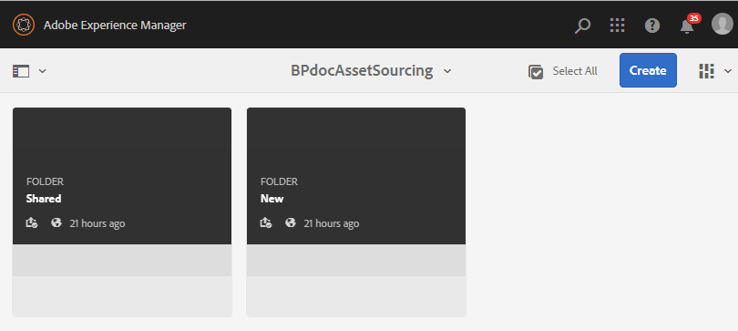

# Configurare la cartella dei contributi in Experience Manager Assets {#configure-contribution-folder}

Per l’origine collaborativa delle risorse, gli utenti di Experience Manager Assets (amministratori e utenti non amministratori con autorizzazione) possono creare nuove cartelle di tipo **Contributo risorse**, garantendo che la nuova cartella creata sia aperta all’invio delle risorse da parte degli utenti Brand Portal.  Questo attiva automaticamente un flusso di lavoro che crea due sottocartelle aggiuntive, denominate **SHARED** e **NEW**, all’interno della cartella **Contribution** appena creata.

L’utente Experience Manager Assets definisce quindi i requisiti delle risorse caricando una breve descrizione dei tipi di risorse da aggiungere alla cartella dei contributi, nonché un set di risorse della linea di base, nella cartella **SHARED** per garantire che gli utenti Brand Portal dispongano delle informazioni necessarie. L’amministratore può quindi concedere agli utenti Brand Portal attivi l’accesso alla cartella dei contributi prima di pubblicare la nuova cartella Contribution in Brand Portal.

Il video seguente illustra come configurare una cartella Contribution in Experience Manager Assets:

>[!VIDEO](https://video.tv.adobe.com/v/30547)

L’utente Experience Manager Assets esegue le seguenti attività durante la configurazione di una cartella di contributi:

* [Crea cartella contributi](#create-contribution-folder)
* [Caricare i requisiti delle risorse e assegnare i collaboratori](#configure-contribution-folder-properties)
* [Caricare le risorse della linea di base](#uplad-new-assets-to-contribution-folder)
* [Pubblicare la cartella dei contributi da Experience Manager Assets a Brand Portal](#publish-contribution-folder-to-brand-portal)

## Crea cartella contributi {#create-contribution-folder}

Gli amministratori di Experience Manager Assets e gli utenti non amministratori che dispongono dell’autorizzazione per creare una nuova cartella possono creare una cartella di contributo in Experience Manager Assets.
Per creare una cartella dei contributi, crea una nuova cartella di tipo Contributo risorse, in modo che la nuova cartella creata sia aperta all’invio delle risorse da parte degli utenti Brand Portal.  Questo attiva automaticamente un flusso di lavoro che crea due sottocartelle aggiuntive, denominate SHARED e NEW, all’interno della cartella dei contributi.

>[!NOTE]
>
>Gli amministratori possono creare più cartelle di contributi delle risorse all’interno di una cartella.
>
>Una cartella contributo risorse contiene cartelle NUOVE e CONDIVISE per la distribuzione e il contributo delle risorse. Non creare una risorsa, una cartella o una cartella di contributo all’interno di una cartella di contributo.

È possibile configurare le proprietà della cartella dei contributi separatamente e durante la creazione della cartella dei contributi. In questo esempio, configuriamo le proprietà separatamente.

**Per creare una cartella di contributo:**

1. Accedi alla tua istanza Experience Manager Assets.

1. Passa a **[!UICONTROL Risorse]** > **[!UICONTROL File]**. Elenca tutte le cartelle esistenti nell&#39;archivio Experience Manager Assets.

1. Fai clic su **[!UICONTROL Crea]** per creare una nuova cartella. **[!UICONTROL Viene visualizzata la finestra di dialogo Crea]** cartella .

1. Immetti **[!UICONTROL Titolo]** e **[!UICONTROL Nome]** della cartella e seleziona la casella di controllo **[!UICONTROL Contributo risorsa]** .
Si consiglia di utilizzare lettere minuscole senza spazio per denominare la cartella.

1. Fai clic su **[!UICONTROL Crea]**. Puoi visualizzare la cartella dei contributi elencata nell’archivio di Experience Manager Assets.

   >[!NOTE]
   >
   >Un utente non amministratore può creare e condividere una cartella di contributo delle risorse ma non può modificarla o eliminarla.

   

1. Fai clic per aprire la cartella dei contributi. Puoi vedere due sottocartelle:**[!UICONTROL SHARED]** e **[!UICONTROL NEW]** vengono create automaticamente all’interno della cartella dei contributi.

   

## Configurare le proprietà della cartella dei contributi {#configure-contribution-folder-properties}

L’amministratore di Experience Manager Assets esegue le attività seguenti durante la configurazione delle proprietà di una cartella di contributi.

* **Aggiungi descrizione**: Fornisci una descrizione di alto livello della cartella dei contributi.
* **Carica breve**: Carica il documento Requisito risorse contenente informazioni relative alle risorse.
* **Aggiungi collaboratori**: Aggiungi gli utenti Brand Portal per concedere loro l’accesso alla cartella dei contributi.

Per requisito risorsa si intendono i dettagli forniti dagli amministratori per aiutare i collaboratori (utenti Brand Portal) a comprendere la necessità e i requisiti della cartella dei contributi. L’amministratore carica un documento relativo ai requisiti delle risorse che contiene una breve descrizione del tipo di risorse da aggiungere alla cartella Contributo e alle informazioni relative alle risorse, ad esempio scopo, tipo di immagini, dimensione massima, ecc.

**Per configurare le proprietà della cartella dei contributi:**

1. Accedi alla tua istanza Experience Manager Assets.

1. Passa a **[!UICONTROL Risorse > File]** e individua la cartella dei contributi.
1. Seleziona la cartella dei contributi e fai clic su **[!UICONTROL Proprietà]** per aprire la finestra delle proprietà della cartella.

   

   

1. Passa alla scheda **[!UICONTROL Contributo risorsa]** .
1. Immetti un livello elevato **[!UICONTROL Descrizione]** della cartella Contributo.
1. Fai clic su **[!UICONTROL Carica descrizione]** per sfogliare il computer locale e caricare un **Documento sui requisiti delle risorse**.

   

1. Nel campo **[!UICONTROL Aggiungi utente]** , aggiungi gli utenti Brand Portal con cui desideri condividere la cartella dei contributi. Questi utenti possono accedere e caricare il contenuto nella cartella dei contributi utilizzando l’interfaccia di Brand Portal.
1. Fai clic su **[!UICONTROL Salva]**.

   

>[!NOTE]
>
>I risultati della ricerca si basano sull’elenco di utenti Brand Portal configurato in Experience Manager Assets. Verifica di disporre dell’elenco utenti Brand Portal aggiornato.

Gli amministratori possono scaricare il file `user.csv` da [!DNL Admin Console] e usarlo come modello di base per l’aggiunta di utenti Brand Portal. Vai a [!UICONTROL Utenti] e fai clic sull&#39;opzione [!UICONTROL Esporta utenti in csv] per scaricare il file `users.csv`. Nell’elenco degli utenti di esempio riportato di seguito sono descritti gli attributi necessari per aggiungere gli utenti. L’unico attributo obbligatorio per una voce utente è `Email` e tutti gli altri attributi sono facoltativi.

[Ottieni file](assets/users.csv)

## Caricare risorse nella cartella Contribution {#uplad-new-assets-to-contribution-folder}

Gli utenti di Brand Portal possono scaricare i requisiti delle risorse per comprendere la necessità di un contributo.
Possono quindi creare nuove risorse per il contributo e caricarle nella cartella NEW all’interno della cartella Contribution.

>[!NOTE]
>
>Gli utenti Brand Portal possono caricare le risorse solo nella cartella NEW .
>
>Il limite massimo di caricamento per qualsiasi tenant Brand Portal è **10** GB, che viene applicato cumulativamente a tutte le cartelle dei contributi.

Dopo aver pubblicato le risorse appena create in Experience Manager Assets, gli utenti Brand Portal possono eliminarle dalla cartella NEW. Al contrario, l’amministratore di Brand Portal può eliminare le risorse sia dalla cartella NEW che da quella SHARED.

Una volta raggiunto l’obiettivo di creare la cartella dei contributi, l’amministratore di Brand Portal può eliminare la cartella dei contributi per rilasciare lo spazio di caricamento per altri utenti.

>[!NOTE]
>
>Si consiglia di rilasciare lo spazio di caricamento dopo la pubblicazione della cartella Contributo in Experience Manager Assets in modo che sia disponibile per gli altri utenti Brand Portal per il contributo.
>
>Se è necessario estendere il limite di caricamento del tenant Brand Portal oltre **10** GB, contatta l’Assistenza clienti specificando il requisito.

**Per caricare nuove risorse:**

1. Accedi alla tua istanza Brand Portal.
Il dashboard di Brand Portal riflette tutte le cartelle esistenti consentite all’utente di Brand Portal insieme alla cartella dei contributi appena condivisi.

1. Seleziona la cartella dei contributi e fai clic su per aprirla. La cartella Contributo contiene due sottocartelle: **[!UICONTROL SHARED]** e **[!UICONTROL NEW]**.

1. Fai clic sulla cartella **[!UICONTROL NEW]** .

   

1. Fai clic su **[!UICONTROL Crea]** > **[!UICONTROL File]** per caricare singoli file o cartelle (.zip) contenenti più risorse.

   

1. Sfoglia e carica le risorse (file o cartelle) nella cartella **[!UICONTROL NEW]** .

   

Dopo aver caricato tutte le risorse o le cartelle nella cartella NEW , pubblica la cartella Contribution in Experience Manager Assets.

## Pubblicare la cartella dei contributi in Brand Portal {#publish-contribution-folder-to-brand-portal}

Una volta configurata la cartella dei contributi, l’utente Experience Manager Assets (amministratore/non amministratore) può pubblicare la cartella dei contributi da Experience Manager Assets a Brand Portal. Gli utenti Brand Portal che dispongono dell’autorizzazione per accedere alla cartella dei contributi riceveranno una notifica e-mail/impulso al completamento dell’azione di pubblicazione.

**Per pubblicare la cartella dei contributi:**

1. Accedi alla tua istanza Experience Manager Assets.

1. Passa a **[!UICONTROL Risorse > File]** e individua la cartella dei contributi in cui vuoi pubblicare in Brand Portal.
1. Seleziona la cartella dei contributi e fai clic su **[!UICONTROL Pubblicazione rapida]** > **[!UICONTROL Pubblica in Brand Portal]**.

   

   Dopo la pubblicazione della cartella Contributo in Brand Portal, riceverai un messaggio di successo.

Viene inviata una notifica e-mail/impulso agli utenti Brand Portal assegnati alla cartella dei contributi. Gli utenti Brand Portal possono accedere alla cartella dei contributi e iniziare il contributo. Consulta [Caricare risorse nella cartella Contribution e pubblicare su Experience Manager Assets](brand-portal-publish-contribution-folder-to-aem-assets.md).
