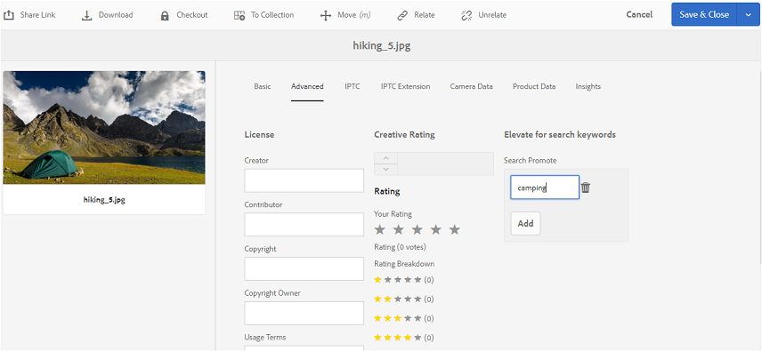

# Publish tags to Brand Portal {#publish-tags-to-brand-portal}

Scopri come pubblicare i tag da [!DNL AEM] Risorse a [!DNL Brand Portal].

I tag sono utili per organizzare le risorse e migliorare la ricerca delle risorse alle quali sono associate. I tag possono essere considerate come parole chiave o etichette (metadati) associati alle risorse e consentono di trovare rapidamente le risorse come risultato di una ricerca. Per sapere come assegnare tag alle risorse in [!DNL AEM] Risorse, consulta [Usare i tag per organizzare le risorse](https://helpx.adobe.com/experience-manager/6-5/assets/using/organize-assets.html#Usetagstoorganizeassets).

I tag (associati a risorse e raccolte in [!DNL AEM]) vengono pubblicati automaticamente su [!DNL Brand Portal] quando vengono pubblicate le risorse (e le raccolte) con i tag associati [!DNL Brand Portal]. I tag pubblicati sono utili per abilitare le ricerche per individuare le risorse associate.

>[!NOTE]
>
>È tuttavia consigliabile pubblicare i tag in modo esclusivo [!DNL Brand Portal] prima di pubblicare le risorse (e raccolte) con cui sono associati. Questo garantisce una pubblicazione più veloce delle risorse (e raccolte) a [!DNL Brand Portal].

## Manage tags {#manage-tags}

Potete usare i tag preesistenti da allegare a una risorsa o creare nuovi tag dalla [!DNL AEM] console Tag (**Strumenti) | Assegnazione tag |[!DNL AEM]Tag**). In entrambe le situazioni è necessario prima pubblicare i tag e [!DNL Brand Portal] associarli a risorse appropriate.

Per creare tag su [!DNL AEM], pubblicare i tag e [!DNL Brand Portal]associarli con risorse appropriate (o raccolte), effettuate le seguenti operazioni:

1. **Create Tag**
Sign to [!DNL AEM] Author Instance with administrative privileges, and access **[!DNL AEM]Tags** console from global navigation:

   1. Seleziona **strumenti**

   2. Seleziona **generale**

   3. Selezionare **i tag**

2. Selezionate **Crea,** quindi selezionate **Crea tag.**
3. Specificate:

   * **Titolo**
      *(obbligatorio)* Un titolo di visualizzazione per il tag.
   * **Nome**
      *(obbligatorio)* Un nome per il tag. Se non viene specificato, viene creato un nome di nodo valido dal Titolo. Consultate [tagid](https://helpx.adobe.com/experience-manager/6-5/sites/developing/using/framework.html#TagID).
   * **Descrizione**
      *(Facoltativo)* Una descrizione del tag.
   * **Percorso**JCR percorso
del tag.

4. Selezionate **Invia** per creare il tag.

   Dopo aver creato un tag, [!DNL AEM] il tag sarà disponibile per essere allegato a una risorsa (utilizzando la sezione Proprietà o Gestisci tag della risorsa).

5. **Pubblicate il tag in[!DNL Brand Portal]**.

   Vai alla **[!DNL AEM]console Tag** (Strumenti) | Assegnazione tag | [!DNL AEM] Tag), selezionate il tag desiderato e Pubblica in **[!DNL Brand Portal]**.

6. **Allegare il tag a una risorsa (o raccolta)**.

   Selezionate una risorsa (o una raccolta) e allegate il tag desiderato utilizzando la sezione Proprietà o Gestisci tag della risorsa. Per ulteriori informazioni su come assegnare tag alle risorse in [!DNL AEM] Risorse, consulta [Utilizzare i tag per organizzare le risorse](https://helpx.adobe.com/experience-manager/6-5/assets/using/organize-assets.html#Usetagstoorganizeassets).

7. **Pubblicate le risorse (o raccolte) in[!DNL Brand Portal]**.\
   Quando pubblicate una risorsa (o raccolta) in, [!DNL Brand Portal]il [!DNL Brand Portal]tag allegato è disponibile anche.

   Per visualizzare il tag allegato sulla rispettiva risorsa (o raccolta) in [!DNL Brand Portal], accedete e [!DNL Brand Portal] selezionate la risorsa, nella sezione Proprietà visualizzerete il tag allegato.

## Promozione ricerca {#search-promote}

[!DNL AEM] Risorse [!DNL Brand Portal] consente di creare risorse specifiche come risultati principali per le ricerche basate su un tag parola chiave.

Per alzare una risorsa per una parola chiave di ricerca, effettuate le seguenti operazioni:

1. Aprite la **pagina Proprietà** di una risorsa nell'istanza [!DNL AEM] di creazione.
2. Vai alla **scheda Avanzate** .
3. In **Search Promote (Promuovi)** nella sezione **Elevate for search keywords** (Incremento delle parole chiave), selezionate **Aggiungi** per aggiungere le parole chiave o i tag di ricerca.

   

4. Salvate le modifiche.
5. Publish the asset to [!DNL Brand Portal].
6. Accedi a [!DNL Brand Portal]. Scheda Visualizza **avanzate** nella **sezione Proprietà** della risorsa.
La parola chiave **Search Promote** è visibile anche nelle proprietà della risorsa.
