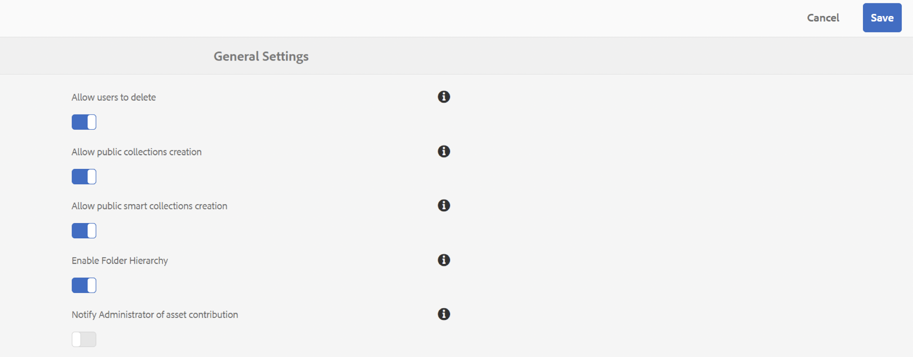

# Note sulla versione {#release-notes}

Scopri le nuove funzioni, i miglioramenti, i problemi critici risolti e i problemi noti nella versione 2023.08.0 di Adobe Experience Manager Assets Brand Portal.

## Informazioni sulla versione {#release-information}

| Prodotto | Adobe Experience Manager Assets Brand Portal |
|---|---|
| Versione | 2023.08.0 |
| Data | Agosto 2023 |

## Panoramica {#overview}

Adobe Experience Manager (AEM) Assets Brand Portal consente di acquisire, controllare e distribuire in modo semplice e sicuro le risorse creative approvate a parti esterne e utenti aziendali interni tra i dispositivi. Consente di migliorare l’efficienza della condivisione delle risorse, accelera il time-to-market delle risorse e riduce il rischio di non conformità e di accesso non autorizzato. Brand Portal consente agli utenti di sfogliare, cercare, visualizzare in anteprima, scaricare ed esportare le risorse in formati approvati dall&#39;azienda, in qualsiasi momento e ovunque.

## Novità della versione 2023.08.0 {#whats-new-in-2023.08.0}

### Problemi critici risolti {#critical-issues-fixed}

#### Correzioni di bug e miglioramenti {#bug-fixes-enhancements}

Questa versione include i seguenti miglioramenti:

* Miglioramenti delle prestazioni durante il caricamento delle risorse sulla [!UICONTROL Scarica] pop up.
* Quando scarichi una risorsa o ne esegui il rendering, questa viene scaricata nel formato di file originale e non in un file zip.

Questa versione include le seguenti correzioni di bug:

* Le etichette lunghe o i tag non vengono visualizzati correttamente per i filtri di ricerca.
* Impossibile visualizzare i nomi delle rappresentazioni lunghe nella finestra di dialogo Scarica.
* Impossibile visualizzare in anteprima le risorse video nella vista a schede.

## Versioni precedenti

### Versione di maggio 2023 {#may-2023}

**Correzioni di bug**
Questa versione include correzioni ai seguenti problemi critici:

* Se si verifica un errore durante il download di una risorsa da un collegamento condiviso, il `Notice` e `Close` le etichette del prompt degli errori non sono localizzate.
* Schermi Brand Portal **Campi intestazione richiesta troppo grandi** errore durante l’accesso ai filtri di ricerca tramite `Filter` riquadro.

**Problemi noti**
Questa versione include i seguenti problemi noti:

* Localizzazione parziale nel contenuto del rapporto Asset sourcing.
* Pochi campi del profilo utente non sono modificabili nel profilo utente.

### Versione di febbraio 2023 {#feb-2023}

**Correzioni di bug**

Questa versione include correzioni ai seguenti problemi critici:

* Impossibile aggiornare l&#39;immagine del profilo in Brand Portal.
* Il riquadro della struttura del contenuto non è ridimensionabile. Se il nome del file è più lungo della larghezza predefinita della struttura contenuto, non è possibile trascinare la struttura contenuto in orizzontale e in verticale. Di conseguenza, i nomi di file più lunghi non sono leggibili.
* I risultati della ricerca non sono coerenti per lo stesso predicato di proprietà utilizzato due volte nei moduli di ricerca.
* Il testo nelle pagine di accesso intermedie non è localizzato per tutte le lingue.

**Miglioramenti**

Questa versione include i seguenti miglioramenti:

* È ora disponibile un nuovo visualizzatore PDF moderno per una migliore anteprima delle risorse PDF.
* Ora puoi scegliere di abilitare o disabilitare le notifiche di asset sourcing per gli amministratori. Accedi a [!UICONTROL Impostazioni generali] e quindi attiva o disattiva [!UICONTROL `Notify Administrator of asset contribution`].

  

* Un utente non autorizzato non può richiedere l’accesso al Brand Portal se la richiesta di accesso è disabilitata.
* Nell’elenco di selezione dei profili sono visibili solo le organizzazioni per le quali è stato eseguito il provisioning di Brand Portal.

**Problemi noti**

Questa versione include i seguenti problemi noti:

* Localizzazione parziale nel contenuto del rapporto Asset sourcing.
* Pochi campi del profilo utente non sono modificabili nel profilo utente.

### Versione di ottobre 2022 {#oct-2022}

**Problemi critici risolti**

Questa versione include correzioni ai seguenti problemi critici:

* Tempi di risposta lenti durante la copia di file di grandi dimensioni da Brand Portal a uno strumento di terze parti.
* Quando si seleziona la casella di controllo Numero di copie trasformate, le caselle di controllo per selezionare le singole copie trasformate sono disattivate.
* Tempo di risposta lento per la ricerca.

>[!IMPORTANT]
>
>Le notifiche Pulse in AEM Assets Brand Portal cesseranno a partire dal 1° dicembre 2022. Invece delle notifiche Pulse, continuerai a ricevere notifiche e-mail per i seguenti eventi:
>* Condivisione di risorse tramite collegamento
>* Flusso di lavoro di richiesta di accesso
>* Condivisione della cartella dei contributi
>* Avvio dell’esportazione verso l’AEM
>* Esportazione in AEM completata
>

### Versione di agosto 2022 {#aug-2022}

**Problemi critici risolti**

Questa versione include correzioni ai seguenti problemi critici:

* Quando NUI non riesce a elaborare una risorsa in Experience Manager, Brand Portal mostra uno stato di importazione della risorsa non accurato.
* Quando l’azione di anteprima non riesce, non viene inviata alcuna notifica per comunicare l’errore.
* È stato corretto un valore non preciso per la proprietà totalUploadedSize di ogni risorsa.
* Quando fai clic su **Scarica tutti gli elementi** e sono disponibili numerose rappresentazioni di una risorsa, Brand Portal scarica un file .ZIP non valido.
* La traduzione di alcune stringhe viene troncata nell’interfaccia utente di Brand Portal.

### Versione di maggio 2022 {#may-2022}

**Nuove funzioni**

Brand Portal ora esegue processi automatici ogni dodici ore per eliminare tutte le risorse Brand Portal pubblicate in AEM. Di conseguenza, non è necessario eliminare manualmente le risorse nella cartella Contributo per mantenere la dimensione della cartella al di sotto del limite di soglia.

**Problemi critici risolti**

Questa versione include correzioni ai seguenti problemi critici:

* Quando si scarica una cartella o una raccolta che include risorse con tag colore, viene scaricato anche un file XML.
* Quando scarichi un video che include rappresentazioni, Brand Portal crea un file .ZIP non valido.
* Quando crei predefiniti e risorse in AEM author e li pubblichi in Brand Portal e selezioni rappresentazioni dinamiche durante il download delle risorse, non puoi estrarre il file .ZIP scaricato.
* Problemi durante il download di risorse video da determinate cartelle disponibili su Brand Portal.
* Quando si condivide l’URL della cartella Contribution tramite e-mail, i ruoli Visualizzatore ed Editor riscontrano problemi durante l’accesso alla cartella principale tramite la breadcrumb.
* Nel rapporto di sourcing pubblicato viene visualizzata un&#39;ora di inizio del processo non corretta.

### Versione di febbraio 2022 {#feb-2022}

**Nuove funzioni**

* La soglia di timeout della sessione per gli utenti guest è stata ridotta da 2 ore a 15 minuti.
* Il valore aggiuntivo **[!UICONTROL Visualizza pagine]** L’opzione è stata rimossa per i PDF con più pagine in quanto l’utente ora può visualizzare le pagine dei PDF dal visualizzatore Adobe Document Cloud.
* Gli utenti non sono in grado di cercare, navigare o aprire le cartelle. L’interfaccia utente visualizza il messaggio di errore: `Failed to load data`.
* Il **[!UICONTROL Rappresentazioni]** Il pannello non elenca tutte le rappresentazioni statiche delle risorse pubblicate in Brand Portal.
* Il **[!UICONTROL Rappresentazioni]** nel pannello sono elencate le rappresentazioni con ritaglio avanzato della risorsa, ma l’utente non può visualizzarle in anteprima né scaricarle.
* La finestra di dialogo per il download elenca le rappresentazioni con ritaglio avanzato della risorsa selezionata. Tuttavia, l’utente non può scaricare le rappresentazioni con ritaglio avanzato.
* Quando si scarica una risorsa, un utente che non è amministratore riceve solo il rendering originale della risorsa. Il sistema e le rappresentazioni personalizzate non vengono scaricate.
* Quando si applica un filtro di ricerca per scaricare una risorsa, il `Download` è disattivato nella finestra di dialogo di download e non consente all’utente di scaricare la risorsa.
* Se `Smart Tags` e (o) `Color Tags` sono attivati, nella finestra di dialogo per il download sono elencate le opzioni `json` file come copie trasformate e download `json` file nella cartella zip archiviata.
* Gli utenti anonimi non possono scaricare le risorse utilizzando un collegamento condiviso perché il collegamento reindirizza alla pagina di accesso di Brand Portal.
* Il sistema non riflette il valore corretto per il numero di utenti simultanei attivi.

<!--
### New Features {#new-features}

This release includes the following new features:

* AEM Assets as a Cloud Service is now entitled to have a pre-configured Brand Portal instance. The Cloud Manager user can activate Brand Portal on the AEM Assets as a Cloud Service instance.

* Asset Sourcing feature is now available on AEM Assets as a Cloud Service. It allows the Brand Portal users to upload assets to the permitted contribution folders and publish the contribution folder from Brand Portal to AEM Assets as a Cloud Service instance. 

* An additional **[!UICONTROL Asset Download]** setting has been introduced under the **[!UICONTROL Download Settings]**. It creates a separate folder for each asset while downloading the folders, collections, or bulk download of assets. 
-->
<!-- 
* The **[!UICONTROL Download]** dialog is revamped in a list view with additional options to exclude the renditions which are not required, apply the same set of rules for similar asset types, and download the selected asset renditions.
-->

<!--
* The new **[!UICONTROL Download]** dialog now appears with all the renditions of the selected assets or folders containing assets in a list view, wherein the Brand Portal users can apply same set of renditions for similar asset types and download the selected asset renditions. 
-->

<!-- 
* Navigation to the **[!UICONTROL Files]**, **[!UICONTROL Collections]**, and **[!UICONTROL Shared Links]** is now possible from all the Brand Portal pages in one-click.  

* The **[!UICONTROL Renditions]** panel in the asset details page now allows the Brand Portal users to select the original asset and (or) specific asset renditions, and directly download them from the **[!UICONTROL Renditions]** panel without having to open the **[!UICONTROL Download]** dialog.
-->

<!--
Brand Portal users can exclude specific renditions which are not required and directly download the original asset and its renditions from the **[!UICONTROL Renditions]** panel on the asset details page. 
-->

<!-- 
* In addition to the existing **[!UICONTROL Download]** configurations, the Brand Portal administrators can also [configure permissions for different group of users]() to view and (or) download the original asset and its renditions from the asset details page. These configurations will define who can access and (or) download the asset renditions.
-->

<!--
### Enhancements {#enhancements}

Brand Portal 2021.08.0 is an internal release that introduces Business profiles for enterprise and teams customers to give organizations better control over their assets. 

This release includes the following enhancements:

* The users now have organization-specific entitlement on the new and migrated organizations. If a user is entitled to multiple organizations, the user has to select the organization at the time of login.

* The new users that are added in Admin Console must **Join Team** to get entitled to the organization. 

>[!NOTE]
>
>Business profiles are currently applicable for the new organizations that are created after August 16, 2021. 
>
>Until your organization is migrated, you can continue to use Adobe ID, Enterprise ID, or Federated ID types to access the organization.   
-->

<!-- 
* For folder download, a separate folder is created for each asset using share link irrespective of the **[!UICONTROL Download Settings]**. 
* The Brand Portal **[!UICONTROL Usage Report]** has been modified to reflect only the active Brand Portal users.
-->

<!--
* The threshold of session timeout for the guest users has been reduced from 2 hours to 15 minutes.
* The additional **[!UICONTROL View pages]** option has been removed for multi-page PDFs as the user can now view the PDF pages from the Adobe Document Cloud Viewer.

* The users are unable to search, navigate, or open folders. The user interface reflects the error message: `Failed to load data`. 
* The **[!UICONTROL Renditions]** panel does not list all the static renditions of the assets that are published to Brand Portal.
* The **[!UICONTROL Renditions]** panel lists the smart crop renditions of the asset, however, the user cannot preview or download the smart crop renditions.
* The download dialog lists the smart crop renditions of the selected asset, however, the user cannot download the smart crop renditions. 
* A non-admin user is getting only the original asset rendition when downloading an asset. The system and custom renditions are not downloaded.  
* When applying search filter to download an asset, the `Download` button is disabled in the download dialog and does not allows the user to download the asset.
* If `Smart Tags` and (or) `Color Tags` are enabled, the download dialog lists the `json` files as renditions and downloads these `json` files in the archived zip folder.
* The anonymous users are unable to download assets using a shared link because the link redirects to the Brand Portal login page. 
* The system is not reflecting the correct value for the number of active concurrent users.
-->

<!--
### New features {#new-features}

Brand Portal now executes automatic jobs every twelve hours to delete all Brand Portal assets that are published to AEM. As a result, you do not need to delete the assets in the Contribution folder manually to keep the folder size below the threshold limit. See [What's new in Experience Manager Assets Brand Portal](whats-new.md).
-->

<!--
This release includes fixes to the following critical issues:

* When you download a folder or a collection that includes assets with color tags, an XML file gets downloaded as well.

* When you download a video that includes renditions, Brand Portal creates an invalid .ZIP file.

* When you create presets and assets on AEM author and publish them to Brand Portal and then select dynamic renditions while downloading the assets, you cannot extract the downloaded .ZIP file.

* Issues while downloading video assets from certain folders available on Brand Portal.

* When you share the Contribution folder's URL using an email, Viewer and Editor roles face issues while accessing its parent folder using the breadcrumb.

* Sourcing published report displays an incorrect job start time.
>
 
<!--
* Asset Sourcing email notifications are not delivered for some organizations. 

* Video files with extension `.mov` are not running on Brand Portal. 

* In the **[!UICONTROL Smart Collections]** dropdown list, only ten saved collections are visible. 
-->
<!--
* *_deleted tenants are listed as valid tenant which fails during the execution of TenantCustomizers/TenantUpdates where tenant id is returned as /etc/tenants/`<nodename>`.
-->

<!--
In case only the original assets are downloaded, the asset reflects its own extension and does not open until the extension is manually changed to zip. 
* The user interface of the collection folder does not respond on clicking the navigation arrow. 
* **[!UICONTROL Create]** button is visible in the **[!UICONTROL Column]** view even when the folders are empty.
* **[!UICONTROL Omni search]** fails with a 414 error message (Request-URI Too Long) if the dispatcher is bypassed while accessing the Brand Portal instance.
* An empty zip folder is downloaded if the asset contains a comma (`,`) in the file name.
* The viewer users get the option to add users to the collection they have created. 
* Inconsistent behavior is experienced when an asset (thumbnail or web rendition) is downloaded using share link.

See [what's new in Brand Portal 2021.02.0](whats-new.md).
-->

<!--
### Known Issues {#known-issues}

This release includes the following known issue:

* Search on the **[!UICONTROL Asset Reports]** shows processing on the product interface with no search result.
* The video DM encodes are not visible to the non-admin users on the asset details page.
* The alignment of the size of individual asset renditions and total download size is distorted in the Download dialog.
-->

<!--
* Download Settings configuration to configure asset download from Brand Portal. Fast download, custom renditions, and system renditions are the available configurations. 
-->

<!--
* Document Viewer has been introduced to enhance the PDF viewing experience. New options are available for viewing the PDF files in Brand Portal.

* Advances in the asset download process which improves the Brand Portal user experience while [downloading assets from Brand Portal](brand-portal-download-assets.md). Brand Portal administrators can configure **[!UICONTROL Fast Download]**, **[!UICONTROL Custom Renditions]**, and **[!UICONTROL System Renditions]** from the **[!UICONTROL Download]** settings. 

For details, see [what's new in Brand Portal 6.4.7](whats-new.md). 

### Critical Issues Fixed {#critical-issues-fixed-647}

This release includes fixes to the following critical issues:

* The viewer users are not permitted to share link for collections but the option to share is visible to them on the product interface.

* The **[!UICONTROL Download]** button on the options bar does not list all the licensed assets of the selected folder.

* The search takes longer to show the results for certain keywords.

* The **[!UICONTROL Agree]** and **[!UICONTROL Disagree]** check boxes does not appear on bulk selection of licensed and unlicensed assets during download.

* Filter-based search shows processing on the product interface with no search result. 

* The assets do not download from share link if the shared folder contains numerous and large assets.

### Known Issues {#known-issues-647}

This release includes the following known issues:

* If multiple assets are selected, license text does not appear on clicking Terms and Conditions on the license agreement page during download using share link.   

-->

## Lingue {#languages}

L’interfaccia utente di Brand Portal è disponibile nelle seguenti lingue:

* Inglese
* Tedesco
* Francese
* Spagnolo
* Italiano
* Portoghese brasiliano
* Giapponese
* Cinese semplificato
* Coreano

## Piattaforme certificate {#certified-platforms}

Per verificare quali piattaforme sono certificate per l’esecuzione con questa versione di Brand Portal, consulta **Supporto per l’interfaccia touch** nella tabella in **Browser supportati per l&#39;authoring dell&#39;interfaccia utente** sezione di [Requisiti tecnici](https://experienceleague.adobe.com/docs/experience-manager-65/deploying/introduction/technical-requirements.html).

## Collegamenti {#links}

* [Pagina prodotto Adobe Experience Manager su adobe.com](https://business.adobe.com/in/products/experience-manager/adobe-experience-manager.html)
* [Documentazione di Assets Brand Portal](https://experienceleague.adobe.com/docs/experience-manager-brand-portal/using/home.html)

## Accesso e supporto ai prodotti (siti con restrizioni) {#product-access-and-support-restricted-sites}

Questi siti sono disponibili solo per i clienti. Se sei un cliente e vuoi accedervi, contatta il tuo account manager Adobe.

<!--
* [https://daycare.day.com](https://daycare.day.com) 
-->

<!--
* [Customer Support]()
-->
