# Utilizzare i rapporti {#work-with-reports}

La funzionalità di reporting è fondamentale per valutare l’utilizzo di Brand Portal e sapere in che modo gli utenti interni ed esterni interagiscono con le risorse approvate. Gli amministratori possono visualizzare il rapporto Utilizzo Brand Portal , sempre disponibile nella pagina Rapporti su risorse . Tuttavia, i rapporti relativi agli accessi utente e alle risorse scaricate, scadute, pubblicate e condivise tramite i collegamenti possono essere generati e visualizzati dalla pagina Rapporti sulle risorse . Questi rapporti sono utili per analizzare la distribuzione delle risorse, che consentono di derivare metriche di successo chiave per misurare l’adozione di risorse approvate all’interno e all’esterno dell’organizzazione.

L’interfaccia di gestione dei rapporti è intuitiva e include opzioni e controlli a grana fine per accedere ai rapporti salvati. Puoi visualizzare, scaricare o eliminare i rapporti dalla pagina Rapporti su risorse , in cui sono elencati tutti i rapporti generati in precedenza.

## Visualizzare i rapporti {#view-reports}

Per visualizzare un rapporto, effettua le seguenti operazioni:

1. Dalla barra degli strumenti nella parte superiore, tocca o fai clic sul logo Experience Manager per accedere agli strumenti amministrativi.

   

1. Dal pannello degli strumenti amministrativi, fai clic su **[!UICONTROL Crea/Gestisci rapporti]** per aprire la pagina **[!UICONTROL Rapporti su risorse]**.

   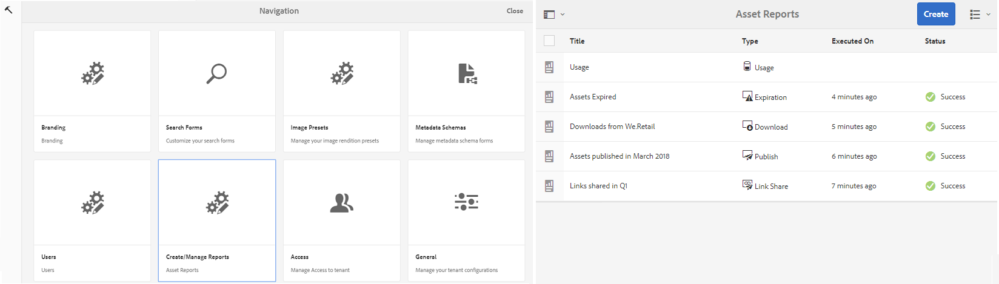

1. Accedi al rapporto **[!UICONTROL Utilizzo]** e ad altri rapporti generati dalla pagina Rapporti su risorse .

   >[!NOTE]
   >
   >Il rapporto di utilizzo è un rapporto predefinito generato in Brand Portal. Non può essere creato o eliminato. Tuttavia, puoi creare, scaricare ed eliminare i rapporti Download, Scadenza, Pubblicazione, Condivisione collegamenti e Registri utente.

   Per visualizzare un rapporto, fai clic sul collegamento del rapporto. In alternativa, seleziona il rapporto e tocca o fai clic sull’icona Visualizza nella barra degli strumenti.

   **[!UICONTROL In]** Report utilizzo vengono visualizzate informazioni sul numero di utenti Brand Portal attivi, sullo spazio di archiviazione occupato da tutte le risorse e sul conteggio totale delle risorse in Brand Portal. Gli utenti del brand portal che non sono assegnati ad alcun profilo di prodotto nell’Admin Console sono considerati utenti inattivi e non vengono riportati nel **[!UICONTROL Rapporto sull’utilizzo]**.
Il rapporto mostra anche la capacità consentita per ciascuna di queste metriche di informazioni.

   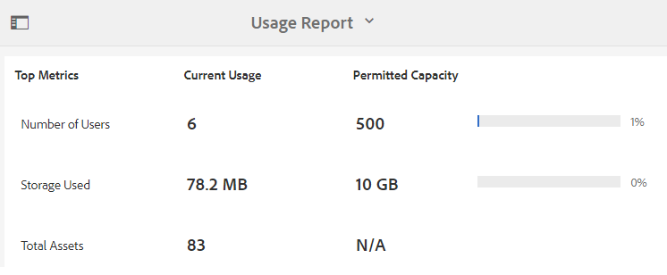

   **[!UICONTROL User]** Loginsreport fornisce informazioni sugli utenti che hanno effettuato l&#39;accesso a Brand Portal. Il rapporto mostra nomi visualizzati, ID e-mail, utenti tipo (amministratore, visualizzatore, editor, ospite), gruppi, ultimo accesso, stato dell’attività e conteggio di accesso di ogni utente dalla distribuzione Brand Portal 6.4.2 fino al momento della generazione del rapporto.

   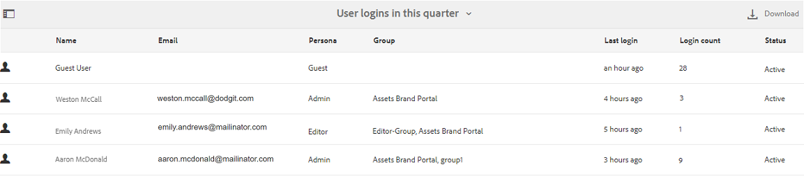

   **** Scaricare elenchi di rapporti e dettagli su tutte le risorse scaricate in un intervallo di date e ore specifico.

   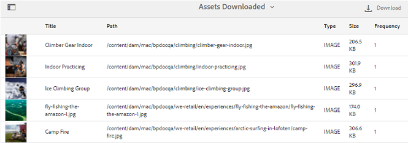

   >[!NOTE]
   >
   >Il rapporto **[!UICONTROL Scarica]** delle risorse visualizza solo le risorse selezionate e scaricate singolarmente da Brand Portal. Se un utente ha scaricato una cartella contenente risorse, il rapporto non visualizza la cartella o le risorse all’interno della cartella.

   **** Il rapporto sulla scadenza elenca e fornisce dettagli su tutte le risorse scadute in un intervallo di tempo specifico.

   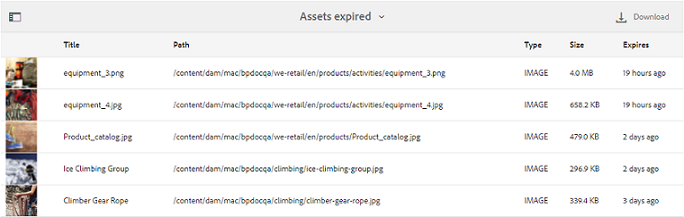

   **** Il rapporto di pubblicazione elenca e fornisce informazioni su tutte le risorse pubblicate da Experience Manager Assets in Brand Portal in un intervallo di tempo specificato.

   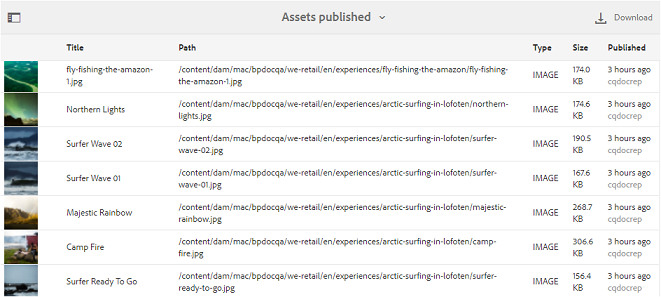

   >[!NOTE]
   >
   >Pubblica rapporto non visualizza informazioni sui frammenti di contenuto, in quanto i frammenti di contenuto non possono essere pubblicati in Brand Portal.

   **[!UICONTROL I]** rapporti Condivisione collegamenti elencano tutte le risorse condivise tramite collegamenti dall’interfaccia di Brand Portal in un intervallo di tempo specifico. Il rapporto informa anche quando la risorsa è stata condivisa tramite collegamento, in base a quale utente, quando scade il collegamento e il numero di collegamenti condivisi per il tenant (e gli utenti con cui è stato condiviso il collegamento della risorsa). Le colonne del rapporto Condivisione collegamenti non sono personalizzabili.

   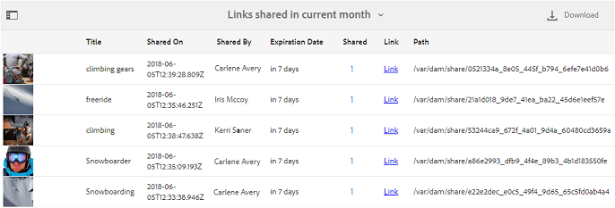

   >[!NOTE]
   >
   >Il rapporto Condivisione collegamenti non visualizza gli utenti che hanno accesso alla risorsa condivisa tramite il collegamento o che hanno scaricato la risorsa tramite il collegamento.
   >
   >Per tenere traccia dei download attraverso il collegamento condiviso, è necessario generare un rapporto di download dopo aver selezionato l&#39;opzione **[!UICONTROL Solo download di condivisione dei collegamenti]** nella pagina **[!UICONTROL Crea rapporto]**. Tuttavia, l&#39;utente (scaricato da) è anonimo in questo caso.

## Genera report {#generate-reports}

Gli amministratori possono generare e gestire i seguenti rapporti standard, una volta generati, in modo che siano [accessibili](../using/brand-portal-reports.md#main-pars-header) più tardi:

* Accessi utenti
* Scarica
* Scadenza
* Pubblicazione
* Condivisione collegamenti

Le colonne del rapporto Download, Scadenza e Pubblicazione possono essere personalizzate per la visualizzazione. Per generare un rapporto, effettua le seguenti operazioni:

1. Dalla barra degli strumenti nella parte superiore, tocca o fai clic sul logo Experience Manager per accedere agli strumenti amministrativi.

1. Dal pannello degli strumenti amministrativi, tocca o fai clic su **[!UICONTROL Crea/gestisci rapporti]** per aprire la pagina **[!UICONTROL Rapporti sulle risorse]**.

   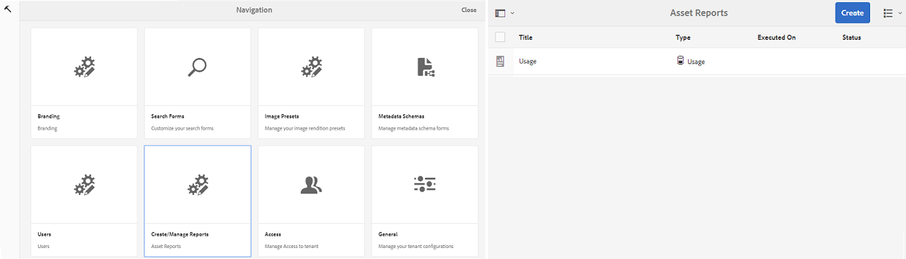

1. Nella pagina Rapporti su risorse, tocca o fai clic su **[!UICONTROL Crea]**.
1. Dalla pagina **[!UICONTROL Crea rapporto]**, seleziona un rapporto da creare e tocca o fai clic su **[!UICONTROL Avanti]**.

   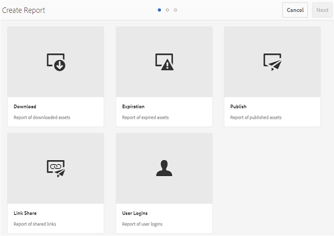

1. Configura i dettagli del rapporto. Specifica il titolo, la descrizione, la struttura della cartella (in cui il rapporto deve essere eseguito e generato statistiche) e l&#39;intervallo di date per i rapporti **[!UICONTROL Download]**, **[!UICONTROL Scadenza]** e **[!UICONTROL Pubblicazione]**.

   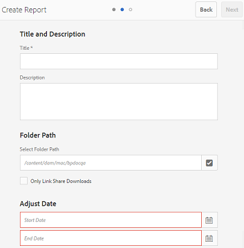

   Al contrario, **[!UICONTROL Rapporto condivisione collegamenti]** richiede solo i parametri del titolo, della descrizione e dell&#39;intervallo di date.

   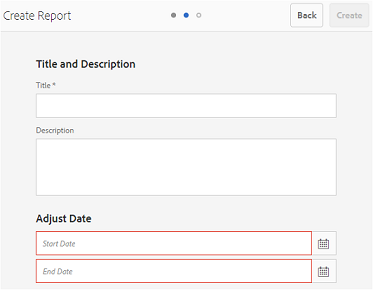

   >[!NOTE]
   >
   >I caratteri speciali # e % nel titolo del rapporto sono sostituiti da un trattino (-) nella generazione del rapporto.

1. Tocca o fai clic su **[!UICONTROL Avanti]** per configurare le colonne dei rapporti Download, Scadenza e Pubblicazione.
1. Seleziona o deseleziona le caselle di controllo appropriate in base alle esigenze. Ad esempio, per visualizzare i nomi degli utenti (che hanno scaricato le risorse) nel rapporto **[!UICONTROL Download]** , seleziona **[!UICONTROL Scaricato da]**. L&#39;immagine seguente illustra la selezione delle colonne predefinite nel rapporto di download.

   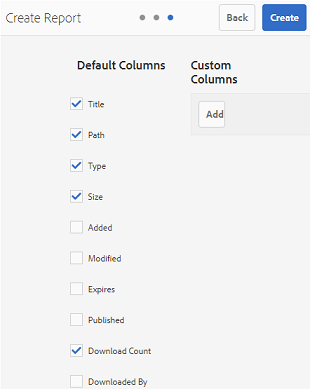

   Puoi anche aggiungere colonne personalizzate a questi rapporti per visualizzare più dati per le tue esigenze personalizzate.

   Per aggiungere colonne personalizzate al rapporto Scarica, Pubblica o Scadenza, effettua le seguenti operazioni:

   1. Per visualizzare una colonna personalizzata, tocca o fai clic su **[!UICONTROL Aggiungi]** in [!UICONTROL Colonne personalizzate].
   1. Specifica il nome della colonna nel campo **[!UICONTROL Nome colonna]** .
   1. Seleziona la proprietà a cui deve essere associata la colonna utilizzando il selettore delle proprietà.

      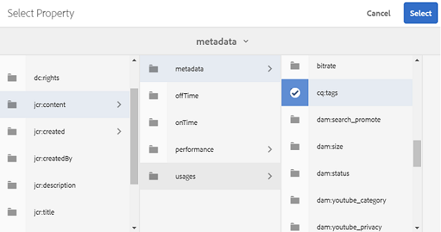
In alternativa, digitare il percorso nel campo percorso della proprietà.

      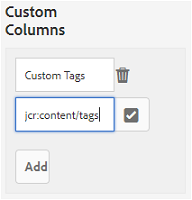

      Per aggiungere altre colonne personalizzate, tocca o fai clic su **Aggiungi** e ripeti i passaggi 2 e 3.

1. Tocca o fai clic su **[!UICONTROL Crea]**. Un messaggio notifica l’avvio della generazione del rapporto.

## Download dei rapporti {#download-reports}

Per salvare e scaricare un rapporto come file .csv, effettua una delle seguenti operazioni:

* Seleziona un rapporto nella pagina Rapporti su risorse e tocca o fai clic su **[!UICONTROL Scarica]** nella barra degli strumenti in alto.

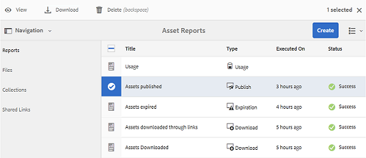

* Dalla pagina Rapporti su risorse , apri un rapporto. Seleziona l’opzione **[!UICONTROL Scarica]** nella parte superiore della pagina del rapporto.

## Eliminare i rapporti {#delete-reports}

Per eliminare un rapporto esistente, selezionalo dalla pagina **[!UICONTROL Rapporti sulle risorse]** e tocca o fai clic su **[!UICONTROL Elimina]** nella barra degli strumenti in alto.

>[!NOTE]
>
>**** Impossibile eliminare Usagereport.
