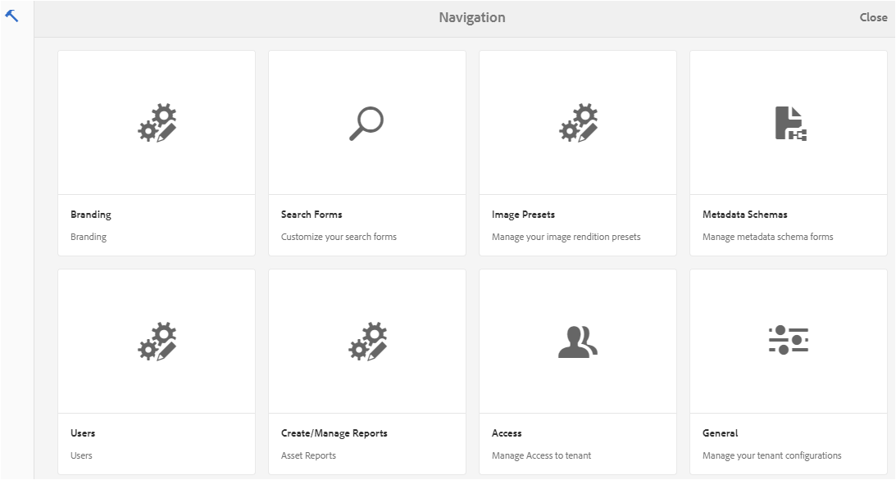
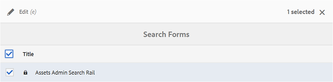
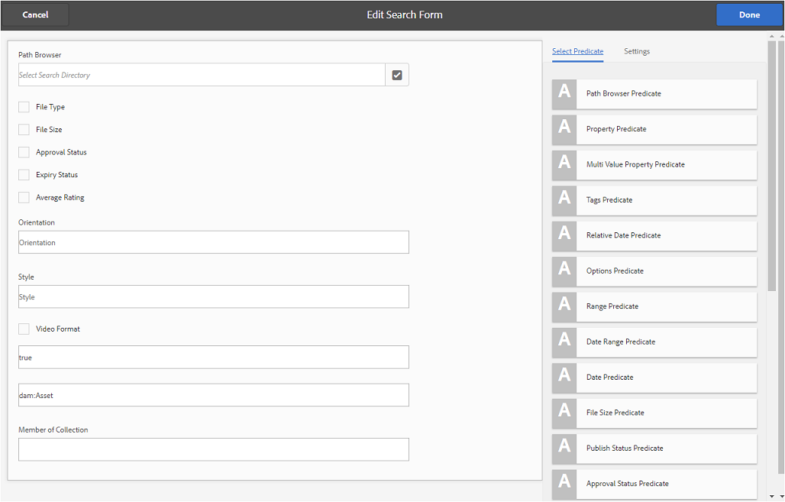
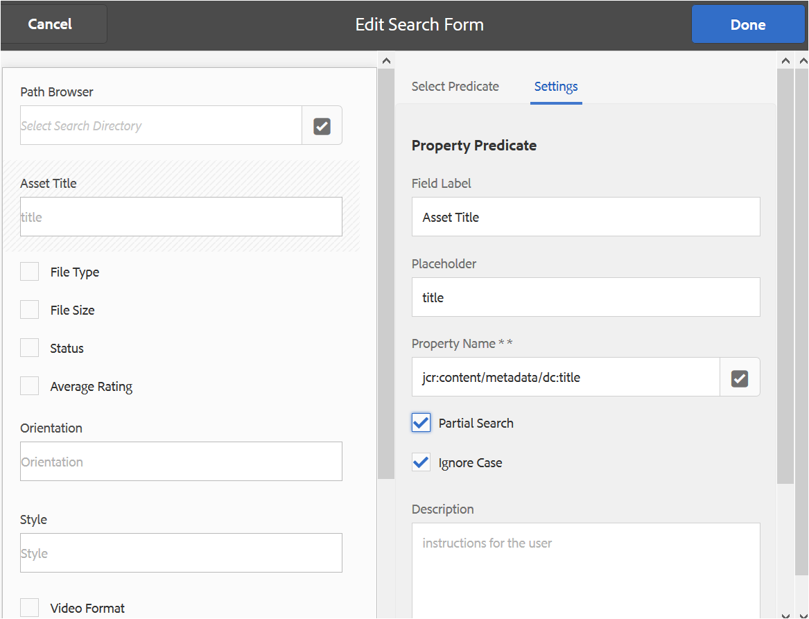
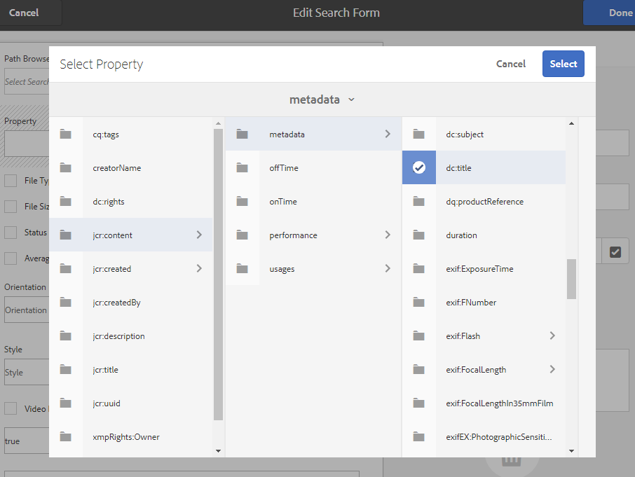
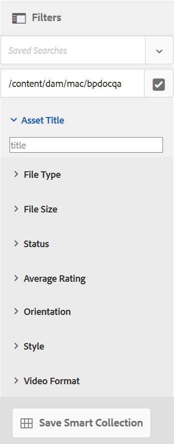
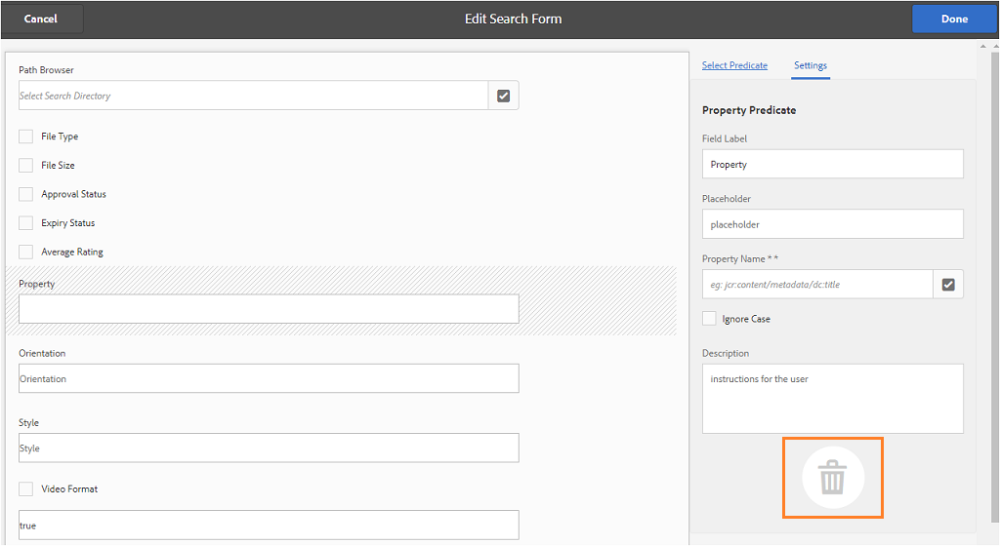

# Utilizzare i facet di ricerca personalizzati {#use-custom-search-facets}

Gli amministratori possono aggiungere i predicati di ricerca al pannello [!UICONTROL Filtri] per personalizzare la ricerca e rendere versatile la funzionalità di ricerca.

Brand Portal supporta la [ricerca sfaccettata](../using/brand-portal-searching.md#search-using-facets-in-filters-panel) per ricerche granulari di risorse di marchio approvate, possibile a causa del pannello [**Filtri**](../using/brand-portal-searching.md#search-using-facets-in-filters-panel). I facet di ricerca sono disponibili nel pannello Filtri tramite **[!UICONTROL Modulo di ricerca]** negli strumenti di amministrazione. Nella pagina Ricerca in Forms in Strumenti di amministrazione esiste un modulo di ricerca predefinito denominato Barra di ricerca amministrazione risorse. Tuttavia, gli amministratori possono personalizzare il pannello Filtri predefiniti modificando il modulo di ricerca predefinito (Barra di ricerca per amministratori risorse) aggiungendo, modificando o rimuovendo i predicati di ricerca, rendendo così versatile la funzionalità di ricerca.

Puoi utilizzare vari predicati di ricerca per personalizzare il pannello **[!UICONTROL Filtri]** . Ad esempio, aggiungi il predicato proprietà per cercare le risorse corrispondenti a una singola proprietà specificata in questo predicato. Aggiungi il predicato delle opzioni per cercare le risorse corrispondenti a uno o più valori specificati per una particolare proprietà. Aggiungi il predicato dell’intervallo di date per cercare le risorse create all’interno di un intervallo di date specificato.

>[!NOTE]
>
>AEM consente alle organizzazioni di [pubblicare i moduli di ricerca personalizzati da AEM Author](../using/publish-schema-search-facets-presets.md#publish-search-facets-to-brand-portal) a Brand Portal, invece di ricreare lo stesso modulo su Brand Portal.

## Aggiungi un predicato di ricerca {#add-a-search-predicate}

Per aggiungere un predicato di ricerca al pannello **[!UICONTROL Filtri]**:

1. Per accedere agli strumenti amministrativi, fai clic sul logo AEM nella barra degli strumenti in alto.

   

1. Dal pannello degli strumenti amministrativi, fai clic su **[!UICONTROL Cerca in Forms]**.

   

1. Nella pagina **[!UICONTROL Ricerca in Forms]**, seleziona **[!UICONTROL Barra di ricerca amministrazione risorse]**.

   

1. Sulla barra degli strumenti visualizzata nella parte superiore, fai clic su **[!UICONTROL Modifica]** per aprire il modulo di ricerca per la modifica.

   

1. Nella pagina [!UICONTROL Modifica modulo di ricerca] , trascina un predicato dalla scheda [!UICONTROL Seleziona predicato] nel riquadro principale. Ad esempio, trascinare **[!UICONTROL Predicato proprietà]**.

   Il campo **[!UICONTROL Proprietà]** viene visualizzato nel riquadro principale e la scheda **[!UICONTROL Impostazioni]** a destra visualizza i predicati delle proprietà.

   

   >[!NOTE]
   >
   >L’etichetta dell’intestazione nella scheda **[!UICONTROL Impostazioni]** identifica il tipo di predicato selezionato.

1. Nella scheda **[!UICONTROL Impostazioni]** , immetti un’etichetta, un testo segnaposto e una descrizione per il predicato proprietà.

   * Seleziona **[!UICONTROL Ricerca parziale]** per consentire la ricerca parziale di frasi (e ricerche con caratteri jolly) in base al valore della proprietà specificato. Per impostazione predefinita, il predicato supporta la ricerca full-text.
   * Seleziona **[!UICONTROL Ignora maiuscole/minuscole]** se desideri che la ricerca delle risorse basata sul valore della proprietà non faccia distinzione tra maiuscole e minuscole. Per impostazione predefinita, la ricerca dei valori delle proprietà nel filtro di ricerca fa distinzione tra maiuscole e minuscole.

   >[!NOTE]
   >
   >Selezionando la casella di controllo **[!UICONTROL Ricerca parziale]**, per impostazione predefinita viene selezionato **[!UICONTROL Ignora maiuscole/minuscole]**.

1. Nel campo **[!UICONTROL Nome proprietà]** , apri il selettore delle proprietà e seleziona la proprietà in base alla quale viene eseguita la ricerca. In alternativa, immettere un nome per la proprietà. Ad esempio, inserisci `  jcr :content/metadata/dc:title` o `./jcr:content/metadata/dc:title`.

   >[!NOTE]
   >
   >In Brand Portal, tutte le proprietà (ad eccezione di quelle che iniziano con `xmp`) in `jcrcontent/metadata` di `dam:asset` sono indicizzate per impostazione predefinita.
   >
   >Qualsiasi proprietà indicizzata può essere utilizzata durante la creazione di un predicato di proprietà. Se è configurata una proprietà non indicizzata, la query di ricerca su una proprietà non indicizzata potrebbe non dare alcun risultato alla ricerca.

   

1. Fai clic su **[!UICONTROL Fine]** per salvare le impostazioni.
1. Dall&#39;interfaccia utente [!UICONTROL Risorse], fai clic sull&#39;icona di sovrapposizione e scegli **[!UICONTROL Filtro]** per passare al pannello **[!UICONTROL Filtri]**. Il predicato **[!UICONTROL Proprietà]** viene aggiunto al pannello.

   

1. Immetti un titolo per la risorsa da cercare nella casella di testo **[!UICONTROL Proprietà]** . Ad esempio, &quot;Adobe&quot;. Quando esegui una ricerca, nei risultati della ricerca vengono visualizzate le risorse il cui titolo corrisponde a &quot;Adobe&quot;.

## Elenco dei predicati di ricerca {#list-of-search-predicates}

Analogamente al modo in cui aggiungi un predicato **[!UICONTROL Proprietà]**, puoi aggiungere i seguenti predicati al pannello **[!UICONTROL Filtri]** :

| **Nome predicato** | **Descrizione** | **Proprietà** |
|-------|-------|----------|
| **[!UICONTROL Browser Percorsi]** | Cerca predicato per cercare le risorse in una posizione particolare. **Nota:** *per un utente connesso, il browser percorsi su Filtro mostra solo la struttura del contenuto delle cartelle (e dei relativi predecessori) condivise con l&#39;utente.*   Gli utenti amministratori possono cercare le risorse in qualsiasi cartella passando a tale cartella utilizzando il browser percorsi.   Al contrario, gli utenti non amministratori possono cercare le risorse in una cartella (accessibile loro) passando a tale cartella nel browser percorsi. | <ul><li>Etichetta campo</li><li>Percorso</li><li>Descrizione</li></ul> |
| **[!UICONTROL Proprietà]** | Cerca le risorse in base a una particolare proprietà di metadati. **Nota:** *selezionando Ricerca parziale, l’opzione Ignora maiuscole/minuscole è selezionata per impostazione predefinita*. | <ul><li>Etichetta campo</li><li>Segnaposto</li><li>Nome proprietà</li><li>Ricerca parziale</li><li>Ignora maiuscole/minuscole</li><li> Descrizione</li></ul> |
| **[!UICONTROL Proprietà multivalore]** | Simile al predicato delle proprietà ma consente più valori di input, separati da un delimitatore (il valore predefinito è COMMA[,]), le risorse che corrispondono a uno qualsiasi dei valori di input vengono restituite nei risultati. | <ul><li>Etichetta campo</li><li>Segnaposto</li><li>Nome proprietà</li><li>Supporto delimitatore</li><li>Ignora maiuscole/minuscole</li><li>Descrizione</li></ul> |
| **[!UICONTROL Tag]** | Cerca un predicato per cercare le risorse in base ai tag. Puoi configurare la proprietà Path per popolare vari tag nell’elenco Tag . *Nota: Gli amministratori potrebbero dover modificare il valore del percorso, ad esempio [!UICONTROL `/etc/tags/mac/<tenant_id>/<custom_tag_namespace>`], se pubblicano il modulo di ricerca da AEM, dove il percorso non include informazioni sul tenant, ad esempio [!UICONTROL `/etc/tags/<custom_tag_namespace>`]. | <ul><li>Etichetta campo</li><li>Nome proprietà</li><li>Percorso</li><li>Descrizione</li></ul> |
| **[!UICONTROL Percorso]** | Cerca predicato per cercare le risorse in una posizione particolare. | <ul><li>Etichetta campo</li><li>Percorso</li><li>Descrizione</li></ul> |  |
| **[!UICONTROL Data relativa]** | Cerca un predicato per cercare le risorse in base alla data relativa della loro creazione. | <ul><li>Etichetta campo</li><li>Nome proprietà</li><li>Data relativa</li></ul> |
| **[!UICONTROL Intervallo]** | Cerca predicato per cercare risorse che si trovano entro un intervallo specificato di valori di proprietà. Nel pannello Filtri puoi specificare i valori di proprietà minimi e massimi per l’intervallo. | <ul><li>Etichetta campo</li><li>Nome proprietà</li><li>Descrizione</li></ul> |
| **[!UICONTROL Intervallo date]** | Cerca predicato per cercare le risorse create all’interno di un intervallo specificato per una proprietà data. Nel pannello Filtri puoi specificare le date di inizio e fine. | <ul><li>Etichetta campo</li><li>Segnaposto</li><li>Nome proprietà</li><li>Testo intervallo (Da)</li><li>Testo intervallo (A)</li><li>Descrizione</li></ul> |
| **[!UICONTROL Data]** | Cerca un predicato per una ricerca basata su cursore delle risorse basata su una proprietà data. | <ul><li>Etichetta campo</li><li>Nome proprietà</li><li>Descrizione</li></ul> |
| **[!UICONTROL Dimensione file]** | Cerca un predicato per cercare le risorse in base alle loro dimensioni. | <ul><li>Etichetta campo</li><li>Nome proprietà</li><li>Percorso</li><li>Descrizione</li></ul> |
| **[!UICONTROL Ultima modifica risorsa]** | Cerca predicato per cercare le risorse in base all’ultima data di modifica. | <ul><li>Etichetta campo</li><li>Nome proprietà</li><li>Descrizione</li></ul> |
| **[!UICONTROL Stato approvazione]** | Cerca un predicato per cercare le risorse in base alla proprietà dei metadati di approvazione. Il nome predefinito della proprietà è **dam:status**. | <ul><li>Etichetta campo</li><li>Nome proprietà</li><li>Descrizione</li></ul> |
| **[!UICONTROL Stato ritiro]** | Cerca un predicato per cercare le risorse in base allo stato di estrazione di una risorsa quando è stata pubblicata da AEM Assets. | <ul><li>Etichetta campo</li><li>Nome proprietà</li><li>Descrizione</li></ul> |
| **[!UICONTROL Ritirato da]** | Cerca un predicato per cercare le risorse in base all’utente che ha estratto la risorsa. | <ul><li>Etichetta campo</li><li>Nome proprietà</li><li>Descrizione</li></ul> |
| **[!UICONTROL Stato scadenza]** | Cerca un predicato per cercare le risorse in base allo stato di scadenza. | <ul><li>Etichetta campo</li><li>Nome proprietà</li><li>Descrizione</li></ul> |
| **[!UICONTROL Membro della raccolta]** | Cerca un predicato per cercare le risorse in base al fatto che una risorsa faccia parte di una raccolta. | Descrizione |
| **[!UICONTROL Nascosto]** | Questo predicato non è esplicitamente visibile agli utenti finali e viene utilizzato per eventuali vincoli nascosti tipicamente per limitare il tipo di risultati di ricerca a **dam:Asset**. | <ul><li>Etichetta campo</li><li>Nome proprietà</li><li>Descrizione</li></ul> |

>[!NOTE]
>
>Non utilizzare **[!UICONTROL Predicato opzioni]**, **[!UICONTROL Predicato stato di pubblicazione]** e **[!UICONTROL Predicato di valutazione]** in quanto questi predicati non funzionano in Brand Portal.

## Eliminare un predicato di ricerca {#delete-a-search-predicate}

Per eliminare un predicato di ricerca, effettua le seguenti operazioni:

1. Fai clic sul logo Adobe per accedere agli strumenti amministrativi.

   

1. Dal pannello degli strumenti amministrativi, fai clic su **[!UICONTROL Cerca in Forms]**.

   

1. Nella pagina **[!UICONTROL Ricerca in Forms]**, seleziona **[!UICONTROL Barra di ricerca amministrazione risorse]**.

   

1. Sulla barra degli strumenti visualizzata nella parte superiore, fai clic su **[!UICONTROL Modifica]** per aprire il modulo di ricerca per la modifica.

   

1. Nella pagina [!UICONTROL Modifica modulo di ricerca], seleziona il predicato da eliminare dal riquadro principale. Ad esempio, selezionare **[!UICONTROL Predicato proprietà]**.

   La scheda **[!UICONTROL Impostazioni]** a destra visualizza i campi predicati delle proprietà.

1. Per eliminare il predicato delle proprietà, fai clic sull’icona bin. Nella finestra di dialogo **[!UICONTROL Elimina campo]**, fai clic su **[!UICONTROL Elimina]** per confermare l’eliminazione.

   Il campo **[!UICONTROL Predicato proprietà]** viene rimosso dal riquadro principale e la scheda **[!UICONTROL Impostazioni]** diventa vuota.

   

1. Per salvare le modifiche, fai clic su **[!UICONTROL Fine]** nella barra degli strumenti.
1. Dall&#39;interfaccia utente **[!UICONTROL Risorse]**, fai clic sull&#39;icona di sovrapposizione e scegli **[!UICONTROL Filtro]** per passare al pannello **[!UICONTROL Filtri]**. Il predicato **[!UICONTROL Proprietà]** viene rimosso dal pannello.

   
