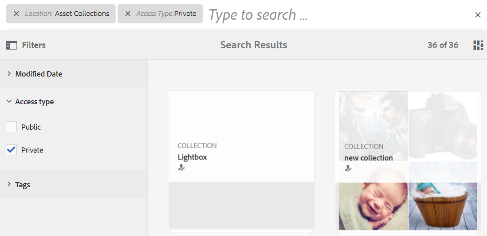

# Cercare le risorse in Brand Portal {#search-assets-on-brand-portal}

La funzionalità di ricerca di Brand Portal consente di cercare rapidamente le risorse rilevanti tramite omnisearch e la ricerca per facet che utilizza i filtri per restringere ulteriormente la ricerca. Puoi cercare le risorse a livello di file o cartella e salvare i risultati della ricerca come raccolte avanzate.

>[!NOTE]
>
>Brand Portal non supporta la ricerca di raccolte mediante omnisearch.
>
>Tuttavia, puoi utilizzare [cerca filtri per ottenere l’elenco delle raccolte rilevanti](#search-collection).

## Cercare risorse con Omnisearch {#search-assets-using-omnisearch}

Per cercare le risorse in Brand Portal:

1. Dalla barra degli strumenti, fai clic su **[!UICONTROL Ricerca]** o premere il tasto &quot;**[!UICONTROL /]**&quot; per avviare Omnisearch.

   

1. Nella casella di ricerca, digita una parola chiave per le risorse da cercare.

   

   >[!NOTE]
   >
   >* Per visualizzare i suggerimenti di ricerca in omnisearch sono necessari almeno 3 caratteri.
   >* Quando si cerca `mountain biking`, omnisearch restituisce tutte le risorse nei risultati di ricerca che hanno entrambi `mountain` e `biking` disponibile nei campi di metadati. Ad esempio: `mountain` nel `Title` campo e `biking` nel `Description` campo. Entrambi i termini devono essere disponibili nei campi di metadati per essere visualizzati nei risultati della ricerca. Tuttavia, omnisearch restituisce la risorsa nei risultati della ricerca anche se nel campo dei metadati Tag avanzati è disponibile solo uno dei due termini. Ad esempio, se una risorsa contiene `mountain` come uno dei tag avanzati e non contiene `biking` in qualsiasi altro campo di metadati e cerchi `mountain biking`, omnisearch restituisce comunque la risorsa nei risultati di ricerca.

1. Seleziona dai suggerimenti correlati visualizzati nell’elenco a discesa per accedere rapidamente alle risorse rilevanti.

   

   *Ricerca di risorse tramite omnisearch*

Per informazioni sul comportamento di ricerca con le risorse con tag avanzati, consulta [comprendere i risultati e il comportamento della ricerca](https://experienceleague.adobe.com/docs/experience-manager-65/assets/using/search-assets.html).

## Ricerca tramite facet nel pannello Filtri {#search-using-facets-in-filters-panel}

I facet di ricerca nel pannello Filtri aggiungono granularità all’esperienza di ricerca e rendono efficiente la funzionalità di ricerca. I facet di ricerca utilizzano più dimensioni (predicati) che consentono di eseguire ricerche complesse. Per una ricerca più mirata, è possibile eseguire facilmente un drill-down al livello di dettaglio desiderato.

Ad esempio, se si sta cercando un&#39;immagine, è possibile scegliere se si desidera una bitmap o un&#39;immagine vettoriale. Puoi ridurre ulteriormente l’ambito della ricerca specificando il tipo MIME per l’immagine nel facet di ricerca Tipo file. Analogamente, durante la ricerca di documenti, è possibile specificare il formato, ad esempio PDF o MS® Word.

Il **[!UICONTROL Filtri]** Il pannello include alcuni facet standard, ad esempio: **[!UICONTROL Browser percorsi]**, **[!UICONTROL Tipo di file]**, **[!UICONTROL Dimensione file]**, **[!UICONTROL Stato]**, e **[!UICONTROL Orientamento]**. Tuttavia, è possibile [aggiungi facet di ricerca personalizzati](../using/brand-portal-search-facets.md) o rimuovere facet di ricerca specifici dal **[!UICONTROL Filtri]** aggiungendo o rimuovendo i predicati nel modulo di ricerca sottostante. Consulta l’elenco delle opzioni disponibili e utilizzabili [cerca predicati in Brand Portal](../using/brand-portal-search-facets.md#list-of-search-predicates).

Per applicare i filtri alla ricerca, utilizzare la [facet di ricerca](../using/brand-portal-search-facets.md):

1. Fai clic sull’icona della sovrapposizione e seleziona **[!UICONTROL Filtro]**.

   

1. Dalla sezione **[!UICONTROL Filtri]** sulla sinistra, seleziona le opzioni appropriate per applicare i filtri rilevanti.
Ad esempio, utilizza i seguenti filtri standard:

   * **[!UICONTROL Browser percorsi]** per cercare le risorse in una directory specifica. Il percorso di ricerca predefinito del predicato per Browser percorsi è `/content/dam/mac/<tenant-id>/`, configurabile modificando il modulo di ricerca predefinito.
   >[!NOTE]
   >
   >Per gli utenti non amministratori: [!UICONTROL Browser percorsi] in [!UICONTROL Filtro] Il pannello mostra solo la struttura del contenuto delle cartelle (e delle relative cartelle precedenti) condivise con esse.\
   >Per gli utenti amministratori, il browser Percorsi consente di accedere a qualsiasi cartella in Brand Portal.

   * **[!UICONTROL Tipo di file]** per specificare il tipo (immagine, documento, multimedia, archivio) di file di risorse che si sta cercando. Inoltre, è possibile limitare l&#39;ambito della ricerca, ad esempio specificare il tipo MIME (Tiff, Bitmap, Immagini GIMP) per l&#39;immagine o il formato (PDF o MS® Word) per i documenti.
   * **[!UICONTROL Dimensione file]** per cercare le risorse in base alle loro dimensioni. È possibile specificare i limiti inferiore e superiore per l&#39;intervallo di dimensioni per limitare la ricerca e specificare l&#39;unità di misura da cercare.
   * **[!UICONTROL Stato]** per cercare le risorse in base agli stati delle risorse, ad esempio Approvazione (Approvata, Modifiche richieste, Rifiutata, In sospeso) e Scadenza.
   * **[!UICONTROL Valutazione media]** per cercare le risorse in base al loro rating.
   * **[!UICONTROL Orientamento]** per cercare le risorse in base all’orientamento (orizzontale, verticale, quadrato) delle risorse.
   * **[!UICONTROL Stile]** per cercare le risorse in base allo stile (colorato, monocromatico) delle risorse.
   * **[!UICONTROL Formato video]** per cercare risorse video in base al formato (DVI, Flash, MPEG4, MPEG, OGG Theora, QuickTime, Windows Media, WebM).

   È possibile utilizzare [facet di ricerca personalizzati](../using/brand-portal-search-facets.md) nel pannello Filtri modificando il modulo di ricerca sottostante.

   * **[!UICONTROL Predicato proprietà]** se utilizzato nel modulo di ricerca, consente di cercare le risorse che corrispondono a una proprietà di metadati a cui è mappato il predicato.\
      Ad esempio, se il predicato Proprietà è mappato a [!UICONTROL `jcr:content /metadata/dc:title`], puoi cercare le risorse in base al loro titolo.\
      Il [!UICONTROL Predicato proprietà] supporta le ricerche di testo per:

      **Espressioni parziali**
Per consentire la ricerca delle risorse mediante espressioni parziali nel predicato delle proprietà, abilita la casella di controllo **[!UICONTROL Ricerca parziale]** in Modulo di ricerca. Questo consente di cercare le risorse desiderate anche senza specificare le parole o espressioni precise usate nei metadati della risorsa.

      >[!NOTE]
      >
      > Brand Portal supporta i campi seguenti per la ricerca parziale:
      >* jcr:content/metadata/dc:title
      >* jcr:content/jcr:title
      >* jcr:content/metadata/dam:search_promote
      >* jcr:content/metadata/dc:format

      Operazioni disponibili:
      * Specifica una parola presente nella frase cercata nel facet nel pannello Filtri. Ad esempio, se cerchi il termine **salire** (e il predicato Proprietà è mappato a [!UICONTROL `dc:title`] ), quindi tutte le risorse contenenti la parola **salire** nella frase del titolo vengono restituiti.
      * Specificare una parte della parola, che si trova nella frase cercata, insieme al carattere jolly (&#42;) per colmare le lacune.
Ad esempio, se cerchi:
         * **salire&#42;** restituisce tutte le risorse con parole che iniziano con i caratteri &quot;climb&quot; nella frase del titolo.
         * **&#42;salire** restituisce tutte le risorse con parole che terminano con i caratteri &quot;climb&quot; nella frase del titolo.
         * **&#42;salire&#42;** restituisce tutte le risorse contenenti parole comprendenti i caratteri &quot;climb&quot; nella frase del titolo.

Per consentire la ricerca senza distinzione tra maiuscole e minuscole nel predicato di proprietà, abilita       **Testo senza distinzione tra maiuscole e minuscole**
Per consentire la ricerca senza distinzione tra maiuscole e minuscole nel predicato di proprietà, abilita **[!UICONTROL Ignora maiuscole/minuscole]** in Modulo di ricerca. Per impostazione predefinita, la ricerca di testo nel predicato delle proprietà distingue tra maiuscole e minuscole.
   >[!NOTE]
   >
   >Alla selezione **[!UICONTROL Ricerca parziale]** casella di controllo, **[!UICONTROL Ignora maiuscole/minuscole]** è selezionato per impostazione predefinita.

   

   I risultati della ricerca vengono visualizzati in base ai filtri applicati, insieme al conteggio dei risultati della ricerca.

   

   Risultato di ricerca risorsa con conteggio dei risultati di ricerca.

1. Puoi passare facilmente a un elemento dal risultato della ricerca e tornare allo stesso risultato utilizzando il pulsante Indietro nel browser senza dover rieseguire la query di ricerca.

## Salvare le ricerche come raccolta avanzata {#save-your-searches-as-smart-collection}

Puoi salvare le impostazioni di ricerca come raccolta avanzata per poter ripetere rapidamente la stessa ricerca senza dover ripetere le stesse impostazioni in un secondo momento. Tuttavia, non è possibile applicare filtri di ricerca a una raccolta.

Per salvare le impostazioni di ricerca come raccolta avanzata:

1. Tocca o fai clic su **[!UICONTROL Salva raccolta avanzata]** e fornisci un nome per la raccolta avanzata.

   Per rendere la raccolta avanzata accessibile a tutti gli utenti, seleziona **[!UICONTROL Pubblico]**. Un messaggio conferma che la raccolta avanzata è stata creata e aggiunta all’elenco delle ricerche salvate.

   >[!NOTE]
   >
   >Agli utenti non amministratori può essere impedito di rendere pubbliche le raccolte avanzate, per evitare di avere un numero enorme di raccolte avanzate pubbliche create da utenti non amministratori sul Brand Portal dell’organizzazione. Le organizzazioni possono disattivare **[!UICONTROL Consenti creazione di raccolte avanzate pubbliche]** configurazione da **[!UICONTROL Generale]** impostazioni disponibili nel pannello strumenti di amministrazione.

   

1. Per salvare la raccolta avanzata con un nome diverso e selezionare o deselezionare la **[!UICONTROL Pubblico]** , fare clic su **[!UICONTROL Modifica raccolta avanzata]**.

   

1. Il giorno **[!UICONTROL Modifica raccolta avanzata]** finestra di dialogo, seleziona **[!UICONTROL Salva con nome]** e immetti un nome per la raccolta avanzata. Fai clic su **[!UICONTROL Salva]**.

   

## Cerca raccolta {#search-collection}

Omnisearch non è supportato per le raccolte. Tuttavia, puoi applicare i filtri di ricerca per elencare le raccolte rilevanti dall’interno di [!UICONTROL Raccolte] di rete.

Dalla sezione [!UICONTROL Raccolte] , fai clic sull’icona di sovrapposizione per aprire il pannello dei filtri nella barra a sinistra. Applicare uno o più filtri di ricerca dai filtri disponibili (`modified date`, `access type`, e `tags`). Elenca il set di raccolte più rilevante in base ai filtri applicati.

