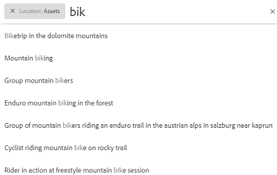
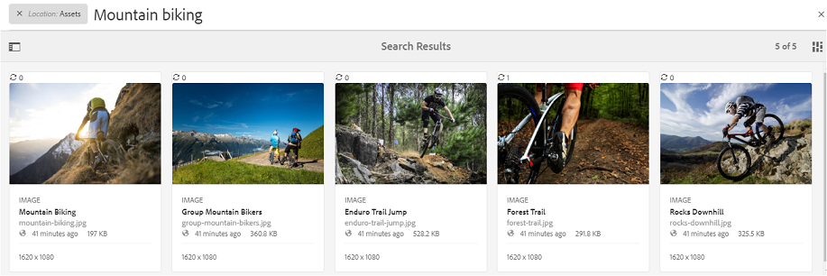
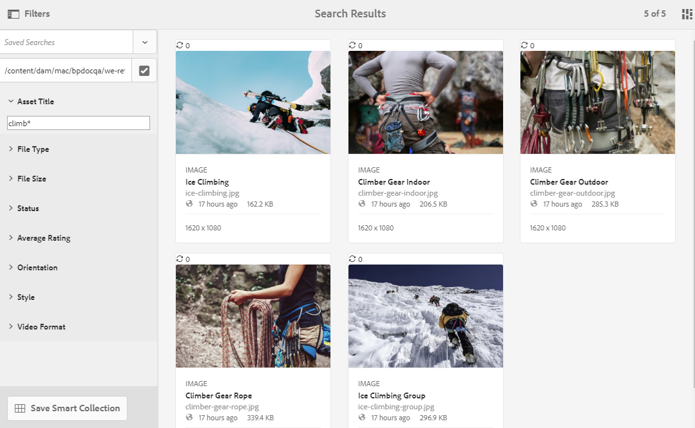
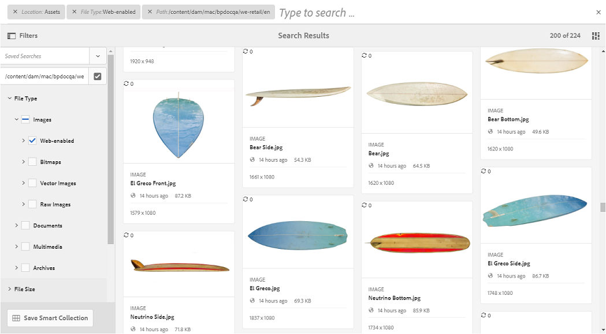
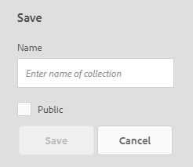
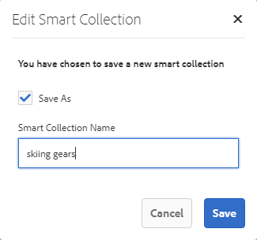

# Cercare le risorse in Brand Portal {#search-assets-on-brand-portal}

La funzione di ricerca Brand Portal consente di cercare rapidamente le risorse rilevanti utilizzando la ricerca per tipo di volto e i filtri per limitare ulteriormente la ricerca. Potete inoltre salvare le ricerche come raccolte intelligenti per il futuro.

## Ricerca risorse tramite Omnisearch {#search-assets-using-omnisearch}

Per cercare risorse in Brand Portal:

1. Dalla barra degli strumenti, fare clic sull&#39;icona **[!UICONTROL Cerca]** oppure premere il tasto &quot;**[!UICONTROL /]**&quot; per avviare Omnisearch.

   

1. Nella casella di ricerca, digitate una parola chiave per le risorse da cercare.

   

   >[!NOTE]
   >
   >Sono necessari almeno 3 caratteri in omnisearch per visualizzare i suggerimenti di ricerca.

1. Per accedere rapidamente alle risorse pertinenti, potete scegliere tra i suggerimenti correlati visualizzati nell’elenco a discesa.

   

   *Ricerca di risorse tramite omnisearch*

Per informazioni sul comportamento di ricerca con le risorse con tag avanzati, consultate [Comprendere i risultati e il comportamento di ricerca](https://helpx.adobe.com/experience-manager/6-5/assets/using/search-assets.html).

## Ricerca utilizzando i facet nel pannello Filtri {#search-using-facets-in-filters-panel}

I facet di ricerca nel pannello Filtri aggiungono granularità all’esperienza di ricerca e rendono efficiente la funzionalità di ricerca. I facet di ricerca utilizzano più dimensioni (predicati) che consentono di eseguire ricerche complesse. Potete facilmente approfondire fino al livello di dettaglio desiderato per una ricerca più mirata.

Ad esempio, se cercate un’immagine, potete scegliere se un elemento bitmap o un’immagine vettoriale deve essere selezionato. È possibile ridurre ulteriormente l&#39;ambito della ricerca specificando il tipo MIME per l&#39;immagine nel facet di ricerca Tipo file. Allo stesso modo, durante la ricerca di documenti, è possibile specificare il formato, ad esempio PDF o MS Word. 

Il pannello **[!UICONTROL Filtri]** include alcuni facet standard, come- **[!UICONTROL Browser percorso]**, **[!UICONTROL Tipo file]**, **[!UICONTROL Dimensioni file]**, **[!UICONTROL Stato]** e **[!UICONTROL Orientamento]**. Tuttavia, è possibile [aggiungere facet di ricerca personalizzati](../using/brand-portal-search-facets.md) o rimuovere facet di ricerca specifici dal pannello **[!UICONTROL Filtri]** aggiungendo o rimuovendo i predicati nel modulo di ricerca sottostante. Consultate l&#39;elenco dei predicati di ricerca [disponibili e utilizzabili in Brand Portal](../using/brand-portal-search-facets.md#list-of-search-predicates).

Per applicare i filtri alla ricerca, utilizzando i facet di ricerca [disponibili](../using/brand-portal-search-facets.md):

1. Fate clic sull&#39;icona della sovrapposizione e selezionate **[!UICONTROL Filtro]**.

   

1. Dal pannello **[!UICONTROL Filtri]** a sinistra, selezionare le opzioni appropriate per applicare i filtri pertinenti.
Ad esempio, utilizzate i seguenti filtri standard:

   * **[!UICONTROL Percorso]** browser per cercare le risorse in una directory specifica. Il percorso di ricerca predefinito del predicato per il browser percorso è `/content/dam/mac/<tenant-id>/`, che può essere configurato modificando il modulo di ricerca predefinito.
   >[!NOTE]
   >
   >Per gli utenti non amministratori, il [!UICONTROL browser percorso] nel pannello [!UICONTROL Filtro] mostra solo la struttura del contenuto delle cartelle (e delle relative cartelle antenate) condivise con loro.\
   >Per gli utenti amministratori, il browser Percorsi consente di accedere a qualsiasi cartella del Portale marchio.

   * **[!UICONTROL Tipo di file]** per specificare il tipo (immagine, documento, elementi multimediali, archivio) di file di risorse che si desidera trovare. È inoltre possibile limitare l’ambito della ricerca, ad esempio specificare il tipo MIME (Tiff, Bitmap, GIMP Images) per l’immagine o il formato (PDF o MS Word) per i documenti.
   * **[!UICONTROL File]** Dimensione per cercare le risorse in base alle loro dimensioni. È possibile specificare i limiti inferiore e superiore dell&#39;intervallo di dimensioni per limitare la ricerca e specificare l&#39;unità di misura da cercare.
   * **[!UICONTROL Ricerca]** statica delle risorse in base agli stati delle risorse, ad esempio Approvazione (approvata, Modifiche richieste, Rifiutato, In sospeso) e Scadenza.
   * **[!UICONTROL Valutazione media]** per la ricerca di risorse in base al rating delle risorse.
   * **[!UICONTROL Orientamento]** per cercare le risorse in base all’orientamento (orizzontale, verticale, quadrato) delle risorse.
   * **[!UICONTROL Consente di]** cercare risorse in base allo stile (colorato, bianco e nero) delle risorse.
   * **[!UICONTROL Video]** Forwa per la ricerca di risorse video in base al formato (DVI, Flash, MPEG4, MPEG, OGG Theora, QuickTime, Windows Media, WebM).

   È possibile utilizzare [facet di ricerca personalizzati](../using/brand-portal-search-facets.md) nel pannello Filtri modificando il modulo di ricerca sottostante.

   * **[!UICONTROL Predicato proprietà]** se utilizzato nel modulo di ricerca, consente di cercare le risorse che corrispondono a una proprietà di metadati a cui è associato il predicato.\
      Ad esempio, se Predicato proprietà è mappato su [!UICONTROL `jcr:content /metadata/dc:title`], potete cercare le risorse in base al relativo titolo.\
      Il [!UICONTROL Predicato proprietà] supporta le ricerche di testo per:

      **Espressioni parziali**
Per consentire la ricerca delle risorse mediante espressioni parziali nel predicato delle proprietà, abilita la casella di controllo **[!UICONTROL Ricerca parziale]** in Modulo di ricerca.\
      Questo consente di cercare le risorse desiderate anche senza specificare le parole o espressioni precise usate nei metadati della risorsa.\
      Operazioni disponibili:
      * Specificate una parola che si verifica nella frase cercata nel facet nel pannello Filtri. Ad esempio, se cercate il termine **climb** (e Property Predicate è mappato sulla proprietà [!UICONTROL `dc:title`]), vengono restituite tutte le risorse con la parola **climb** nella frase del titolo.
      * Specificare una parte di una parola da cercare, utilizzando il carattere jolly (*) al posto dei caratteri rimanenti.
Ad esempio, se cerchi:
         * **climb*** restituisce tutte le risorse con parole che iniziano con i caratteri &quot;climb&quot; nella frase del titolo.
         * ***** climbrestituisce tutte le risorse con parole che terminano con caratteri &quot;culb&quot; nella frase del titolo.
         * ***climb*** restituisce tutte le risorse con parole contenenti i caratteri &quot;climb&quot; nella frase del titolo.

Per consentire una ricerca senza distinzione tra maiuscole e minuscole nel predicato delle proprietà, abilitare il       **Testo con distinzione tra**
maiuscole e minuscolePer consentire ricerche senza distinzione tra maiuscole e minuscole nel predicato delle proprietà, abilitare la casella di controllo  **[!UICONTROL Ignora]** Casebox nel modulo di ricerca. Per impostazione predefinita, la ricerca di testo nel predicato delle proprietà fa distinzione tra maiuscole e minuscole.
   >[!NOTE]
   >
   >Selezionando la casella di controllo **[!UICONTROL Ricerca parziale]**, per impostazione predefinita è selezionata l&#39;opzione **[!UICONTROL Ignora maiuscole/minuscole]**.

   

   I risultati della ricerca vengono visualizzati in base ai filtri applicati, insieme al conteggio dei risultati della ricerca.

   

   Risultato della ricerca delle risorse con il conteggio dei risultati della ricerca.

1. È possibile individuare facilmente un elemento dal risultato della ricerca e tornare allo stesso risultato utilizzando il pulsante Indietro del browser senza dover ripetere la query di ricerca.

## Salva le ricerche come raccolta intelligente {#save-your-searches-as-smart-collection}

Potete salvare le impostazioni di ricerca come una raccolta intelligente per poter ripetere rapidamente la stessa ricerca senza dover ripristinare le stesse impostazioni in un secondo momento.

Per salvare le impostazioni di ricerca come raccolta dinamica:

1. Toccate o fate clic su **[!UICONTROL Salva raccolta avanzata]** e fornite un nome per la raccolta dinamica.

   Per rendere la raccolta avanzata accessibile a tutti gli utenti, selezionate **[!UICONTROL Public]**. Un messaggio conferma che la raccolta smart è stata creata e aggiunta all&#39;elenco delle ricerche salvate.

   >[!NOTE]
   >
   >Agli utenti non amministratori può essere impedito di rendere pubbliche le raccolte smart, per evitare che un numero enorme di raccolte pubbliche intelligenti create da utenti non amministratori nel Portale marchio dell&#39;organizzazione. Le organizzazioni possono disattivare la configurazione **[!UICONTROL Consenti creazione raccolte pubbliche]** dalle impostazioni **[!UICONTROL Generale]** disponibili nel pannello degli strumenti di amministrazione.

   

1. Per salvare la raccolta avanzata con un nome diverso e selezionare o deselezionare la casella di controllo **[!UICONTROL Public]**, fare clic su **[!UICONTROL Edit Smart Collection]**.

   

1. Nella finestra di dialogo **[!UICONTROL Modifica raccolta avanzata]**, selezionare **[!UICONTROL Salva con nome]** e immettere un nome per la raccolta avanzata. Fai clic su **[!UICONTROL Salva]**.

   
