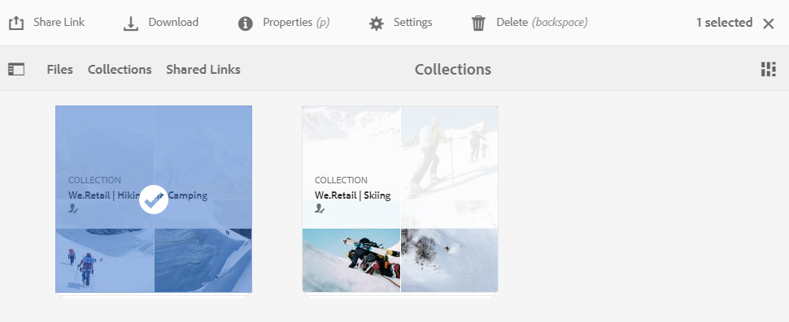

# Condividi raccolte {#share-collections}

Una raccolta rappresenta un gruppo di risorse correlate memorizzate insieme in Adobe Experience Manager Assets Brand Portal. Gli utenti possono creare raccolte avanzate mediante l&#39;applicazione di [ricerca globale o facet per filtrare le risorse correlate](brand-portal-searching.md) e memorizzarle insieme per un accesso semplice e per condividerle ulteriormente con altri utenti di Brand Portal.

Gli amministratori possono condividere e annullare la condivisione di una raccolta con gli utenti autorizzati del Brand Portal. Gli editor e i visualizzatori possono visualizzare e condividere le raccolte create da loro, condivise con loro e le raccolte pubbliche.

>[!NOTE]
>
>Gli editor non possono modificare una raccolta pubblica in una raccolta non pubblica e pertanto non dispongono della casella di controllo **[!UICONTROL Raccolta pubblica]** disponibile nella finestra di dialogo **[!UICONTROL Impostazioni raccolta]**.

## Condividere una raccolta {#share-collection}

Di seguito sono riportati i passaggi per condividere una raccolta con gli utenti autorizzati del Brand Portal:

1. Accedete al tenant del Brand Portal. Per impostazione predefinita, viene aperta la visualizzazione **[!UICONTROL File]** che contiene tutte le risorse e le cartelle pubblicate.

1. Dalla navigazione rapida in alto, fate clic su **[!UICONTROL Raccolte]**.

1. Dalla console **[!UICONTROL Raccolte]**, effettuate una delle seguenti operazioni:

   * Passate il puntatore del mouse sulla raccolta da condividere. Dalle miniature delle azioni rapide disponibili per la raccolta, fate clic sull&#39;icona **[!UICONTROL Settings]**.

      

   * Selezionate la raccolta da condividere. Dalla barra degli strumenti nella parte superiore, fare clic su **[!UICONTROL Impostazioni]**.

      

1. Nella finestra di dialogo **[!UICONTROL Impostazioni raccolta]**, selezionate gli utenti con i quali desiderate condividere la raccolta e il ruolo per l&#39;utente che dovrà corrispondere al ruolo globale. Ad esempio, assegnate il ruolo Editor a un editor globale, il ruolo Visualizzatore, a un visualizzatore globale.

   In alternativa, per rendere la raccolta disponibile a tutti gli utenti, indipendentemente dall&#39;appartenenza e dal ruolo del gruppo, rendetela pubblica selezionando la casella di controllo **[!UICONTROL Raccolta pubblica]**.

   >[!NOTE]
   >
   >Tuttavia, agli utenti non amministratori può essere impedito di creare raccolte pubbliche, per evitare di avere numerose raccolte pubbliche in modo da poter risparmiare spazio sul sistema. Le organizzazioni possono disabilitare la configurazione **[!UICONTROL Consenti creazione raccolte pubbliche]** dalle impostazioni **[!UICONTROL Generale]** disponibili nel pannello degli strumenti di amministrazione.

   

   Gli editor non possono modificare una raccolta pubblica in una raccolta non pubblica e pertanto non dispongono della casella di controllo **[!UICONTROL Raccolta pubblica]** disponibile nella finestra di dialogo **[!UICONTROL Impostazioni raccolta]**.

   

1. Fare clic sul pulsante **[!UICONTROL Aggiungi]** per aggiungere l&#39;utente, quindi fare clic su **[!UICONTROL Salva]**. La raccolta viene condivisa con gli utenti.

   >[!NOTE]
   >
   >Il ruolo di un utente regola l&#39;accesso alle risorse e alle cartelle all&#39;interno di una raccolta. Se un utente non ha accesso alle risorse, viene condivisa con l&#39;utente una raccolta vuota. Inoltre, il ruolo di un utente governa le azioni disponibili per le raccolte.

## Annullare la condivisione di una raccolta {#unshare-a-collection}

Per annullare la condivisione di una raccolta precedentemente condivisa, effettuate le seguenti operazioni:

1. Dalla console **[!UICONTROL Raccolte]**, selezionate la raccolta da annullare la condivisione.

   Dalla barra degli strumenti nella parte superiore, fare clic su **[!UICONTROL Impostazioni]**.

   

1. Nella finestra di dialogo **[!UICONTROL Impostazioni raccolta]**, nella sezione **[!UICONTROL Membri]** fare clic sul simbolo **[!UICONTROL x]** accanto agli utenti per rimuoverli dall&#39;elenco degli utenti che hanno accesso alla raccolta.

   

1. Viene visualizzato un messaggio di avviso. Fate clic su **[!UICONTROL Confirm]** per annullare la condivisione della raccolta.

1. Fare clic su **[!UICONTROL Salva]** per applicare le modifiche.

   Una volta rimosso l&#39;utente dall&#39;elenco condiviso, la raccolta non condivisa viene rimossa dalla console **[!UICONTROL Raccolte]** dell&#39;utente.

<!--
1. Click the overlay icon on the left, and choose **[!UICONTROL Navigation]**.

   

1. From the siderail on the left, click **[!UICONTROL Collections]**.

   

1. From the **[!UICONTROL Collections]** console, do one of the following:

    * Hover the pointer over the collection you want to share. From the quick action thumbnails available for the collection, click the **[!UICONTROL Settings]** icon.

   

    * Select the collection you want to share. From the toolbar at the top, click **[!UICONTROL Settings]**.
    
   

1. In the [!UICONTROL Collection Settings] dialog box, select the users or groups with whom you want to share the collection and select the role for a user or a group to match their global role. For example, assign the Editor role to a global editor, the Viewer role to a global viewer.

   Alternatively, to make the collection available to all users irrespective of their group membership and role, make it public by selecting the **[!UICONTROL Public Collection]** check-box.

   >[!NOTE]
   >
   >However, non-admin users can be restricted from creating public collections, to avoid having numerous public collections so that system space can be saved. Organizations can disable the **[!UICONTROL Allow public collections creation]** configuration from [!UICONTROL General] settings available in admin tools panel.

   

   Editors cannot change a public collection to a non-public collection and, therefore, do not have **[!UICONTROL Public Collection]** check-box available in **[!UICONTROL Collection Settings]** dialog.

   

1. Select **[!UICONTROL Add]**, and then **[!UICONTROL Save]**. The collection is shared with the chosen users.

   >[!NOTE]
   >
   >A user's role governs access to the assets and folders inside a collection. If a user does not have access to assets, an empty collection is shared with the user. Also, a user's role governs the actions available for collections.

## Unshare a collection {#unshare-a-collection}

To unshare a previously shared collection, do the following:

1. From the **[!UICONTROL Collections]** console, select the collection you want to unshare.

   In the toolbar, click **[!UICONTROL Settings]**.

   

1. On the **[!UICONTROL Collection Settings]** dialog box, under **[!UICONTROL Members]**, click the **[!UICONTROL x]** symbol next to users or groups to remove them from the list of users you shared the collection with.

   

1. In the warning message box, click **[!UICONTROL Confirm]** to confirm unshare.

   Click **[!UICONTROL Save]**.

1. Log in to Brand Portal with the credentials of the user you removed from the shared list. The collection is removed from the **[!UICONTROL Collections]** console.
-->