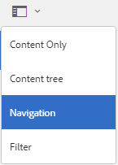
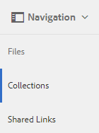
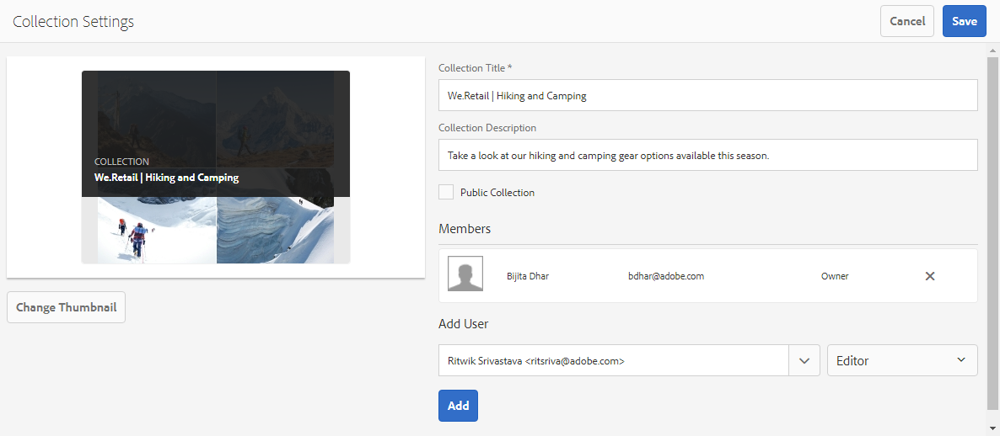
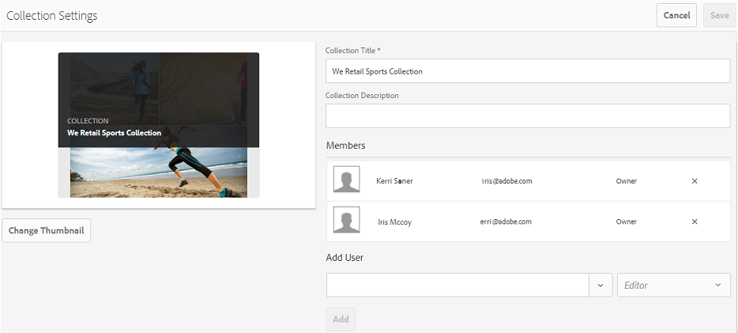
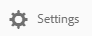
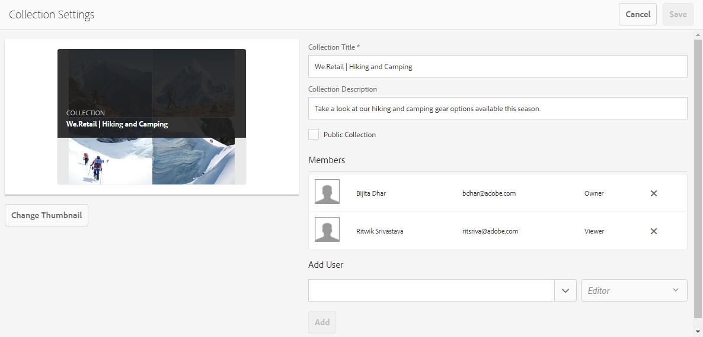

# Condividere raccolte su Brand Portal {#share-collections-bp}

Gli amministratori di AEM Assets Brand Portal possono condividere e annullare la condivisione di una raccolta o di una raccolta dinamica con utenti autorizzati. Gli editor possono visualizzare e condividere solo le raccolte create da loro, condivise con loro e raccolte pubbliche. Tuttavia, gli editor non possono modificare una raccolta pubblica in una raccolta non pubblica.

>[!NOTE]
>
>Gli editor non possono modificare una raccolta pubblica in una raccolta non pubblica e, di conseguenza, non dispongono **della casella di controllo Raccolta** pubblica nella finestra **di** dialogo Impostazioni raccolta.

## Condividere una raccolta {#share-collection}

Per condividere una raccolta, effettuate le seguenti operazioni:

1. Fate clic sull'icona della sovrapposizione a sinistra, quindi scegliete **Navigazione**.

   

1. Da Siderail a sinistra, fate clic **su Raccolte**.

   

1. Dalla console **Raccolte** , effettuate una delle seguenti operazioni:

   * Passate il puntatore sulla raccolta che desiderate condividere. Dalle miniature delle azioni rapide disponibili per la raccolta, fate clic sull'icona **Impostazioni** .
   

   * Selezionate la raccolta da condividere. Nella barra degli strumenti in alto, fate clic **su Impostazioni**.
   

1. Nella **finestra di** dialogo Impostazioni raccolta, selezionate gli utenti o i gruppi con i quali desiderate condividere la raccolta e selezionate il ruolo per un utente o un gruppo che corrisponda al ruolo globale. Ad esempio, assegnate il ruolo Editor a un editor globale, il ruolo Visualizzatore a un visualizzatore globale.

   In alternativa, per rendere la raccolta disponibile a tutti gli utenti indipendentemente dalla appartenenza al gruppo e dal ruolo, rendetela pubblica selezionando la **casella di** controllo Raccolta pubblica.

   >[!NOTE]
   >
   >Tuttavia, gli utenti non amministratori possono impedire la creazione di raccolte pubbliche, per evitare di avere numerose raccolte pubbliche in modo che lo spazio del sistema possa essere salvato. Le organizzazioni possono disattivare la **configurazione Consenti creazione** raccolte pubbliche dalle impostazioni **Generali** disponibili nel pannello Strumenti di amministrazione.

   

   Gli editor non possono modificare una raccolta pubblica in una raccolta non pubblica e, di conseguenza, non dispongono **della casella di controllo Raccolta** pubblica nella finestra **di** dialogo Impostazioni raccolta.

   

1. Fate clic **su Aggiungi**, quindi **su Salva**. La raccolta viene condivisa con gli utenti scelti.

   >[!NOTE]
   >
   >Il ruolo di un utente regola l'accesso alle risorse e alle cartelle all'interno di una raccolta. Se un utente non dispone dell'accesso alle risorse, una raccolta vuota viene condivisa con l'utente. Inoltre, il ruolo di un utente regola le azioni disponibili per le raccolte.

## Annullare la condivisione di una raccolta {#unshare-a-collection}

Per annullare la condivisione di una raccolta condivisa precedentemente, effettuate le seguenti operazioni:

1. Dalla console **Raccolte** , selezionate la raccolta da annullare la condivisione.

   In the toolbar, click **Settings**.

   

1. Nella **finestra di** dialogo Impostazioni raccolta, in **Membri**, fate clic sul **simbolo x** accanto a utenti o gruppi per rimuoverli dall'elenco di utenti con cui avete condiviso la raccolta.

   

1. Nella finestra di messaggio di avviso, fate clic **su Conferma** per confermare l'annullamento della condivisione.

   Fai clic su **Salva**.

1. Accedete al portale marchio con le credenziali dell'utente rimosso dall'elenco condiviso. La raccolta viene rimossa dalla console **Raccolte** .
