# Condividi cartelle su Brand Portal {#share-folders}

Le risorse devono essere pubblicate in Brand Portal da un’istanza di authoring di Experience Manager preconfigurata, in quanto Brand Portal non supporta l’inserimento delle risorse.

## Flusso di lavoro di condivisione cartelle in Brand Portal {#folder-sharing-workflow-in-brand-portal}

Di seguito viene descritto il flusso di lavoro di condivisione delle cartelle e l’accesso utente:

* Per impostazione predefinita, tutte le cartelle pubblicate da Experience Manager Assets in Brand Portal sono visibili solo all’amministratore di Brand Portal, a meno che non siano contrassegnate come pubbliche durante la configurazione della replica.
* L&#39;amministratore utilizza la console **[!UICONTROL Proprietà cartella]** per condividere una cartella con utenti o gruppi selettivi. Solo gli utenti o i gruppi con i quali la cartella è condivisa possono visualizzare la cartella dopo l’accesso a Brand Portal. La cartella non è visibile ad altri utenti.
* L&#39;amministratore può anche scegliere di rendere pubblica una cartella tramite la casella di controllo **[!UICONTROL Cartella pubblica]** nella console **[!UICONTROL Proprietà cartella]**. Una cartella pubblica è visibile a tutti gli utenti.

* Indipendentemente dai ruoli utente e dai privilegi, quando gli utenti accedono a Brand Portal, visualizzano tutte le cartelle pubbliche e le cartelle direttamente condivise con loro o con un gruppo a cui appartengono. Le cartelle private o le cartelle condivise con altri utenti non sono visibili a tutti gli utenti.

### Condivisione di cartelle con gruppi di utenti in Brand Portal {#sharing-folders-with-user-groups-on-brand-portal}

I diritti di accesso alle risorse di una cartella dipendono dai diritti di accesso alla cartella padre, indipendentemente dalle impostazioni delle cartelle figlie. Questo comportamento è gestito da [ACL](https://helpx.adobe.com/experience-manager/6-5/sites/administering/using/security.html#PermissionsinAEM) in AEM, in quanto le cartelle figlio ereditano ACL dalle relative cartelle principali. Ad esempio, se una cartella A contiene la cartella B che contiene la cartella C, un gruppo di utenti (o utenti) con diritti di accesso sulla cartella A ha anche gli stessi diritti di accesso sulla cartella B e sulla cartella C. La cartella B, essendo la cartella figlia di A, eredita i propri ACL, e la cartella C, essendo la cartella figlio di B, eredita i propri ACL.

Allo stesso modo, i gruppi di utenti (o gli utenti) che dispongono delle autorizzazioni per accedere solo alla cartella B hanno le stesse autorizzazioni di accesso sulla cartella C ma non sulla cartella A. Si consiglia pertanto alle organizzazioni di disporre il proprio contenuto in modo che le risorse più esposte vengano posizionate nella cartella secondaria e dall&#39;accesso alle cartelle principali all&#39;accesso alle cartelle principali possa essere limitato.

### Pubblicazione di cartelle pubbliche {#public-folder-publish}

A meno che l&#39;opzione **[!UICONTROL Pubblica cartella pubblica]** non sia selezionata durante la configurazione della replica Brand Portal, gli utenti non amministratori (come editor e visualizzatori) non hanno accesso alle risorse pubblicate da AEM Assets a Brand Portal.

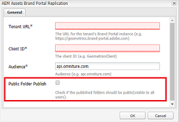

Se l&#39;opzione **[!UICONTROL Pubblica cartella pubblica]** è disabilitata, gli amministratori devono condividere in modo specifico queste risorse con utenti non amministratori che utilizzano la funzionalità di condivisione.

>[!NOTE]
>
>L&#39;opzione per abilitare **[!UICONTROL Pubblica cartella pubblica]** è disponibile a partire dalla versione 6.3.2.1.

## Accesso a cartelle condivise {#access-to-shared-folders}

La matrice seguente illustra i diritti di accesso e i diritti per condividere/annullare la condivisione delle risorse per vari ruoli utente:

|  | Accesso a tutte le cartelle pubblicate da AEM Assets in Brand Portal | Accesso a cartelle condivise | Condividere/annullare la condivisione dei diritti di cartella |
|---------------|-----------|-----------|------------|
| Administrator | Sì | Sì | Sì |
| Editor | No* | Sì, solo se condiviso con loro o con il gruppo a cui appartengono | Sì, solo per le cartelle condivise con loro o con il gruppo a cui appartengono |
| Visualizzatore | No* | Sì, solo se condiviso con loro o con il gruppo a cui appartengono | No |
| Utente ospite | No* | Sì, solo se condiviso con loro o con il gruppo a cui appartengono | No |

>[!NOTE]
>
>Per impostazione predefinita, l&#39;opzione **[!UICONTROL Pubblica cartella pubblica]** è disabilitata durante la configurazione della replica di Brand Portal con AEM Author. Se l’opzione è abilitata, le cartelle pubblicate in Brand Portal saranno accessibili per impostazione predefinita a tutti gli utenti (anche agli utenti non amministratori).

### Accesso utente non amministratore a cartelle condivise {#non-admin-user-access-to-shared-folders}

Gli utenti non amministratori possono accedere solo alle cartelle condivise con loro su Brand Portal. Tuttavia, la modalità di visualizzazione di queste cartelle sul portale quando effettuano l&#39;accesso dipende dalle impostazioni della configurazione **[!UICONTROL Abilita gerarchia cartelle]**.

**Se la configurazione è disabilitata**

Gli utenti non amministratori visualizzano tutte le cartelle condivise con loro sulla pagina di destinazione al momento dell’accesso a Brand Portal.

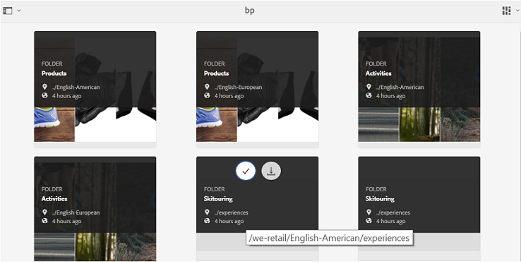

**Se la configurazione è abilitata**

Gli utenti non amministratori visualizzano la struttura delle cartelle (a partire dalla cartella principale) e le cartelle condivise organizzate all’interno delle rispettive cartelle principali, al momento dell’accesso a Brand Portal.

Queste cartelle principali sono le cartelle virtuali e non è possibile eseguire azioni su di esse. È possibile riconoscere queste cartelle virtuali con un&#39;icona di blocco.

A differenza delle cartelle condivise, non sono visibili attività di azione al passaggio del mouse o alla selezione in **[!UICONTROL Vista a schede]**. **** Il pulsante Panoramica viene visualizzato quando si seleziona una cartella virtuale in Vista a  **[!UICONTROL colonne]** e Vista a  **[!UICONTROL elenco]**.

>[!NOTE]
>
>La miniatura predefinita delle cartelle virtuali è l&#39;immagine in miniatura della prima cartella condivisa.

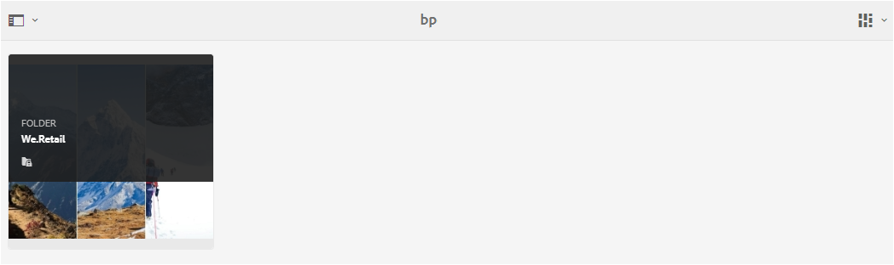 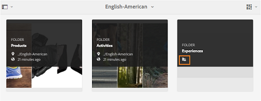 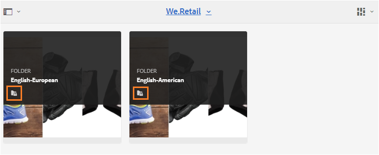 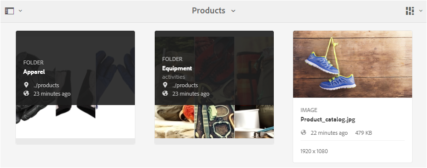

## Condividere le cartelle {#how-to-share-folders}

Per condividere una cartella con gli utenti su Brand Portal, effettua le seguenti operazioni:

1. Fai clic sull&#39;icona di sovrapposizione a sinistra e scegli **[!UICONTROL Navigazione]**.

   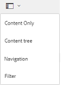

1. Dall&#39;alto a sinistra, seleziona **[!UICONTROL File]**.

   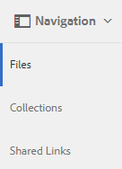

1. Dall’interfaccia di Brand Portal, seleziona la cartella da condividere.

   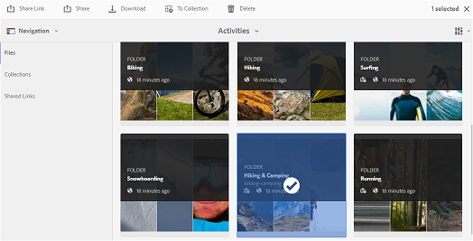

1. Dalla barra degli strumenti nella parte superiore, seleziona **[!UICONTROL Condividi]**.

   

   Viene visualizzata la console [!UICONTROL Proprietà cartella] .

   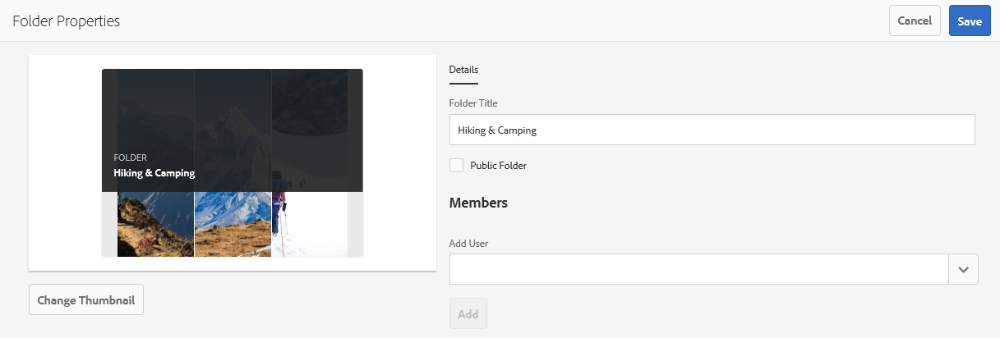

1. Nella console **[!UICONTROL Proprietà cartella]**, specifica il titolo della cartella nel campo **[!UICONTROL Titolo cartella]** se non desideri che il nome predefinito sia visualizzato agli utenti.
1. Dall&#39;elenco **[!UICONTROL Aggiungi utente]**, selezionare gli utenti o i gruppi con cui si desidera condividere la cartella, quindi fare clic su **[!UICONTROL Aggiungi]**.
Per condividere la cartella solo con gli utenti ospiti e nessun altro utente, seleziona **[!UICONTROL Utenti anonimi]** dal menu a discesa **[!UICONTROL Membri]** .

   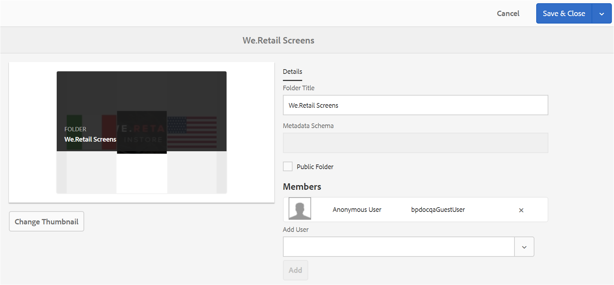

   >[!NOTE]
   >
   >Per rendere la cartella disponibile a tutti gli utenti indipendentemente dall&#39;appartenenza al gruppo e dal ruolo, renderla pubblica selezionando la casella di controllo **[!UICONTROL Cartella pubblica]** .

1. Se necessario, fai clic su **[!UICONTROL Cambia miniatura]** per modificare l&#39;immagine della miniatura della cartella.
1. Fai clic su **[!UICONTROL Salva]**.

1. Per accedere alla cartella condivisa, accedi a Brand Portal con le credenziali dell’utente con cui hai condiviso la cartella. Esamina la cartella condivisa nell’interfaccia di .

## Annulla condivisione cartelle {#unshare-the-folders}

Per annullare la condivisione di una cartella condivisa in precedenza, effettua le seguenti operazioni:

1. Dall’interfaccia di Brand Portal, seleziona la cartella di cui desideri annullare la condivisione.

   

1. Dalla barra degli strumenti nella parte superiore, fai clic su **[!UICONTROL Condividi]**.
1. Nella console **[!UICONTROL Proprietà cartella]**, in **[!UICONTROL Membri]**, fai clic sul simbolo **[!UICONTROL x]** accanto a un utente per rimuoverli dall&#39;elenco degli utenti con cui hai condiviso la cartella.

   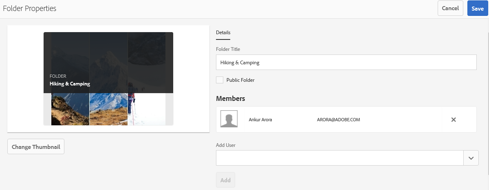

1. Nella finestra del messaggio di avviso, fai clic su **[!UICONTROL Conferma]** per confermare l’annullamento della condivisione.
Fai clic su **[!UICONTROL Salva]**.

1. Accedi a Brand Portal con le credenziali dell&#39;utente rimosso dall&#39;elenco condiviso. La cartella non è più disponibile nell’interfaccia di Brand Portal per l’utente.
