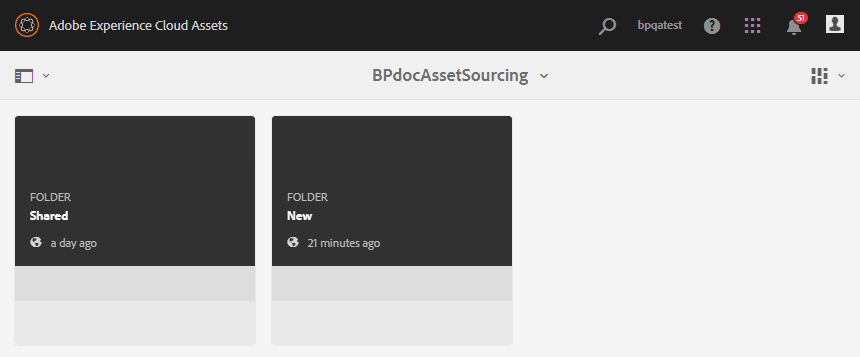
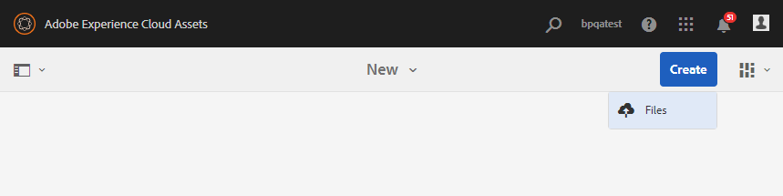

# Caricare le risorse nella cartella Contribution {#uplad-new-assets-to-contribution-folder}

Gli utenti di Brand Portal [scaricano i requisiti](brand-portal-download-asset-requirements.md) delle risorse: breve documento allegato alla cartella dei contributi e scaricano le risorse della linea di base dalla cartella **SHARED** per comprendere la necessità di contributi.
Gli utenti di Brand Portal possono quindi creare nuove risorse da assegnare al contributo e caricarle nella cartella **NEW** all’interno della cartella dei contributi.

>[!NOTE]
>
>Gli utenti di Brand Portal possono caricare contenuto/risorse solo nella cartella **NEW** . Non dispongono dell’autorizzazione necessaria per eliminare una risorsa caricata.
>
>Il limite massimo di caricamento per qualsiasi account/tenant Brand Portal è **10** GB.

**Per caricare nuove risorse:**

1. Effettuate l&#39;accesso all&#39;istanza Brand Portal.
La dashboard di Brand Portal riflette tutte le cartelle esistenti consentite all’utente di Brand Portal insieme alla nuova cartella di contributi condivisi.
1. Fate clic per aprire la cartella dei contributi. Nella cartella dei contributi sono visualizzate due sottocartelle **[!UICONTROL CONDIVISE]** e **[!UICONTROL NUOVO]** .
1. Fate clic su **[!UICONTROL NUOVA]** cartella.
   
1. Fate clic su **[!UICONTROL Crea > File]**  per caricare singoli file o cartelle (.zip) contenenti più risorse.
   
1. Sfogliate e caricate nuove risorse (file/cartelle) nella cartella **[!UICONTROL NEW]** .
   

Al termine del caricamento, l’utente di Brand Portal può pubblicare nuovamente la cartella dei contributi  AEM Assets. Consultate [Pubblicare la cartella dei contributi per  AEM Assets](brand-portal-publish-contribution-folder-to-aem-assets.md).