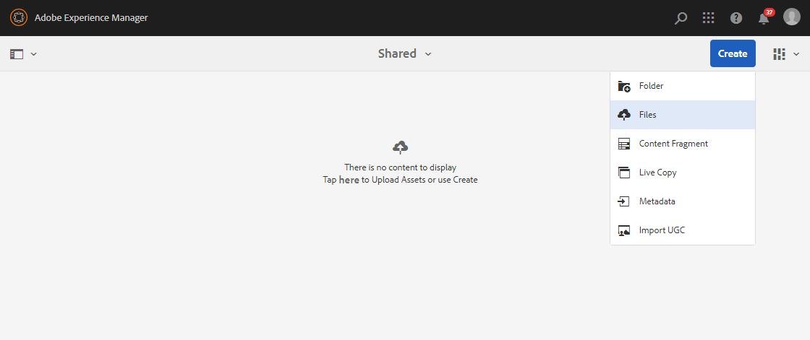
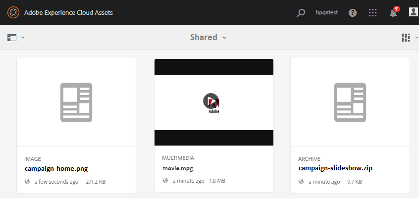

# Caricare le risorse della baseline {#upload-baseline-assets}

L’amministratore di AEM carica le risorse di base nella cartella **CONDIVISA** per aiutare gli utenti del Brand Portal a comprendere i tipi di risorse richiesti durante il contributo. Tali risorse possono essere utilizzate come contenuto di riferimento dagli utenti del Brand Portal durante la creazione di nuove risorse da assegnare ai contributi.

**Per caricare le risorse della baseline:**

1. Accedete all’istanza di creazione di AEM.
URL predefinito: http:// localhost:4502/aem/start.html
1. Andate a **[!UICONTROL Risorse > File]** e individuate la cartella dei contributi in cui desiderate caricare le risorse della linea di base.
1. Fate clic per aprire la cartella dei contributi. Nella cartella dei contributi sono visualizzate due sottocartelle **[!UICONTROL CONDIVISE]** e **[!UICONTROL NUOVO]** .
1. Fate clic su cartella **[!UICONTROL CONDIVISA]** .
1. Fate clic su **[!UICONTROL Crea > File]**  per caricare singole risorse.
In alternativa, fate clic su **[!UICONTROL Crea > Cartella]** per caricare la cartella (.zip) contenente più risorse.
   
1. Sfogliare e caricare le risorse della baseline (file/cartelle) nella cartella **[!UICONTROL SHARED]** .
   

Al termine del caricamento, gli amministratori possono pubblicare la cartella dei contributi sul Brand Portal. Consultate [Pubblicare la cartella dei contributi su Brand Portal](brand-portal-publish-contribution-folder-to-brand-portal.md).